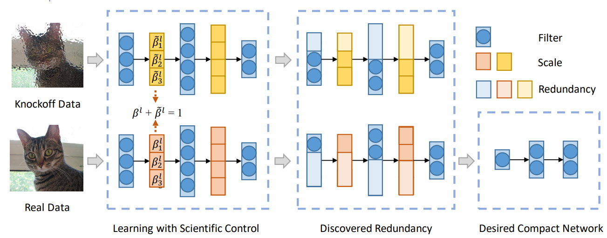

# Applying the SCOP Algorithm

<a href="https://gitee.com/mindspore/docs/blob/master/docs/golden_stick/docs/source_en/pruner/scop.md" target="_blank"></a>

## Background

Deep learning models such as a convolutional neural network (CNN) have been widely applied to multiple fields such as computer vision and natural language processing and have achieved great success. Due to that a neural network has high requirements on a computing capability and memory, it is difficult to directly deploy a neural network with powerful performance on an edge device such as a mobile phone or a wearable device. Therefore, a model compression method such as neural network pruning is very important for deploying a model on an edge device.

### Pruning Method

Neural network pruning is a general model compression method. It reduces the number of parameters and computation workload by removing some parameters from the neural network. It is classified into unstructured pruning and structured pruning. Take the convolutional neural network (CNN) as an example. Unstructured pruning is to remove some weights from the convolution kernel. Although it can achieve a high compression ratio, the actual acceleration depends on the special hardware design. It is difficult to obtain benefits on the Ascend, GPU, and CPU platforms. Structured pruning directly removes the complete convolution kernel from the CNN without damaging the network topology. It can directly accelerate model inference without specific software and hardware design.

Finding a redundant convolution kernel is a key step in structured pruning. There are two common methods: In the first method, no training data is required, and the importance of different convolution kernels is determined by defining some assumptions about importance of the convolution kernels. A typical assumption is that a convolution kernel with a small norm is not important, and cutting off some convolution kernels with small norm does not affect network performance too much. Another method is data driven, in which training data is introduced to learn importance of different convolution kernels. For example, an additional control coefficient is introduced for each convolution kernel, and importance of different convolution kernels is measured by learning their control coefficients. A convolution kernel that corresponds to a small control coefficient is considered unimportant.



A typical neural network pruning method: Reliable Neural Network Pruning (SCOP) based on Scientific Control is driven by data. It introduces knockoff features as a reference, sets up control experiments to reduce the interference of various irrelevant factors to the pruning process and improve the reliability of pruning results. As shown in the preceding figure, real data and knockoff data are input to the network at the same time to generate real features and knockoff features separately. If the knockoff feature corresponding to a convolution kernel suppresses the real feature, the convolution kernel is considered redundant and should be deleted.

## SCOP Training

The data-driven SCOP introduces training data to learn importance of different convolution kernels, thereby improving pruning reliability.

Table 1: SCOP training specifications

| Specifications        | Description                                                    |
| ------------ | ------------------------------------------------------------ |
| Hardware    | GPU and Ascend AI 910 Processor hardware platforms                          |
| Networks    | ResNet series networks. For details, see <https://gitee.com/mindspore/models/tree/master>.|
| Algorithms    | Structured pruning algorithms                                          |
| Data types| The Ascend and the GPU platforms support pruning training on FP32 networks.|
| Running modes| Graph mode and PyNative mode                                     |

## SCOP Training Example

SCOP training consists of the knockoff and fine-tuning phases. In the knockoff phase, redundant convolution kernels are removed by using the knockoff feature. In the fine-tuning phase, the network is completely trained after the redundant convolution kernels are removed. The complete process is as follows:

1. Load the dataset and process data.
2. Initialize the ResNet-50.
3. Use PrunerKfCompressAlgo to replace nodes, define the optimizer and loss function, and perform training in the knockoff phase.
4. Use PrunerFtCompressAlgo to replace nodes, define the optimizer and loss function, perform training in the fine-tuning phase, and save the model.
5. Load the saved model for evaluation.

Then, ResNet-50 is used as an example to describe steps related to SCOP training in detail.

> You can find the complete executable sample code here: <https://gitee.com/mindspore/models/tree/master/official/cv/resnet/golden_stick/pruner/scop>.

### Knockoff Data

Initialize the ResNet-50, load the pre-trained model, replace nodes using PrunerKfCompressAlgo to obtain the network in the knockoff phase (For details, users can refer to [API](https://gitee.com/mindspore/golden-stick/blob/master/mindspore_gs/pruner/scop/scop_pruner.py)), and train the network.

```python
from mindspore import ModelCheckpoint, CheckpointConfig, LossMonitor, TimeMonitor
from mindspore import FixedLossScaleManager
from mindspore_gs import PrunerKfCompressAlgo
from mindspore.models.resnet import resnet50
import mindspore.nn as nn
from copy import deepcopy
net = resnet50(10)
load_checkpoint(config.pre_trained, net=net)
algo_kf = PrunerKfCompressAlgo({})
net = algo_kf.apply(net) # Get konckoff stage network

optimizer = nn.Momentum(filter(lambda p: p.requires_grad, net.get_parameters()),
                        learning_rate=lr,
                        momentum=0.9,
                        loss_scale=1024
                        )
loss_fn = SoftmaxCrossEntropyWithLogits(sparse=True, reduction='mean')
net_with_loss = NetWithLossCell(net, loss_fn)
net_train_step = nn.TrainOneStepCell(net_with_loss, optimizer)
for epoch in range(0, config.epochs):
    for i, (data, target) in enumerate(train_data.create_tuple_iterator()):
        kf = deepcopy(data)
        idx = ops.Randperm(max_length=kf.shape[0])(Tensor([kf.shape[0]], dtype=mstype.int32)) # Random generate Knockoff data
        kf_input = kf[idx, :].view(kf.shape)
        input_list = []
        num_pgpu = data.shape[0] // config.ngpu
        for igpu in range(config.ngpu):
            input_list.append(ops.Concat(axis=0)([data[igpu * num_pgpu:(igpu + 1) * num_pgpu], kf_input[igpu * num_pgpu:(igpu + 1) * num_pgpu]]))
        input = ops.Concat(axis=0)(input_list)
        loss = net_train_step(input, target)
        print('step_{0}: loss={1}'.format(i, loss))
```

The result is as follows:

```text
step_0: loss=3.5922117
step_1: loss=5.259112
step_2: loss=5.152421
step_3: loss=3.2383142
step_4: loss=5.3319235
step_5: loss=4.715785
```

### Fine-tuning

Determine the redundant convolution kernels in the knockoff phase. Use PrunerFtCompressAlgo to replace nodes (For details, users can refer to [API](https://gitee.com/mindspore/golden-stick/blob/master/mindspore_gs/pruner/scop/scop_pruner.py)) and delete redundant convolution kernels. Perform the complete training and save the model.

```python
from mindspore_gs import Kf_Conv2d
...
for _, (nam, module) in enumerate(net.cells_and_names()): # Get name and content of each Cell on the network from net.cells_and_names()
    if isinstance(module, Kf_Conv2d):
        module.score = module.bn.gamma.data.abs() * ops.Squeeze()(module.kfscale.data - (1 - module.kfscale.data))
for _, (nam, module) in enumerate(net.cells_and_names()): # Confirm redundant convolution kernel
    if isinstance(module, Kf_Conv2d):
        _, index = ops.Sort()(module.score)
        num_pruned_channel = int(module.prune_rate * module.score.shape[0])
        module.out_index = index[num_pruned_channel:]

algo_ft = PrunerFtCompressAlgo({})
net = algo_ft.apply(net) # Get Finetune stage network
lr_ft_new = ms.Tensor(get_lr(lr_init=config.lr_init,
                             lr_end=config.lr_ft_end,
                             lr_max=config.lr_ft_max,
                             warmup_epochs=config.warmup_epochs,
                             total_epochs=config.epochs_ft,
                             steps_per_epoch=dataset.get_dataset_size(),
                             lr_decay_mode='poly'))

optimizer_ft = nn.Momentum(filter(lambda p: p.requires_grad, net.get_parameters()),
                           learning_rate=lr_ft_new,
                           momentum=config.momentum,
                           loss_scale=config.loss_scale
                          )
net.set_train()
metrics = {"acc"}
loss_scale = FixedLossScaleManager(1024, drop_overflow_update=False)
model_ft = ms.Model(net, loss_fn=loss_fn, optimizer=optimizer_ft, loss_scale_manager=loss_scale,
                    metrics=metrics,
                    amp_level="O2", boost_level="O0", keep_batchnorm_fp32=False) # Get Finetune stage model

step_size = dataset.get_dataset_size()

time_cb = TimeMonitor(data_size=step_size)
loss_cb = LossMonitor()
config_ck = CheckpointConfig(save_checkpoint_steps=5 * step_size,
                             keep_checkpoint_max=10)
ckpt_cb = ModelCheckpoint(prefix="resnet", directory=config.output_path,
                          config=config_ck)
ft_cb = [time_cb, loss_cb, ckpt_cb]
model_ft.train(config.epochs_ft, dataset, callbacks=ft_cb,
                sink_size=dataset.get_dataset_size(), dataset_sink_mode=True)
```

The result is as follows:

```text
epoch: 1 step: 1, loss is 1.776729941368103
epoch: 1 step: 2, loss is 2.481227159500122
epoch: 1 step: 3, loss is 2.010404586791992
epoch: 1 step: 4, loss is 1.852586030960083
epoch: 1 step: 5, loss is 1.4738214015960693
epoch: 1 step: 6, loss is 1.6637545824050903
epoch: 1 step: 7, loss is 1.7006491422653198
epoch: 1 step: 8, loss is 1.6532130241394043
epoch: 1 step: 9, loss is 1.5730770826339722
epoch: 1 step: 10, loss is 1.4364683628082275
epoch: 1 step: 11, loss is 1.572392225265503
```

### Loading the Saved Model for Evaluation

```python
from mindspore import Tensor, set_context, load_checkpoint, load_param_into_net, export

if __name__ == "__main__":
    ...
    net = resnet(class_num=config.class_num)
    net = PrunerKfCompressAlgo({}).apply(net)
    net = PrunerFtCompressAlgo({}).apply(net)

    # load checkpoint
    param_dict = load_checkpoint(config.ckpt_path)
    load_param_into_net(net, param_dict)
    total_params = 0
    for param in net.trainable_params():
        total_params += np.prod(param.shape)

    model = ms.Model(net, loss_fn=loss, metrics={'top_1_accuracy'})

    # eval model
    res = model.eval(dataset)
    print("result:", res, "prune_rate=", config.prune_rate, "ckpt=", config.checkpoint_file_path, "params=", total_params)
```

The following are the accuracy (top_1_accuracy), pruning rate (prune_rate), model storage location (ckpt), and parameters (params) evaluated by the model:

```text
result:{'top_1_accuracy': 0.9273838141025641} prune_rate=0.45 ckpt=~/resnet50_cifar10/train_parallel0/resnet-400_390.ckpt params=10587835
```

## Exporting a Pruned Model

The quantization model deployed on the device-side hardware platform is in the general model format (such as AIR and MindIR). The export procedure is as follows:

1. Define a pruned network.
2. Load the checkpoint file saved during pruning-based training.
3. Export the pruned model.

```python
from mindspore import Tensor, set_context, load_checkpoint, load_param_into_net, export

if __name__ == "__main__":
    ...
    # define fusion network
    net = resnet(class_num=config.class_num)
    net = PrunerKfCompressAlgo({}).apply(net)
    net = PrunerFtCompressAlgo({}).apply(net)

    # load quantization aware network checkpoint
    param_dict = load_checkpoint(config.ckpt_path)
    load_param_into_net(net, param_dict)

    # export network
    inputs = Tensor(np.ones([1, 1, cfg.image_height, cfg.image_width]), mindspore.float32)
    export(network, inputs, file_name="ResNet_SCOP", file_format='MINDIR')
```

After the pruned model is exported, [use MindSpore for inference](https://www.mindspore.cn/tutorials/experts/en/master/infer/inference.html).

## SCOP Effect

In graph mode, apply SCOP to ResNet-50 and use the CIFAR-10 dataset for evaluation. The following table lists the experiment results. It can be found that in the current task, compared with the original model, when the pruning rate is 45%, the model after SCOP greatly reduces the parameters of the model, and the accuracy loss is within 0.5%.

| Model            | Pruning Rate     | Parameters (M)  | Accuracy     |
| ------------     | ----------  | --------   | -----      |
| ResNet-50        | -           | 24         |  93.2%     |
| ResNet-50 pruned by SCOP| **45%**     | **11**     |  **92.7%** |
