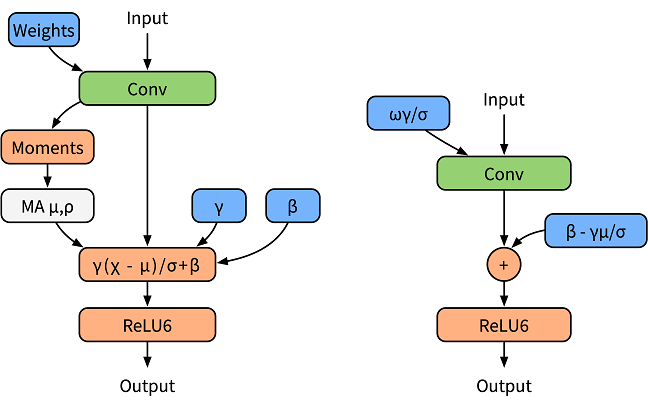
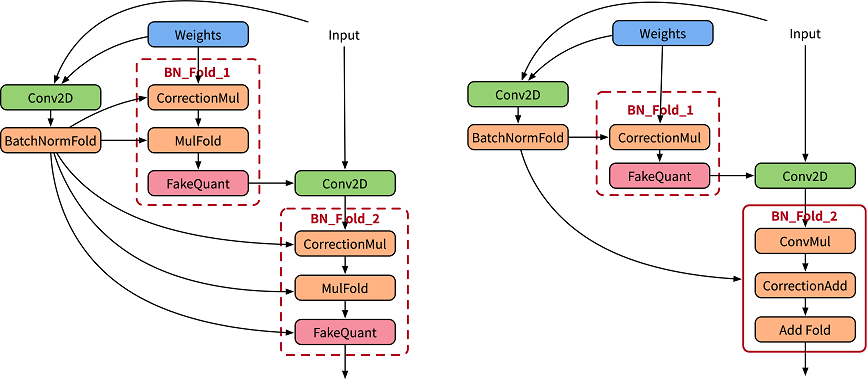

# Applying the SimQAT Algorithm

<a href="https://gitee.com/mindspore/docs/blob/master/docs/golden_stick/docs/source_en/quantization/simqat.md" target="_blank"></a>

## Background

SimQAT is a basic quantization aware algorithm based on fake quantization nodes. Its principles come from Google's [A White Paper on Neural Network Quantization](https://arxiv.org/abs/2106.08295).

### Fake Quantization Node

A fake quantization node is a kind of node which is inserted into network during quantization aware training, and is used to search for network data distribution and feed back a loss in accuracy. The specific functions are as follows:

- Find the distribution of network data, that is, find the maximum and minimum values of the parameters to be quantized.
- Simulate the accuracy loss of low-bit quantization, apply the loss to the network model, and transfer the loss to the loss function, so that the optimizer optimizes the loss value during training.

### BatchNorm Folding

To normalize the output data, the BatchNorm operator is added after the convolutional or fully connected layer. In the training phase, the BatchNorm operator is used as an independent operator to collect statistics on the output average value and variance (as shown in the left figure in the following figure). In the inference phase, the BatchNorm operator is integrated into the weight and bias. It is called BatchNorm folding (as shown in the right figure below).



The formula for folding BatchNorm is as follows:

$$y_{bn}=\operatorname{BN}\left(y_{cout}\right)=BN(w \cdot x+b)=\widehat{w} \cdot x+\widehat{b}$$

In quantization aware training, to accurately simulate the folding operation in inference, the paper [1] uses two sets of convolutions to calculate the current BatchNorm parameter, and uses the calculated parameter to normalize the weight value of the actual convolution (as shown in the left figure below). CorrectionMul is used for weight calibration, and mulFold is used for weight data specification. The weight calibration and weight data specification are further integrated in the MindSpore Golden Stick (as shown in the right figure below) to improve training performance.



## Quantization Aware Training

MindSpore's quantization aware training uses fake quantization nodes to simulate quantization operations. During the training, floating-point numbers are still used for computation, and network parameters are updated through backward propagation learning, so that the network parameters can better adapt to the loss caused by quantization. MindSpore adopts the solution in reference [1] for the quantization of weights and data.

Table 1: Quantization aware training specifications

| Specifications| Description|
| --- | --- |
| Hardware| GPU |
| Networks| The supported networks include LeNet and ResNet-50. For details, see <https://gitee.com/mindspore/models/tree/master>.|
| Algorithms| Asymmetric, symmetric, layer-by-layer, and channel-by-channel quantization algorithms.|
| Solutions| 8-bit quantization solution|
| Data types| The GPU platform supports FP32.|
| Running modes| Graph mode and PyNative mode|

## Quantization Aware Training Example

The procedure of quantization aware training is basically the same as that of common training. In the network construction phase, the quantization algorithm of the MindSpore Golden Stick is used to generate a quantization model. The complete process is as follows:

1. Load the dataset and process data.
2. Define a network.
3. Define the MindSpore Golden Stick quantization algorithm and use the algorithm to generate a quantization model.
4. Define the optimizer, loss function, and callbacks.
5. Train the network and save the model file.
6. Load the model file and compare the accuracy after quantization.

The following uses the LeNet-5 as an example to describe these steps.

> For the complete code, see the [LeNet model repository](https://gitee.com/mindspore/models/blob/master/official/cv/lenet/README.md#apply-algorithm-in-mindspore-golden-stick).The [train.py](https://gitee.com/mindspore/models/blob/master/official/cv/lenet/golden_stick/quantization/simqat/train.py) is the complete training code, and the [eval.py](https://gitee.com/mindspore/models/blob/master/official/cv/lenet/golden_stick/quantization/simqat/eval.py) is the accuracy verification code.

### Loading a Dataset

Load MNIST dataset using MindData:

```python
ds_train = create_dataset(os.path.join(config.data_path), config.batch_size)
```

In the code, `create_dataset` is referenced from [dataset.py](https://gitee.com/mindspore/models/blob/master/official/cv/lenet/src/dataset.py).
 `config.data_path` and `config.batch_size` are configured in the [configuration file](https://gitee.com/mindspore/models/blob/master/official/cv/lenet/golden_stick/quantization/simqat/lenet_mnist_config.yaml).

### Defining the Original Network

Instantiate a LeNet5 network:

```python
from src.lenet import LeNet5
...
network = LeNet5(config.num_classes)
print(network)
```

The original network structure is as follows:

```text
LeNet5<
  (conv1): Conv2d<input_channels=1, output_channels=6, kernel_size=(5, 5), stride=(1, 1), pad_mode=valid, padding=0, dilation=(1, 1), group=1, has_bias=False, weight_init=normal, bias_init=zeros, format=NCHW>
  (conv2): Conv2d<input_channels=6, output_channels=16, kernel_size=(5, 5), stride=(1, 1), pad_mode=valid, padding=0, dilation=(1, 1), group=1, has_bias=False, weight_init=normal, bias_init=zeros, format=NCHW>
  (relu): ReLU<>
  (max_pool2d): MaxPool2d<kernel_size=2, stride=2, pad_mode=VALID>
  (flatten): Flatten<>
  (fc1): Dense<input_channels=400, output_channels=120, has_bias=True>
  (fc2): Dense<input_channels=120, output_channels=84, has_bias=True>
  (fc3): Dense<input_channels=84, output_channels=10, has_bias=True>
  >
```

For details about the ResNet-5 definition, see [lenet.py](https://gitee.com/mindspore/models/blob/master/official/cv/lenet/src/lenet.py).

### Applying the Quantization Algorithm

After a network layer to be quantized is modified based on the original network definition, a network with fake quantization nodes is generated. This network is a quantization network. The `SimulatedQuantizationAwareTraining` class under the MindSpore Golden Stick is constructed and applied to the original network to convert the original network into a quantization network.

```python
from mindspore_gs import SimulatedQuantizationAwareTraining as SimQAT

...
algo = SimQAT()
quanted_network = algo.apply(network)
print(quanted_network)
```

The quantized network structure is as follows. QuantizerWrapperCell is the encapsulation class of perceptual quantization training for the original Conv2d or Dense, including the original operator and pseudo-quantization nodes of input, output and weight.  Users can refer to [API](HTTP://https://www.mindspore.cn/golden_stick/docs/en/master/mindspore_gs.html#mindspore_gs.SimulatedQuantizationAwareTraining) to modify the algorithm configuration, and verify that the algorithm is configured successfully by checking the QuantizeWrapperCell properties.

```text
LeNet5Opt<
  (_handler):
  ...
  (Conv2dQuant): QuantizeWrapperCell<
    (_handler): Conv2dQuant<
      in_channels=1, out_channels=6, kernel_size=(5, 5), stride=(1, 1), pad_mode=valid, padding=0, dilation=(1, 1), group=1, has_bias=False
      (fake_quant_weight): SimulatedFakeQuantizerPerChannel<bit_num=8, symmetric=True, narrow_range=False, ema=False(0.999), per_channel=True(0, 6), quant_delay=0>
      >
    (_input_quantizer): SimulatedFakeQuantizerPerLayer<bit_num=8, symmetric=False, narrow_range=False, ema=False(0.999), per_channel=False, quant_delay=0>
    (_output_quantizer): SimulatedFakeQuantizerPerLayer<bit_num=8, symmetric=False, narrow_range=False, ema=False(0.999), per_channel=False, quant_delay=0>
    >
  (Conv2dQuant_1): QuantizeWrapperCell<
    (_handler): Conv2dQuant<
      in_channels=6, out_channels=16, kernel_size=(5, 5), stride=(1, 1), pad_mode=valid, padding=0, dilation=(1, 1), group=1, has_bias=False
      (fake_quant_weight): SimulatedFakeQuantizerPerChannel<bit_num=8, symmetric=True, narrow_range=False, ema=False(0.999), per_channel=True(0, 16), quant_delay=0>
      >
    (_input_quantizer): SimulatedFakeQuantizerPerLayer<bit_num=8, symmetric=False, narrow_range=False, ema=False(0.999), per_channel=False, quant_delay=0>
    (_output_quantizer): SimulatedFakeQuantizerPerLayer<bit_num=8, symmetric=False, narrow_range=False, ema=False(0.999), per_channel=False, quant_delay=0>
    >
  (DenseQuant): QuantizeWrapperCell<
    (_handler): DenseQuant<
      in_channels=400, out_channels=120, weight=Parameter (name=DenseQuant._handler.weight, shape=(120, 400), dtype=Float32, requires_grad=True), has_bias=True, bias=Parameter (name=DenseQuant._handler.bias, shape=(120,), dtype=Float32, requires_grad=True)
      (fake_quant_weight): SimulatedFakeQuantizerPerChannel<bit_num=8, symmetric=True, narrow_range=False, ema=False(0.999), per_channel=True(0, 120), quant_delay=0>
      >
    (_input_quantizer): SimulatedFakeQuantizerPerLayer<bit_num=8, symmetric=False, narrow_range=False, ema=False(0.999), per_channel=False, quant_delay=0>
    (_output_quantizer): SimulatedFakeQuantizerPerLayer<bit_num=8, symmetric=False, narrow_range=False, ema=False(0.999), per_channel=False, quant_delay=0>
    >
  (DenseQuant_1): QuantizeWrapperCell<
    (_handler): DenseQuant<
      in_channels=120, out_channels=84, weight=Parameter (name=DenseQuant_1._handler.weight, shape=(84, 120), dtype=Float32, requires_grad=True), has_bias=True, bias=Parameter (name=DenseQuant_1._handler.bias, shape=(84,), dtype=Float32, requires_grad=True)
      (fake_quant_weight): SimulatedFakeQuantizerPerChannel<bit_num=8, symmetric=True, narrow_range=False, ema=False(0.999), per_channel=True(0, 84), quant_delay=0>
      >
    (_input_quantizer): SimulatedFakeQuantizerPerLayer<bit_num=8, symmetric=False, narrow_range=False, ema=False(0.999), per_channel=False, quant_delay=0>
    (_output_quantizer): SimulatedFakeQuantizerPerLayer<bit_num=8, symmetric=False, narrow_range=False, ema=False(0.999), per_channel=False, quant_delay=0>
    >
  (DenseQuant_2): QuantizeWrapperCell<
    (_handler): DenseQuant<
      in_channels=84, out_channels=10, weight=Parameter (name=DenseQuant_2._handler.weight, shape=(10, 84), dtype=Float32, requires_grad=True), has_bias=True, bias=Parameter (name=DenseQuant_2._handler.bias, shape=(10,), dtype=Float32, requires_grad=True)
      (fake_quant_weight): SimulatedFakeQuantizerPerChannel<bit_num=8, symmetric=True, narrow_range=False, ema=False(0.999), per_channel=True(0, 10), quant_delay=0>
      >
    (_input_quantizer): SimulatedFakeQuantizerPerLayer<bit_num=8, symmetric=False, narrow_range=False, ema=False(0.999), per_channel=False, quant_delay=0>
    (_output_quantizer): SimulatedFakeQuantizerPerLayer<bit_num=8, symmetric=False, narrow_range=False, ema=False(0.999), per_channel=False, quant_delay=0>
    >
  >
```

### Defining the Optimizer, Loss Function, and Training Callbacks

Use Momentum as optimizer and SoftmaxCrossEntropyWithLogits as loss function for LeNet5 training.

```python
net_loss = nn.SoftmaxCrossEntropyWithLogits(sparse=True, reduction="mean")
net_opt = nn.Momentum(network.trainable_params(), config.lr, config.momentum)
time_cb = TimeMonitor(data_size=ds_train.get_dataset_size())
config_ck = CheckpointConfig(save_checkpoint_steps=config.save_checkpoint_steps,
                             keep_checkpoint_max=config.keep_checkpoint_max)
ckpoint_cb = ModelCheckpoint(prefix="checkpoint_lenet", directory="./ckpt", config=config_ck)
```

### Training the Model and Saving the Model File

Call `train` method of class `Model` to start training:

```python
model = Model(network, net_loss, net_opt, metrics={"Accuracy": Accuracy()})
model.train(config.epoch_size, ds_train, callbacks=[time_cb, ckpoint_cb, LossMonitor()])
```

The result is as follows:

```text
epoch:1 step: 1875, loss is 0.1609785109
Train epoch time: 18172.836 ms, per step time: 9.692 ms
epoch:2 step: 1875, loss is 0.00334590533
Train epoch time: 8617.408 ms, per step time: 4.596 ms
epoch:3 step: 1875, loss is 0.00310735423
Train epoch time: 8526.766 ms, per step time: 4.548 ms
epoch:4 step: 1875, loss is 0.00962805934
Train epoch time: 8585.520 ms, per step time: 4.579 ms
epoch:5 step: 1875, loss is 0.00363082927
Train epoch time: 8512.096 ms, per step time: 4.540 ms
epoch:6 step: 1875, loss is 0.00169560452
Train epoch time: 8303.8515 ms, per step time: 4.429 ms
epoch:7 step: 1875, loss is 0.08799523115
Train epoch time: 8417.257 ms, per step time: 4.489 ms
epoch:8 step: 1875, loss is 0.0838107979
Train epoch time: 8416.146 ms, per step time: 4.489 ms
epoch:9 step: 1875, loss is 0.00722093607
Train epoch time: 8425.732 ms, per step time: 4.484 ms
epoch:10 step: 1875, loss is 0.00027961225
Train epoch time: 8544.641 ms, per step time: 4.552 ms
```

### Loading the Model and Comparing the Accuracy

Obtain the accuracy of the common training model according to the steps in the [LeNet model repository](https://gitee.com/mindspore/models/tree/master/official/cv/lenet).

```text
'Accuracy':0.9842
```

Load the model file obtained in the previous step and import the quantized model for accuracy evaluation.

```python
param_dict = load_checkpoint(config.checkpoint_file_path)
load_param_into_net(network, param_dict)
ds_eval = create_dataset(os.path.join(config.data_path), config.batch_size)
acc = model.eval(ds_eval)
print(acc)
```

```text
'Accuracy':0.990484
```

The accuracy of LeNet-5 does not decrease after quantization aware training.

> The model here is not the final deployment model. Due to the addition of pseudo quantization nodes, the ckpt size increases slightly compared to the original model.

## Summary

This document describes the functions of quantization and principles of common quantization algorithms, and provides examples to describe how to use the quantization aware algorithm of MindSpore Golden Stick. The quantization algorithm can greatly reduce the model size and improve the model inference performance without decreasing the accuracy. Try it out yourself.

## References

[1] Jacob B, Kligys S, Chen B, et al. Quantization and training of neural networks for efficient integer-arithmetic-only inference[C]//Proceedings of the IEEE Conference on Computer Vision and Pattern Recognition. 2018: 2704-2713.
