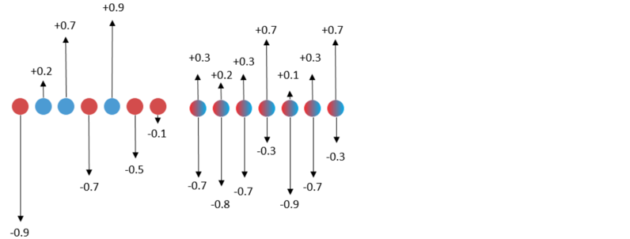
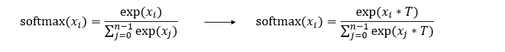
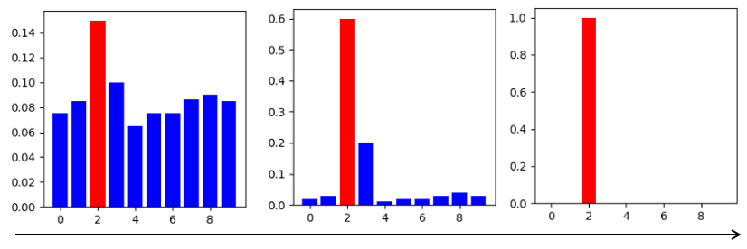

# Applying the SLB Algorithm

<a href="https://gitee.com/mindspore/docs/blob/r1.8/docs/golden_stick/docs/source_en/quantization/slb.md" target="_blank"></a>

## Background

In a conventional quantization method, a gradient is usually calculated by using straight through estimator (STE) [1] or a self-designed gradient calculation manner [2]. Due to that the quantization function is not differentiable, an error usually occurs in a calculated gradient. An inaccurate optimization direction results in relatively poor final performance. Therefore, there is an urgent need for a quantitative neural network learning method that can avoid this inaccurate gradient estimation.

## Algorithm Principles

Searching for low-bit weights (SLB) [3] is a weight quantization algorithm developed by Huawei Noah's Ark Lab. It provides a low-bit quantization algorithm based on weight search to avoid inaccurate gradient estimation. For quantization of a low-bit network, the number of effective solutions for quantizing the network weight is small. Therefore, the quantization of the network may be implemented through weight search, that is, the quantization process is converted into a weight search process. A group of quantization weights are preset for the quantization network, and then a probability matrix is defined to represent the probability that different quantization weights are retained. In the training phase, the network weights are quantized by optimizing the probability matrix.

The figure on the left shows the traditional quantization algorithm. During training, the floating-point weights are quantized, the weights are updated using inaccurate gradients, and then the floating-point weights are quantized. The figure on the right shows the SLB quantization algorithm. It uses the continuous relaxation strategy to search for discrete weights, optimizes the distribution of discrete weights during training, and selects discrete weights based on the probability to implement quantization.



### Temperature Factor

In classification tasks, softmax distribution is used to calculate the probability that the output is classified into different classes. Therefore, the SLB also uses softmax distribution to calculate the probability that a weight is quantized into each quantized weight, and finally selects a corresponding weight as a quantization result based on the maximum probability. To improve the confidence of the quantization result, the SLB introduces a temperature factor. By gradually adjusting the temperature factor, the softmax distribution gradually becomes steep and gradually approaches the one-hot distribution, thereby maximizing the confidence of the quantization result and reducing the error.

The formula on the left is a standard softmax function, and the formula on the right is the softmax function after the temperature factor is introduced in the SLB algorithm.



The following figure shows the change process of softmax distribution when the temperature factor is gradually adjusted. The rightmost figure shows the one-hot distribution.



## Algorithm Features

- A new weight search method is proposed for training quantization deep neural networks, which can avoid inaccurate gradient estimation.
- The continuous relaxation strategy is used to search for discrete weights, optimize the probability distribution of discrete weights during training, and finally select discrete weights according to the probability to realize quantization.
- In order to further eliminate the performance gap after search and ensure the consistency of training and testing, a strategy of gradually adjusting the temperature factor is proposed.
- Compared with the traditional quantization algorithm, this algorithm avoids the inaccurate gradient updating process, obtains better performance, and has more advantages in very low bit quantization.

## SLB Quantization Training

Table 1: SLB quantization training specifications

| Specifications| Description|
| --- | --- |
| Hardware| GPU |
| Networks| ResNet-18. For details, see <https://gitee.com/mindspore/models/blob/master/official/cv/resnet/README.md#apply-algorithm-in-mindspore-golden-stick>.|
| Solutions| Supports 1-, 2-, and 4-bit weight quantization solutions.|
| Data types| The GPU platform supports FP32.|
| Running modes| Graph mode and PyNative mode|

## SLB Quantization Training Example

The procedure of SLB quantization training is the same as that of common training. Additional operations need to be performed in the phases of defining a quantization network and generating a quantization model. The complete process is as follows:

1. Load the dataset and process data.
2. Define a network.
3. Define the SLB quantization algorithm and use the algorithm to generate a quantization model.
4. Define the optimizer, loss function, and callbacks.
5. Train the network and save the model file.
6. Load the model file and compare the accuracy after quantization.

The following uses the LeNet-18 as an example to describe these steps.

> For details about the complete code, see [ResNet model repository](https://gitee.com/mindspore/models/blob/master/official/cv/resnet/README.md#). [train.py](https://gitee.com/mindspore/models/blob/master/official/cv/resnet/golden_stick/quantization/slb/train.py) is the complete training code, and [eval.py](https://gitee.com/mindspore/models/blob/master/official/cv/resnet/golden_stick/quantization/slb/eval.py) is the accuracy verification code.

### Loading a Dataset

```python
dataset = create_dataset(dataset_path=config.data_path, do_train=True,
                         batch_size=config.batch_size, train_image_size=config.train_image_size,
                         eval_image_size=config.eval_image_size, target=config.device_target,
                         distribute=config.run_distribute)
```

In the code, `create_dataset` is referenced from [dataset.py](https://gitee.com/mindspore/models/blob/master/official/cv/resnet/src/dataset.py), and `config.data_path` and `config.batch_size` are configured in the [configuration file](https://gitee.com/mindspore/models/blob/master/official/cv/resnet/golden_stick/quantization/slb/resnet18_cifar10_config.yaml).

### Defining the Original Network

```python
from src.resnet import resnet18 as resnet

...
net = resnet(class_num=config.class_num)
print(net)
```

The original network structure is as follows:

```commandline
ResNet<
  (conv1): Conv2d<input_channels=3, output_channels=64, kernel_size=(7, 7), stride=(2, 2), pad_mode=pad, padding=3, dilation=(1, 1), group=1, has_bias=False, weight_init=..., bias_init=zeros, format=NCHW>
  (bn1): BatchNorm2d<num_features=64, eps=1e-05, momentum=0.9, gamma=Parameter (name=bn1.gamma, shape=(64,), dtype=Float32, requires_grad=True), beta=Parameter (name=bn1.beta, shape=(64,), dtype=Float32, requires_grad=True), moving_mean=Parameter (name=bn1.moving_mean, shape=(64,), dtype=Float32, requires_grad=False), moving_variance=Parameter (name=bn1.moving_variance, shape=(64,), dtype=Float32, requires_grad=False)>
  (pad): Pad<>
  (maxpool): MaxPool2d<kernel_size=3, stride=2, pad_mode=VALID>
  (layer1): SequentialCell<
    (0): ResidualBlockBase<
      (conv1): Conv2d<input_channels=64, output_channels=64, kernel_size=(3, 3), stride=(1, 1), pad_mode=pad, padding=1, dilation=(1, 1), group=1, has_bias=False, weight_init=..., bias_init=zeros, format=NCHW>
      (bn1d): BatchNorm2d<num_features=64, eps=0.0001, momentum=0.09999999999999998, gamma=Parameter (name=layer1.0.bn1d.gamma, shape=(64,), dtype=Float32, requires_grad=True), beta=Parameter (name=layer1.0.bn1d.beta, shape=(64,), dtype=Float32, requires_grad=True), moving_mean=Parameter (name=layer1.0.bn1d.moving_mean, shape=(64,), dtype=Float32, requires_grad=False), moving_variance=Parameter (name=layer1.0.bn1d.moving_variance, shape=(64,), dtype=Float32, requires_grad=False)>
      (conv2): Conv2d<input_channels=64, output_channels=64, kernel_size=(3, 3), stride=(1, 1), pad_mode=pad, padding=1, dilation=(1, 1), group=1, has_bias=False, weight_init=..., bias_init=zeros, format=NCHW>
      (bn2d): BatchNorm2d<num_features=64, eps=0.0001, momentum=0.09999999999999998, gamma=Parameter (name=layer1.0.bn2d.gamma, shape=(64,), dtype=Float32, requires_grad=True), beta=Parameter (name=layer1.0.bn2d.beta, shape=(64,), dtype=Float32, requires_grad=True), moving_mean=Parameter (name=layer1.0.bn2d.moving_mean, shape=(64,), dtype=Float32, requires_grad=False), moving_variance=Parameter (name=layer1.0.bn2d.moving_variance, shape=(64,), dtype=Float32, requires_grad=False)>
      (relu): ReLU<>
      >
    (1): ResidualBlockBase<
      (conv1): Conv2d<input_channels=64, output_channels=64, kernel_size=(3, 3), stride=(1, 1), pad_mode=pad, padding=1, dilation=(1, 1), group=1, has_bias=False, weight_init=..., bias_init=zeros, format=NCHW>
      (bn1d): BatchNorm2d<num_features=64, eps=0.0001, momentum=0.09999999999999998, gamma=Parameter (name=layer1.1.bn1d.gamma, shape=(64,), dtype=Float32, requires_grad=True), beta=Parameter (name=layer1.1.bn1d.beta, shape=(64,), dtype=Float32, requires_grad=True), moving_mean=Parameter (name=layer1.1.bn1d.moving_mean, shape=(64,), dtype=Float32, requires_grad=False), moving_variance=Parameter (name=layer1.1.bn1d.moving_variance, shape=(64,), dtype=Float32, requires_grad=False)>
      (conv2): Conv2d<input_channels=64, output_channels=64, kernel_size=(3, 3), stride=(1, 1), pad_mode=pad, padding=1, dilation=(1, 1), group=1, has_bias=False, weight_init=..., bias_init=zeros, format=NCHW>
      (bn2d): BatchNorm2d<num_features=64, eps=0.0001, momentum=0.09999999999999998, gamma=Parameter (name=layer1.1.bn2d.gamma, shape=(64,), dtype=Float32, requires_grad=True), beta=Parameter (name=layer1.1.bn2d.beta, shape=(64,), dtype=Float32, requires_grad=True), moving_mean=Parameter (name=layer1.1.bn2d.moving_mean, shape=(64,), dtype=Float32, requires_grad=False), moving_variance=Parameter (name=layer1.1.bn2d.moving_variance, shape=(64,), dtype=Float32, requires_grad=False)>
      (relu): ReLU<>
      >
    >
  (layer2): SequentialCell<...>
  (layer3): SequentialCell<...>
  (layer4): SequentialCell<...>
  (flatten): Flatten<>
  (end_point): Dense<input_channels=512, output_channels=10, has_bias=True>
  >
```

For details about the ResNet-18 definition, see [resnet.py](https://gitee.com/mindspore/models/blob/master/official/cv/resnet/src/resnet.py).

### Applying the Quantization Algorithm

After a network layer to be quantized is modified based on the original network definition, a network with fake quantization nodes is generated. This network is a quantization network. The `SlbQuantAwareTraining` class under the MindSpore Golden Stick is constructed and applied to the original network to convert the original network into a quantization network. `QuantDtype` is a class that defines various quantization bits. You can customize the weight quantization bits by calling the `set_weight_quant_dtype` API of the `SlbQuantAwareTraining` class.

```python
from mindspore_gs import SlbQuantAwareTraining as SlbQAT
from mindspore_gs.quantization.constant import QuantDtype

...
algo = SlbQAT()
algo.set_weight_quant_dtype(QuantDtype.INT1)
quant_net = algo.apply(net)
print(quant_net)
```

The quantized network structure is as follows, QuantizeWrapperCell is the encapsulation class of SLB quantization to the original Conv2d, including the pseudo-quantization node of the original operator and weight. Users can modify the algorithm configuration by referring to [API](https://www.mindspore.cn/golden_stick/docs/en/r0.1/mindspore_gs.html#mindspore_gs.SlbQuantAwareTraining) and confirm whether the algorithm is configured successfully by checking the attributes of the QuantizeWrapperCell.

```commandline
ResNetOpt<
  (_handler): ResNet<...>
  (conv1): Conv2d<input_channels=3, output_channels=64, kernel_size=(7, 7), stride=(2, 2), pad_mode=pad, padding=3, dilation=(1, 1), group=1, has_bias=False, weight_init=..., bias_init=zeros, format=NCHW>
  (bn1): BatchNorm2d<num_features=64, eps=1e-05, momentum=0.9, gamma=Parameter (name=bn1.gamma, shape=(64,), dtype=Float32, requires_grad=True), beta=Parameter (name=bn1.beta, shape=(64,), dtype=Float32, requires_grad=True), moving_mean=Parameter (name=bn1.moving_mean, shape=(64,), dtype=Float32, requires_grad=False), moving_variance=Parameter (name=bn1.moving_variance, shape=(64,), dtype=Float32, requires_grad=False)>
  (pad): Pad<>
  (maxpool): MaxPool2d<kernel_size=3, stride=2, pad_mode=VALID>
  (layer1): SequentialCellOpt<
    (_handler): SequentialCell<...>
    (cell_list_0): ResidualBlockBaseOpt<
      (_handler): ResidualBlockBase<...>
      (conv1): Conv2d<input_channels=64, output_channels=64, kernel_size=(3, 3), stride=(1, 1), pad_mode=pad, padding=1, dilation=(1, 1), group=1, has_bias=False, weight_init=..., bias_init=zeros, format=NCHW>
      (bn1d): BatchNorm2d<num_features=64, eps=0.0001, momentum=0.09999999999999998, gamma=Parameter (name=layer1._handler.0.bn1d.gamma, shape=(64,), dtype=Float32, requires_grad=True), beta=Parameter (name=layer1._handler.0.bn1d.beta, shape=(64,), dtype=Float32, requires_grad=True), moving_mean=Parameter (name=layer1._handler.0.bn1d.moving_mean, shape=(64,), dtype=Float32, requires_grad=False), moving_variance=Parameter (name=layer1._handler.0.bn1d.moving_variance, shape=(64,), dtype=Float32, requires_grad=False)>
      (conv2): Conv2d<input_channels=64, output_channels=64, kernel_size=(3, 3), stride=(1, 1), pad_mode=pad, padding=1, dilation=(1, 1), group=1, has_bias=False, weight_init=..., bias_init=zeros, format=NCHW>
      (bn2d): BatchNorm2d<num_features=64, eps=0.0001, momentum=0.09999999999999998, gamma=Parameter (name=layer1._handler.0.bn2d.gamma, shape=(64,), dtype=Float32, requires_grad=True), beta=Parameter (name=layer1._handler.0.bn2d.beta, shape=(64,), dtype=Float32, requires_grad=True), moving_mean=Parameter (name=layer1._handler.0.bn2d.moving_mean, shape=(64,), dtype=Float32, requires_grad=False), moving_variance=Parameter (name=layer1._handler.0.bn2d.moving_variance, shape=(64,), dtype=Float32, requires_grad=False)>
      (relu): ReLU<>
      (Conv2dSlbQuant): QuantizeWrapperCell<
        (_handler): Conv2dSlbQuant<
          in_channels=64, out_channels=64, kernel_size=(3, 3), weight_bit_num=1, stride=(1, 1), pad_mode=pad, padding=1, dilation=(1, 1), group=1, has_bias=False
          (fake_quant_weight): SlbFakeQuantizerPerLayer<bit_num=1>
          >
        >
      (Conv2dSlbQuant_1): QuantizeWrapperCell<
        (_handler): Conv2dSlbQuant<
          in_channels=64, out_channels=64, kernel_size=(3, 3), weight_bit_num=1, stride=(1, 1), pad_mode=pad, padding=1, dilation=(1, 1), group=1, has_bias=False
          (fake_quant_weight): SlbFakeQuantizerPerLayer<bit_num=1>
          >
        >
      >
    (cell_list_1): ResidualBlockBaseOpt_1<
    (_handler): ResidualBlockBase<...>
      (conv1): Conv2d<input_channels=64, output_channels=64, kernel_size=(3, 3), stride=(1, 1), pad_mode=pad, padding=1, dilation=(1, 1), group=1, has_bias=False, weight_init=..., bias_init=zeros, format=NCHW>
      (bn1d): BatchNorm2d<num_features=64, eps=0.0001, momentum=0.09999999999999998, gamma=Parameter (name=layer1._handler.1.bn1d.gamma, shape=(64,), dtype=Float32, requires_grad=True), beta=Parameter (name=layer1._handler.1.bn1d.beta, shape=(64,), dtype=Float32, requires_grad=True), moving_mean=Parameter (name=layer1._handler.1.bn1d.moving_mean, shape=(64,), dtype=Float32, requires_grad=False), moving_variance=Parameter (name=layer1._handler.1.bn1d.moving_variance, shape=(64,), dtype=Float32, requires_grad=False)>
      (conv2): Conv2d<input_channels=64, output_channels=64, kernel_size=(3, 3), stride=(1, 1), pad_mode=pad, padding=1, dilation=(1, 1), group=1, has_bias=False, weight_init=..., bias_init=zeros, format=NCHW>
      (bn2d): BatchNorm2d<num_features=64, eps=0.0001, momentum=0.09999999999999998, gamma=Parameter (name=layer1._handler.1.bn2d.gamma, shape=(64,), dtype=Float32, requires_grad=True), beta=Parameter (name=layer1._handler.1.bn2d.beta, shape=(64,), dtype=Float32, requires_grad=True), moving_mean=Parameter (name=layer1._handler.1.bn2d.moving_mean, shape=(64,), dtype=Float32, requires_grad=False), moving_variance=Parameter (name=layer1._handler.1.bn2d.moving_variance, shape=(64,), dtype=Float32, requires_grad=False)>
      (relu): ReLU<>
      (Conv2dSlbQuant): QuantizeWrapperCell<
        (_handler): Conv2dSlbQuant<
          in_channels=64, out_channels=64, kernel_size=(3, 3), weight_bit_num=1, stride=(1, 1), pad_mode=pad, padding=1, dilation=(1, 1), group=1, has_bias=False
          (fake_quant_weight): SlbFakeQuantizerPerLayer<bit_num=1>
          >
        >
      (Conv2dSlbQuant_1): QuantizeWrapperCell<
        (_handler): Conv2dSlbQuant<
          in_channels=64, out_channels=64, kernel_size=(3, 3), weight_bit_num=1, stride=(1, 1), pad_mode=pad, padding=1, dilation=(1, 1), group=1, has_bias=False
          (fake_quant_weight): SlbFakeQuantizerPerLayer<bit_num=1>
          >
        >
      >
    >
  (layer2): SequentialCellOpt_1<...>
  (layer3): SequentialCellOpt_3<...>
  (layer4): SequentialCellOpt_5<...>
  (flatten): Flatten<>
  (end_point): Dense<input_channels=512, output_channels=10, has_bias=True>
  (Conv2dSlbQuant): QuantizeWrapperCell<
    (_handler): Conv2dSlbQuant<
      in_channels=3, out_channels=64, kernel_size=(7, 7), weight_bit_num=1, stride=(2, 2), pad_mode=pad, padding=3, dilation=(1, 1), group=1, has_bias=False
      (fake_quant_weight): SlbFakeQuantizerPerLayer<bit_num=1>
      >
    >
  >
```

Compared with the original network, conv in the quantized network is replaced with Conv2dSlbQuant.

### Defining the Optimizer, Loss Function, and Training Callbacks

For the SLB quantization algorithm, in addition to the callbacks commonly used in training, a callback class `TemperatureScheduler` that supports dynamic adjustment of the temperature factor needs to be defined.

```python
import mindspore as ms
import mindspore.train.callback as callback
from mindspore.train.loss_scale_manager import FixedLossScaleManager
from mindspore.train.callback import ModelCheckpoint, CheckpointConfig, LossMonitor, TimeMonitor

class TemperatureScheduler(callback.Callback):
    def __init__(self, model, epoch_size=100, has_trained_epoch=0,
                 t_start_val=1.0, t_start_time=0.2, t_end_time=0.6, t_factor=1.2):
        super().__init__()
        self.epochs = epoch_size
        self.has_trained_epoch = has_trained_epoch
        self.t_start_val = t_start_val
        self.t_start_time = t_start_time
        self.t_end_time = t_end_time
        self.t_factor = t_factor
        self.model = model

    def epoch_begin(self, run_context):
        cb_params = run_context.original_args()
        epoch = cb_params.cur_epoch_num + self.has_trained_epoch
        # Compute temperature value
        t = self.t_start_val
        t_start_epoch = int(self.epochs*self.t_start_time)
        t_end_epoch = int(self.epochs*self.t_end_time)
        if epoch > t_start_epoch:
            t *= self.t_factor**(min(epoch, t_end_epoch) - t_start_epoch)
        # Assign new value to temperature parameter
        for _, cell in self.model.train_network.cells_and_names():
            if cell.cls_name == 'SlbFakeQuantizerPerLayer':
                cell.set_temperature(t)
                if epoch >= t_end_epoch:
                    cell.set_temperature_end_flag()

step_size = dataset.get_dataset_size()
lr = get_lr(lr_init=config.lr_init,
            lr_end=config.lr_end,
            lr_max=config.lr_max,
            warmup_epochs=config.warmup_epochs,
            total_epochs=config.epoch_size,
            steps_per_epoch=step_size,
            lr_decay_mode=config.lr_decay_mode)
if config.pre_trained:
    lr = lr[config.has_trained_epoch * step_size:]
lr = ms.Tensor(lr)
# define optimizer
group_params = init_group_params(quant_net)
opt = nn.Momentum(group_params, lr, config.momentum, weight_decay=config.weight_decay,
                  loss_scale=config.loss_scale)

loss = init_loss_scale()
loss_scale = FixedLossScaleManager(config.loss_scale, drop_overflow_update=False)
metrics = {"acc"}
model = ms.Model(quant_net, loss_fn=loss, optimizer=opt, loss_scale_manager=loss_scale, metrics=metrics,
                 amp_level="O0", boost_level=config.boost_mode, keep_batchnorm_fp32=False,
                 boost_config_dict={"grad_freeze": {"total_steps": config.epoch_size * step_size}})

# define callbacks
time_cb = TimeMonitor(data_size=step_size)
loss_cb = LossCallBack(config.has_trained_epoch)

cb = [time_cb, loss_cb]
algo_cb = algo.callback()
cb.append(algo_cb)
cb.append(TemperatureScheduler(model, config.epoch_size, config.has_trained_epoch, config.t_start_val,
                                   config.t_start_time, config.t_end_time, config.t_factor))
ckpt_append_info = [{"epoch_num": config.has_trained_epoch, "step_num": config.has_trained_step}]
config_ck = CheckpointConfig(save_checkpoint_steps=config.save_checkpoint_epochs * step_size,
                             keep_checkpoint_max=config.keep_checkpoint_max,
                             append_info=ckpt_append_info)
ckpt_cb = ModelCheckpoint(prefix="resnet", directory="./ckpt", config=config_ck)
cb += [ckpt_cb]
```

In the code, `get_lr` is referenced from [lr_generator.py](https://gitee.com/mindspore/models/blob/master/official/cv/resnet/src/lr_generator.py), and `init_group_params` and `init_loss_scale` are referenced from [train.py](https://gitee.com/mindspore/models/blob/master/official/cv/resnet/golden_stick/quantization/slb/train.py).

### Training the Model and Saving the Model File

```python
dataset_sink_mode = target != "CPU"
model.train(config.epoch_size - config.has_trained_epoch, dataset, callbacks=cb,
            sink_size=dataset.get_dataset_size(), dataset_sink_mode=dataset_sink_mode)
```

The running result is as follows:

```commandline
epoch: 1 step: 1562, loss is 1.4536957
Train epoch time: 101539.306 ms, per step time: 65.006 ms
epoch: 2 step: 1562, loss is 1.3616204
Train epoch time: 94238.882 ms, per step time: 60.332 ms
epoch: 3 step: 1562, loss is 1.2128768
Train epoch time: 94237.197 ms, per step time: 60.331 ms
epoch: 4 step: 1562, loss is 0.99068344
Train epoch time: 94084.353 ms, per step time: 60.233 ms
epoch: 5 step: 1562, loss is 0.89842224
Train epoch time: 94498.564 ms, per step time: 60.498 ms
epoch: 6 step: 1562, loss is 0.8985137
Train epoch time: 94106.722 ms, per step time: 60.248 ms
```

### Loading the Model and Comparing the Accuracy

Obtain the accuracy of the common training model according to the steps in the [ResNet model repository](https://gitee.com/mindspore/models/tree/master/official/cv/resnet).

```commandline
'top_1_accuracy': 0.9544270833333334, 'top_5_accuracy': 0.9969951923076923
```

Load the model file obtained in the previous step and import the quantized model for accuracy evaluation.

```python
param_dict = ms.load_checkpoint(config.checkpoint_file_path)
ms.load_param_into_net(quant_net, param_dict)
ds_eval = create_dataset(dataset_path=config.data_path, do_train=False, batch_size=config.batch_size,
                         eval_image_size=config.eval_image_size, target=config.device_target)
model = ms.Model(quant_net, loss_fn=loss, metrics={'top_1_accuracy', 'top_5_accuracy'})
acc = model.eval(ds_eval)
print(acc)
```

```commandline
'top_1_accuracy': 0.9485176282051282, 'top_5_accuracy': 0.9965945512820513.
```

In graph mode, apply SLB quantization to ResNet-18 and use the CIFAR-10 dataset for evaluation. The following table lists the experiment results. W32 indicates a full-precision model. W4 indicates that the weight is 4 bits, W2 indicates that the weight is 2 bits, and W1 indicates that the weight is 1 bit. It can be found that, in the current task, compared with the full-precision model, the top 1 accuracy of the model after 4-bit weight quantization has no loss, and the top 1 accuracy loss of the model after 1-bit weight quantization is within 0.6%. SLB quantization greatly reduces model parameters, making it easier to deploy models on devices with limited resources. The model here is not the final deployment model. Due to the addition of pseudo-quantization nodes and weight probability matrix, the checkpoint size increases compared with the original model. The increase amplitude is affected by the weight quantization bits. The final quantization model, that is, the final deployment model, is obtained by selecting the preset quantization weights according to the weight probability matrix.

| Quantization Type| Top 1 Accuracy| Top 5 Accuracy|
| --- | --- | --- |
| W32 | 0.9544 | 0.9970 |
| W4 | 0.9534 | 0.9970 |
| W2 | 0.9503 | 0.9967 |
| W1 | 0.9485 | 0.9966 |

## References

[1] Bengio, Yoshua, Nicholas Léonard, and Aaron Courville. Estimating or propagating gradients through stochastic neurons for conditional computation. 2013.

[2] Hanxiao Liu, Karen Simonyan, and Yiming Yang. Darts: Differentiable architecture search. ICLR, 2019.

[3] Yang Z, Wang Y, Han K, et al. Searching for low-bit weights in quantized neural networks. NIPS, 2020.
