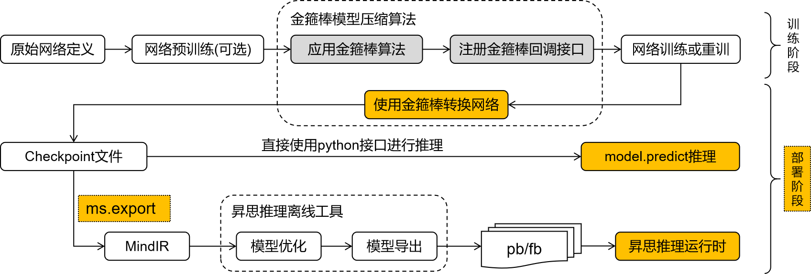

# 模型部署概述

经过MindSpore Golden Stick压缩的网络可能需要额外的步骤，将网络中模型压缩相关的结构从训练形态转化为部署形态，方便进一步进行模型导出和模型部署。主要考虑以下三点：

1. 不同的算法通过会引入不同神经网络算子或者自定义后端算子来实现算法逻辑。如果网络存在这些压缩算法自定义算子，该网络将无法在MindSpore后端进行推理。如各种量化算法中的伪量化算子、剪枝算法中的mask算子等，这些算子应被提前优化去除。
2. 网络的训练态和部署态差异很大，部署时更加注重部署的功耗、性能等，所以通常会对训练网络做一些优化，如数据类型的优化、常量折叠等，其目的是为了尽可能提高部署时的效果。
3. MindIR是MindSpore的中间表达，模型导出为MindIR格式将有利于将模型便利地部署在不同的推理设备中。

总而言之，从模型压缩算法整体来看，其最终的输出应该是一个标准的量化网络，以便部署在不同的后端上，实现算法的价值。MindSpore Golden Stick提供简洁易用的接口方便用户在模型训练后对网络进行转换导出继而进行模型部署。

## 模型部署的三个步骤

1. [模型转换](https://www.mindspore.cn/golden_stick/docs/zh-CN/master/deployment/convert.html)：将经过算法优化的模型进一步转换成标准的MindSpore网络；
2. 模型导出：将模型导出为MindIR格式。MindSpore Golden Stick模型导出使用MindSpore已有能力，详情请见 [`mindspore.export` 文档](https://www.mindspore.cn/docs/zh-CN/master/api_python/mindspore/mindspore.export.html)；
3. 模型推理：使用MindIR在端侧、GPU或者Ascend上进行部署推理。此特性敬请期待。

