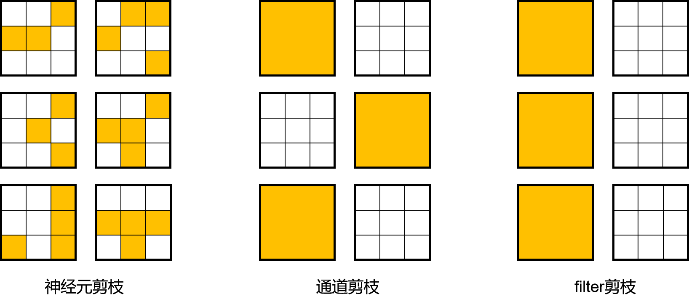

# 剪枝算法概述

本文是在介绍具体的剪枝算法之前，介绍一些剪枝算法的基本概念，帮助用户理解。如果已经对剪枝算法有较深的理解，可以直接跳转到[示例](#示例)小节。

## 什么是剪枝

如同神经网络的发明是受到神经生物学的启发一样，剪枝算法同样受到了神经生物学的启发，在神经生物学中有个概念叫做突触修剪，通常发生在哺乳动物的婴幼儿时期，通过突触修剪机制，简化和重构大脑的神经元连接，使得大脑能以更低的能量获得更高效的工作方式。剪枝是在保证网络准确率下降较小的前提下，通过去除神经网络中部分组件（如权重、特征图、卷积核）降低网络的参数量，从而降低网络部署时的存储和计算代价。

神经网络推理的过程通常可以看作是激活和权重做运算的过程，相应的，剪枝算法也通常分为两大类，权重剪枝和激活剪枝。当前在MindSpore Golden Stick中，我们仅讨论权重剪枝。

对于权重剪枝来说，按照剪枝模式的不同，主要分为结构化剪枝和非结构化剪枝。如图，从左至右，剪枝模式越来越粗粒度，剪枝得到的结构也越来越结构化：

非结构化剪枝是指以单个权值为粒度，可以对权重张量中的任意位置的权值进行裁剪。这种剪枝方式由于其细粒度的特点，其对于网络的准确率的影响更小，但会导致权重张量的稀疏化。稀疏化的权重张量对访存不友好，对并行计算不友好，所以非结构化剪枝后的网络难以获得较高的加速比。

结构化剪枝是指以权重的通道或者整个卷积核为粒度，删去模型中的部分权重。由于是直接剪掉整个通道或者整个卷积核，所以剪枝得到的权重更加规则且规模更小，这也是其结构化剪枝的含义所在。相较于非结构化剪枝，结构化剪枝由于得到的权重更加规则，对访存更友好，所以比较适合在CPU、GPU等设备上进行加速推理。

## 示例

当前版本中，MindSpore Golden Stick提供了一个结构化权重剪枝算法，可以参考[SCOP剪枝算法示例](https://www.mindspore.cn/golden_stick/docs/zh-CN/r0.1/pruner/scop.html)了解如何应用MindSpore Golden Stick中的剪枝算法。
