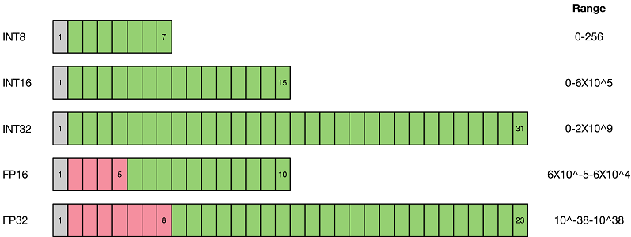

# 量化算法概述

本文是在介绍具体的量化算法之前，介绍一些量化算法的基本概念，帮助用户理解。如果已经对量化算法有较深的理解，可以直接跳转到[示例](#示例)小节。

## 背景

随着深度学习的发展，神经网络被广泛应用于各种领域，网络准确率提高的同时也引入了巨大的参数量和计算量。同时越来越多的应用选择在移动设备或者边缘设备上使用深度学习技术。

以手机为例，为了提供人性化和智能化的服务，操作系统和APP应用都开始集成AI功能。使用该功能，不可避免地要向手机软件中引入网络文件和权重文件，以经典的AlexNet为例，原始权重文件已经超过了200MB，而最近出现的新网络正往结构更复杂、参数更多的方向发展。

由于移动设备、边缘设备的硬件资源有限，需要对网络进行精简，量化（Quantization）技术就是应对该类问题衍生出的技术之一。网络量化是一种将浮点计算转成低比特定点计算的技术，可以有效地降低网络计算量、参数大小和内存消耗，但往往带来一些精度损失。

## 量化方法

量化即以较低的推理精度损失，将网络中的32位有限范围浮点型（FP32）权重或激活近似为有限多个离散值（通常为int8）的过程。换言之，它是以更少位数的数据类型来近似表示FP32数据的过程，而网络的输入输出依然是浮点型，从而达到减少网络尺寸大小、减少网络部署时的内存消耗及加快网络推理速度等目标。

虽然量化会损失精度，因为量化相当于给网络引入了噪声，但是神经网络一般对噪声是不太敏感的，只要控制好量化的程度，对高级任务精度影响可以做到很小。量化后的网络相较于原始网络，在网络推理时使用INT8运算代替了原有的FP32计算，性能能够得到极大的提升。

如上图所示，与FP32类型相比，FP16、INT8等低精度数据表达类型所占用空间更小。使用低精度数据表达类型替换高精度数据表达类型，可以大幅降低存储空间和传输时间。而低比特的推理性能也更高，INT8相对比FP32的加速比可达到3倍甚至更高，对于相同的计算，功耗上也有明显优势。

当前业界量化方案主要分为两种：**感知量化训练**（Quantization Aware Training）和**训练后量化**（Post-training Quantization）。

1）**感知量化训练**需要训练数据，在网络准确率上通常表现更好，适用于对网络压缩率和网络准确率要求较高的场景。目的是减少精度损失，其参与网络训练的前向推理过程令网络获得量化损失的差值，但梯度更新需要在浮点下进行，因而其并不参与反向传播过程。

2）**训练后量化**简单易用，只需少量校准数据，适用于追求高易用性和缺乏训练资源的场景。

## 示例

- [SimQAT算法示例](https://www.mindspore.cn/golden_stick/docs/zh-CN/master/quantization/simqat.html)：一种基础的基于伪量化技术的感知量化算法
- [SLB量化算法示例](https://www.mindspore.cn/golden_stick/docs/zh-CN/master/quantization/slb.html)：一种非线性的低比特感知量化算法

