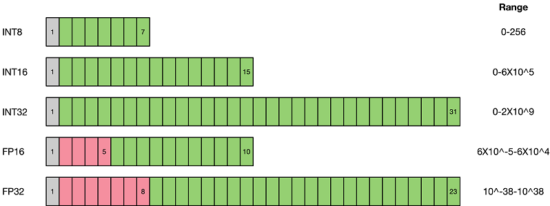
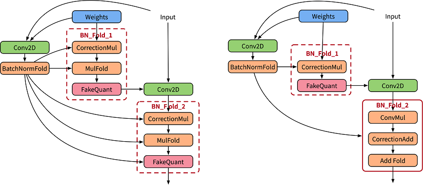

# 使用MindSpore Golden Stick中的感知量化算法

<a href="https://gitee.com/mindspore/docs/blob/master/docs/golden_stick/docs/source_zh_cn/quantization/quantization.md" target="_blank"></a>
&nbsp;&nbsp;

## 背景

随着深度学习的发展，神经网络被广泛应用于各种领域，模型性能提高的同时也引入了巨大的参数量和计算量。越来越多的应用选择在移动设备或者边缘设备上使用深度学习技术。

以手机为例，为了提供人性化和智能化的服务，操作系统和APP应用都开始集成AI功能。而使用该功能，涉及训练或者推理，自然包含大量的网络模型及权重文件。以经典的AlexNet为例，原始权重文件已经超过了200MB，而最近出现的新模型正往结构更复杂、参数更多的方向发展。

## 概述

由于移动设备、边缘设备的硬件资源有限，需要对模型进行精简，而量化（Quantization）技术就是应对该类问题衍生出的技术之一。模型量化是一种将浮点计算转成低比特定点计算的技术，可以有效地降低模型计算强度、参数大小和内存消耗，但往往带来巨大的精度损失。

### 量化方法

模型量化即以较低的推理精度损失将连续取值（或者大量可能的离散取值）的浮点型模型权重或流经模型的张量数据定点近似为（通常为int8）有限多个（或较少的）离散值的过程，它是以更少位数的数据类型用于近似表示32位有限范围浮点型数据的过程，而模型的输入输出依然是浮点型，从而达到减少模型尺寸大小、减少模型内存消耗及加快模型推理速度等目标。

首先量化会损失精度，这相当于给网络引入了噪声，但是神经网络一般对噪声是不太敏感的，只要控制好量化的程度，对高级任务精度影响可以做到很小。

其次，传统的卷积操作都是使用FP32浮点，浮点运算时需要很多时间周期来完成，但是如果我们将权重参数和激活在输入各个层之前量化到INT8，减少了位数和乘法操作，而且此时做的卷积操作都是整型的乘加运算，比浮点快很多。



如上图所示，与FP32类型相比，FP16、INT8等低精度数据表达类型所占用空间更小。使用低精度数据表达类型替换高精度数据表达类型，可以大幅降低存储空间和传输时间。而低比特的计算性能也更高，INT8相对比FP32的加速比可达到3倍甚至更高，对于相同的计算，功耗上也有明显优势。

当前业界量化方案主要分为两种：**感知量化训练**（Quantization Aware Training）和**训练后量化**（Post-training Quantization）。

1）**感知量化训练**需要训练数据，在模型准确率上通常表现更好，适用于对模型压缩率和模型准确率要求较高的场景。目的是减少精度损失，其参与模型训练的前向推理过程令模型获得量化损失的差值，但梯度更新需要在浮点下进行，因而其并不参与反向传播过程。

2）**训练后量化**简单易用，只需少量校准数据，适用于追求高易用性和缺乏训练资源的场景。

3）**训练后校正量化**同样是训练后静态量化，也称为校正量化或者数据集量化。其原理是在端侧低比特推理时，生成一个校准表来量化模型。

### 伪量化节点

伪量化节点，是指感知量化训练中插入的节点，用以寻找网络数据分布，并反馈损失精度，具体作用如下：

- 找到网络数据的分布，即找到待量化参数的最大值和最小值；
- 模拟量化为低比特时的精度损失，把该损失作用到网络模型中，传递给损失函数，让优化器在训练过程中对该损失值进行优化。

### BatchNorm折叠

为了规约输出数据范围，卷积或者全连接层后通常会加入BatchNorm算子，在训练过阶段BatchNorm作为一个独立的算子，统计输出的均值和方差（如下左图），在推理阶段则将其融入权重和Bias中，称为BatchNorm折叠（如下右图）。


BatchNorm折叠的公式如下：

$$y_{bn}=\operatorname{BN}\left(y_{cout}\right)=BN(w \cdot x+b)=\widehat{w} \cdot x+\widehat{b}$$

在感知量化训练中，为精确模拟推理中的折叠操作，论文[1]使用两套卷积分别用于计算当前的BatchNorm参数，并用计算得到的参数规约实际作用卷积的权重值（如下左图），其中CorrectionMul用于权重校正，MulFold用于权重数据规约
在金箍棒中进一步将权重校正和规约融合，提升性能。



## 感知量化训练

MindSpore的感知量化训练是指在训练时使用伪量化节点来模拟量化操作，过程中仍然采用浮点数计算，并通过反向传播学习更新网络参数，使得网络参数更好地适应量化带来的损失。对于权值和数据的量化，MindSpore采用了参考文献[1]中的方案。

表1：感知量化训练规格

| 规格 | 规格说明 |
| --- | --- |
| 硬件支持 | GPU |
| 网络支持 | 已实现的网络包括LeNet、ResNet50等网络，具体请参见<https://gitee.com/mindspore/models/tree/master>。 |
| 算法支持 | 支持非对称和对称的量化算法；支持逐层和逐通道的量化算法。|
| 方案支持 | 支持8比特的量化方案。 |
| 数据类型支持 | GPU平台支持FP32。 |
| 运行模式支持 | Graph模式和PyNative模式 |

## 感知量化训练示例

感知量化训练与一般训练步骤基本一致,在构造网络阶段需要应用金箍棒的量化算法生成量化模型，完整流程如下：

1. 加载数据集，处理数据。
2. 定义网络。
3. 定义金箍棒量化算法，应用算法生成量化模型。
4. 定义优化器、损失函数和callbacks。
5. 训练网络，保存模型文件。
6. 加载模型文件，对比量化后精度。

接下来以LeNet5网络为例，分别叙述这些步骤。

> 完整代码见[lenet模型仓](https://gitee.com/mindspore/models/tree/master/official/cv/lenet/README_CN.md#应用金箍棒模型压缩算法)
> ，其中[train.py](https://gitee.com/mindspore/models/blob/master/official/cv/lenet/golden_stick/quantization/simqat/train.py) 为完整的训练代码，[eval.py](https://gitee.com/mindspore/models/blob/master/official/cv/lenet/golden_stick/quantization/simqat/eval.py) 为精度验证代码。

### 加载数据集

```python
ds_train = create_dataset(os.path.join(config.data_path), config.batch_size)
```

代码中create_dataset引用自[dataset.py](https://gitee.com/mindspore/models/blob/master/official/cv/lenet/src/dataset.py)
 ，config.data_path和config.batch_size分别在[配置文件](https://gitee.com/mindspore/models/blob/master/official/cv/lenet/golden_stick/quantization/simqat/lenet_mnist_config.yaml) 中配置，下同。

### 定义原网络

```python
from src.lenet import LeNet5
...
network = LeNet5(config.num_classes)
print(network)
```

原始网络结构如下：

```commandline
LeNet5<
  (conv1): Conv2d<input_channels=1, output_channels=6, kernel_size=(5, 5), stride=(1, 1), pad_mode=valid, padding=0, dilation=(1, 1), group=1, has_bias=False, weight_init=normal, bias_init=zeros, format=NCHW>
  (conv2): Conv2d<input_channels=6, output_channels=16, kernel_size=(5, 5), stride=(1, 1), pad_mode=valid, padding=0, dilation=(1, 1), group=1, has_bias=False, weight_init=normal, bias_init=zeros, format=NCHW>
  (relu): ReLU<>
  (max_pool2d): MaxPool2d<kernel_size=2, stride=2, pad_mode=VALID>
  (flatten): Flatten<>
  (fc1): Dense<input_channels=400, output_channels=120, has_bias=True>
  (fc2): Dense<input_channels=120, output_channels=84, has_bias=True>
  (fc3): Dense<input_channels=84, output_channels=10, has_bias=True>
  >
```

LeNet5网络定义见[lenet.py](https://gitee.com/mindspore/models/blob/master/official/cv/lenet/src/lenet.py) 。

### 应用量化算法

量化网络是指在原网络定义的基础上，修改需要量化的网络层后生成的带有伪量化节点的网络，通过构造金箍棒下的`SimulatedQuantizationAwareTraining`类，并将其应用到原网络上将原网络转换为量化网络。

```python
from mindspore_gs import SimulatedQuantizationAwareTraining as SimQAT

...
algo = SimQAT()
quanted_network = algo.apply(network)
print(quanted_network)
```

量化网络结构如下：

```commandline
LeNet5Opt<
  (_handler):
  ...
  (Conv2dQuant): QuantizeWrapperCell<
    (_handler): Conv2dQuant<
      in_channels=1, out_channels=6, kernel_size=(5, 5), stride=(1, 1), pad_mode=valid, padding=0, dilation=(1, 1), group=1, has_bias=False
      (fake_quant_weight): SimulatedFakeQuantizerPerChannel<bit_num=8, symmetric=True, narrow_range=False, ema=False(0.999), per_channel=True(0, 6), quant_delay=0>
      >
    (_input_quantizer): SimulatedFakeQuantizerPerLayer<bit_num=8, symmetric=False, narrow_range=False, ema=False(0.999), per_channel=False, quant_delay=0>
    (_output_quantizer): SimulatedFakeQuantizerPerLayer<bit_num=8, symmetric=False, narrow_range=False, ema=False(0.999), per_channel=False, quant_delay=0>
    >
  (Conv2dQuant_1): QuantizeWrapperCell<
    (_handler): Conv2dQuant<
      in_channels=6, out_channels=16, kernel_size=(5, 5), stride=(1, 1), pad_mode=valid, padding=0, dilation=(1, 1), group=1, has_bias=False
      (fake_quant_weight): SimulatedFakeQuantizerPerChannel<bit_num=8, symmetric=True, narrow_range=False, ema=False(0.999), per_channel=True(0, 16), quant_delay=0>
      >
    (_input_quantizer): SimulatedFakeQuantizerPerLayer<bit_num=8, symmetric=False, narrow_range=False, ema=False(0.999), per_channel=False, quant_delay=0>
    (_output_quantizer): SimulatedFakeQuantizerPerLayer<bit_num=8, symmetric=False, narrow_range=False, ema=False(0.999), per_channel=False, quant_delay=0>
    >
  (DenseQuant): QuantizeWrapperCell<
    (_handler): DenseQuant<
      in_channels=400, out_channels=120, weight=Parameter (name=DenseQuant._handler.weight, shape=(120, 400), dtype=Float32, requires_grad=True), has_bias=True, bias=Parameter (name=DenseQuant._handler.bias, shape=(120,), dtype=Float32, requires_grad=True)
      (fake_quant_weight): SimulatedFakeQuantizerPerChannel<bit_num=8, symmetric=True, narrow_range=False, ema=False(0.999), per_channel=True(0, 120), quant_delay=0>
      >
    (_input_quantizer): SimulatedFakeQuantizerPerLayer<bit_num=8, symmetric=False, narrow_range=False, ema=False(0.999), per_channel=False, quant_delay=0>
    (_output_quantizer): SimulatedFakeQuantizerPerLayer<bit_num=8, symmetric=False, narrow_range=False, ema=False(0.999), per_channel=False, quant_delay=0>
    >
  (DenseQuant_1): QuantizeWrapperCell<
    (_handler): DenseQuant<
      in_channels=120, out_channels=84, weight=Parameter (name=DenseQuant_1._handler.weight, shape=(84, 120), dtype=Float32, requires_grad=True), has_bias=True, bias=Parameter (name=DenseQuant_1._handler.bias, shape=(84,), dtype=Float32, requires_grad=True)
      (fake_quant_weight): SimulatedFakeQuantizerPerChannel<bit_num=8, symmetric=True, narrow_range=False, ema=False(0.999), per_channel=True(0, 84), quant_delay=0>
      >
    (_input_quantizer): SimulatedFakeQuantizerPerLayer<bit_num=8, symmetric=False, narrow_range=False, ema=False(0.999), per_channel=False, quant_delay=0>
    (_output_quantizer): SimulatedFakeQuantizerPerLayer<bit_num=8, symmetric=False, narrow_range=False, ema=False(0.999), per_channel=False, quant_delay=0>
    >
  (DenseQuant_2): QuantizeWrapperCell<
    (_handler): DenseQuant<
      in_channels=84, out_channels=10, weight=Parameter (name=DenseQuant_2._handler.weight, shape=(10, 84), dtype=Float32, requires_grad=True), has_bias=True, bias=Parameter (name=DenseQuant_2._handler.bias, shape=(10,), dtype=Float32, requires_grad=True)
      (fake_quant_weight): SimulatedFakeQuantizerPerChannel<bit_num=8, symmetric=True, narrow_range=False, ema=False(0.999), per_channel=True(0, 10), quant_delay=0>
      >
    (_input_quantizer): SimulatedFakeQuantizerPerLayer<bit_num=8, symmetric=False, narrow_range=False, ema=False(0.999), per_channel=False, quant_delay=0>
    (_output_quantizer): SimulatedFakeQuantizerPerLayer<bit_num=8, symmetric=False, narrow_range=False, ema=False(0.999), per_channel=False, quant_delay=0>
    >
  >
```

### 定义优化器、损失函数和训练的callbacks

```python
net_loss = nn.SoftmaxCrossEntropyWithLogits(sparse=True, reduction="mean")
net_opt = nn.Momentum(network.trainable_params(), config.lr, config.momentum)
time_cb = TimeMonitor(data_size=ds_train.get_dataset_size())
config_ck = CheckpointConfig(save_checkpoint_steps=config.save_checkpoint_steps,
                             keep_checkpoint_max=config.keep_checkpoint_max)
ckpoint_cb = ModelCheckpoint(prefix="checkpoint_lenet", directory="./ckpt", config=config_ck)
```

### 训练模型，保存模型文件

```python
model = Model(network, net_loss, net_opt, metrics={"Accuracy": Accuracy()})
model.train(config.epoch_size, ds_train, callbacks=[time_cb, ckpoint_cb, LossMonitor()])
```

运行结果如下：

```commandline
epoch:1 step: 1875, loss is 0.1609785109
Train epoch time: 18172.836 ms, per step time: 9.692 ms
epoch:2 step: 1875, loss is 0.00334590533
Train epoch time: 8617.408 ms, per step time: 4.596 ms
epoch:3 step: 1875, loss is 0.00310735423
Train epoch time: 8526.766 ms, per step time: 4.548 ms
epoch:4 step: 1875, loss is 0.00962805934
Train epoch time: 8585.520 ms, per step time: 4.579 ms
epoch:5 step: 1875, loss is 0.00363082927
Train epoch time: 8512.096 ms, per step time: 4.540 ms
epoch:6 step: 1875, loss is 0.00169560452
Train epoch time: 8303.8515 ms, per step time: 4.429 ms
epoch:7 step: 1875, loss is 0.08799523115
Train epoch time: 8417.257 ms, per step time: 4.489 ms
epoch:8 step: 1875, loss is 0.0838107979
Train epoch time: 8416.146 ms, per step time: 4.489 ms
epoch:9 step: 1875, loss is 0.00722093607
Train epoch time: 8425.732 ms, per step time: 4.484 ms
epoch:10 step: 1875, loss is 0.00027961225
Train epoch time: 8544.641 ms, per step time: 4.552 ms
```

### 加载模型，对比精度

按照[lenet模型仓](https://gitee.com/mindspore/models/tree/master/official/cv/lenet) 步骤获得普通训练的模型精度：

```commandline
'Accuracy':0.9842
```

加载上一步得到的模型文件，导入量化后模型评估精度。

```python
param_dict = load_checkpoint(config.checkpoint_file_path)
load_param_into_net(network, param_dict)
ds_eval = create_dataset(os.path.join(config.data_path), config.batch_size)
acc = model.eval(ds_eval)
print(acc)
```

```commandline
'Accuracy':0.990484
```

LeNet5应用感知量化训练后精度未下降。

## 总结

本文主要介绍了量化的作用、常用量化算法的原理，并给出了示例介绍如何应用MindSpore Golden Stick中的感知量化算法。量化算法可以在精度不下降或者下降较少的前提下大幅降低模型尺寸，提升模型推理性能，欢迎使用金箍棒的感知量化训练功能！

## 参考文献

[1] Jacob B, Kligys S, Chen B, et al. Quantization and training of neural networks for efficient integer-arithmetic-only inference[C]//Proceedings of the IEEE Conference on Computer Vision and Pattern Recognition. 2018: 2704-2713.
