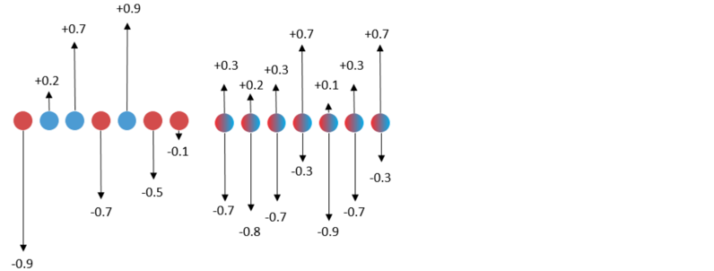
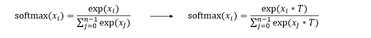

# 应用SLB算法

<a href="https://gitee.com/mindspore/docs/blob/r1.8/docs/golden_stick/docs/source_zh_cn/quantization/slb.md" target="_blank"></a>

## 背景

传统的量化方法在计算梯度时，通常使用STE(Straight Through Estimator) [1]或者自行设计的梯度计算方式[2]。由于量化函数的不可微，往往会导致计算出来的梯度有误差，从而提供不准确的优化方向，导致最终性能比较差。因此，迫切需要一种能规避这种不准确梯度估计的量化神经网络学习方法。

## 算法原理介绍

SLB(Searching for low-bit weights) [3]是华为诺亚自研的权重量化算法，提供了一种基于权值搜索的低比特量化算法，能避开不准确的梯度估计。针对低比特网络量化，由于量化网络权值的有效解数量比较少，因此，对网络的量化可以通过对权值搜索实现，即将量化过程转换成权值搜索的过程。对给定量化网络预设一组量化权值，然后定义一个概率矩阵来表示不同量化权值被保留的概率，在训练阶段通过优化概率矩阵实现网络权重的量化。

下面左边图是传统量化算法，训练时量化浮点权重，并用不准确的梯度更新权重，最后对浮点权重做量化。右边图是SLB量化算法，利用连续松弛策略搜索离散权重，训练时优化离散权重的分布，最后根据概率挑选离散权重实现量化。



### 温度因子

在分类任务中，softmax分布通常用于计算输出被分为各个类的概率。因此，SLB也使用softmax分布来计算权重被量化为各个量化权值的概率，并最终根据最大概率挑选对应权值作为量化结果。为了提高量化结果的置信度，SLB引入了温度因子，通过逐步调整温度因子，能使softmax分布逐渐变得陡峭，慢慢趋近于one-hot分布，从而最大化量化结果的置信度，缩减量化误差。

下面左边公式是标准的softmax函数，右边是SLB算法中引入了温度因子后的softmax函数。



下图展示了逐步调整温度因子时，softmax分布的变化过程，最右侧是one-hot分布。


## 算法特点

- 提出了一种新的权值搜索方法，用于训练量化深度神经网络，能规避不准确梯度估计。
- 利用连续松弛策略搜索离散权重，训练时优化离散权重的概率分布，最后根据概率挑选离散权重实现量化。
- 为了进一步消除搜索后的性能差距，保证训练和测试的一致性，提出了逐步调整温度因子的策略。
- 与传统的量化算法相比，规避了不准确的梯度更新过程，能获得更好的性能，在极低比特量化中更有优势。

## SLB量化训练

表1：SLB量化训练规格

| 规格 | 规格说明 |
| --- | --- |
| 硬件支持 | GPU |
| 网络支持 | ResNet18，具体请参见<https://gitee.com/mindspore/models/tree/master/official/cv/resnet#应用金箍棒模型压缩算法>。 |
| 方案支持 | 支持1、2、4比特的权重量化方案。 |
| 数据类型支持 | GPU平台支持FP32。 |
| 运行模式支持 | Graph模式和PyNative模式。 |

## SLB量化训练示例

SLB量化训练与一般训练步骤一致，在定义量化网络和生成量化模型阶段需要进行额外的操作，完整流程如下：

1. 加载数据集，处理数据。
2. 定义网络。
3. 定义SLB量化算法，应用算法生成量化模型。
4. 定义优化器、损失函数和callbacks。
5. 训练网络，保存模型文件。
6. 加载模型文件，对比量化后精度。

接下来以ResNet18网络为例，分别叙述这些步骤。

> 完整代码见[resnet模型仓](https://gitee.com/mindspore/models/blob/master/official/cv/resnet/README_CN.md#应用金箍棒模型压缩算法)，其中[train.py](https://gitee.com/mindspore/models/blob/master/official/cv/resnet/golden_stick/quantization/slb/train.py)为完整的训练代码，[eval.py](https://gitee.com/mindspore/models/blob/master/official/cv/resnet/golden_stick/quantization/slb/eval.py)为精度验证代码。

### 加载数据集

```python
dataset = create_dataset(dataset_path=config.data_path, do_train=True,
                         batch_size=config.batch_size, train_image_size=config.train_image_size,
                         eval_image_size=config.eval_image_size, target=config.device_target,
                         distribute=config.run_distribute)
```

代码中create_dataset引用自[dataset.py](https://gitee.com/mindspore/models/blob/master/official/cv/resnet/src/dataset.py)，config.data_path和config.batch_size分别在[配置文件](https://gitee.com/mindspore/models/blob/master/official/cv/resnet/golden_stick/quantization/slb/resnet18_cifar10_config.yaml)中配置，下同。

### 定义原网络

```python
from src.resnet import resnet18 as resnet

...
net = resnet(class_num=config.class_num)
print(net)
```

原始网络结构如下：

```text
ResNet<
  (conv1): Conv2d<input_channels=3, output_channels=64, kernel_size=(7, 7), stride=(2, 2), pad_mode=pad, padding=3, dilation=(1, 1), group=1, has_bias=False, weight_init=..., bias_init=zeros, format=NCHW>
  (bn1): BatchNorm2d<num_features=64, eps=1e-05, momentum=0.9, gamma=Parameter (name=bn1.gamma, shape=(64,), dtype=Float32, requires_grad=True), beta=Parameter (name=bn1.beta, shape=(64,), dtype=Float32, requires_grad=True), moving_mean=Parameter (name=bn1.moving_mean, shape=(64,), dtype=Float32, requires_grad=False), moving_variance=Parameter (name=bn1.moving_variance, shape=(64,), dtype=Float32, requires_grad=False)>
  (pad): Pad<>
  (maxpool): MaxPool2d<kernel_size=3, stride=2, pad_mode=VALID>
  (layer1): SequentialCell<
    (0): ResidualBlockBase<
      (conv1): Conv2d<input_channels=64, output_channels=64, kernel_size=(3, 3), stride=(1, 1), pad_mode=pad, padding=1, dilation=(1, 1), group=1, has_bias=False, weight_init=..., bias_init=zeros, format=NCHW>
      (bn1d): BatchNorm2d<num_features=64, eps=0.0001, momentum=0.09999999999999998, gamma=Parameter (name=layer1.0.bn1d.gamma, shape=(64,), dtype=Float32, requires_grad=True), beta=Parameter (name=layer1.0.bn1d.beta, shape=(64,), dtype=Float32, requires_grad=True), moving_mean=Parameter (name=layer1.0.bn1d.moving_mean, shape=(64,), dtype=Float32, requires_grad=False), moving_variance=Parameter (name=layer1.0.bn1d.moving_variance, shape=(64,), dtype=Float32, requires_grad=False)>
      (conv2): Conv2d<input_channels=64, output_channels=64, kernel_size=(3, 3), stride=(1, 1), pad_mode=pad, padding=1, dilation=(1, 1), group=1, has_bias=False, weight_init=..., bias_init=zeros, format=NCHW>
      (bn2d): BatchNorm2d<num_features=64, eps=0.0001, momentum=0.09999999999999998, gamma=Parameter (name=layer1.0.bn2d.gamma, shape=(64,), dtype=Float32, requires_grad=True), beta=Parameter (name=layer1.0.bn2d.beta, shape=(64,), dtype=Float32, requires_grad=True), moving_mean=Parameter (name=layer1.0.bn2d.moving_mean, shape=(64,), dtype=Float32, requires_grad=False), moving_variance=Parameter (name=layer1.0.bn2d.moving_variance, shape=(64,), dtype=Float32, requires_grad=False)>
      (relu): ReLU<>
      >
    (1): ResidualBlockBase<
      (conv1): Conv2d<input_channels=64, output_channels=64, kernel_size=(3, 3), stride=(1, 1), pad_mode=pad, padding=1, dilation=(1, 1), group=1, has_bias=False, weight_init=..., bias_init=zeros, format=NCHW>
      (bn1d): BatchNorm2d<num_features=64, eps=0.0001, momentum=0.09999999999999998, gamma=Parameter (name=layer1.1.bn1d.gamma, shape=(64,), dtype=Float32, requires_grad=True), beta=Parameter (name=layer1.1.bn1d.beta, shape=(64,), dtype=Float32, requires_grad=True), moving_mean=Parameter (name=layer1.1.bn1d.moving_mean, shape=(64,), dtype=Float32, requires_grad=False), moving_variance=Parameter (name=layer1.1.bn1d.moving_variance, shape=(64,), dtype=Float32, requires_grad=False)>
      (conv2): Conv2d<input_channels=64, output_channels=64, kernel_size=(3, 3), stride=(1, 1), pad_mode=pad, padding=1, dilation=(1, 1), group=1, has_bias=False, weight_init=..., bias_init=zeros, format=NCHW>
      (bn2d): BatchNorm2d<num_features=64, eps=0.0001, momentum=0.09999999999999998, gamma=Parameter (name=layer1.1.bn2d.gamma, shape=(64,), dtype=Float32, requires_grad=True), beta=Parameter (name=layer1.1.bn2d.beta, shape=(64,), dtype=Float32, requires_grad=True), moving_mean=Parameter (name=layer1.1.bn2d.moving_mean, shape=(64,), dtype=Float32, requires_grad=False), moving_variance=Parameter (name=layer1.1.bn2d.moving_variance, shape=(64,), dtype=Float32, requires_grad=False)>
      (relu): ReLU<>
      >
    >
  (layer2): SequentialCell<...>
  (layer3): SequentialCell<...>
  (layer4): SequentialCell<...>
  (flatten): Flatten<>
  (end_point): Dense<input_channels=512, output_channels=10, has_bias=True>
  >
```

ResNet18网络定义见[resnet.py](https://gitee.com/mindspore/models/blob/master/official/cv/resnet/src/resnet.py)。

### 应用量化算法

量化网络是指在原网络定义的基础上，修改需要量化的网络层后生成的带有伪量化节点的网络，通过构造金箍棒下的`SlbQuantAwareTraining`类，并将其应用到原网络上将原网络转换为量化网络。`QuantDtype`是定义了各种量化比特的类，通过调用`SlbQuantAwareTraining`类的`set_weight_quant_dtype`接口可以实现权重量化比特的自定义。

```python
from mindspore_gs import SlbQuantAwareTraining as SlbQAT
from mindspore_gs.quantization.constant import QuantDtype

...
algo = SlbQAT()
algo.set_weight_quant_dtype(QuantDtype.INT1)
quant_net = algo.apply(net)
print(quant_net)
```

量化后的网络结构如下：

```text
ResNetOpt<
  (_handler): ResNet<...>
  (conv1): Conv2d<input_channels=3, output_channels=64, kernel_size=(7, 7), stride=(2, 2), pad_mode=pad, padding=3, dilation=(1, 1), group=1, has_bias=False, weight_init=..., bias_init=zeros, format=NCHW>
  (bn1): BatchNorm2d<num_features=64, eps=1e-05, momentum=0.9, gamma=Parameter (name=bn1.gamma, shape=(64,), dtype=Float32, requires_grad=True), beta=Parameter (name=bn1.beta, shape=(64,), dtype=Float32, requires_grad=True), moving_mean=Parameter (name=bn1.moving_mean, shape=(64,), dtype=Float32, requires_grad=False), moving_variance=Parameter (name=bn1.moving_variance, shape=(64,), dtype=Float32, requires_grad=False)>
  (pad): Pad<>
  (maxpool): MaxPool2d<kernel_size=3, stride=2, pad_mode=VALID>
  (layer1): SequentialCellOpt<
    (_handler): SequentialCell<...>
    (cell_list_0): ResidualBlockBaseOpt<
      (_handler): ResidualBlockBase<...>
      (conv1): Conv2d<input_channels=64, output_channels=64, kernel_size=(3, 3), stride=(1, 1), pad_mode=pad, padding=1, dilation=(1, 1), group=1, has_bias=False, weight_init=..., bias_init=zeros, format=NCHW>
      (bn1d): BatchNorm2d<num_features=64, eps=0.0001, momentum=0.09999999999999998, gamma=Parameter (name=layer1._handler.0.bn1d.gamma, shape=(64,), dtype=Float32, requires_grad=True), beta=Parameter (name=layer1._handler.0.bn1d.beta, shape=(64,), dtype=Float32, requires_grad=True), moving_mean=Parameter (name=layer1._handler.0.bn1d.moving_mean, shape=(64,), dtype=Float32, requires_grad=False), moving_variance=Parameter (name=layer1._handler.0.bn1d.moving_variance, shape=(64,), dtype=Float32, requires_grad=False)>
      (conv2): Conv2d<input_channels=64, output_channels=64, kernel_size=(3, 3), stride=(1, 1), pad_mode=pad, padding=1, dilation=(1, 1), group=1, has_bias=False, weight_init=..., bias_init=zeros, format=NCHW>
      (bn2d): BatchNorm2d<num_features=64, eps=0.0001, momentum=0.09999999999999998, gamma=Parameter (name=layer1._handler.0.bn2d.gamma, shape=(64,), dtype=Float32, requires_grad=True), beta=Parameter (name=layer1._handler.0.bn2d.beta, shape=(64,), dtype=Float32, requires_grad=True), moving_mean=Parameter (name=layer1._handler.0.bn2d.moving_mean, shape=(64,), dtype=Float32, requires_grad=False), moving_variance=Parameter (name=layer1._handler.0.bn2d.moving_variance, shape=(64,), dtype=Float32, requires_grad=False)>
      (relu): ReLU<>
      (Conv2dSlbQuant): QuantizeWrapperCell<
        (_handler): Conv2dSlbQuant<
          in_channels=64, out_channels=64, kernel_size=(3, 3), stride=(1, 1), pad_mode=pad, padding=1, dilation=(1, 1), group=1, has_bias=False
          (fake_quant_weight): SlbFakeQuantizerPerLayer<>
          >
        >
      (Conv2dSlbQuant_1): QuantizeWrapperCell<
        (_handler): Conv2dSlbQuant<
          in_channels=64, out_channels=64, kernel_size=(3, 3), stride=(1, 1), pad_mode=pad, padding=1, dilation=(1, 1), group=1, has_bias=False
          (fake_quant_weight): SlbFakeQuantizerPerLayer<>
          >
        >
      >
    (cell_list_1): ResidualBlockBaseOpt_1<
    (_handler): ResidualBlockBase<...>
      (conv1): Conv2d<input_channels=64, output_channels=64, kernel_size=(3, 3), stride=(1, 1), pad_mode=pad, padding=1, dilation=(1, 1), group=1, has_bias=False, weight_init=..., bias_init=zeros, format=NCHW>
      (bn1d): BatchNorm2d<num_features=64, eps=0.0001, momentum=0.09999999999999998, gamma=Parameter (name=layer1._handler.1.bn1d.gamma, shape=(64,), dtype=Float32, requires_grad=True), beta=Parameter (name=layer1._handler.1.bn1d.beta, shape=(64,), dtype=Float32, requires_grad=True), moving_mean=Parameter (name=layer1._handler.1.bn1d.moving_mean, shape=(64,), dtype=Float32, requires_grad=False), moving_variance=Parameter (name=layer1._handler.1.bn1d.moving_variance, shape=(64,), dtype=Float32, requires_grad=False)>
      (conv2): Conv2d<input_channels=64, output_channels=64, kernel_size=(3, 3), stride=(1, 1), pad_mode=pad, padding=1, dilation=(1, 1), group=1, has_bias=False, weight_init=..., bias_init=zeros, format=NCHW>
      (bn2d): BatchNorm2d<num_features=64, eps=0.0001, momentum=0.09999999999999998, gamma=Parameter (name=layer1._handler.1.bn2d.gamma, shape=(64,), dtype=Float32, requires_grad=True), beta=Parameter (name=layer1._handler.1.bn2d.beta, shape=(64,), dtype=Float32, requires_grad=True), moving_mean=Parameter (name=layer1._handler.1.bn2d.moving_mean, shape=(64,), dtype=Float32, requires_grad=False), moving_variance=Parameter (name=layer1._handler.1.bn2d.moving_variance, shape=(64,), dtype=Float32, requires_grad=False)>
      (relu): ReLU<>
      (Conv2dSlbQuant): QuantizeWrapperCell<
        (_handler): Conv2dSlbQuant<
          in_channels=64, out_channels=64, kernel_size=(3, 3), stride=(1, 1), pad_mode=pad, padding=1, dilation=(1, 1), group=1, has_bias=False
          (fake_quant_weight): SlbFakeQuantizerPerLayer<>
          >
        >
      (Conv2dSlbQuant_1): QuantizeWrapperCell<
        (_handler): Conv2dSlbQuant<
          in_channels=64, out_channels=64, kernel_size=(3, 3), stride=(1, 1), pad_mode=pad, padding=1, dilation=(1, 1), group=1, has_bias=False
          (fake_quant_weight): SlbFakeQuantizerPerLayer<>
          >
        >
      >
    >
  (layer2): SequentialCellOpt_1<...>
  (layer3): SequentialCellOpt_3<...>
  (layer4): SequentialCellOpt_5<...>
  (flatten): Flatten<>
  (end_point): Dense<input_channels=512, output_channels=10, has_bias=True>
  (Conv2dSlbQuant): QuantizeWrapperCell<
    (_handler): Conv2dSlbQuant<
      in_channels=3, out_channels=64, kernel_size=(7, 7), stride=(2, 2), pad_mode=pad, padding=3, dilation=(1, 1), group=1, has_bias=False
      (fake_quant_weight): SlbFakeQuantizerPerLayer<>
      >
    >
  >
```

与原网络相比，量化后的网络里面的conv被替换成了Conv2dSlbQuant。

### 定义优化器、损失函数和训练的callbacks

对于SLB量化算法，除了要定义训练中常用的callbacks，还需要定义一个支持温度因子动态调整的callback类`TemperatureScheduler`。

```python
import mindspore as ms
import mindspore.train.callback as callback
from mindspore.train.loss_scale_manager import FixedLossScaleManager
from mindspore.train.callback import ModelCheckpoint, CheckpointConfig, LossMonitor, TimeMonitor

class TemperatureScheduler(callback.Callback):
    def __init__(self, model, epoch_size=100, has_trained_epoch=0,
                 t_start_val=1.0, t_start_time=0.2, t_end_time=0.6, t_factor=1.2):
        super().__init__()
        self.epochs = epoch_size
        self.has_trained_epoch = has_trained_epoch
        self.t_start_val = t_start_val
        self.t_start_time = t_start_time
        self.t_end_time = t_end_time
        self.t_factor = t_factor
        self.model = model

    def epoch_begin(self, run_context):
        cb_params = run_context.original_args()
        epoch = cb_params.cur_epoch_num + self.has_trained_epoch
        # Compute temperature value
        t = self.t_start_val
        t_start_epoch = int(self.epochs*self.t_start_time)
        t_end_epoch = int(self.epochs*self.t_end_time)
        if epoch > t_start_epoch:
            t *= self.t_factor**(min(epoch, t_end_epoch) - t_start_epoch)
        # Assign new value to temperature parameter
        for _, cell in self.model.train_network.cells_and_names():
            if cell.cls_name == 'SlbFakeQuantizerPerLayer':
                cell.set_temperature(t)
                if epoch >= t_end_epoch:
                    cell.set_temperature_end_flag()

step_size = dataset.get_dataset_size()
lr = get_lr(lr_init=config.lr_init,
            lr_end=config.lr_end,
            lr_max=config.lr_max,
            warmup_epochs=config.warmup_epochs,
            total_epochs=config.epoch_size,
            steps_per_epoch=step_size,
            lr_decay_mode=config.lr_decay_mode)
if config.pre_trained:
    lr = lr[config.has_trained_epoch * step_size:]
lr = ms.Tensor(lr)
# define optimizer
group_params = init_group_params(quant_net)
opt = nn.Momentum(group_params, lr, config.momentum, weight_decay=config.weight_decay,
                  loss_scale=config.loss_scale)

loss = init_loss_scale()
loss_scale = FixedLossScaleManager(config.loss_scale, drop_overflow_update=False)
metrics = {"acc"}
model = ms.Model(quant_net, loss_fn=loss, optimizer=opt, loss_scale_manager=loss_scale, metrics=metrics,
                 amp_level="O0", boost_level=config.boost_mode, keep_batchnorm_fp32=False,
                 boost_config_dict={"grad_freeze": {"total_steps": config.epoch_size * step_size}})

# define callbacks
time_cb = TimeMonitor(data_size=step_size)
loss_cb = LossCallBack(config.has_trained_epoch)

cb = [time_cb, loss_cb]
algo_cb = algo.callback()
cb.append(algo_cb)
cb.append(TemperatureScheduler(model, config.epoch_size, config.has_trained_epoch, config.t_start_val,
                                   config.t_start_time, config.t_end_time, config.t_factor))
ckpt_append_info = [{"epoch_num": config.has_trained_epoch, "step_num": config.has_trained_step}]
config_ck = CheckpointConfig(save_checkpoint_steps=config.save_checkpoint_epochs * step_size,
                             keep_checkpoint_max=config.keep_checkpoint_max,
                             append_info=ckpt_append_info)
ckpt_cb = ModelCheckpoint(prefix="resnet", directory="./ckpt", config=config_ck)
cb += [ckpt_cb]
```

代码中get_lr引用自[lr_generator.py](https://gitee.com/mindspore/models/blob/master/official/cv/resnet/src/lr_generator.py)，init_group_params和init_loss_scale都引用自[train.py](https://gitee.com/mindspore/models/blob/master/official/cv/resnet/golden_stick/quantization/slb/train.py)。

### 训练模型，保存模型文件

```python
dataset_sink_mode = target != "CPU"
model.train(config.epoch_size - config.has_trained_epoch, dataset, callbacks=cb,
            sink_size=dataset.get_dataset_size(), dataset_sink_mode=dataset_sink_mode)
```

运行部分结果如下：

```text
epoch: 1 step: 1562, loss is 1.4536957
Train epoch time: 101539.306 ms, per step time: 65.006 ms
epoch: 2 step: 1562, loss is 1.3616204
Train epoch time: 94238.882 ms, per step time: 60.332 ms
epoch: 3 step: 1562, loss is 1.2128768
Train epoch time: 94237.197 ms, per step time: 60.331 ms
epoch: 4 step: 1562, loss is 0.99068344
Train epoch time: 94084.353 ms, per step time: 60.233 ms
epoch: 5 step: 1562, loss is 0.89842224
Train epoch time: 94498.564 ms, per step time: 60.498 ms
epoch: 6 step: 1562, loss is 0.8985137
Train epoch time: 94106.722 ms, per step time: 60.248 ms
```

### 加载模型，对比精度

按照[resnet模型仓](https://gitee.com/mindspore/models/tree/master/official/cv/resnet)步骤获得普通训练的模型精度：

```text
'top_1_accuracy': 0.9544270833333334, 'top_5_accuracy': 0.9969951923076923
```

加载上一步得到的模型文件，导入量化后模型评估精度。

```python
param_dict = ms.load_checkpoint(config.checkpoint_file_path)
ms.load_param_into_net(quant_net, param_dict)
ds_eval = create_dataset(dataset_path=config.data_path, do_train=False, batch_size=config.batch_size,
                         eval_image_size=config.eval_image_size, target=config.device_target)
model = ms.Model(quant_net, loss_fn=loss, metrics={'top_1_accuracy', 'top_5_accuracy'})
acc = model.eval(ds_eval)
print(acc)
```

```text
'top_1_accuracy': 0.9485176282051282, 'top_5_accuracy': 0.9965945512820513.
```

在Graph模式下，对ResNet18网络应用SLB量化，并使用CIFAR-10数据集评估，实验结果如下图所示。其中，W32表示全精度模型。W4表示weight权重量化为4bit，W2表示权重量化为2bit，W1表示权重量化为1bit。可以发现，在当前任务中，与全精度模型相比，4bit权重量化后的模型top1精度没有损失，1bit权重量化的top1精度损失在0.6%以内。SLB量化大幅降低了模型的参数量，使得在资源受限的端侧部署模型变得更加便利。

| 量化类型 | top1精度 | top5精度 |
| --- | --- | --- |
| W32 | 0.9544 | 0.9970 |
| W4 | 0.9534 | 0.9970 |
| W2 | 0.9503 | 0.9967 |
| W1 | 0.9485 | 0.9966 |

## 参考文献

[1] Bengio, Yoshua, Nicholas Léonard, and Aaron Courville. Estimating or propagating gradients through stochastic neurons for conditional computation. 2013.

[2] Hanxiao Liu, Karen Simonyan, and Yiming Yang. Darts: Differentiable architecture search. ICLR, 2019.

[3] Yang Z, Wang Y, Han K, et al. Searching for low-bit weights in quantized neural networks. NIPS, 2020.
