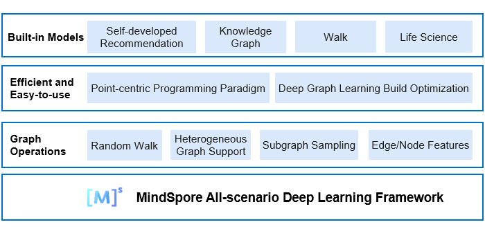

MindSpore Graph Learning Documents
===================================

MindSpore Graph Learning is an efficient and easy-to-use graph learning framework. Thanks to the MindSpore graph kernel fusion, MindSpore Graph Learning can optimize the build of execution patterns specific to graph models, helping developers shorten the training time. MindSpore Graph Learning also proposes an innovative point-centric programming paradigm, which provides native graph neural network expressions and built-in models covering most application scenarios, enabling developers to easily build graph neural networks.

Design Features
----------------

1. Point-centric programming paradigm

   A graph neural network model transfers and aggregates information on a given graph structure, which cannot be intuitively expressed through entire graph computing. MindSpore Graph Learning provides a point-centric programming paradigm that better complies with the graph learning algorithm logic and Python language style. It can directly translate formulas into code, reducing the gap between algorithm design and implementation.

2. Accelerated graph models

   MindSpore Graph Learning combines the features of MindSpore graph kernel fusion and auto kernel generator (AKG) to automatically identify the specific execution pattern of graph neural network tasks for fusion and kernel-level optimization, covering the fusion of existing operators and new combined operators in the existing framework. The performance is improved by 3 to 4 times compared with that of the existing popular frameworks.

Future Roadmap
---------------

The initial version of MindSpore Graph Learning includes the point-centric programming paradigm, provides implementation of typical graph models, and provides cases and performance evaluation for single-node training on small datasets. The initial version does not support performance evaluation and distributed training on large datasets, and does not support interconnection with graph databases. These features will be included in later versions of MindSpore Graph Learning.

Typical MindSpore Graph Learning Application Scenarios
-------------------------------------------------------

1. Graph convolutional neural network (GCN) for entire graph training

   Entire graph training requires that the graph nodes and edge features of the user be stored in the GPU. The GCN is a type of graph neural network that uses convolution operations.

2. Graph isomorphism network (GIN) for graph sampling training

   If the input graph is too large, random batch training can be used. During each random batch training, the graph is sampled so as to train the graph in batches. The GIN is used as an example.

.. toctree::
   :maxdepth: 1
   :caption: Deployment

   mindspore_graphlearning_install

.. toctree::
   :maxdepth: 1
   :caption: Guide

   full_training_of_gcn
   random_sampling_training_of_gin

.. toctree::
   :maxdepth: 1
   :caption: API References

   mindspore_gl.dataset
   mindspore_gl.nn
   mindspore_gl.parser
   mindspore_gl.sampling
