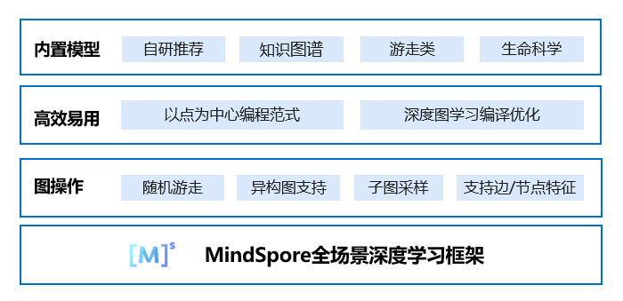

MindSpore Graph Learning文档
==============================

MindSpore Graph Learning是一个基于MindSpore的高效易用的图学习框架。得益于MindSpore的图算融合能力，MindSpore Graph Learning能够针对图模型特有的执行模式进行编译优化，帮助开发者缩短训练时间。MindSpore Graph Learning还创新提出以点为中心编程范式，提供更原生的图神经网络表达方式，并内置覆盖大部分应用场景的模型，使开发者能够轻松搭建图神经网络。

设计特点
---------

1. 以点为中心的编程范式

   图神经网络模型需要在给定的图结构上做信息的传递和聚合，整图计算无法直观表达这些操作。MindSpore Graph Learning提供以点为中心的编程范式，更符合图学习算法逻辑和Python语言风格，可以直接进行公式到代码的翻译，减少算法设计和实现间的差距。

2. 高效加速图模型

   MindSpore Graph Learning结合MindSpore的图算融合和自动算子编译技术（AKG）特性，自动识别图神经网络任务中特有的执行pattern进行融合和kernel level优化，能够覆盖现有框架中已有的算子和新组合算子的融合优化，获得相比现有流行框架平均3到4倍的性能提升。

未来路标
---------

MindSpore Graph Learning初始版本包含以点为中心的编程范式，并内置提供了典型图模型的实现，以及在小数据集上单机训练的案例和性能评测。初始版本暂时不包含大数据集上的性能评测和分布式训练，也不支持对接图数据库。MindSpore Graph Learning后续版本将包含这些内容，敬请期待。

使用MindSpore Graph Learning的典型场景
---------------------------------------

- 整图训练GCN网络

   整图训练需要用户的图节点和边特征都能存入GPU，图卷积神经网络(GCN)是采用卷积操作的一类图神经网络。

.. toctree::
   :maxdepth: 1
   :caption: 安装部署

   mindspore_graphlearning_install

.. toctree::
   :maxdepth: 1
   :caption: 使用指南

   full_training_of_GCN

.. toctree::
   :maxdepth: 1
   :caption: API参考

   mindspore_gl.dataset
   mindspore_gl.nn
   mindspore_gl.parser
   mindspore_gl.sampling

.. toctree::
   :maxdepth: 1
   :caption: 参考文档

   faq
