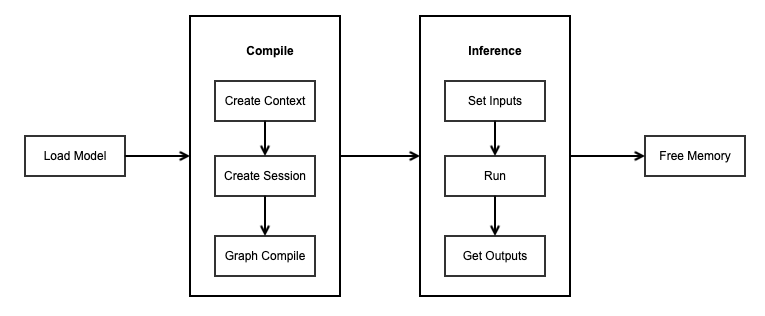

.. MindSpore documentation master file, created by
   sphinx-quickstart on Thu Aug 17 09:00:00 2020.
   You can adapt this file completely to your liking, but it should at least
   contain the root `toctree` directive.

MindSpore Lite Device-side Documentation
===========================================

MindSpore Lite inference comprises two components: cloud-side inference and device-side inference. This document primarily introduces MindSpore Lite device-side inference. For cloud-side inference, please refer to the `Cloud-side Inference Documentation <https://www.mindspore.cn/lite/cloud_docs/en/master/index.html>`_ .

Usage Scenarios
----------------

MindSpore Lite supports industry-standard CPUs and Kirin NPU hardware devices on the edge. As a lightweight AI engine built into HarmonyOS, it establishes an open AI architecture supporting multi-processor architectures for all scenarios, enabling HarmonyOS's full-scenario intelligent applications. It also supports development on Android/iOS platforms, providing developers with end-to-end solutions. For algorithm engineers and data scientists, it delivers a developer-friendly experience with efficient runtime and flexible deployment, fostering the flourishing development of the AI software and hardware application ecosystem.

It is currently widely used in applications such as image classification, object detection, facial recognition, text recognition, and automatic speech recognition. Common scenarios include:

- Image Classification: The most fundamental application of computer vision, falling under the category of supervised learning. For example, given an image (of a cat, dog, airplane, car, etc.), it determines the category to which the image belongs.

- Object Detection: Utilizes pre-trained object detection models to detect objects within camera input frames, apply labels, and delineate them with bounding boxes.

- Image Segmentation: Can be used to detect the location of objects within an image or to determine which object a specific pixel belongs to within an image.

- Automatic Speech Recognition (ASR): The process of converting human speech signals into machine-processable text. It encompasses applications such as real-time speech transcription (e.g., meeting minutes), voice command control (e.g., smart home devices), and voice search. By integrating acoustic models with language models, AI can overcome background noise and accent interference to enable natural human-machine interaction.

Advantages
------------

MindSpore Lite delivers AI model inference capabilities across diverse hardware devices. The advantages of using MindSpore Lite include:

1. Enhanced Performance: Efficient kernel algorithms and assembly-level optimizations support high-performance inference on CPUs and Kirin NPU dedicated chips, maximizing hardware computing power while minimizing inference latency and power consumption.

2. Lightweight: Provides ultra-lightweight solutions supporting model quantization and compression, enabling smaller models that run faster and facilitating AI model deployment and execution in extreme environments.

3. Full-scenario support: Supports multiple operating systems and embedded systems, enabling AI applications across diverse hardware and software intelligent devices.

4. Efficient Deployment: Supports MindSpore/TensorFlow Lite/Caffe/ONNX models, offering capabilities such as model compression and data processing. It provides a unified training and inference intermediate representation (IR), enabling users to deploy models quickly.

Development Process
-------------------------

Using the MindSpore Lite device-side inference framework primarily involves the following steps:

1. Model loading: MindSpore Lite performs inference on the device using .ms format models.

   1. Cross-platform compatibility: For third-party framework models such as TensorFlow, TensorFlow Lite, Caffe, ONNX, etc., you can use the model conversion tool provided by MindSpore Lite to convert them into .ms models.

   2. Optimization Strategy: During the conversion process, optimization techniques such as operator fusion and weight quantization can be integrated to enhance runtime efficiency on the device.

2. Model compilation: The preparatory phase preceding inference, primarily responsible for initializing the runtime environment, loading models, and performing graph compilation.

   1. Create configuration context: Set hardware backends (such as CPU, GPU, NPU), configure the number of worker threads, and define memory allocation strategies.

   2. Model loading: Loads model files from disk into memory and parses them into a runtime graph structure.

   3. Graph Compilation: During runtime, the computational graph undergoes deep optimization (e.g., constant folding, memory reuse, weight packing). **Note**: Graph compilation is a computationally expensive operation. Adopt a "**compile once, infer multiple times**" strategy, where the Model instance is constructed once during initialization and reused in subsequent iterations.

3. Model inference:

   1. Before executing inference, the preprocessed data must be filled into the input buffer based on the dimensions and data types of the model's input tensors.

   2. Execute inference: Perform model inference by calling the model inference function.

   3. Obtain output: The outputs parameter in the inference interface serves as the return value for inference results. By parsing the MSTensor object, you can obtain the model's inference results along with the output data type and size.

4. Memory release: During the model compilation phase, resources such as resident memory, video memory, and thread pools are allocated. These resources must be released after model inference concludes to prevent resource leaks.

.. toctree::
   :glob:
   :maxdepth: 1
   :caption: Obtain MindSpore Lite

   use/downloads
   use/build

.. toctree::
   :glob:
   :maxdepth: 1
   :caption: Quick Start

   quick_start/one_hour_introduction

.. toctree::
   :glob:
   :maxdepth: 1
   :caption: Model Conversion

   converter/converter_tool

.. toctree::
   :glob:
   :maxdepth: 1
   :caption: Device-side Inference

   infer/runtime_cpp
   infer/runtime_java
   infer/device_infer_example

.. toctree::
   :glob:
   :maxdepth: 1
   :caption: Device-side Training

   train/converter_train
   train/runtime_train
   train/device_train_example

.. toctree::
   :glob:
   :maxdepth: 1
   :caption: Device-side Third-party Access

   advanced/third_party/register
   advanced/third_party/delegate
   advanced/third_party/asic

.. toctree::
   :glob:
   :maxdepth: 1
   :caption: Advanced Development

   advanced/image_processing
   advanced/quantization
   advanced/micro

.. toctree::
   :glob:
   :maxdepth: 1
   :caption: Device-side Tools

   tools/visual_tool
   tools/benchmark
   tools/cropper_tool
   tools/obfuscator_tool
   tools/benchmark_golden_data

.. toctree::
   :glob:
   :maxdepth: 1
   :caption: References

   reference/operator_lite
   reference/operator_list_codegen
   reference/model_lite
   reference/faq
   reference/log

.. toctree::
   :maxdepth: 1
   :caption: RELEASE NOTES

   RELEASE
