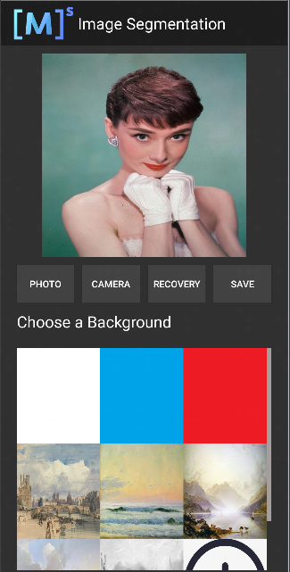

# Android Application Development Based on Java Interface

[](https://gitee.com/mindspore/docs/blob/r2.6.0rc1/docs/lite/docs/source_en/infer/image_segmentation.md)

## Overview

It is recommended that you start from the image segmentation demo on the Android device to understand how to build the MindSpore Lite application project, configure dependencies, and use related Java APIs.

This tutorial demonstrates the on-device deployment process based on the image segmentation demo on the Android device provided by the MindSpore team.

## Selecting a Model

Select an image segmentation model.

> Click [here](https://download.mindspore.cn/model_zoo/official/lite/mobile_segment_lite/segment_model.ms) to download the Android image segmentation model.
>
> This example describes how to use Java APIs.
>
> The application development environment is Windows.

Scan the QR code below or directly download the [APK file](https://download.mindspore.cn/model_zoo/official/lite/apk/segmentation/image_segmentation.apk) corresponding to this sample, and deploy it on an Android device.


## Deploying an Application

The following describes how to build and execute an on-device image segmentation task on MindSpore Lite.

### Running Dependencies

- Android Studio 3.2 or later (Android 4.0 or later is recommended.)
- Android SDK 26 or later (installed by Android Studio by default)
- JDK 1.8 or later (installed by Android Studio by default)

### Building and Running

1. Load the [sample source code](https://gitee.com/mindspore/models/tree/master/official/lite/image_segmentation) to Android Studio and install the corresponding SDK. (After the SDK version is specified, Android Studio automatically installs the SDK.)

    

2. Connect to an Android device and runs the image segmentation application.

    Connect to the Android device through a USB cable for debugging. Click `Run 'app'` to run the demo on your device.

    

    For details about how to connect the Android Studio to a device for debugging, see <https://developer.android.com/studio/run/device>.

    Android Studio can identify the mobile phone only when USB debugging mode is enabled on the mobile phone. For Huawei phones, enable USB debugging mode by choosing `Settings > System & updates > Developer options > USB debugging`.

3. On the Android device, click Continue. After the installation is complete, you can view the local album and the segmentation result of the image taken by the camera.

    

    The running result is shown in the following figure (A portrait in the album is used as an example).

    

    Select a portrait from an album.

    

    Select a background image from the nine images to replace and segment the portrait background.

    <table>
      <tr>
        <td><center><br>Figure 1 White background</br> </center></td>
        <td><center><br>Figure 2 Blue background</br></center></td>
        <td><center><br>Figure 3 Oil painting background</br></center></td>
      </tr>
    </table>

## Detailed Demo Description

The Android demo for on-device image segmentation uses the Java layer. Therefore, you must have basic Android development knowledge.

### Demo Structure

```text
app
├── src/main
│   ├── assets # Resource file
|   |   └── segment_model.ms # Stored model file
│   |
│   ├── java # Application code at the Java layer
│   │   └── com.mindspore.imagesegmentation
│   │       ├── help # Image processing
│   │       │   └── ...
│   │       └── ... Android page display and logic processing
│   │
│   ├── res # Resource files related to Android
│   └── AndroidManifest.xml # Android configuration file
│
├── libs # Binary archive file of the Android library project
|     └── mindspore-lite-version.aar # MindSpore Lite archive file of the Android version
|
├── build.gradle # Other Android configuration file
├── download.gradle # Downloading the files that the project depends on
└── ...
```

### Configuring MindSpore Lite Dependencies

Related library files are required for Android to call MindSpore Android AAR. You can use MindSpore Lite [source code](https://www.mindspore.cn/lite/docs/en/r2.6.0rc1/build/build.html) to generate the `mindspore-lite-maven-{version}.zip` library file package (including the `mindspore-lite-{version}.aar` library file) and decompress it.

> version: version number in the output file, which is the same as the version number of the built branch code.

In this example, the MindSpore Lite version file is automatically downloaded using the `app/download.gradle` file during the build process and stored in the `app/libs` directory.

Note: If the automatic download fails, manually download the related library file [mindspore-lite-{version}-android-{arch}.tar.gz](https://www.mindspore.cn/lite/docs/en/r2.6.0rc1/use/downloads.html), decompress it, and save it to the corresponding directory.

### Downloading and Deploying the Model File

Download the model file from MindSpore Model Hub. The on-device image segmentation model file used in this demo is `segment_model.ms`, which is automatically downloaded during app building using the `app/download.gradle` script and stored in the `app/src/main/assets` project directory.

Note: If the download fails, manually download the model file [segment_model.ms](https://download.mindspore.cn/model_zoo/official/lite/mobile_segment_lite/segment_model.ms).

### Writing On-Device Inference Code

The inference code and process are as follows. For details about the complete code, see [src/java/com/mindspore/imagesegmentation/TrackingMobile](https://gitee.com/mindspore/models/blob/master/official/lite/image_segmentation/app/src/main/java/com/mindspore/imagesegmentation/help/TrackingMobile.java).

1. Load the MindSpore Lite model file and build the context, model, and computational graph for inference.

    - Create a model.

      ```java
      // Create and init config.
      MSContext context = new MSContext();
      if (!context.init(2, CpuBindMode.MID_CPU, false)) {
          Log.e(TAG, "Init context failed");
          return;
      }
      if (!context.addDeviceInfo(DeviceType.DT_CPU, false, 0)) {
          Log.e(TAG, "Add device info failed");
          return;
      }
      ```

    - Load the model file and build a computational graph for inference.

      ```java
      // build model.
      MappedByteBuffer modelBuffer = loadModel(mContext, IMAGESEGMENTATIONMODEL);
      if(modelBuffer == null) {
          Log.e(TAG, "Load model failed");
          return;
      }
      // build model.
      boolean ret = model.build(modelBuffer, ModelType.MT_MINDIR,context);
      if(!ret) {
          Log.e(TAG, "Build model failed");
      }
      ```

2. Convert the input image into the Tensor format that is input to the MindSpore model.

      Convert the image data to be detected into the Tensor format that is input to the MindSpore model.

      ```java
      List<MSTensor> inputs = model.getInputs();
      if (inputs.size() != 1) {
        Log.e(TAG, "inputs.size() != 1");
        return null;
      }

      float resource_height = bitmap.getHeight();
      float resource_weight = bitmap.getWidth();

      ByteBuffer contentArray = BitmapUtils.bitmapToByteBuffer(bitmap, imageSize, imageSize, IMAGE_MEAN, IMAGE_STD);

      MSTensor inTensor = inputs.get(0);
      inTensor.setData(contentArray);
      ```

3. Run the model and execute the computational graph.

    ```java
    // Run graph to infer results.
    if (!model.predict()) {
        Log.e(TAG, "Run graph failed");
        return null;
    }
    ```

4. Process the output data.

    - Obtain information such as the dimension, number of batches, and number of channels based on the output data obtained by the tensor.

      ```java
      // Get output tensor values.
      List<MSTensor> outTensors = model.getOutputs();
      for (MSTensor output : outTensors) {
        if (output == null) {
            Log.e(TAG, "Can not find output " + tensorName);
            return null;
        }
      float[] results = output.getFloatData();
      float[] result = new float[output.elementsNum()];

      int batch = output.getShape()[0];
      int channel = output.getShape()[1];
      int weight = output.getShape()[2];
      int height = output.getShape()[3];
      int plane = weight * height;
      ```

    - Convert the NCHW format to the NHWC format and put it in `float[] result`.

      ```java
      for (int n = 0; n < batch; n++) {
        for (int c = 0; c < channel; c++) {
          for (int hw = 0; hw < plane; hw++) {
                 result[n * channel * plane + hw * channel + c] = results[n * channel * plane + c * plane + hw];
              }
           }
        }
      ```

5. Perform inference and post-processing on the input tensor based on the model.

    - Convert the `float[] result` data into the ByteBuffer data format.

      ```java
      ByteBuffer buffer = ByteBuffer.allocate(4 * result.length);
      FloatBuffer floatBuffer = buffer.asFloatBuffer();
      floatBuffer.put(result);
      return buffer;
      ```

    - Convert the ByteBuffer data format into Bitmap.

        Based on the inferred data, compare the coordinates of each pixel in the bitmap. If the coordinate data corresponds to PERSON, the color of the coordinate point remains unchanged. Otherwise, change the color to transparent, as shown in the following figure.

        ```java
        Bitmap.Config conf = Bitmap.Config.ARGB_8888;
        Bitmap maskBitmap = Bitmap.createBitmap(imageWidth, imageHeight, conf);
        Bitmap scaledBackgroundImage =
                BitmapUtils.scaleBitmapAndKeepRatio(backgroundImage, imageWidth, imageHeight);
        int[][] mSegmentBits = new int[imageWidth][imageHeight];
        inputBuffer.rewind();
        for (int y = 0; y < imageHeight; y++) {
            for (int x = 0; x < imageWidth; x++) {
                float maxVal = 0f;
                mSegmentBits[x][y] = 0;
                    for (int i = 0; i < NUM_CLASSES; i++) {
                        float value = inputBuffer.getFloat((y * imageWidth * NUM_CLASSES + x * NUM_CLASSES + i) * 4);
                        if (i == 0 || value > maxVal) {
                            maxVal = value;
                        if (i == PERSON) {
                            mSegmentBits[x][y] = i;
                        } else {
                            mSegmentBits[x][y] = 0;
                        }
                    }
                }
                maskBitmap.setPixel(x, y, mSegmentBits[x][y] == 0 ? colors[0] : scaledBackgroundImage.getPixel(x, y));
            }
        }
        ```

        <table>
           <tr>
            <td><center><br>Figure 1 Before inference</br></center></td>
            <td><center><br>Figure 2 After inference</br></center></td>
          </tr>
        </table>

6. Combine the image after inference with the selected background image.

    ```java
    MainActivity.this.imgPreview.setDrawingCacheEnabled(true);
    MainActivity.this.imgPreview.setBackground(isDemo ? getDrawable(IMAGES[selectedPosition]) : customBack);
    MainActivity.this.imgPreview.setImageBitmap(foreground);
    MainActivity.this.imgPreview.setDrawingCacheEnabled(false);
    ```
