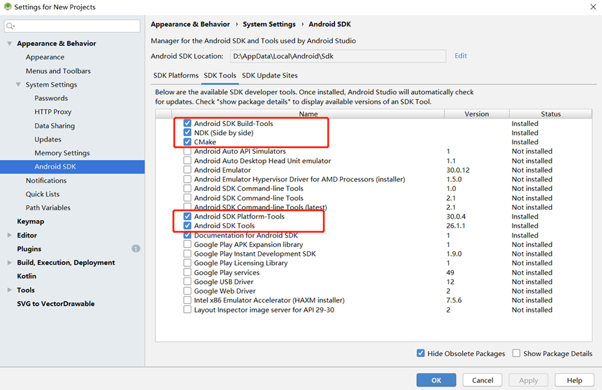
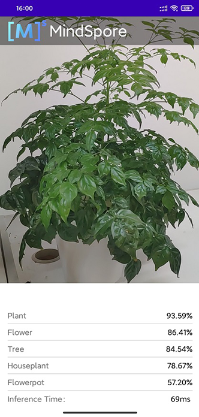

# Android Application Development Based on JNI Interface

[](https://gitee.com/mindspore/docs/blob/r2.6.0rc1/docs/lite/docs/source_en/infer/quick_start.md)

## Overview

It is recommended that you start from the image classification demo on the Android device to understand how to build the MindSpore Lite application project, configure dependencies, and use related APIs.

This tutorial demonstrates the on-device deployment process based on the image classification sample program on the Android device provided by the MindSpore team.  

1. Select an image classification model.
2. Convert the model into a MindSpore Lite model.
3. Use the MindSpore Lite inference model on the device. The following describes how to use the MindSpore Lite C++ APIs (Android JNIs) and MindSpore Lite image classification models to perform on-device inference, classify the content captured by a device camera, and display the most possible classification result on the application's image preview screen.

> Click to find [Android image classification models](https://download.mindspore.cn/model_zoo/official/lite/mobilenetv2_openimage_lite/1.5) and [image classification sample code](https://gitee.com/mindspore/models/tree/master/official/lite/image_classification).
>
> In this example, we explain how to use C++ API. Besides, MindSpore Lite also supports Java API. Please refer to [image segmentation demo](https://gitee.com/mindspore/models/tree/master/official/lite/image_segmentation) to learn more about Java API.

We provide the APK file corresponding to this example. You can scan the QR code below or download the [APK file](https://download.mindspore.cn/model_zoo/official/lite/apk/label/Classification.apk) directly, and deploy it to Android devices for use.


## Selecting a Model

The MindSpore team provides a series of preset device models that you can use in your application.  
Click to download [image classification models](https://download.mindspore.cn/model_zoo/official/lite/mobilenetv2_openimage_lite/1.5/mobilenetv2.ms) in MindSpore ModelZoo.
In addition, you can use the preset model to perform transfer learning to implement your image classification tasks.

## Converting a Model

After you retrain a model provided by MindSpore, export the model in the [.mindir format](https://www.mindspore.cn/tutorials/en/r2.6.0rc1/beginner/save_load.html). Use the MindSpore Lite [model conversion tool](https://www.mindspore.cn/lite/docs/en/r2.6.0rc1/converter/converter_tool.html) to convert the .mindir format to a .ms model.

Take the mobilenetv2 model as an example. Execute the following script to convert a model into a MindSpore Lite model for on-device inference.

```bash
call converter_lite --fmk=MINDIR --modelFile=mobilenetv2.mindir --outputFile=mobilenetv2
```

## Deploying an Application

The following section describes how to build and execute an on-device image classification task on MindSpore Lite.

### Running Dependencies

- Android Studio 3.2 or later and Android 4.0 or later is recommended.
- Native development kit (NDK) 21.3
- [CMake](https://cmake.org/download) >= 3.18.3  
- Android software development kit (SDK) 26 or later
- JDK 1.8 or later

### Building and Running

1. Load the [sample source code](https://gitee.com/mindspore/models/tree/master/official/lite/image_classification) to Android Studio and install the corresponding SDK (After the SDK version is specified, Android Studio automatically installs the SDK).

    

    Start Android Studio, click `File > Settings > System Settings > Android SDK`, and select the corresponding SDK. As shown in the following figure, select an SDK and click `OK`. Android Studio automatically installs the SDK.

    

    (Optional) If an NDK version issue occurs during the installation, manually download the corresponding [NDK version](https://developer.android.com/ndk/downloads) (the version used in the sample code is 21.3). Specify the NDK location in `Android NDK location` of `Project Structure`.

    

2. Connect to an Android device and runs the image classification application.

    Connect to the Android device through a USB cable for debugging. Click `Run 'app'` to run the sample project on your device.

    

    For details about how to connect the Android Studio to a device for debugging, see <https://developer.android.com/studio/run/device>.

    The mobile phone needs to turn on "USB debugging mode" for Android Studio to recognize the phone. In general, Huawei mobile phones turn on "USB debugging mode" in Settings -> System and Update -> Developer Options -> USB Debugging.

3. Continue the installation on the Android device. After the installation is complete, you can view the content captured by a camera and the inference result.

    

## Detailed Description of the Sample Program  

This image classification sample program on the Android device includes a Java layer and a JNI layer. At the Java layer, the Android Camera 2 API is used to enable a camera to obtain image frames and process images. At the JNI layer, the model inference process is completed in [Runtime](https://www.mindspore.cn/lite/docs/en/r2.6.0rc1/infer/runtime_cpp.html).

> This following describes the JNI layer implementation of the sample program. At the Java layer, the Android Camera 2 API is used to enable a device camera and process image frames. Readers are expected to have the basic Android development knowledge.

### Sample Program Structure

```text
app
│
├── src/main
│   ├── assets # resource files
|   |   └── model # model files
|   |       └── mobilenetv2.ms # stored model file
│   |
│   ├── cpp # main logic encapsulation classes for model loading and prediction
|   |   ├── ...
|   |   ├── mindspore-lite-{version}-android-{arch} # MindSpore Lite version
|   |   ├── MindSporeNetnative.cpp # JNI methods related to MindSpore calling
│   |   ├── MindSporeNetnative.h # header file
│   |   └── MsNetWork.cpp # MindSpore API
│   |
│   ├── java # application code at the Java layer
│   │   └── com.mindspore.classification
│   │       ├── gallery.classify # implementation related to image processing and MindSpore JNI calling
│   │       │   └── ...
│   │       └── widget # implementation related to camera enabling and drawing
│   │           └── ...
│   │
│   ├── res # resource files related to Android
│   └── AndroidManifest.xml # Android configuration file
│
├── CMakeList.txt # CMake compilation entry file
│
├── build.gradle # Other Android configuration file
├── download.gradle # MindSpore version download
└── ...
```

### Configuring MindSpore Lite Dependencies

When MindSpore C++ APIs are called at the Android JNI layer, related library files are required. You can use MindSpore Lite [source code compilation](https://www.mindspore.cn/lite/docs/en/r2.6.0rc1/build/build.html) to generate the `mindspore-lite-{version}-android-{arch}.tar.gz` library package and extract it (contains the `libmindspore-lite.so` library file and related header files). In this case, you need to use the compile command of generate with image preprocessing module.

> version: Version number of the .tar package, which is the same as the version of the compiled branch code.
>
> arch: Operating system arm64 or arm32.

In this example, the build process automatically downloads the MindSpore Lite version file by the `app/download.gradle` file and saves in the `app/src/main/cpp` directory.

Note: if the automatic download fails, please manually download the relevant library files [mindspore-lite-{version}-android-{arch}.tar.gz](https://www.mindspore.cn/lite/docs/en/r2.6.0rc1/use/downloads.html). After decompression, copy the `mindspore-lite-{version}-android-{arch}` folder to the directory of `src/main/cpp`.

```text
android{
    defaultConfig{
        externalNativeBuild{
            cmake{
                arguments "-DANDROID_STL=c++_shared"
            }
        }

        ndk{
            abiFilters'armeabi-v7a', 'arm64-v8a'
        }
    }
}
```

Create a link to the `.so` library file in the `app/CMakeLists.txt` file:

```text
# ============== Set MindSpore Dependencies. =============
include_directories(${CMAKE_SOURCE_DIR}/src/main/cpp/${MINDSPORELITE_VERSION})
include_directories(${CMAKE_SOURCE_DIR}/src/main/cpp/${MINDSPORELITE_VERSION}/runtime)
include_directories(${CMAKE_SOURCE_DIR}/src/main/cpp/${MINDSPORELITE_VERSION}/runtime/include)
include_directories(${CMAKE_SOURCE_DIR}/src/main/cpp/${MINDSPORELITE_VERSION}/runtime/include/dataset)
include_directories(${CMAKE_SOURCE_DIR}/src/main/cpp/${MINDSPORELITE_VERSION}/runtime/include/dataset/lite_cv)
include_directories(${CMAKE_SOURCE_DIR}/src/main/cpp/${MINDSPORELITE_VERSION}/runtime/include/schema)
include_directories(${CMAKE_SOURCE_DIR}/src/main/cpp/${MINDSPORELITE_VERSION}/runtime/include/ir/dtype)
include_directories(${CMAKE_SOURCE_DIR}/src/main/cpp/${MINDSPORELITE_VERSION}/runtime/third_party)

add_library(mindspore-lite SHARED IMPORTED)
add_library(minddata-lite SHARED IMPORTED)
add_library(libmindspore-lite-train SHARED IMPORTED)
add_library(libjpeg SHARED IMPORTED)
add_library(libturbojpeg SHARED IMPORTED)

set_target_properties(mindspore-lite PROPERTIES IMPORTED_LOCATION
        ${CMAKE_SOURCE_DIR}/src/main/cpp/${MINDSPORELITE_VERSION}/runtime/lib/libmindspore-lite.so)
set_target_properties(minddata-lite PROPERTIES IMPORTED_LOCATION
        ${CMAKE_SOURCE_DIR}/src/main/cpp/${MINDSPORELITE_VERSION}/runtime/lib/libminddata-lite.so)
set_target_properties(libmindspore-lite-train PROPERTIES IMPORTED_LOCATION
        ${CMAKE_SOURCE_DIR}/src/main/cpp/${MINDSPORELITE_VERSION}/runtime/lib/libmindspore-lite-train.so)
set_target_properties(libjpeg PROPERTIES IMPORTED_LOCATION
        ${CMAKE_SOURCE_DIR}/src/main/cpp/${MINDSPORELITE_VERSION}/runtime/third_party/libjpeg-turbo/lib/libjpeg.so)
set_target_properties(libturbojpeg PROPERTIES IMPORTED_LOCATION
        ${CMAKE_SOURCE_DIR}/src/main/cpp/${MINDSPORELITE_VERSION}/runtime/third_party/libjpeg-turbo/lib/libturbojpeg.so)
# --------------- MindSpore Lite set End. --------------------

# Link target library.
target_link_libraries( # Specifies the target library.
        mlkit-label-MS

        # --- mindspore ---
        minddata-lite
        mindspore-lite
        libmindspore-lite-train
        libjpeg
        libturbojpeg

        # --- other dependencies.---
        -ljnigraphics
        android

        # Links the target library to the log library
        ${log-lib}
        )
```

### Downloading and Deploying a Model File

In this example, the build process automatically downloads the `mobilenetv2.ms` by referring to the `app/download.gradle` file and saves in the `app/src/main/assets/model` directory.

Note: if the automatic download fails, please manually download the relevant library files [mobilenetv2.ms]( https://download.mindspore.cn/model_zoo/official/lite/mobilenetv2_openimage_lite/1.5/mobilenetv2.ms) and put them in the corresponding location.

### Writing On-Device Inference Code

Call MindSpore Lite C++ APIs at the JNI layer to implement on-device inference.

The inference process code is as follows. For details about the complete code, see [MindSporeNetnative.cpp](https://gitee.com/mindspore/models/blob/master/official/lite/image_classification/app/src/main/cpp/MindSporeNetnative.cpp).

1. Load the MindSpore Lite model file and build the context, model, and computational graph for inference.  

    - Load model file:

       Read the model file in the Java layer of Android and convert it into a ByteBuffer type file `model_buffer`, which is transferred to C++ layer by calling JNI. Finally, the `model_buffer` is converted to char type file `modelBuffer`.

        ```cpp
        // Buffer is the model data passed in by the Java layer
        jlong bufferLen = env->GetDirectBufferCapacity(model_buffer);
        if (0 == bufferLen) {
            MS_PRINT("error, bufferLen is 0!");
            return (jlong) nullptr;
        }

        char *modelBuffer = CreateLocalModelBuffer(env, model_buffer);
        if (modelBuffer == nullptr) {
            MS_PRINT("modelBuffer create failed!");
            return (jlong) nullptr;
        }
        ```

    - Build context, model, and computational graph for inference:

        Build context and set model parameters. Create a model from context and model data.

        ```cpp
        // To create a MindSpore network inference environment.
        void **labelEnv = new void *;
        MSNetWork *labelNet = new MSNetWork;
        *labelEnv = labelNet;

        auto context = std::make_shared<mindspore::Context>();
        if (context == nullptr) {
            MS_PRINT("context create failed!");
            delete labelNet;
            delete labelEnv;
            return (jlong) nullptr;
        }

        context->SetThreadNum(num_thread);
        context->SetThreadAffinity(0);
        auto &device_list = context->MutableDeviceInfo();
        auto cpuDeviceInfo = std::make_shared<mindspore::CPUDeviceInfo>();
        cpuDeviceInfo->SetEnableFP16(false);
        device_list.push_back(cpuDeviceInfo);
        ```

    - Based on the model file `modelBuffer`, the computational graph for inference is constructed.

        ```cpp
        bool MSNetWork::BuildModel(char *modelBuffer, size_t bufferLen,
                                   std::shared_ptr<mindspore::Context> ctx) {
        model_ = std::make_shared<mindspore::Model>();
        if (model_ == nullptr) {
            MS_PRINT("MindSpore build model failed!.");
            return false;
        }
        auto ret = model_->Build(modelBuffer, bufferLen, mindspore::ModelType::kMindIR, ctx);
        return ret.IsOk();
        }
        ```

2. Convert the input image into the Tensor format of the MindSpore model.

    - Cut the size of the image `srcbitmap` to be detected and convert it to LiteMat format `lite_norm_mat_cut`. The width, height and channel number information are converted into float format data `dataHWC`. Finally, copy the `dataHWC` to the input `inTensor` of MindSpore model.

        ```cpp
        void **labelEnv = reinterpret_cast<void **>(netEnv);
        if (labelEnv == nullptr) {
            MS_PRINT("MindSpore error, labelEnv is a nullptr.");
            return NULL;
        }
        MSNetWork *labelNet = static_cast<MSNetWork *>(*labelEnv);

        auto mModel = labelNet->model();
        if (mModel == nullptr) {
            MS_PRINT("MindSpore error, Model is a nullptr.");
            return NULL;
        }
        MS_PRINT("MindSpore get model.");

        auto msInputs = mModel->GetInputs();
        if (msInputs.empty()) {
            MS_PRINT("MindSpore error, msInputs.size() equals 0.");
            return NULL;
        }
        auto inTensor = msInputs.front();

        float *dataHWC = reinterpret_cast<float *>(lite_norm_mat_cut.data_ptr_);
        // Copy dataHWC to the model input tensor.
        memcpy(inTensor.MutableData(), dataHWC,
                inputDims.channel * inputDims.width * inputDims.height * sizeof(float));
        ```

    - Adjust the size of the input image, as well as the detailed algorithm of data processing.

        ```cpp
        bool PreProcessImageData(const LiteMat &lite_mat_bgr, LiteMat *lite_norm_mat_ptr) {
            bool ret = false;
            LiteMat lite_mat_resize;
            LiteMat &lite_norm_mat_cut = *lite_norm_mat_ptr;
            ret = ResizeBilinear(lite_mat_bgr, lite_mat_resize, 256, 256);
            if (!ret) {
            MS_PRINT("ResizeBilinear error");
            return false;
            }
            LiteMat lite_mat_convert_float;
            ret = ConvertTo(lite_mat_resize, lite_mat_convert_float, 1.0 / 255.0);
            if (!ret) {
                MS_PRINT("ConvertTo error");
                return false;
            }
            LiteMat lite_mat_cut;
            ret = Crop(lite_mat_convert_float, lite_mat_cut, 16, 16, 224, 224);
            if (!ret) {
                MS_PRINT("Crop error");
                return false;
            }
            std::vector<float> means = {0.485, 0.456, 0.406};
            std::vector<float> stds = {0.229, 0.224, 0.225};
            SubStractMeanNormalize(lite_mat_cut, lite_norm_mat_cut, means, stds);
            return true;
        }
        ```

3. The input tensor is inferred according to the model, and the output tensor is obtained and post processed.

   - The graph and model are loaded and on device inference is performed.

        ```cpp
        std::vector<mindspore::MSTensor> outputs;
        // After the model and image tensor data is loaded, run inference.
        auto status = mModel->Predict(msInputs, &outputs);
        ```

   - Get the tensor output `msOutputs` of MindSpore model. The text information `resultCharData` displayed in the APP is calculated through `msOutputs` and classification array information.

        ```cpp
        auto names = mModel->GetOutputTensorNames();
        std::unordered_map<std::string, mindspore::MSTensor> msOutputs;
        for (const auto &name : names) {
            auto temp_dat = mModel->GetOutputByTensorName(name);
            msOutputs.insert(std::pair<std::string, mindspore::MSTensor>{name, temp_dat});
        }
        std::string resultStr = ProcessRunnetResult(::RET_CATEGORY_SUM,::labels_name_map, msOutputs);

        const char *resultCharData = resultStr.c_str();
        return (env)->NewStringUTF(resultCharData);
        ```

   - Perform post-processing of the output data. Obtain the output object `outputTensor` through `msOutputs`, and parse it with the thing category array `labels_name_map` to obtain the training score array `scores[]` of each element. Set the credibility threshold value to `unifiedThre`, and count the credibility threshold value according to the training data. Above the threshold, it belongs to this type. On the contrary, it is not. Finally, a corresponding category name and corresponding score data `categoryScore` are returned.

        ```cpp
        std::string ProcessRunnetResult(const int RET_CATEGORY_SUM, const char *const labels_name_map[],
                                        std::unordered_map<std::string, mindspore::MSTensor> msOutputs) {
        // Get the branch of the model output.
        // Use iterators to get map elements.
        std::unordered_map<std::string, mindspore::MSTensor>::iterator iter;
        iter = msOutputs.begin();

        // The mobilenetv2.ms model outputs just one branch.
        auto outputTensor = iter->second;

        int tensorNum = outputTensor.ElementNum();
        MS_PRINT("Number of tensor elements:%d", tensorNum);

        // Get a pointer to the first score.
        float *temp_scores = static_cast<float *>(outputTensor.MutableData());
        float scores[RET_CATEGORY_SUM];
        for (int i = 0; i < RET_CATEGORY_SUM; ++i) {
            scores[i] = temp_scores[i];
        }

        const float unifiedThre = 0.5;
        const float probMax = 1.0;
        for (size_t i = 0; i < RET_CATEGORY_SUM; ++i) {
            float threshold = g_thres_map[i];
            float tmpProb = scores[i];
            if (tmpProb < threshold) {
            tmpProb = tmpProb / threshold * unifiedThre;
            } else {
            tmpProb = (tmpProb - threshold) / (probMax - threshold) * unifiedThre + unifiedThre;
            }
            scores[i] = tmpProb;
        }

        for (int i = 0; i < RET_CATEGORY_SUM; ++i) {
            if (scores[i] > 0.5) {
            MS_PRINT("MindSpore scores[%d] : [%f]", i, scores[i]);
            }
        }

        // Score for each category.
        // Converted to text information that needs to be displayed in the APP.
        std::string categoryScore = "";
        for (int i = 0; i < RET_CATEGORY_SUM; ++i) {
            categoryScore += labels_name_map[i];
            categoryScore += ":";
            std::string score_str = std::to_string(scores[i]);
            categoryScore += score_str;
            categoryScore += ";";
        }
        return categoryScore;
        }
        ```
