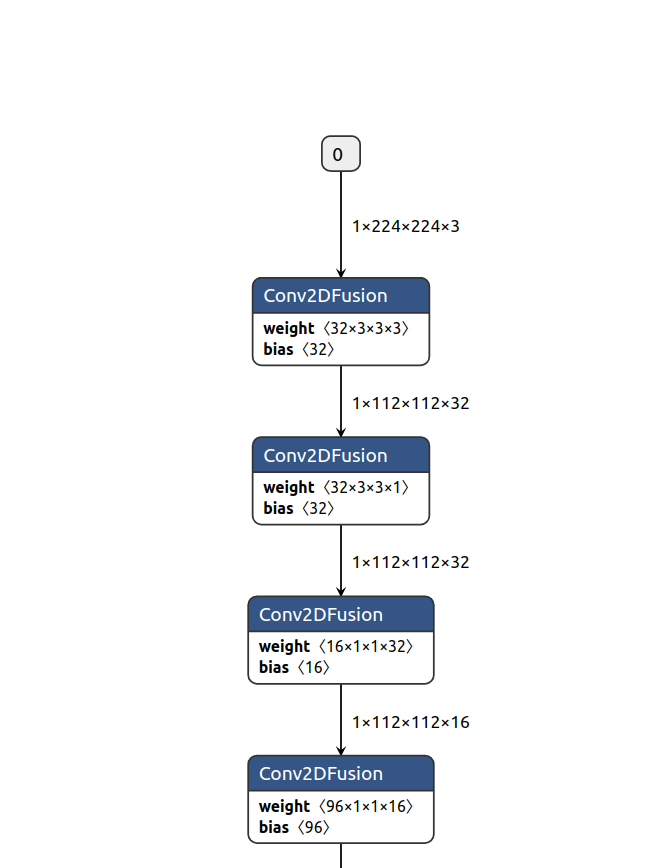
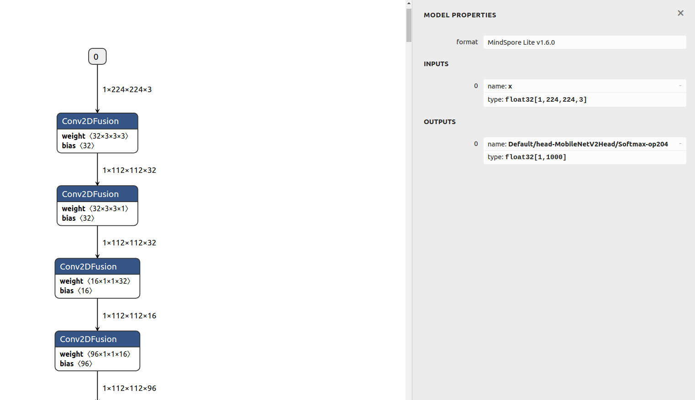

# Quick Start to Device-side Inference

[](https://gitee.com/mindspore/docs/blob/r2.6.0rc1/docs/lite/docs/source_en/quick_start/one_hour_introduction.md)

## Overview

This document uses a model inference example to describe how to use basic MindSpore Lite functions. Before using MindSpore Lite, you need to have a Linux (such as Ubuntu, CentOS, and EulerOS) or Windows environment for verification at any time.

To use MindSpore Lite to infer a model, perform the following steps:

1. Convert the model.

    Before inferring a model, you need to convert the model into a MindSpore Lite model file.

2. Perform integration and inference.

    Integrate the `libmindspore-lite.so` library in the release package, call related APIs, and transfer the pre-processed data to the framework to implement forward inference of the `ms` model.

## For Linux

This section describes how to convert a model and perform integration and inference on Linux.

### Converting a Model

Convert a model to a MindSpore Lite model file. This operation includes the following steps:

1. Download a release package.

    Both Windows and Linux release packages contain the converter. You can download any release package based on your platform.
    Use the `converter_lite` tool in the release package to convert a non-`ms` model into the `ms` model used by MindSpore Lite.
    The same converted model file can be obtained regardless of the platform where the conversion is performed.

2. Convert the model.

    Use the `converter_lite` tool in the release package to convert the model.

#### Downloading the Release Package

You can download MindSpore Lite from the [official website](https://www.mindspore.cn/lite/docs/en/r2.6.0rc1/use/downloads.html).
In this example, we use MindSpore Lite 1.6.0 (download [here](https://ms-release.obs.cn-north-4.myhuaweicloud.com/1.6.0/MindSpore/lite/release/linux/x86_64/mindspore-lite-1.6.0-linux-x64.tar.gz)) and a CPU release package with Linux OS and the x86_64 underlying architecture.
The structure of each release package varies. In this example, the structure of the Linux release package is as follows (files in the release package will be introduced later):

```text
mindspore-lite-{version}-linux-x64
├── runtime
│   ├── include                        # Header file of APIs integrated and developed by MindSpore Lite
│   ├── lib
│   │   ├── libminddata-lite.a         # Static library for image processing
│   │   ├── libminddata-lite.so        # Dynamic library for image processing
│   │   ├── libmindspore-lite.a        # Static library of the MindSpore Lite inference framework
│   │   ├── libmindspore-lite-jni.so   # JNI dynamic library of the MindSpore Lite inference framework
│   │   ├── libmindspore-lite.so       # Dynamic library of the MindSpore Lite inference framework
│   │   ├── libmindspore-lite-train.a  # Static library of the MindSpore Lite training framework
│   │   ├── libmindspore-lite-train.so # Dynamic library of the MindSpore Lite training framework
│   │   ├── libmsdeobfuscator-lite.so  # To load the dynamic library file for obfuscating models, you need to enable the `MSLITE_ENABLE_MODEL_OBF` option.
│   │   └── mindspore-lite-java.jar    # MindSpore Lite inference framework JAR package
│   └── third_party
│       └── libjpeg-turbo
└── tools
    ├── benchmark       # Directory of the benchmark test tool
    ├── benchmark_train # Directory of the benchmark test tool for training models
    ├── codegen         # Directory of the code generation tool
    ├── converter       # Directory of the converter
    ├── obfuscator      # Directory of the obfuscator
    └── cropper         # Directory of the library cropping tool
```

#### Converting the Model

Decompress the downloaded release package and find the `converter_lite` tool in the `mindspore-lite-{version}-linux-x64/tools/converter/converter` directory.
The `converter_lite` provides the offline model conversion function for the MindSpore, CAFFE, TensorFlow Lite, TensorFlow and ONNX models.
The model conversion procedure is as follows:

1. Set up the environment.

    Add the dynamic link library required by the converter to the environment variable LD_LIBRARY_PATH.

    ```bash
    export LD_LIBRARY_PATH=${PACKAGE_ROOT_PATH}/tools/converter/lib:${LD_LIBRARY_PATH}
    ```

    ${PACKAGE_ROOT_PATH} indicates the path generated after the release package is decompressed.

2. Go to the directory where the converter is stored.

    Run the following command to go to the directory where the converter is stored:

    ```bash
    cd ${PACKAGE_ROOT_PATH}/tools/converter/converter
    ```

    ${PACKAGE_ROOT_PATH} indicates the path generated after the release package is decompressed.

3. Set conversion parameters.

    When using converter_lite to perform conversion, you need to set related parameters. Table 1 describes the parameters used in this example.

    The following uses the conversion commands for various models as examples to describe how to use the parameters.

    - Command for converting the Caffe model `lenet.prototxt`

        ```bash
        ./converter_lite --fmk=CAFFE --modelFile=lenet.prototxt --weightFile=lenet.caffemodel --outputFile=lenet
        ```

        When converting a Caffe model, set `fmk` to CAFFE (`--fmk=CAFFE`), and transfer the model structure file (lenet.prototxt) and model weight file (lenet.caffemodel) by using the modelFile and weightFile parameters, respectively.
        In addition, use outputFile to specify the name of the output model after conversion. Because the path is not specified, the generated model is in the current path by default and has the suffix `.ms`, that is, `lenet.ms`.

    - Commands for converting the MindSpore, TensorFlow Lite, TensorFlow, and ONNX models

        - MindSpore model `lenet.mindir`

            ```bash
            ./converter_lite --fmk=MINDIR --modelFile=lenet.mindir --outputFile=lenet
            ```

        - TensorFlow Lite model `lenet.tflite`

            ```bash
            ./converter_lite --fmk=TFLITE --modelFile=lenet.tflite --outputFile=lenet
            ```

        - TensorFlow model `lenet.pb`

            ```bash
            ./converter_lite --fmk=TF --modelFile=lenet.pb --outputFile=lenet
            ```

        - ONNX model `lenet.onnx`

            ```bash
            ./converter_lite --fmk=ONNX --modelFile=lenet.onnx --outputFile=lenet
            ```

        During model conversion, set `fmk` to a symbol corresponding to the model type and transfer the model file by using the modelFile parameter.
        Use outputFile to specify the name of the output model after conversion. Because the path is not specified, the generated model is in the current path by default and has the suffix `.ms`, that is, `lenet.ms`.

4. Execute the conversion.

    You can use your own model or click [here](https://download.mindspore.cn/model_zoo/official/lite/quick_start/mobilenetv2.mindir) to download a MindSpore model for testing.
    Take the downloaded model as an example. Copy the model `mobilenetv2.mindir` to the directory where the converter is located. The model conversion command is as follows:

   ```bash
    ./converter_lite --fmk=MINDIR --modelFile=mobilenetv2.mindir --outputFile=mobilenetv2
    ```

    If the conversion is successful, the following information is displayed, and a new model file named `mobilenetv2.ms` is generated in the current directory:

    ```text
    CONVERT RESULT SUCCESS:0
    ```

5. Perform advanced functions.

    For details about the converter, see [Converting Models for Inference](https://www.mindspore.cn/lite/docs/en/r2.6.0rc1/converter/converter_tool.html).

    For details about how to use the converter to implement post training quantization, see [Post Training Quantization](https://www.mindspore.cn/lite/docs/en/r2.6.0rc1/advanced/quantization.html).

    If you want to train a converted model, you need to convert a training model. For details, see [Creating MindSpore Lite Models](https://www.mindspore.cn/lite/docs/en/r2.6.0rc1/train/converter_train.html).

Table 1: converter_lite parameters

| Parameter| Mandatory or Not| Description| Value Range|
| --------------------------- | ------------------- | ----------------------------------------------------------- | ------------------------------- |
| `--fmk=<FMK>`               | Yes| Original format of the model to be converted.| MINDIR, CAFFE, TFLITE, TF, or ONNX|
| `--modelFile=<MODELFILE>`   | Yes| Path of the model to be converted.| -                               |
| `--outputFile=<OUTPUTFILE>` | Yes| Path and name of the converted model. The suffix `.ms` is automatically generated.| -                               |
| `--weightFile=<WEIGHTFILE>` | Yes for Caffe model conversion| Path of the input model weight file.| -                               |

> - The parameter name and value are separated by an equal sign (=) and no space is allowed between them.
> - Generally, a Caffe model has two files: the model structure `*.prototxt`, which corresponds to the `--modelFile` parameter, and the model weight `*.caffemodel`, which corresponds to the `--weightFile` parameter.

#### Netron Visualization

[Netron](https://github.com/lutzroeder/netron) is a neural network model visualization tool developed based on the [Electron](http://www.electronjs.org/) platform. It supports visualization of many mainstream AI framework models, including MindSpore Lite, and can be used online on multiple platforms (such as Mac, Windows, and Linux) and browsers.
After a MindSpore Lite model is loaded using `Netron`, the topology, graph, and node information of the model can be displayed.
In this example, we use `Netron` on a browser to visualize the `mobilenetv2.ms` model converted in the previous section. You can also use `Netron` to visualize your own model.

1. Open a browser and enter <https://netron.app/> in the address box.

2. Drag the model file `mobilenetv2.ms` to the web page to load and open the model.

3. View the model.

    The following figure shows the loaded model.

    

    *Figure 1 Page displayed after the model is loaded*

    It can be observed that the model consists of a series of operator nodes connected in sequence. In this model, the `Conv2DFusion` operator appears most frequently.

    - View the model input and output.

        Click input node 0 or output node 0. The following figure is displayed.

        

        *Figure 2 Model input and output nodes*

        `MODEL PROPERTIES` in the upper column indicates the model attribute. The model format `MindSpore Lite v1.6.0` indicates that the model is converted by the converter 1.6.

        In the `INPUTS` field, there is an input node, indicating that the model has an input. The input node name is `x` and the data type is `float32[1,224,224,3]`, that is, the `1x224x224x3` tensor of `float32`.

        The `0` before the input node is a serial number identifier, indicating that the node is the 0th node in the model input.

        In the `OUTPUTS` field, there is an output node, indicating that the model has an output. The output node name is `Default/head-MobileNetV2Head/Softmax-op204` and the data type is `float32 [1,1000]`, that is, the `1x1000` tensor of `float32`.

    - View an operator.

        Click the `Conv2DFusion` operator. The following figure is displayed.

        

        *Figure 3 `Conv2DFusion` operator*

        We can see:

        - Node operator type

            In the `NODE PROPERTIES` field, you can see that the node type is `Conv2DFusion`, indicating that the node performs the `Conv2DFusion` operation, that is, the two-dimensional convolution operation.

        - Node name

            In the `NODE PROPERTIES` field, you can see that the node name is `Default/backbone-MobileNetV2Backbone/features-SequentialCell/0-ConvBNReLU/features-SequentialCell/0-Conv2d/Conv2D-op0`.

        - Operator attribute

            The `ATTRIBUTES` field lists the operator attributes, which store the parameter values required for operator computation.

        - Node inputs

            The `INPUTS` field shows the operator inputs. You can see that the operator has three inputs: `input`, `weight`, and `bias`.
            The name of the input tensor `input` is `x`, which is the model input.
            The name of the input tensor `weight` is `Default/backbone-MobileNetV2Backbone/features-SequentialCell/0-ConvBNReLU/features-SequentialCell/0-Conv2d/Conv2D-op0features.0.features.0.weight`.
            Click the plus sign on the right to view the value of the tensor.

        - Node outputs

            The `OUTPUTS` field displays the operator output. You can see that the operator has an output tensor named `Default/backbone-MobileNetV2Backbone/features-SequentialCell/0-ConvBNReLU/features-SequentialCell/0-Conv2d/Conv2D-op0`.

4. Understand the `mobilenetv2.ms` model.

    By viewing the model, you can know that the `mobilenetv2.ms` model is computed as follows:
    Continuously convolute the input tensor `x` in the format of `float32[1,224,224,3]`, perform the matrix multiplication operation on the `MatMulFusion` fully-connected layer, and perform the Softmax operation to obtain the `1x1000` output tensor. The output tensor name is `Default/head-MobileNetV2Head/Softmax-op204`.

    The `mobilenetv2.ms` model provided in this example is an image classification model with 1000 classes. By viewing the model, you can know that the model does not contain pre-processing operations on images, receives the float32 value of 1 x 224 x 224 x 3 and outputs the float32 value of 1 x 1000.
    Therefore, when using this model for inference, you need to encode and pre-process images, transfer the processed data to the inference framework for forward inference, and post-process the 1 x 1000 output.

### Model Inference

You need to integrate the `mindspore-lite` library file in the release package and use the APIs declared in the MindSpore Lite header file to perform model inference.
Before integration, you can also use the `benchmark` tool (stored in `mindspore-lite-{version}-linux-x64/tools/benchmark`) released with the release package to perform inference tests.
The `benchmark` tool is an executable program that integrates the `mindspore-lite` library. It uses command parameters to implement multiple functions, including inference.

#### Downloading the Release Package

Download a release package based on the system environment used for model inference.
In this example, we use MindSpore Lite 1.6.0 (download [here](https://ms-release.obs.cn-north-4.myhuaweicloud.com/1.6.0/MindSpore/lite/release/linux/x86_64/mindspore-lite-1.6.0-linux-x64.tar.gz)) and a CPU release package with Linux OS and the x86_64 underlying architecture.

#### Benchmark Inference Test

1. Set up the environment.

    Add the dynamic link library required for `benchmark` inference to the environment variable LD_LIBRARY_PATH.

    ```bash
    export LD_LIBRARY_PATH=${PACKAGE_ROOT_PATH}/runtime/lib:${LD_LIBRARY_PATH}
    ```

    ${PACKAGE_ROOT_PATH} indicates the path generated after the release package is decompressed.

2. Go to the directory where the `benchmark` tool is located.

    Run the following command to go to the directory where the `benchmark` tool is located:

    ```bash
    cd ${PACKAGE_ROOT_PATH}/tools/benchmark
    ```

    ${PACKAGE_ROOT_PATH} indicates the path generated after the release package is decompressed.

3. Set the `benchmark` parameters.

    When using `benchmark` to perform inference, you need to set related parameters. Table 2 describes the parameters used in this example.

4. Execute inference and analyze inference performance.

    You can use the converted model `mobilenetv2.ms` to perform the inference test. Copy the model to the directory where the `benchmark` tool is located and run the following command to perform inference:

    ```bash
    ./benchmark --modelFile=mobilenetv2.ms
    ```

    Use `modelFile` to specify the model to be inferred and use the default values for other parameters.
    In this example, if no input data is specified, a random value is generated as the input.
    After the command is executed, if the inference is successful, information similar to the following is displayed. The information shows performance indicators such as the number of concurrent threads during inference (`NumThreads = 2`), the minimum duration of a single inference of the test model (`6.677000 ms`), maximum duration of a single inference (`8.656000 ms`), and average inference duration (`7.291000 ms`). The performance value varies according to the environment.
    Because the `numThreads` parameter is not specified, two threads are used for inference by default. You can set the number of threads to test the inference performance. (When the number of threads reaches a certain value, the inference time is prolonged due to the thread switchover overhead.)

    ```text
    ModelPath = mobilenetv2.ms
    ModelType = MindIR
    InDataPath =
    ConfigFilePath =
    InDataType = bin
    LoopCount = 10
    DeviceType = CPU
    AccuracyThreshold = 0.5
    CosineDistanceThreshold = -1.1
    WarmUpLoopCount = 3
    NumThreads = 2
    Fp16Priority = 0
    EnableParallel = 0
    calibDataPath =
    cpuBindMode = HIGHER_CPU
    CalibDataType = FLOAT
    start unified benchmark run
    PrepareTime = 30.013 ms
    Running warm up loops...
    Running benchmark loops...
    Model = mobilenetv2.ms, NumThreads = 2, MinRunTime = 6.677000 ms, MaxRuntime = 8.656000 ms, AvgRunTime = 7.291000 ms
    Run Benchmark mobilenetv2.ms Success.
    ```

5. Execute inference and analyze inference accuracy.

    To use the `benchmark` tool to test the inference accuracy of MindSpore Lite, run the following command:

    ```bash
    ./benchmark --modelFile=mobilenetv2.ms --inDataFile=input.bin --benchmarkDataFile=output.txt
    ```

    In this example, `modelFile` specifies the model to be inferred.

    `inDataFile` specifies the model input data file, which is set to `input.bin`.
    The model is opened in the `Netron`, and we know that the `mobilenetv2.ms` model receives the `1x224x224x3` tensor of `float32`.
    The `inDataFile` option of `benchmark` receives data files in binary format by default. The `input.bin` file saves 150528 `float32` binary values in sequence, which is the same as the `1x224x224x3` data volume required by the model, and the format is `float32`.

    Generally, the input data file can be generated in the following ways:

    - Save training data: Pre-process the data in the model training dataset and save the pre-processed data.

    - Random generation: Randomly generate data within a specified range.

    In this example, a randomly generated number is used as the input. You can run the following Python script or click [here](https://download.mindspore.cn/model_zoo/official/lite/quick_start/input.bin) to download the `input.bin` file and save it to the benchmark directory.

    ```python
    import numpy as np
    np.random.seed(1)
    t = np.random.rand(1,224,224,3)
    t.astype(np.float32).tofile("input.bin")
    ```

    After the input data is provided, you need to provide the benchmark data for comparison with the inference result for accuracy error analysis.
    In this example, `benchmarkDataFile` specifies the model output benchmark file, which is set to `output.txt`. The format of the benchmark file is as follows:

    ```text
    [Name of output node 1][Dimension length of shape of output node 1][Value of the first dimension of shape of output node 1]... [Value of the n dimension of shape of output node 1]
    [Node 1 data 1]  [Node 1 data 2]...
    [Name of output node 2][Dimension length of shape of output node 2][Value of the first dimension of shape of output node 2]... [Value of the n dimension of shape of output node 2]
    [Node 2 data 1]  [Node 2 data 2]...
    ```

    Generally, the benchmark file can be generated in the following ways:

    - Comparison with other frameworks: Use another deep learning model inference framework with the same input, and save the inference result in the required format.

    - Comparison with model training: In the training framework, save the pre-processed data as the input data specified by `inDataFile`. After model inference, save the output data that has not been post-processed in the benchmark file format, and use it as the benchmark.

    - Comparison with different devices or data types: Use different data types (such as FP16) or devices (such as GPU/NPU) for inference to obtain the benchmark in the environment.

    - Comparison with theoretical values: For some simple models, manually construct output benchmarks based on your understanding of the models.

    The size of the provided benchmark data must be the same as that of the model output so that the benchmark data can be compared with the model output to obtain the inference accuracy error.
    The output node name of the `mobilenetv2.ms` model is `Default/head-MobileNetV2Head/Softmax-op204`, and the output shape of the node is `1x1000` (as shown in Figure 2). Therefore, the dimension length of the node shape is 2. The first dimension value of the node shape is 1, and the second dimension value of the node shape is 1000.
    In this example, the benchmark is generated by comparing with other frameworks. The previously obtained `input.bin` file uses another framework to generate the inference data and is saved in the benchmark file format.
    The benchmark data is as follows:

    ```text
    Default/head-MobileNetV2Head/Softmax-op204 2 1 1000
    4.75662418466527e-05 0.00044544308912009 ...
    ```

    The second row of data in the benchmark indicates the inference output of another framework with the same input (`input.bin`). You can click [here](https://download.mindspore.cn/model_zoo/official/lite/quick_start/output.txt) to download the output.txt file in this example and save it to the benchmark directory.
    After the `benchmark` command is executed, if the inference is successful, information similar to the following is displayed:

    ```text
    ModelPath = mobilenetv2.ms
    ModelType = MindIR
    InDataPath = input.bin
    ConfigFilePath =
    InDataType = bin
    LoopCount = 10
    DeviceType = CPU
    AccuracyThreshold = 0.5
    CosineDistanceThreshold = -1.1
    WarmUpLoopCount = 3
    NumThreads = 2
    Fp16Priority = 0
    EnableParallel = 0
    calibDataPath = output.txt
    cpuBindMode = HIGHER_CPU
    CalibDataType = FLOAT
    start unified benchmark run
    PrepareTime = 31.709 ms
    MarkAccuracy
    InData 0: 0.417022 0.720325 0.000114375 0.302333 0.146756 0.0923386 0.18626 0.345561 0.396767 0.538817 0.419195 0.68522 0.204452 0.878117 0.0273876 0.670467 0.417305 0.55869 0.140387 0.198101
    ================ Comparing Output data ================
    Data of node Default/head-MobileNetV2Head/Softmax-op204 : 4.75662e-05 0.000445443 0.000294212 0.000354572 0.000165406 8.36175e-05 0.000198424 0.000329004 0.000288576 0.000203605 0.000962143 0.00421465 0.0019162 0.00129701 0.00260928 0.0012302 0.000879829 0.000609378 0.000691054 0.00119472 0.000516733 0.00160048 0.000959531 0.00176164 0.000365934 0.00013575 0.000245539 0.000414651 0.000165337 0.000480154 0.000216396 0.00101303 0.000105544 0.000475172 0.000761407 0.000305815 0.000294882 0.000307003 0.00188077 0.000454868 0.000897518 0.00051352 0.000595383 0.000644214 0.000513376 0.000343709 0.00103984 0.000197185 7.54722e-05 8.89811e-05
    Mean bias of node/tensor Default/head-MobileNetV2Head/Softmax-op204 : 0%
    Mean bias of all nodes/tensors: 0%
    =======================================================

    Run Benchmark mobilenetv2.ms Success.
    ```

    In the output information, the `InData 0` line displays the input data (only the first 20 values are displayed) of the inference, and the `Data of node Default/head-MobileNetV2Head/Softmax-op204` line displays the inference result (only the first 50 values are displayed) of the related output node (`Default/head-MobileNetV2Head/Softmax-op204`). You can directly observe the differences between them and the benchmark file.
    In line `Mean bias of node/tensor Default/head-MobileNetV2Head/Softmax-op204`, the average error between the `Default/head-MobileNetV2Head/Softmax-op204` output tensor and the benchmark data is provided. The error is computed using the comparison algorithm provided by the benchmark tool.
    `Mean bias of all nodes/tensors` provides the average error of all tensors compared with the benchmark. In this example, there is only one output tensor. Therefore, the total average error is the same as that of the `Default/head-MobileNetV2Head/Softmax-op204` tensor. It can be observed that the total average error of inference is 0%.

6. Perform advanced functions.

    For details about `benchmark`, see [benchmark](https://www.mindspore.cn/lite/docs/en/r2.6.0rc1/tools/benchmark_tool.html).

Table 2 Definition of benchmark parameters

| Parameter| Mandatory or Not| Description| Type| Default Value|
| ------------------------------------- | -------- | ------------------------------------------------------------------------------------------------------------------------------------------------------------------------ | -------- | ------ |
| `--modelFile=<MODELPATH>`             | Yes| Specifies the path of the MindSpore Lite model file for which the benchmark test is to be performed.| String   | null   |
| `--numThreads=<NUMTHREADS>`           | No| Specifies the number of threads for running the model inference program.| Integer  | 2      |
| `--inDataFile=<INDATAPATH>`           | No| Specifies the file path of the input data of the test model. By default, data files in binary format are received. In the accuracy test, this input is used as the benchmark input. If this parameter is not set, a random value is used.| String   | null   |
| `--benchmarkDataFile=<CALIBDATAPATH>` | No| Specifies the file path of the benchmark data (for accuracy comparison) to be compared and receives the character text in the specified format.| String | null |

> - The parameter name and value are separated by an equal sign (=) and no space is allowed between them.

#### Integration and Inference

In the previous section, the official inference test tool is used to perform the model inference test. This section uses the C++ APIs of MindSpore Lite as an example to describe how to use the MindSpore Lite release package to perform integrated development and build your own inference program.

1. Environment Requirements

    - System environment: Linux x86_64 (Ubuntu 18.04.02LTS is recommended.)
    - C++ build dependencies
        - [GCC](https://gcc.gnu.org/releases.html) >= 7.3.0
        - [CMake](https://cmake.org/download/) >= 3.12

2. Obtain the release package.

    Click [here](https://www.mindspore.cn/lite/docs/en/r2.6.0rc1/use/downloads.html) to obtain a MindSpore Lite release package.
    The release package for integration and development in this example is the same as that in the previous sections. You can click [here](https://ms-release.obs.cn-north-4.myhuaweicloud.com/1.6.0/MindSpore/lite/release/linux/x86_64/mindspore-lite-1.6.0-linux-x64.tar.gz) to download the package.
    The following content in the release package is required:

    ```text
    mindspore-lite-{version}-linux-x64
    └── runtime
        │── include                        # Header file of APIs integrated and developed by MindSpore Lite
        └── lib
            └── libmindspore-lite.so       # Dynamic library of the MindSpore Lite inference framework
    ```

3. Build a project directory.

    In this example, the project directory is as follows:

    ```text
    demo
    ├── CMakeLists.txt                  # CMake project management file
    ├── main.cc                         # User code
    ├── build                           # Build directory
    ├── model
    │    └── mobilenetv2.ms             # Model file (the converted model)
    └── runtime                         # Runtime directory of the release package
        ├── include                     # Header file of APIs integrated and developed by MindSpore Lite
        └── lib
            └── libmindspore-lite.so    # Dynamic library of the MindSpore Lite inference framework
    ```

    Create a `demo` folder and create the `main.cc` and `CMakeLists.txt` files.
    Create the `build` and `model` directories and place `mobilenetv2.ms` in `model`.
    Copy the `runtime` directory in the release package to `demo`. You can retain files in the `runtime` directory or delete library files except the `libmindspore-lite.so` and `include` folders.

4. Build a CMake project.

    Open the created `CMakeLists.txt` file and paste the following content.

    ```cpp
    cmake_minimum_required(VERSION 3.12)  # The CMake version must be 3.12 or later.
    project(Demo)  # The project name is Demo.

    # The GCC version must be 7.3.0 or later.
    if(CMAKE_CXX_COMPILER_ID STREQUAL "GNU" AND CMAKE_CXX_COMPILER_VERSION VERSION_LESS 7.3.0)
        message(FATAL_ERROR "GCC version ${CMAKE_CXX_COMPILER_VERSION} must not be less than 7.3.0")
    endif()

    include_directories(${CMAKE_CURRENT_SOURCE_DIR}/runtime/)  # Add the header file search path.

    link_directories(${CMAKE_CURRENT_SOURCE_DIR}/runtime/lib)  # Add the library file search path.

    add_executable(demo main.cc)  # Build and generate the demo execution program.

    # Declare the library to be linked to the demo execution program. mindspore-lite is the dynamic library of the MindSpore Lite inference framework.
    target_link_libraries(
            demo
            mindspore-lite
            pthread
            dl
    )
    ```

    > If you want to integrate the `libmindspore-lite.a` static library, replace `mindspore-lite` with the `-Wl,--whole-archive mindspore-lite -Wl,--no-whole-archive` option.

5. Write code.

    Open the created `main.cc` and paste the following content:

    ```cpp
    #include <iostream>
    #include <fstream>
    #include <random>
    #include "include/api/model.h"
    #include "include/api/context.h"
    #include "include/api/status.h"
    #include "include/api/types.h"
    using mindspore::MSTensor;

    char *ReadFile(const char *file, size_t *size) {
      if (file == nullptr) {
        std::cerr << "file is nullptr." << std::endl;
        return nullptr;
      }

      std::ifstream ifs(file, std::ifstream::in | std::ifstream::binary);
      if (!ifs.good()) {
        std::cerr << "file: " << file << " is not exist." << std::endl;
        return nullptr;
      }

      if (!ifs.is_open()) {
        std::cerr << "file: " << file << " open failed." << std::endl;
        return nullptr;
      }

      ifs.seekg(0, std::ios::end);
      *size = ifs.tellg();
      std::unique_ptr<char[]> buf(new (std::nothrow) char[*size]);
      if (buf == nullptr) {
        std::cerr << "malloc buf failed, file: " << file << std::endl;
        ifs.close();
        return nullptr;
      }

      ifs.seekg(0, std::ios::beg);
      ifs.read(buf.get(), *size);
      ifs.close();

      return buf.release();
    }

    template <typename T, typename Distribution>
    void GenerateRandomData(int size, void *data, Distribution distribution) {
      std::mt19937 random_engine;
      int elements_num = size / sizeof(T);
      (void)std::generate_n(static_cast<T *>(data), elements_num,
                            [&distribution, &random_engine]() { return static_cast<T>(distribution(random_engine)); });
    }

    int main(int argc, const char **argv) {
      // Read model file.
      std::string model_path = "../model/mobilenetv2.ms";
      size_t size = 0;
      char *model_buf = ReadFile(model_path.c_str(), &size);
      if (model_buf == nullptr) {
        std::cerr << "Read model file failed." << std::endl;
        return -1;
      }

      // Create and init context, add CPU device info
      auto context = std::make_shared<mindspore::Context>();
      if (context == nullptr) {
        delete[](model_buf);
        std::cerr << "New context failed." << std::endl;
        return -1;
      }
      auto &device_list = context->MutableDeviceInfo();
      auto device_info = std::make_shared<mindspore::CPUDeviceInfo>();
      if (device_info == nullptr) {
        delete[](model_buf);
        std::cerr << "New CPUDeviceInfo failed." << std::endl;
        return -1;
      }
      device_list.push_back(device_info);

      // Create model
      auto model = new (std::nothrow) mindspore::Model();
      if (model == nullptr) {
        delete[](model_buf);
        std::cerr << "New Model failed." << std::endl;
        return -1;
      }

      // Build model
      auto build_ret = model->Build(model_buf, size, mindspore::kMindIR, context);
      delete[](model_buf);
      if (build_ret != mindspore::kSuccess) {
        delete model;
        std::cerr << "Build model error " << std::endl;
        return -1;
      }

      // Get Input
      auto inputs = model->GetInputs();
      for (auto tensor : inputs) {
        auto input_data = reinterpret_cast<float *>(tensor.MutableData());
        if (input_data == nullptr) {
          std::cerr << "MallocData for inTensor failed." << std::endl;
          delete model;
          return -1;
        }
        GenerateRandomData<float>(tensor.DataSize(), input_data, std::uniform_real_distribution<float>(0.1f, 1.0f));
      }

      // Predict
      std::vector<MSTensor> outputs;
      auto status = model->Predict(inputs, &outputs);
      if (status != mindspore::kSuccess) {
        std::cerr << "Inference error." << std::endl;
        delete model;
        return -1;
      }

      // Get Output Tensor Data.
      std::cout << "\n------- print outputs ----------" << std::endl;
      for (auto tensor : outputs) {
        std::cout << "out tensor name is:" << tensor.Name() << "\nout tensor size is:" << tensor.DataSize()
                  << "\nout tensor elements num is:" << tensor.ElementNum() << std::endl;
        auto out_data = reinterpret_cast<float *>(tensor.MutableData());
        std::cout << "output data is:";
        for (int i = 0; i < tensor.ElementNum(); i++) {
          std::cout << out_data[i] << " ";
        }
        std::cout << std::endl;
      }
      std::cout << "------- print end ----------\n" << std::endl;

      // Delete model.
      delete model;
      return mindspore::kSuccess;
    }
    ```

    The code function is parsed as follows:

    (1) Read the model file to the buffer.

    Call the `ReadFile` function to read the model file to the `model_buf` memory and use the `size` variable to save the model size.

    ```cpp
    char *model_buf = ReadFile(model_path.c_str(), &size);
    ```

    (2) Initialize the context configuration.

    The context stores configurations required for model inference, including the operator preference, number of threads, automatic concurrency, and other configurations related to the inference processor.
    For details about the context, see "Context" in [API](https://www.mindspore.cn/lite/api/en/r2.6.0rc1/generate/classmindspore_Context.html).
    When MindSpore Lite loads a model, an object of the `Context` class must be provided. In this example, the `context` object of the `Context` class is applied for.

    ```cpp
    auto context = std::make_shared<mindspore::Context>();
    ```

    Then, use the `Context::MutableDeviceInfo` interface to obtain the device management list of the `context` object.

    ```cpp
    auto &device_list = context->MutableDeviceInfo();
    ```

    In this example, the CPU is used for inference. Therefore, you need to apply for the `device_info` object of the `CPUDeviceInfo` class.

    ```cpp
    auto device_info = std::make_shared<mindspore::CPUDeviceInfo>();
    ```

    Because the default CPU settings are used, you can directly add the `device_info` object to the `context` device management list without making any modification.

    ```cpp
    device_list.push_back(device_info);
    ```

    (3) Load the model.

    Create a `Model` class object `model`. The `Model` class defines the model in MindSpore for computational graph management.
    For details about the `Model` class, see [API](https://www.mindspore.cn/lite/api/en/r2.6.0rc1/generate/classmindspore_Model.html).

    ```cpp
    auto model = new (std::nothrow) mindspore::Model();
    ```

    Call the `Build` API to transfer the model and build the model to a state that can run on the device.
    After the model is loaded and built, the parsed model information is recorded in the `model` variable, and the original model file memory `model_buf` can be released.
    Because `model_buf` is applied for in `char` array mode, `delete[]` is used to release the memory.

    ```cpp
    auto build_ret = model->Build(model_buf, size, mindspore::kMindIR, context);
    delete[](model_buf);
    ```

    (4) Input data.

    Before performing model inference, you need to set the input data for inference.
    In this example, the `Model.GetInputs` API is used to obtain all input tensors of a model. The format of a single tensor is `MSTensor`.
    For details about `MSTensor`, see `MSTensor` in [API](https://www.mindspore.cn/lite/api/en/r2.6.0rc1/generate/classmindspore_MSTensor.html).

    ```cpp
    auto inputs = model->GetInputs();
    ```

    The `MutableData` API of the tensor can be used to obtain the data memory pointer of the tensor.
    In this example, the input to the model is in floating-point format, so the pointer is forcibly converted to a floating-point pointer. You can process the data based on the data format of your model or obtain the data type of the tensor by using the `DataType` API of the tensor.

    ```cpp
    auto input_data = reinterpret_cast<float *>(tensor.MutableData());
    ```

    Then, the data to be inferred is transferred to the tensor through the data pointer.
    In this example, the input is a randomly generated floating-point number ranging from 0.1 to 1, and the data is evenly distributed.
    In actual inference, after reading actual data such as images or audio files, you need to perform algorithm-specific preprocessing and transfer the processed data to the model.

    ```cpp
    template <typename T, typename Distribution>
    void GenerateRandomData(int size, void *data, Distribution distribution) {
      std::mt19937 random_engine;
      int elements_num = size / sizeof(T);
      (void)std::generate_n(static_cast<T *>(data), elements_num,
                           [&distribution, &random_engine]() { return static_cast<T>(distribution(random_engine)); });
    }

    ...

    GenerateRandomData<float>(tensor.DataSize(), input_data, std::uniform_real_distribution<float>(0.1f, 1.0f));
    ```

    (5) Perform inference.

    Apply for an array `outputs` for storing the model inference output tensor, call the model inference API `Predict`, and use the input and output tensors as parameters.
    After the inference is successful, the output tensor is saved in `outputs`.

    ```cpp
    std::vector<MSTensor> outputs;
    auto status = model->Predict(inputs, &outputs);
    ```

    (6) Verify the inference result.

    Obtain the data pointer of the output tensor by using `MutableData`.
    In this example, it is forcibly converted to a floating-point pointer. You can convert the data type based on the data type of your model or obtain the data type by using the `DataType` API of the tensor.

    ```cpp
    auto out_data = reinterpret_cast<float *>(tensor.MutableData());
    ```

    In this example, you can view the accuracy of the inference output in the printed result.

    ```cpp
    for (int i = 0; i < tensor.ElementNum(); i++) {
      std::cout << out_data[i] << " ";
    }
    ```

    (7) Release the model object.

    ```cpp
    delete model;
    ```

6. Perform build.

    Go to the `build` directory, enter `cmake ..` to generate a makefile, and enter `make` to build the project. After the build is successful, you can obtain the `demo` executable program in the `build` directory.

7. Run the inference program.

    Enter `./demo` to execute the `demo` program. According to the preceding description, the `demo` program loads the `mobilenetv2.ms` model, transfers the randomly generated input tensor to the model for inference, and prints the value of the output tensor after inference.
    If the inference is successful, the following output is displayed. The output tensor contains 1000 values, which is consistent with the understanding of the model obtained in [Netron Visualization](#netron-visualization). In this example, the input data is evenly distributed from 0.1 to 1 (which can be considered as noise). Therefore, the output has no classification characteristics:

    ```text
    ------- print outputs ----------
    out tensor name is:Default/head-MobileNetV2Head/Softmax-op204
    out tensor size is:4000
    out tensor elements num is:1000
    output data is:5.26822e-05 0.000497521 0.000296722 0.000377606 0.000177048 8.02106e-05 0.000212863 0.000422287 0.000273189 0.000234106 0.000998072 0.00423312 0.00204994 0.00124968 0.00294459 0.00139796 0.00111545 0.00065636 0.000809462 0.00153732 0.000621052 0.00224638 0.00127046 0.00187558 0.000420145 0.000150638 0.000266477 0.000438629 0.000187774 0.00054668 0.000212853 0.000921661 0.000127179 0.000565873 0.00100395 0.00030016 0.000282677 0.000358068 0.00215288 0.000477846 0.00107597 0.00065134 0.000722135 0.000807503 0.000631416 0.000432471 0.00125898 0.000255094 8.26058e-05 9.91919e-05 0.000794514 0.00031873 0.000525145 0.000564177 0.000390949 0.000239435 0.000769301 0.000522169 0.000489711 0.00106033 0.00188065 0.00162756 0.000154417 0.000423661 0.00114033 0.000521169 0.00104491 0.000394101 0.000574376 0.00103071 0.000328134 0.00220263 0.000588063 0.00114022 0.000639888 0.00160103 0.000883627 0.00168485 0.00749697 0.00378326 0.00049545 0.000697699 0.00094152 0.000694751 0.000361998 0.00249769 0.00224123 0.00144733 0.000867953 0.000409967 0.000414645 0.000921754 0.00362981 0.000598768 0.00939566 0.000354318 0.0011853 0.000582604 0.000977179 0.000363443 0.000252788 0.000161903 0.000498172 0.000835043 0.000125615 0.000150972 0.000271722 0.000391777 8.49806e-05 0.000175627 0.000255629 0.0104205 0.000473356 0.000470714 0.00154926 3.52034e-05 0.00017297 0.000381467 0.000286569 0.00022002 0.000270967 0.00012511 0.000102305 0.000113712 0.000152496 0.00216914 0.000232594 0.00118621 0.00120123 0.000756038 0.000361149 0.000279887 0.00072076 0.0030916 0.000839053 0.000305989 0.000185089 0.00106419 0.00141358 0.000819862 0.000874739 0.00194274 0.000707348 0.00158608 0.000395842 0.000749171 0.00119562 0.000445385 0.000481742 7.57984e-05 0.000101538 0.000709718 0.000151491 0.00051427 0.000212376 0.000216051 9.55411e-05 0.000147092 0.00030403 9.3476e-05 5.85228e-05 0.000247954 0.000708926 0.00022098 0.000342199 0.000117494 0.000191572 3.63169e-05 0.000411851 0.000342481 0.000239097 0.000764161 0.000259073 0.000524563 0.000426145 0.000111397 0.000177984 8.50417e-05 0.000275155 0.000141314 0.000509691 0.000179604 0.000770131 0.000168981 0.000312896 0.000104055 9.1071e-05 0.000408717 8.05139e-05 0.000312057 0.000296877 0.000172418 0.00024341 0.000300782 0.000146993 0.00109211 0.000191816 8.35939e-05 0.000299942 0.000315375 0.000193755 0.000319056 0.000516599 0.000504943 0.000136374 0.000324095 0.000102209 0.000352826 0.000103771 0.000373529 0.000360807 0.000296265 0.000313525 0.000118756 0.000198175 0.000219075 0.000174439 0.000216093 0.000438399 0.000296872 0.000128021 0.00017442 0.000189079 0.000399597 0.000100693 0.000123358 5.15012e-05 0.000218214 0.000222177 0.000299965 0.000147799 0.000234641 0.000149353 4.5897e-05 0.000133614 0.000225688 0.000322703 0.000510069 0.000426839 0.000150078 6.61004e-05 4.68818e-05 0.000280284 0.000124997 0.000113089 0.000687338 0.000183928 0.000232998 0.00018996 0.00016634 9.61161e-05 0.000261457 7.62777e-05 0.000892919 0.00027851 4.25679e-05 0.00012095 0.000143962 0.000543232 0.00019522 0.000152532 8.21291e-05 5.86343e-05 0.000454828 0.000232324 0.000326869 0.00050617 8.3308e-05 8.23556e-05 7.82488e-05 0.000349937 0.000162254 0.000584313 0.000380654 7.41325e-05 0.000328623 0.00052962 0.000750176 0.000374926 0.000511254 0.000546927 0.000420431 0.000673729 0.000211782 0.00163466 0.000524799 0.000383476 0.000244811 7.51562e-05 6.57744e-05 0.000155914 0.000270638 0.000106245 0.000186127 0.000346968 0.000485479 0.000271254 0.00036631 0.000252093 0.000184659 0.000340458 0.00393658 0.00120467 0.00258523 0.000523741 0.00142551 0.00168216 0.00274844 0.00230136 0.000254464 0.000689839 0.00200172 0.000789165 0.00147548 0.00497233 0.00245074 0.00351014 0.000964297 0.0116707 0.00263743 0.000911238 0.000140097 0.000427111 0.000229297 0.000354368 0.000327572 0.000399973 0.000969767 0.000753985 0.000151906 0.000319341 0.00177747 0.00014731 0.000247144 0.00028714 0.000162237 0.000406454 0.000167767 0.000141812 8.20427e-05 0.000140652 0.000154833 0.000414694 0.000191989 0.00028065 0.000298302 0.000326194 0.000358242 0.000218887 0.000214568 0.000456112 0.000153574 5.4711e-05 0.000176373 0.000716305 6.97331e-05 0.000924458 0.00036906 0.000147747 0.000464726 0.000195069 0.000472077 0.000196377 0.000422707 0.000132992 5.76273e-05 0.000180634 0.000355361 0.000247252 0.000157627 0.000537573 0.00020566 0.000577524 0.00019596 0.000227313 0.000237615 0.000251934 0.000581737 0.000156606 0.000377661 0.000534264 9.59369e-05 0.000165362 0.000174582 7.18626e-05 0.000134693 4.02814e-05 0.000179219 0.000100272 9.8463e-05 0.000262976 0.000178799 0.000224355 8.18936e-05 0.000143329 0.000117873 8.40231e-05 0.000588662 0.000158744 0.00069335 0.000287121 0.000151016 0.00152298 0.00024393 0.000737831 0.00115437 5.96499e-05 0.000118379 0.000228003 0.0041712 5.89845e-05 0.00273432 0.00321251 0.00269996 0.000762481 4.82307e-05 0.000160988 0.00115545 0.0155078 0.00138022 0.0025505 0.000223013 0.000251236 0.000123665 5.52253e-05 0.000267688 0.000453393 0.00029877 0.000429822 0.00099786 0.000183652 0.000397013 0.00108393 0.000333911 0.0008731 0.000275806 0.000101959 0.000920896 0.000532173 0.000526293 0.0006834 0.000935434 0.000351484 0.00198101 0.000158832 0.00025276 0.0309715 0.000236896 0.000507701 7.17417e-05 0.000136413 0.00511946 0.001006 0.00030655 0.000170018 0.00102066 0.000676819 0.00111926 0.00101352 0.00122263 0.000436026 0.000709552 0.00280173 0.000343102 0.000684757 0.00250305 8.5246e-05 8.35988e-05 8.50596e-05 0.000745612 0.000384923 0.000115974 0.000104449 0.00142474 0.000464432 0.00013609 4.29949e-05 0.000410546 0.000318726 8.40787e-05 0.00206693 0.00057538 0.000382494 0.000160234 0.000307552 0.000529971 0.000586405 0.00398225 0.00151492 0.00026454 0.000511842 9.7473e-05 0.000163672 0.000160056 0.000816508 3.00784e-05 0.00037759 0.00014328 8.48268e-05 0.00142338 6.22116e-05 0.000788073 0.00155491 0.00121945 0.000680781 0.000758789 0.000459647 0.00708145 0.00120801 7.03766e-05 0.000364867 0.000123017 0.00420891 0.000513928 0.00123761 0.000267312 0.000333363 0.00122328 0.000298812 0.000238888 0.000615765 8.10465e-05 0.000246716 0.00123949 0.000508113 7.77746e-05 0.000487965 0.000462255 0.000310659 0.000585418 0.00176246 0.000181668 0.000288837 0.000232032 0.00549264 0.000113551 0.000251434 0.000276892 0.000604927 0.00410441 0.000628254 0.000532845 0.00177639 0.000769542 0.000172925 0.00065605 0.0015078 4.19799e-05 0.000255064 0.00488681 0.000521465 0.000326431 0.00111252 0.00235686 0.000651842 8.37604e-05 0.00319951 0.000679279 0.00160411 0.000953606 0.00047153 8.01442e-05 0.00192255 0.0110213 0.000130118 0.00018916 0.00082058 0.000194114 0.000183411 0.000152358 0.000211961 5.22587e-05 0.00303399 0.000128953 0.00159357 0.000101542 5.38654e-05 0.000206161 0.000293241 0.000191215 7.02916e-05 0.000230206 0.000109719 0.000682147 0.000378998 0.000515589 0.000204293 0.00115819 0.00252224 0.00132761 4.51228e-05 0.00333054 0.000486169 0.000733327 0.000177619 9.41916e-05 0.00120342 0.00432701 0.000222835 0.000197637 0.00449768 0.00115172 0.000184445 0.000111001 0.00112382 0.0018688 0.00320062 0.000278918 0.000906152 0.000116432 0.00164653 0.000537722 0.000249092 0.00221725 0.000161599 0.000414339 0.00299422 0.000435541 0.00880695 0.00490311 0.00325869 6.05041e-05 0.00458625 0.00517385 0.00024982 0.000220774 0.0032148 0.000275533 0.00222638 0.00206151 0.000420763 0.00028658 0.0149218 0.000693565 6.89355e-05 0.000175107 0.000611934 0.000185402 0.00048781 0.00104491 0.000305031 0.000719747 0.000464874 0.000902618 0.00710998 0.00028243 0.000266798 0.000557195 0.00018203 0.000165886 0.00432344 0.0018616 0.00081676 0.000688068 0.000116212 0.00375912 0.00011202 0.0119426 0.000395667 0.00134768 0.000107723 8.29395e-05 0.00874447 0.000217795 0.00201653 0.000200428 0.000784866 0.000739253 0.000223862 0.000716373 9.37279e-05 1.64484e-05 0.000103597 0.00134084 0.00208305 6.15101e-05 0.000264137 0.00421874 0.000816694 0.019055 0.000882248 0.0265989 0.000885313 0.00189269 0.000819798 0.000479354 0.000194866 4.39721e-05 0.000374197 0.00102411 0.000391648 0.000144945 0.000320067 0.000943551 6.28455e-05 0.000563089 0.00319211 0.000219879 8.42234e-05 0.000555672 0.00231883 0.0037087 0.000302303 0.000149123 0.000789137 7.45903e-05 0.000133478 0.000470522 0.000542576 0.000413181 0.000967243 0.00134348 0.000439858 0.0010091 0.00714279 0.000202303 0.000809548 8.99185e-05 0.000199892 0.00059308 0.00129059 0.00162076 0.00793667 0.000529655 0.000417269 0.00100714 0.000160703 0.00097642 0.000691081 7.56624e-05 0.000217106 0.00290805 0.000661668 0.00104081 0.000133569 0.000945062 0.00132827 0.000932787 0.00482219 3.9986e-05 0.000903322 0.000455647 0.00143754 0.000103266 0.00367346 0.000897197 0.000118318 0.00149419 0.000865034 0.00126782 0.00090065 0.000132982 0.0039552 0.00210961 0.000428278 0.000123607 0.000284831 2.11637e-05 0.000587767 0.000752392 0.00159891 0.00253384 4.46648e-05 0.00597254 0.00373919 0.000849701 4.3499e-05 0.000935258 0.000311729 0.00719802 0.000368296 0.00284921 0.00317468 0.000813635 0.0011214 0.000610401 0.000484875 0.00417738 0.000496244 9.79432e-05 0.000734274 0.000259079 0.00247699 0.00460816 0.00708891 0.000724271 0.00048205 0.000174656 0.000596118 0.000401012 8.25042e-05 0.000161686 0.00197722 0.000806688 0.00684481 0.000596325 0.00131103 0.000204451 0.00100593 0.00151624 8.50725e-05 0.000122174 0.00021799 0.000259111 0.002961 0.000829398 0.000533044 5.0536e-05 0.000946751 6.78423e-05 0.000485367 0.00306399 0.00523905 0.00123471 0.000224707 0.000101096 0.0014873 0.000104553 0.00355624 0.000205465 0.000169472 5.07939e-05 0.000195914 0.000791247 0.000246651 0.000205654 0.000285258 0.000651622 0.00211643 6.79842e-05 0.000138115 0.00103942 0.000187132 0.000409764 0.00214586 0.000292729 0.00031472 0.000691548 0.000382784 0.000125186 0.00233764 0.000536727 0.000502022 4.95937e-05 0.0264263 0.00477407 0.00376776 0.00014371 0.00137865 0.00109858 0.000563498 0.00261839 0.00397829 0.000242258 0.000141749 0.00157776 0.00031561 0.000136863 0.000277254 0.000887197 5.00407e-05 0.0031923 0.000459011 9.37109e-05 0.000129428 9.72145e-05 0.000116087 5.26294e-05 0.000929531 0.00363911 0.000738978 0.000344878 0.00242673 0.000193775 4.87371e-05 0.0010458 0.00015866 0.000108444 7.05613e-05 0.000979656 0.000203967 0.000434424 0.00147155 0.00623083 0.000167943 0.00654287 0.000231375 0.000144977 7.44322e-05 0.000271412 0.000257479 0.000125951 0.0084965 0.00708424 0.000741149 0.000327848 0.00072125 0.00155309 0.000849641 0.000468936 0.000597561 0.000343363 0.0013401 0.000644772 0.00296955 0.00203899 0.000344333 0.000654109 0.000579819 0.000307663 0.00295462 0.00098848 0.000224191 0.000616008 0.000192669 0.000124413 0.000265971 6.58702e-05 0.00031542 0.000253495 0.000276654 0.00289865 0.000574721 0.000131497 0.000204278 0.000568842 9.16333e-05 0.000257384 0.000243244 0.000443263 0.000109194 0.000139178 0.000500078 0.000198004 0.000107967 0.000169954 0.000123934 0.000258871 9.86871e-05 0.000293493 0.000323952 0.000504283 0.00036182 0.000316952 0.000177675 0.00168864 8.59652e-05 7.83207e-05 0.000429965 0.000663861 0.000506927 0.000768278 0.000391109 0.000419152 0.000638448 0.000214176 0.00016114 0.000515638 0.000709203 0.000154853 0.000343536 0.000326896 0.000130624 7.31075e-05 6.40462e-05 0.000139256 0.000695747 0.000437555 0.00208446 0.000180979 0.000100821 0.000760209 0.000238104 9.52171e-05 0.000459536 0.000388741 0.000291907 0.000577998 0.000439995 9.34035e-05 0.000309451 0.000308385 0.00012725 6.17104e-05 0.000231779 0.000489432 0.00012118 0.000211306 0.000357186 0.000356726 0.000311104 0.000615516 0.000252385 0.000400029 0.000204223 0.000195018 7.65522e-05 0.00028094 0.000303784 0.00186481
    ------- print end ----------
    ```

8. See more detailed integration description.

    For details about how to use the C++ API for integration and advanced usage, see [Using C++ Interface to Perform Inference](https://www.mindspore.cn/lite/docs/en/r2.6.0rc1/infer/runtime_cpp.html).

    For details about how to use the Java API for integration and development, see [Using Java Interface to Perform Inference](https://www.mindspore.cn/lite/docs/en/r2.6.0rc1/infer/runtime_java.html).

    For details about Android integration and development, see [Android Application Development Based on JNI Interface](https://www.mindspore.cn/lite/docs/en/r2.6.0rc1/infer/quick_start.html), [Android Application Development Based on Java Interface](https://www.mindspore.cn/lite/docs/en/r2.6.0rc1/infer/image_segmentation.html), and [Model List](https://www.mindspore.cn/lite/docs/en/r2.6.0rc1/reference/model_lite.html).

## For Windows

This section describes how to convert a model and perform integration and inference on Windows.

### Converting a Model

Convert a model to a MindSpore Lite model file. This operation includes the following steps:

1. Download a release package.

    Both Windows and Linux release packages contain the converter. You can download any release package based on your platform.
    Use the `converter_lite` tool in the release package to convert a non-`ms` model into the `ms` model used by MindSpore Lite.
    The same converted model file can be obtained regardless of the platform where the conversion is performed.

2. Convert the model.

    Use the `converter_lite` tool in the release package to convert the model.

#### Downloading the Release Package

You can download MindSpore Lite from the [official website](https://www.mindspore.cn/lite/docs/en/r2.6.0rc1/use/downloads.html).
In this example, we use MindSpore Lite 1.6.0 (download [here](https://ms-release.obs.cn-north-4.myhuaweicloud.com/1.6.0/MindSpore/lite/release/windows/mindspore-lite-1.6.0-win-x64.zip)) and a CPU release package with Windows OS and the x86_64 underlying architecture.
The structure of each release package varies. In this example, the structure of the Windows release package is as follows:

```text
mindspore-lite-{version}-win-x64
├── runtime
│   ├── include
│   └── lib
│       ├── libgcc_s_seh-1.dll      # MinGW dynamic library
│       ├── libmindspore-lite.a     # Static library of the MindSpore Lite inference framework
│       ├── libmindspore-lite.dll   # Dynamic library of the MindSpore Lite inference framework
│       ├── libmindspore-lite.dll.a # Link file of the dynamic library of the MindSpore Lite inference framework
│       ├── libssp-0.dll            # MinGW dynamic library
│       ├── libstdc++-6.dll         # MinGW dynamic library
│       └── libwinpthread-1.dll     # MinGW dynamic library
└── tools
    ├── benchmark # Directory of the benchmark test tool
    └── converter # Directory of the converter
```

#### Converting the Model

Decompress the downloaded release package and find the `converter_lite.exe` tool in the `mindspore-lite-{version}-win-x64\tools\converter\converter` directory.
The `converter_lite.exe` provides the offline model conversion function for the MindSpore, CAFFE, TensorFlow Lite, TensorFlow and ONNX models.
The model conversion procedure is as follows:

1. Set up the environment.

    Add the dynamic link library required by the converter to the environment variable PATH.

    ```bash
    set PATH=%PACKAGE_ROOT_PATH%\tools\converter\lib;%PATH%
    ```

    %PACKAGE_ROOT_PATH% indicates the path generated after the release package is decompressed.

2. Go to the directory where the converter is stored.

    Run the following command to go to the directory where the converter is stored:

    ```bash
    cd %PACKAGE_ROOT_PATH%\tools\converter\converter
    ```

    %PACKAGE_ROOT_PATH% indicates the path generated after the release package is decompressed.

3. Set conversion parameters.

    When using converter_lite.exe to perform conversion, you need to set related parameters. Table 3 describes the parameters used in this example.

    The following uses the conversion commands for various models as examples to describe how to use the parameters.

    - Command for converting the Caffe model `lenet.prototxt`

        ```bash
        call converter_lite.exe --fmk=CAFFE --modelFile=lenet.prototxt --weightFile=lenet.caffemodel --outputFile=lenet
        ```

        When converting a Caffe model, set `fmk` to CAFFE (`--fmk=CAFFE`), and transfer the model structure file (lenet.prototxt) and model weight file (lenet.caffemodel) by using the modelFile and weightFile parameters, respectively.
        In addition, use outputFile to specify the name of the output model after conversion. Because the path is not specified, the generated model is in the current path by default and has the suffix `.ms`, that is, `lenet.ms`.

    - Commands for converting the MindSpore, TensorFlow Lite, TensorFlow, and ONNX models

        - MindSpore model `lenet.mindir`

            ```bash
            call converter_lite.exe --fmk=MINDIR --modelFile=lenet.mindir --outputFile=lenet
            ```

        - TensorFlow Lite model `lenet.tflite`

            ```bash
            call converter_lite.exe --fmk=TFLITE --modelFile=lenet.tflite --outputFile=lenet
            ```

        - TensorFlow model `lenet.pb`

            ```bash
            call converter_lite.exe --fmk=TF --modelFile=lenet.pb --outputFile=lenet
            ```

        - ONNX model `lenet.onnx`

            ```bash
            call converter_lite.exe --fmk=ONNX --modelFile=lenet.onnx --outputFile=lenet
            ```

        During model conversion, set `fmk` to a symbol corresponding to the model type and transfer the model file by using the modelFile parameter.
        Use outputFile to specify the name of the output model after conversion. Because the path is not specified, the generated model is in the current path by default and has the suffix `.ms`, that is, `lenet.ms`.

4. Execute the conversion.

    You can use your own model or click [here](https://download.mindspore.cn/model_zoo/official/lite/quick_start/mobilenetv2.mindir) to download a MindSpore model for testing.
    Take the downloaded model as an example. Copy the model `mobilenetv2.mindir` to the directory where the converter is located. The model conversion command is as follows:

   ```bash
    call converter_lite.exe --fmk=MINDIR --modelFile=mobilenetv2.mindir --outputFile=mobilenetv2
    ```

    If the conversion is successful, the following information is displayed, and a new model file named `mobilenetv2.ms` is generated in the current directory:

    ```text
    CONVERT RESULT SUCCESS:0
    ```

5. Perform advanced functions.

    For details about the converter, see [Converting Models for Inference](https://www.mindspore.cn/lite/docs/en/r2.6.0rc1/converter/converter_tool.html).

    For details about how to use the converter to implement post training quantization, see [Post Training Quantization](https://www.mindspore.cn/lite/docs/en/r2.6.0rc1/advanced/quantization.html).

    If you want to train a converted model, you need to convert a training model. For details, see [Creating MindSpore Lite Models](https://www.mindspore.cn/lite/docs/en/r2.6.0rc1/train/converter_train.html).

Table 3: converter_lite.exe parameters

| Parameter| Mandatory or Not| Description| Value Range|
| --------------------------- | ------------------- | ----------------------------------------------------------- | ------------------------------- |
| `--fmk=<FMK>`               | Yes| Original format of the model to be converted.| MINDIR, CAFFE, TFLITE, TF, or ONNX|
| `--modelFile=<MODELFILE>`   | Yes| Path of the model to be converted.| -                               |
| `--outputFile=<OUTPUTFILE>` | Yes| Path and name of the converted model. The suffix .ms is automatically generated.| -                               |
| `--weightFile=<WEIGHTFILE>` | Yes for Caffe model conversion| Path of the input model weight file.| -                               |

> - The parameter name and value are separated by an equal sign (=) and no space is allowed between them.
> - Generally, a Caffe model has two files: the model structure `*.prototxt`, which corresponds to the `--modelFile` parameter, and the model weight `*.caffemodel`, which corresponds to the `--weightFile` parameter.

#### Netron Visualization

For details, see [Netron Visualization](#netron-visualization) in Linux.

### Model Inference

You need to integrate the `mindspore-lite` library file in the release package and use the APIs declared in the MindSpore Lite header file to perform model inference.
Before integration, you can also use the `benchmark` tool (stored in `mindspore-lite-{version}-win-x64/tools/benchmark`) released with the release package to perform inference tests.
The `benchmark` tool is an executable program that integrates the `mindspore-lite` library. It uses command parameters to implement multiple functions, including inference.

#### Downloading the Release Package

Download a release package based on the system environment used for model inference.
In this example, we use MindSpore Lite 1.6.0 (download [here](https://ms-release.obs.cn-north-4.myhuaweicloud.com/1.6.0/MindSpore/lite/release/windows/mindspore-lite-1.6.0-win-x64.zip)) and a CPU release package with Windows OS and the x86_64 underlying architecture.

#### Benchmark Inference Test

1. Set up the environment.

    Add the dynamic link library required for `benchmark` inference to the environment variable PATH.

    ```bash
    set PATH=%PACKAGE_ROOT_PATH%\runtime\lib;%PATH%
    ```

    %PACKAGE_ROOT_PATH% indicates the path generated after the release package is decompressed.

2. Go to the directory where the `benchmark` tool is located.

    Run the following command to go to the directory where the `benchmark` tool is located:

    ```bash
    cd %PACKAGE_ROOT_PATH%\tools\benchmark
    ```

    %PACKAGE_ROOT_PATH% indicates the path generated after the release package is decompressed.

3. Set the `benchmark` parameters.

    When using `benchmark.exe` to perform inference, you need to set related parameters. Table 4 describes the parameters used in this example.

4. Execute inference and analyze inference performance.

    You can use the converted model `mobilenetv2.ms` to perform the inference test. Copy the model to the directory where the `benchmark` tool is located and run the following command to perform inference:

    ```bash
    call benchmark.exe --modelFile=mobilenetv2.ms
    ```

    Use `modelFile` to specify the model to be inferred and use the default values for other parameters.
    In this example, if no input data is specified, a random value is generated as the input.
    After the command is executed, if the inference is successful, information similar to the following is displayed. The information shows performance indicators such as the number of concurrent threads during inference (`NumThreads = 2`), the minimum duration of a single inference of the test model (`6.677000 ms`), maximum duration of a single inference (`8.656000 ms`), and average inference duration (`7.291000 ms`). The performance value varies according to the environment.
    Because the `numThreads` parameter is not specified, two threads are used for inference by default. You can set the number of threads to test the inference performance. (When the number of threads reaches a certain value, the inference time is prolonged due to the thread switchover overhead.)

    ```text
    ModelPath = mobilenetv2.ms
    ModelType = MindIR
    InDataPath =
    ConfigFilePath =
    InDataType = bin
    LoopCount = 10
    DeviceType = CPU
    AccuracyThreshold = 0.5
    CosineDistanceThreshold = -1.1
    WarmUpLoopCount = 3
    NumThreads = 2
    Fp16Priority = 0
    EnableParallel = 0
    calibDataPath =
    cpuBindMode = HIGHER_CPU
    CalibDataType = FLOAT
    start unified benchmark run
    PrepareTime = 30.013 ms
    Running warm up loops...
    Running benchmark loops...
    Model = mobilenetv2.ms, NumThreads = 2, MinRunTime = 6.677000 ms, MaxRuntime = 8.656000 ms, AvgRunTime = 7.291000 ms
    Run Benchmark mobilenetv2.ms Success.
    ```

5. Execute inference and analyze inference accuracy.

    To use the `benchmark.exe` tool to test the inference accuracy of MindSpore Lite, run the following command:

    ```bash
    call benchmark.exe --modelFile=mobilenetv2.ms --inDataFile=input.bin --benchmarkDataFile=output.txt
    ```

    In this example, `modelFile` specifies the model to be inferred.

    `inDataFile` specifies the model input data file, which is set to `input.bin`.
    The model is opened in the `Netron`, and we know that the `mobilenetv2.ms` model receives the `1x224x224x3` tensor of `float32`.
    The `inDataFile` option of `benchmark` receives data files in binary format by default. The `input.bin` file saves 150528 `float32` binary values in sequence, which is the same as the `1x224x224x3` data volume required by the model, and the format is `float32`.

    Generally, the input data file can be generated in the following ways:

    - Pre-process the data in the model training dataset and save the pre-processed data.

    - Randomly generate data within a specified range.

    In this example, a randomly generated number is used as the input. You can run the following Python script or click [here](https://download.mindspore.cn/model_zoo/official/lite/quick_start/input.bin) to download the `input.bin` file and save it to the benchmark directory.

    ```python
    import numpy as np
    np.random.seed(1)
    t = np.random.rand(1,224,224,3)
    t.astype(np.float32).tofile("input.bin")
    ```

    After the input data is provided, you need to provide the benchmark data for comparison with the inference result for accuracy error analysis.
    In this example, `benchmarkDataFile` specifies the model output benchmark file, which is set to `output.txt`. The format of the benchmark file is as follows:

    ```text
    [Name of output node 1][Dimension length of shape of output node 1][Value of the first dimension of shape of output node 1]... [Value of the n dimension of shape of output node 1]
    [Node 1 data 1]  [Node 1 data 2]...
    [Name of output node 2][Dimension length of shape of output node 2][Value of the first dimension of shape of output node 2]... [Value of the n dimension of shape of output node 2]
    [Node 2 data 1]  [Node 2 data 2]...
    ```

    Generally, the benchmark file can be generated in the following ways:

    - Comparison with other frameworks: Use another deep learning model inference framework with the same input, and save the inference result in the required format.

    - Comparison with model training: In the training framework, save the pre-processed data as the input data specified by `inDataFile`. After model inference, save the output data that has not been post-processed in the benchmark file format, and use it as the benchmark.

    - Comparison with different devices or data types: Use different data types (such as FP16) or devices (such as GPU/NPU) for inference to obtain the benchmark in the environment.

    - Comparison with theoretical values: For some simple models, manually construct output benchmarks based on your understanding of the models.

    The size of the provided benchmark data must be the same as that of the model output so that the benchmark data can be compared with the model output to obtain the inference accuracy error.
    The output node name of the `mobilenetv2.ms` model is `Default/head-MobileNetV2Head/Softmax-op204`, and the output shape of the node is `1x1000` (as shown in Figure 2). Therefore, the dimension length of the node shape is 2. The first dimension value of the node shape is 1, and the second dimension value of the node shape is 1000.
    In this example, the benchmark is generated by comparing with other frameworks. The previously obtained `input.bin` file uses another framework to generate the inference data and is saved in the benchmark file format.
    The benchmark data is as follows:

    ```text
    Default/head-MobileNetV2Head/Softmax-op204 2 1 1000
    4.75662418466527e-05 0.00044544308912009 ...
    ```

    The second row of data in the benchmark indicates the inference output of another framework with the same input (`input.bin`). You can click [here](https://download.mindspore.cn/model_zoo/official/lite/quick_start/output.txt) to download the output.txt file in this example and save it to the benchmark directory.
    After the `benchmark` command is executed, if the inference is successful, information similar to the following is displayed:

    ```text
    ModelPath = mobilenetv2.ms
    ModelType = MindIR
    InDataPath = input.bin
    ConfigFilePath =
    InDataType = bin
    LoopCount = 10
    DeviceType = CPU
    AccuracyThreshold = 0.5
    CosineDistanceThreshold = -1.1
    WarmUpLoopCount = 3
    NumThreads = 2
    Fp16Priority = 0
    EnableParallel = 0
    calibDataPath = output.txt
    cpuBindMode = HIGHER_CPU
    CalibDataType = FLOAT
    start unified benchmark run
    PrepareTime = 31.709 ms
    MarkAccuracy
    InData 0: 0.417022 0.720325 0.000114375 0.302333 0.146756 0.0923386 0.18626 0.345561 0.396767 0.538817 0.419195 0.68522 0.204452 0.878117 0.0273876 0.670467 0.417305 0.55869 0.140387 0.198101
    ================ Comparing Output data ================
    Data of node Default/head-MobileNetV2Head/Softmax-op204 : 4.75662e-05 0.000445443 0.000294212 0.000354572 0.000165406 8.36175e-05 0.000198424 0.000329004 0.000288576 0.000203605 0.000962143 0.00421465 0.0019162 0.00129701 0.00260928 0.0012302 0.000879829 0.000609378 0.000691054 0.00119472 0.000516733 0.00160048 0.000959531 0.00176164 0.000365934 0.00013575 0.000245539 0.000414651 0.000165337 0.000480154 0.000216396 0.00101303 0.000105544 0.000475172 0.000761407 0.000305815 0.000294882 0.000307003 0.00188077 0.000454868 0.000897518 0.00051352 0.000595383 0.000644214 0.000513376 0.000343709 0.00103984 0.000197185 7.54722e-05 8.89811e-05
    Mean bias of node/tensor Default/head-MobileNetV2Head/Softmax-op204 : 0%
    Mean bias of all nodes/tensors: 0%
    =======================================================

    Run Benchmark mobilenetv2.ms Success.
    ```

    In the output information, the `InData 0` line displays the input data (only the first 20 values are displayed) of the inference, and the `Data of node Default/head-MobileNetV2Head/Softmax-op204` line displays the inference result (only the first 50 values are displayed) of the related output node (`Default/head-MobileNetV2Head/Softmax-op204`). You can directly observe the differences between them and the benchmark file.
    In line `Mean bias of node/tensor Default/head-MobileNetV2Head/Softmax-op204`, the average error between the `Default/head-MobileNetV2Head/Softmax-op204` output tensor and the benchmark data is provided. The error is computed using the comparison algorithm provided by the benchmark tool.
    `Mean bias of all nodes/tensors` provides the average error of all tensors compared with the benchmark. In this example, there is only one output tensor. Therefore, the total average error is the same as that of the `Default/head-MobileNetV2Head/Softmax-op204` tensor. It can be observed that the total average error of inference is 0%.

6. Perform advanced functions.

    For details about `benchmark`, see [benchmark](https://www.mindspore.cn/lite/docs/en/r2.6.0rc1/tools/benchmark_tool.html).

Table 4 Definition of benchmark parameters

| Name| Mandatory or Not| Description| Type| Default Value|
| ----------------- | ---- | ------------------------------------------------------------ | ------ | -------- |
| `--modelFile=<MODELPATH>` | Yes| Specifies the path of the MindSpore Lite model file for which the benchmark test is to be performed.| String | null  |
| `--numThreads=<NUMTHREADS>` | No| Specifies the number of threads for running the model inference program.| Integer | 2 |
| `--inDataFile=<INDATAPATH>` | No| Specifies the file path of the input data of the test model. By default, data files in binary format are received. If this parameter is not set, a random value is used.| String | null |
| `--benchmarkDataFile=<CALIBDATAPATH>` | No| Specifies the file path of the benchmark data (for accuracy comparison) to be compared and receives the character text in the specified format.| String | null |

> - The parameter name and value are separated by an equal sign (=) and no space is allowed between them.

#### Integration and Inference

In the previous section, the official inference test tool is used to perform the model inference test. This section uses the C++ APIs of MindSpore Lite as an example to describe how to use the MindSpore Lite release package to perform integrated development and build your own inference program.

1. Environment Requirements

    - System environment: 64-bit Windows 7 or 64-bit Windows 10

    - MinGW build dependencies
        - [CMake](https://cmake.org/download/) >= 3.18.3
        - 64-bit build: [MinGW-W64 x86_64](https://sourceforge.net/projects/mingw-w64/files/Toolchains%20targetting%20Win64/Personal%20Builds/mingw-builds/7.3.0/threads-posix/seh/x86_64-7.3.0-release-posix-seh-rt_v5-rev0.7z) = GCC-7.3.0
        - 32-bit build: [MinGW-W64 i686](https://sourceforge.net/projects/mingw-w64/files/Toolchains%20targetting%20Win32/Personal%20Builds/mingw-builds/7.3.0/threads-posix/dwarf/i686-7.3.0-release-posix-dwarf-rt_v5-rev0.7z) = GCC-7.3.0

2. Obtain the release package.

    Click [here](https://www.mindspore.cn/lite/docs/en/r2.6.0rc1/use/downloads.html) to obtain a MindSpore Lite release package.
    The release package for integration and development in this example is the same as that in the previous sections. You can click [here](https://ms-release.obs.cn-north-4.myhuaweicloud.com/1.6.0/MindSpore/lite/release/windows/mindspore-lite-1.6.0-win-x64.zip) to download the package.
    The following content in the release package is required:

    ```text
    mindspore-lite-{version}-win-x64
    └── runtime
        ├── include
        └── lib
            ├── libgcc_s_seh-1.dll      # MinGW dynamic library
            ├── libmindspore-lite.a     # Static library of the MindSpore Lite inference framework
            ├── libmindspore-lite.dll   # Dynamic library of the MindSpore Lite inference framework
            ├── libmindspore-lite.dll.a # Link file of the dynamic library of the MindSpore Lite inference framework
            ├── libssp-0.dll            # MinGW dynamic library
            ├── libstdc++-6.dll         # MinGW dynamic library
            └── libwinpthread-1.dll     # MinGW dynamic library
    ```

3. Build a project directory.

    In this example, the project directory is as follows:

    ```text
    demo
    ├── CMakeLists.txt                  # CMake project management file
    ├── main.cc                         # User code
    ├── build                           # Build directory
    ├── model
    │    └── mobilenetv2.ms             # Model file (the converted model)
    └── runtime                         # Runtime directory of the release package
        ├── include                     # Header file of APIs integrated and developed by MindSpore Lite
        └── lib
            └── libmindspore-lite.so    # Dynamic library of the MindSpore Lite inference framework
    ```

    Create a `demo` folder and create the `main.cc` and `CMakeLists.txt` files.
    Create the `build` and `model` directories and place `mobilenetv2.ms` in `model`.
    Copy the `runtime` directory in the release package to `demo`. You can retain files in the `runtime` directory or delete library files except the `libmindspore-lite.so` and `include` folders.

4. Build a CMake project.

    Open the created `CMakeLists.txt` file and paste the following content.

    ```cpp
    cmake_minimum_required(VERSION 3.12)  # The CMake version must be 3.12 or later.
    project(Demo)  # The project name is Demo.

    # The GCC version must be 7.3.0 or later.
    if(CMAKE_CXX_COMPILER_ID STREQUAL "GNU" AND CMAKE_CXX_COMPILER_VERSION VERSION_LESS 7.3.0)
        message(FATAL_ERROR "GCC version ${CMAKE_CXX_COMPILER_VERSION} must not be less than 7.3.0")
    endif()

    include_directories(${CMAKE_CURRENT_SOURCE_DIR}/runtime/)  # Add the header file search path.

    link_directories(${CMAKE_CURRENT_SOURCE_DIR}/runtime/lib)  # Add the library file search path.

    add_executable(demo main.cc)  # Build and generate the demo execution program.

    # Declare the library to be linked to the demo execution program. mindspore-lite is the dynamic library of the MindSpore Lite inference framework.
    target_link_libraries(
            demo
            mindspore-lite
            pthread
            ssp
    )
    ```

    > If you want to integrate the `libmindspore-lite.a` static library, replace `mindspore-lite` with the `-Wl,--whole-archive mindspore-lite -Wl,--no-whole-archive` option.

5. Write code.

    Open the created `main.cc` and paste the following content:

    ```cpp
    #include <iostream>
    #include <fstream>
    #include <random>
    #include "include/api/model.h"
    #include "include/api/context.h"
    #include "include/api/status.h"
    #include "include/api/types.h"
    using mindspore::MSTensor;

    char *ReadFile(const char *file, size_t *size) {
      if (file == nullptr) {
        std::cerr << "file is nullptr." << std::endl;
        return nullptr;
      }

      std::ifstream ifs(file, std::ifstream::in | std::ifstream::binary);
      if (!ifs.good()) {
        std::cerr << "file: " << file << " is not exist." << std::endl;
        return nullptr;
      }

      if (!ifs.is_open()) {
        std::cerr << "file: " << file << " open failed." << std::endl;
        return nullptr;
      }

      ifs.seekg(0, std::ios::end);
      *size = ifs.tellg();
      std::unique_ptr<char[]> buf(new (std::nothrow) char[*size]);
      if (buf == nullptr) {
        std::cerr << "malloc buf failed, file: " << file << std::endl;
        ifs.close();
        return nullptr;
      }

      ifs.seekg(0, std::ios::beg);
      ifs.read(buf.get(), *size);
      ifs.close();

      return buf.release();
    }

    template <typename T, typename Distribution>
    void GenerateRandomData(int size, void *data, Distribution distribution) {
      std::mt19937 random_engine;
      int elements_num = size / sizeof(T);
      (void)std::generate_n(static_cast<T *>(data), elements_num,
                            [&distribution, &random_engine]() { return static_cast<T>(distribution(random_engine)); });
    }

    int main(int argc, const char **argv) {
      // Read model file.
      std::string model_path = "../model/mobilenetv2.ms";
      size_t size = 0;
      char *model_buf = ReadFile(model_path.c_str(), &size);
      if (model_buf == nullptr) {
        std::cerr << "Read model file failed." << std::endl;
        return -1;
      }

      // Create and init context, add CPU device info
      auto context = std::make_shared<mindspore::Context>();
      if (context == nullptr) {
        delete[](model_buf);
        std::cerr << "New context failed." << std::endl;
        return -1;
      }
      auto &device_list = context->MutableDeviceInfo();
      auto device_info = std::make_shared<mindspore::CPUDeviceInfo>();
      if (device_info == nullptr) {
        delete[](model_buf);
        std::cerr << "New CPUDeviceInfo failed." << std::endl;
        return -1;
      }
      device_list.push_back(device_info);

      // Create model
      auto model = new (std::nothrow) mindspore::Model();
      if (model == nullptr) {
        delete[](model_buf);
        std::cerr << "New Model failed." << std::endl;
        return -1;
      }

      // Build model
      auto build_ret = model->Build(model_buf, size, mindspore::kMindIR, context);
      delete[](model_buf);
      if (build_ret != mindspore::kSuccess) {
        delete model;
        std::cerr << "Build model error " << std::endl;
        return -1;
      }

      // Get Input
      auto inputs = model->GetInputs();
      for (auto tensor : inputs) {
        auto input_data = reinterpret_cast<float *>(tensor.MutableData());
        if (input_data == nullptr) {
          std::cerr << "MallocData for inTensor failed." << std::endl;
          delete model;
          return -1;
        }
        GenerateRandomData<float>(tensor.DataSize(), input_data, std::uniform_real_distribution<float>(0.1f, 1.0f));
      }

      // Predict
      std::vector<MSTensor> outputs;
      auto status = model->Predict(inputs, &outputs);
      if (status != mindspore::kSuccess) {
        std::cerr << "Inference error." << std::endl;
        delete model;
        return -1;
      }

      // Get Output Tensor Data.
      std::cout << "\n------- print outputs ----------" << std::endl;
      for (auto tensor : outputs) {
        std::cout << "out tensor name is:" << tensor.Name() << "\nout tensor size is:" << tensor.DataSize()
                  << "\nout tensor elements num is:" << tensor.ElementNum() << std::endl;
        auto out_data = reinterpret_cast<float *>(tensor.MutableData());
        std::cout << "output data is:";
        for (int i = 0; i < tensor.ElementNum(); i++) {
          std::cout << out_data[i] << " ";
        }
        std::cout << std::endl;
      }
      std::cout << "------- print end ----------\n" << std::endl;

      // Delete model.
      delete model;
      return mindspore::kSuccess;
    }
    ```

    The code function is parsed as follows:

    (1) Read the model file to the buffer.

    Call the `ReadFile` function to read the model file to the `model_buf` memory and use the `size` variable to save the model size.

    ```cpp
    char *model_buf = ReadFile(model_path.c_str(), &size);
    ```

    (2) Initialize the context configuration.

    The context stores configurations required for model inference, including the operator preference, number of threads, automatic concurrency, and other configurations related to the inference processor.
    For details about the context, see "Context" in [API](https://www.mindspore.cn/lite/api/en/r2.6.0rc1/generate/classmindspore_Context.html).
    When MindSpore Lite loads a model, an object of the `Context` class must be provided. In this example, the `context` object of the `Context` class is applied for.

    ```cpp
    auto context = std::make_shared<mindspore::Context>();
    ```

    Then, use the `Context::MutableDeviceInfo` interface to obtain the device management list of the `context` object.

    ```cpp
    auto &device_list = context->MutableDeviceInfo();
    ```

    In this example, the CPU is used for inference. Therefore, you need to apply for the `device_info` object of the `CPUDeviceInfo` class.

    ```cpp
    auto device_info = std::make_shared<mindspore::CPUDeviceInfo>();
    ```

    Because the default CPU settings are used, you can directly add the `device_info` object to the `context` device management list without making any modification.

    ```cpp
    device_list.push_back(device_info);
    ```

    (3) Load the model.

    Create a `Model` class object `model`. The `Model` class defines the model in MindSpore for computational graph management.
    For details about the `Model` class, see [API](https://www.mindspore.cn/lite/api/en/r2.6.0rc1/generate/classmindspore_Model.html).

    ```cpp
    auto model = new (std::nothrow) mindspore::Model();
    ```

    Call the `Build` API to transfer the model and build the model to a state that can run on the device.
    After the model is loaded and built, the parsed model information is recorded in the `model` variable, and the original model file memory `model_buf` can be released.
    Because `model_buf` is applied for in `char` array mode, `delete[]` is used to release the memory.

    ```cpp
    auto build_ret = model->Build(model_buf, size, mindspore::kMindIR, context);
    delete[](model_buf);
    ```

    (4) Input data.

    Before performing model inference, you need to set the input data for inference.
    In this example, the `Model.GetInputs` API is used to obtain all input tensors of a model. The format of a single tensor is `MSTensor`.
    For details about `MSTensor`, see `MSTensor` in [API](https://www.mindspore.cn/lite/api/en/r2.6.0rc1/generate/classmindspore_MSTensor.html).

    ```cpp
    auto inputs = model->GetInputs();
    ```

    The `MutableData` API of the tensor can be used to obtain the data memory pointer of the tensor.
    In this example, the input to the model is in floating-point format, so the pointer is forcibly converted to a floating-point pointer. You can process the data based on the data format of your model or obtain the data type of the tensor by using the `DataType` API of the tensor.

    ```cpp
    auto input_data = reinterpret_cast<float *>(tensor.MutableData());
    ```

    Then, the data to be inferred is transferred to the tensor through the data pointer.
    In this example, the input is a randomly generated floating-point number ranging from 0.1 to 1, and the data is evenly distributed.
    In actual inference, after reading actual data such as images or audio files, you need to perform algorithm-specific preprocessing and transfer the processed data to the model.

    ```cpp
    template <typename T, typename Distribution>
    void GenerateRandomData(int size, void *data, Distribution distribution) {
      std::mt19937 random_engine;
      int elements_num = size / sizeof(T);
      (void)std::generate_n(static_cast<T *>(data), elements_num,
                           [&distribution, &random_engine]() { return static_cast<T>(distribution(random_engine)); });
    }

    ...

    GenerateRandomData<float>(tensor.DataSize(), input_data, std::uniform_real_distribution<float>(0.1f, 1.0f));
    ```

    (5) Perform inference.

    Apply for an array `outputs` for storing the model inference output tensor, call the model inference API `Predict`, and use the input and output tensors as parameters.
    After the inference is successful, the output tensor is saved in `outputs`.

    ```cpp
    std::vector<MSTensor> outputs;
    auto status = model->Predict(inputs, &outputs);
    ```

    (6) Verify the inference result.

    Obtain the data pointer of the output tensor by using `MutableData`.
    In this example, it is forcibly converted to a floating-point pointer. You can convert the data type based on the data type of your model or obtain the data type by using the `DataType` API of the tensor.

    ```cpp
    auto out_data = reinterpret_cast<float *>(tensor.MutableData());
    ```

    In this example, you can view the accuracy of the inference output in the printed result.

    ```cpp
    for (int i = 0; i < tensor.ElementNum(); i++) {
      std::cout << out_data[i] << " ";
    }
    ```

    (7) Release the model object.

    ```cpp
    delete model;
    ```

6. Perform build.

    Go to the `build` directory, enter `cmake -G "CodeBlocks - MinGW Makefiles" ..` to generate a makefile, and enter `cmake --build .` to build the project. After the build is successful, you can obtain the `demo` executable program in the `build` directory.

7. Run the inference program.

    Add the address of the `libmindspore-lite.so` dynamic library to the environment variable PATH.

    ```bash
    set PATH=..\runtime\lib;%PATH%
    ```

    Enter `call demo` to execute the `demo` program. According to the preceding description, the `demo` program loads the `mobilenetv2.ms` model, transfers the randomly generated input tensor to the model for inference, and prints the value of the output tensor after inference.
    If the inference is successful, the following output is displayed. The output tensor contains 1000 values, which is consistent with the understanding of the model obtained in [Netron Visualization](#netron-visualization). In this example, the input data is evenly distributed from 0.1 to 1 (which can be considered as noise). Therefore, the output has no classification characteristics:

    ```text
    ------- print outputs ----------
    out tensor name is:Default/head-MobileNetV2Head/Softmax-op204
    out tensor size is:4000
    out tensor elements num is:1000
    output data is:5.26822e-05 0.000497521 0.000296722 0.000377606 0.000177048 8.02106e-05 0.000212863 0.000422287 0.000273189 0.000234106 0.000998072 0.00423312 0.00204994 0.00124968 0.00294459 0.00139796 0.00111545 0.00065636 0.000809462 0.00153732 0.000621052 0.00224638 0.00127046 0.00187558 0.000420145 0.000150638 0.000266477 0.000438629 0.000187774 0.00054668 0.000212853 0.000921661 0.000127179 0.000565873 0.00100395 0.00030016 0.000282677 0.000358068 0.00215288 0.000477846 0.00107597 0.00065134 0.000722135 0.000807503 0.000631416 0.000432471 0.00125898 0.000255094 8.26058e-05 9.91919e-05 0.000794514 0.00031873 0.000525145 0.000564177 0.000390949 0.000239435 0.000769301 0.000522169 0.000489711 0.00106033 0.00188065 0.00162756 0.000154417 0.000423661 0.00114033 0.000521169 0.00104491 0.000394101 0.000574376 0.00103071 0.000328134 0.00220263 0.000588063 0.00114022 0.000639888 0.00160103 0.000883627 0.00168485 0.00749697 0.00378326 0.00049545 0.000697699 0.00094152 0.000694751 0.000361998 0.00249769 0.00224123 0.00144733 0.000867953 0.000409967 0.000414645 0.000921754 0.00362981 0.000598768 0.00939566 0.000354318 0.0011853 0.000582604 0.000977179 0.000363443 0.000252788 0.000161903 0.000498172 0.000835043 0.000125615 0.000150972 0.000271722 0.000391777 8.49806e-05 0.000175627 0.000255629 0.0104205 0.000473356 0.000470714 0.00154926 3.52034e-05 0.00017297 0.000381467 0.000286569 0.00022002 0.000270967 0.00012511 0.000102305 0.000113712 0.000152496 0.00216914 0.000232594 0.00118621 0.00120123 0.000756038 0.000361149 0.000279887 0.00072076 0.0030916 0.000839053 0.000305989 0.000185089 0.00106419 0.00141358 0.000819862 0.000874739 0.00194274 0.000707348 0.00158608 0.000395842 0.000749171 0.00119562 0.000445385 0.000481742 7.57984e-05 0.000101538 0.000709718 0.000151491 0.00051427 0.000212376 0.000216051 9.55411e-05 0.000147092 0.00030403 9.3476e-05 5.85228e-05 0.000247954 0.000708926 0.00022098 0.000342199 0.000117494 0.000191572 3.63169e-05 0.000411851 0.000342481 0.000239097 0.000764161 0.000259073 0.000524563 0.000426145 0.000111397 0.000177984 8.50417e-05 0.000275155 0.000141314 0.000509691 0.000179604 0.000770131 0.000168981 0.000312896 0.000104055 9.1071e-05 0.000408717 8.05139e-05 0.000312057 0.000296877 0.000172418 0.00024341 0.000300782 0.000146993 0.00109211 0.000191816 8.35939e-05 0.000299942 0.000315375 0.000193755 0.000319056 0.000516599 0.000504943 0.000136374 0.000324095 0.000102209 0.000352826 0.000103771 0.000373529 0.000360807 0.000296265 0.000313525 0.000118756 0.000198175 0.000219075 0.000174439 0.000216093 0.000438399 0.000296872 0.000128021 0.00017442 0.000189079 0.000399597 0.000100693 0.000123358 5.15012e-05 0.000218214 0.000222177 0.000299965 0.000147799 0.000234641 0.000149353 4.5897e-05 0.000133614 0.000225688 0.000322703 0.000510069 0.000426839 0.000150078 6.61004e-05 4.68818e-05 0.000280284 0.000124997 0.000113089 0.000687338 0.000183928 0.000232998 0.00018996 0.00016634 9.61161e-05 0.000261457 7.62777e-05 0.000892919 0.00027851 4.25679e-05 0.00012095 0.000143962 0.000543232 0.00019522 0.000152532 8.21291e-05 5.86343e-05 0.000454828 0.000232324 0.000326869 0.00050617 8.3308e-05 8.23556e-05 7.82488e-05 0.000349937 0.000162254 0.000584313 0.000380654 7.41325e-05 0.000328623 0.00052962 0.000750176 0.000374926 0.000511254 0.000546927 0.000420431 0.000673729 0.000211782 0.00163466 0.000524799 0.000383476 0.000244811 7.51562e-05 6.57744e-05 0.000155914 0.000270638 0.000106245 0.000186127 0.000346968 0.000485479 0.000271254 0.00036631 0.000252093 0.000184659 0.000340458 0.00393658 0.00120467 0.00258523 0.000523741 0.00142551 0.00168216 0.00274844 0.00230136 0.000254464 0.000689839 0.00200172 0.000789165 0.00147548 0.00497233 0.00245074 0.00351014 0.000964297 0.0116707 0.00263743 0.000911238 0.000140097 0.000427111 0.000229297 0.000354368 0.000327572 0.000399973 0.000969767 0.000753985 0.000151906 0.000319341 0.00177747 0.00014731 0.000247144 0.00028714 0.000162237 0.000406454 0.000167767 0.000141812 8.20427e-05 0.000140652 0.000154833 0.000414694 0.000191989 0.00028065 0.000298302 0.000326194 0.000358242 0.000218887 0.000214568 0.000456112 0.000153574 5.4711e-05 0.000176373 0.000716305 6.97331e-05 0.000924458 0.00036906 0.000147747 0.000464726 0.000195069 0.000472077 0.000196377 0.000422707 0.000132992 5.76273e-05 0.000180634 0.000355361 0.000247252 0.000157627 0.000537573 0.00020566 0.000577524 0.00019596 0.000227313 0.000237615 0.000251934 0.000581737 0.000156606 0.000377661 0.000534264 9.59369e-05 0.000165362 0.000174582 7.18626e-05 0.000134693 4.02814e-05 0.000179219 0.000100272 9.8463e-05 0.000262976 0.000178799 0.000224355 8.18936e-05 0.000143329 0.000117873 8.40231e-05 0.000588662 0.000158744 0.00069335 0.000287121 0.000151016 0.00152298 0.00024393 0.000737831 0.00115437 5.96499e-05 0.000118379 0.000228003 0.0041712 5.89845e-05 0.00273432 0.00321251 0.00269996 0.000762481 4.82307e-05 0.000160988 0.00115545 0.0155078 0.00138022 0.0025505 0.000223013 0.000251236 0.000123665 5.52253e-05 0.000267688 0.000453393 0.00029877 0.000429822 0.00099786 0.000183652 0.000397013 0.00108393 0.000333911 0.0008731 0.000275806 0.000101959 0.000920896 0.000532173 0.000526293 0.0006834 0.000935434 0.000351484 0.00198101 0.000158832 0.00025276 0.0309715 0.000236896 0.000507701 7.17417e-05 0.000136413 0.00511946 0.001006 0.00030655 0.000170018 0.00102066 0.000676819 0.00111926 0.00101352 0.00122263 0.000436026 0.000709552 0.00280173 0.000343102 0.000684757 0.00250305 8.5246e-05 8.35988e-05 8.50596e-05 0.000745612 0.000384923 0.000115974 0.000104449 0.00142474 0.000464432 0.00013609 4.29949e-05 0.000410546 0.000318726 8.40787e-05 0.00206693 0.00057538 0.000382494 0.000160234 0.000307552 0.000529971 0.000586405 0.00398225 0.00151492 0.00026454 0.000511842 9.7473e-05 0.000163672 0.000160056 0.000816508 3.00784e-05 0.00037759 0.00014328 8.48268e-05 0.00142338 6.22116e-05 0.000788073 0.00155491 0.00121945 0.000680781 0.000758789 0.000459647 0.00708145 0.00120801 7.03766e-05 0.000364867 0.000123017 0.00420891 0.000513928 0.00123761 0.000267312 0.000333363 0.00122328 0.000298812 0.000238888 0.000615765 8.10465e-05 0.000246716 0.00123949 0.000508113 7.77746e-05 0.000487965 0.000462255 0.000310659 0.000585418 0.00176246 0.000181668 0.000288837 0.000232032 0.00549264 0.000113551 0.000251434 0.000276892 0.000604927 0.00410441 0.000628254 0.000532845 0.00177639 0.000769542 0.000172925 0.00065605 0.0015078 4.19799e-05 0.000255064 0.00488681 0.000521465 0.000326431 0.00111252 0.00235686 0.000651842 8.37604e-05 0.00319951 0.000679279 0.00160411 0.000953606 0.00047153 8.01442e-05 0.00192255 0.0110213 0.000130118 0.00018916 0.00082058 0.000194114 0.000183411 0.000152358 0.000211961 5.22587e-05 0.00303399 0.000128953 0.00159357 0.000101542 5.38654e-05 0.000206161 0.000293241 0.000191215 7.02916e-05 0.000230206 0.000109719 0.000682147 0.000378998 0.000515589 0.000204293 0.00115819 0.00252224 0.00132761 4.51228e-05 0.00333054 0.000486169 0.000733327 0.000177619 9.41916e-05 0.00120342 0.00432701 0.000222835 0.000197637 0.00449768 0.00115172 0.000184445 0.000111001 0.00112382 0.0018688 0.00320062 0.000278918 0.000906152 0.000116432 0.00164653 0.000537722 0.000249092 0.00221725 0.000161599 0.000414339 0.00299422 0.000435541 0.00880695 0.00490311 0.00325869 6.05041e-05 0.00458625 0.00517385 0.00024982 0.000220774 0.0032148 0.000275533 0.00222638 0.00206151 0.000420763 0.00028658 0.0149218 0.000693565 6.89355e-05 0.000175107 0.000611934 0.000185402 0.00048781 0.00104491 0.000305031 0.000719747 0.000464874 0.000902618 0.00710998 0.00028243 0.000266798 0.000557195 0.00018203 0.000165886 0.00432344 0.0018616 0.00081676 0.000688068 0.000116212 0.00375912 0.00011202 0.0119426 0.000395667 0.00134768 0.000107723 8.29395e-05 0.00874447 0.000217795 0.00201653 0.000200428 0.000784866 0.000739253 0.000223862 0.000716373 9.37279e-05 1.64484e-05 0.000103597 0.00134084 0.00208305 6.15101e-05 0.000264137 0.00421874 0.000816694 0.019055 0.000882248 0.0265989 0.000885313 0.00189269 0.000819798 0.000479354 0.000194866 4.39721e-05 0.000374197 0.00102411 0.000391648 0.000144945 0.000320067 0.000943551 6.28455e-05 0.000563089 0.00319211 0.000219879 8.42234e-05 0.000555672 0.00231883 0.0037087 0.000302303 0.000149123 0.000789137 7.45903e-05 0.000133478 0.000470522 0.000542576 0.000413181 0.000967243 0.00134348 0.000439858 0.0010091 0.00714279 0.000202303 0.000809548 8.99185e-05 0.000199892 0.00059308 0.00129059 0.00162076 0.00793667 0.000529655 0.000417269 0.00100714 0.000160703 0.00097642 0.000691081 7.56624e-05 0.000217106 0.00290805 0.000661668 0.00104081 0.000133569 0.000945062 0.00132827 0.000932787 0.00482219 3.9986e-05 0.000903322 0.000455647 0.00143754 0.000103266 0.00367346 0.000897197 0.000118318 0.00149419 0.000865034 0.00126782 0.00090065 0.000132982 0.0039552 0.00210961 0.000428278 0.000123607 0.000284831 2.11637e-05 0.000587767 0.000752392 0.00159891 0.00253384 4.46648e-05 0.00597254 0.00373919 0.000849701 4.3499e-05 0.000935258 0.000311729 0.00719802 0.000368296 0.00284921 0.00317468 0.000813635 0.0011214 0.000610401 0.000484875 0.00417738 0.000496244 9.79432e-05 0.000734274 0.000259079 0.00247699 0.00460816 0.00708891 0.000724271 0.00048205 0.000174656 0.000596118 0.000401012 8.25042e-05 0.000161686 0.00197722 0.000806688 0.00684481 0.000596325 0.00131103 0.000204451 0.00100593 0.00151624 8.50725e-05 0.000122174 0.00021799 0.000259111 0.002961 0.000829398 0.000533044 5.0536e-05 0.000946751 6.78423e-05 0.000485367 0.00306399 0.00523905 0.00123471 0.000224707 0.000101096 0.0014873 0.000104553 0.00355624 0.000205465 0.000169472 5.07939e-05 0.000195914 0.000791247 0.000246651 0.000205654 0.000285258 0.000651622 0.00211643 6.79842e-05 0.000138115 0.00103942 0.000187132 0.000409764 0.00214586 0.000292729 0.00031472 0.000691548 0.000382784 0.000125186 0.00233764 0.000536727 0.000502022 4.95937e-05 0.0264263 0.00477407 0.00376776 0.00014371 0.00137865 0.00109858 0.000563498 0.00261839 0.00397829 0.000242258 0.000141749 0.00157776 0.00031561 0.000136863 0.000277254 0.000887197 5.00407e-05 0.0031923 0.000459011 9.37109e-05 0.000129428 9.72145e-05 0.000116087 5.26294e-05 0.000929531 0.00363911 0.000738978 0.000344878 0.00242673 0.000193775 4.87371e-05 0.0010458 0.00015866 0.000108444 7.05613e-05 0.000979656 0.000203967 0.000434424 0.00147155 0.00623083 0.000167943 0.00654287 0.000231375 0.000144977 7.44322e-05 0.000271412 0.000257479 0.000125951 0.0084965 0.00708424 0.000741149 0.000327848 0.00072125 0.00155309 0.000849641 0.000468936 0.000597561 0.000343363 0.0013401 0.000644772 0.00296955 0.00203899 0.000344333 0.000654109 0.000579819 0.000307663 0.00295462 0.00098848 0.000224191 0.000616008 0.000192669 0.000124413 0.000265971 6.58702e-05 0.00031542 0.000253495 0.000276654 0.00289865 0.000574721 0.000131497 0.000204278 0.000568842 9.16333e-05 0.000257384 0.000243244 0.000443263 0.000109194 0.000139178 0.000500078 0.000198004 0.000107967 0.000169954 0.000123934 0.000258871 9.86871e-05 0.000293493 0.000323952 0.000504283 0.00036182 0.000316952 0.000177675 0.00168864 8.59652e-05 7.83207e-05 0.000429965 0.000663861 0.000506927 0.000768278 0.000391109 0.000419152 0.000638448 0.000214176 0.00016114 0.000515638 0.000709203 0.000154853 0.000343536 0.000326896 0.000130624 7.31075e-05 6.40462e-05 0.000139256 0.000695747 0.000437555 0.00208446 0.000180979 0.000100821 0.000760209 0.000238104 9.52171e-05 0.000459536 0.000388741 0.000291907 0.000577998 0.000439995 9.34035e-05 0.000309451 0.000308385 0.00012725 6.17104e-05 0.000231779 0.000489432 0.00012118 0.000211306 0.000357186 0.000356726 0.000311104 0.000615516 0.000252385 0.000400029 0.000204223 0.000195018 7.65522e-05 0.00028094 0.000303784 0.00186481
    ------- print end ----------
    ```

8. See more detailed integration description.

    For details about how to use the C++ API for integration and advanced usage, see [Using C++ Interface to Perform Inference](https://www.mindspore.cn/lite/docs/en/r2.6.0rc1/infer/runtime_cpp.html).

    For details about how to use the Java API for integration and development, see [Using Java Interface to Perform Inference](https://www.mindspore.cn/lite/docs/en/r2.6.0rc1/infer/runtime_java.html).

    For details about Android integration and development, see [Android Application Development Based on JNI Interface](https://www.mindspore.cn/lite/docs/en/r2.6.0rc1/infer/quick_start.html), [Android Application Development Based on Java Interface](https://www.mindspore.cn/lite/docs/en/r2.6.0rc1/infer/image_segmentation.html), and [Model List](https://www.mindspore.cn/lite/docs/en/r2.6.0rc1/reference/model_lite.html).
