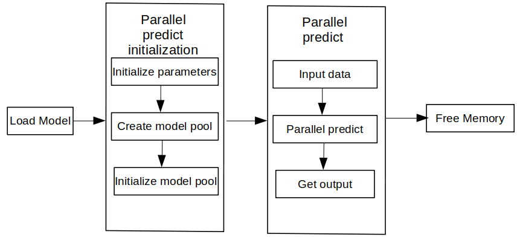

# Experience Java Minimalist Concurrent Reasoning Demo

`Linux` `x86` `Java` `Whole Process` `Inference Application` `Data Preparation` `Beginner`

<a href="https://gitee.com/mindspore/docs/blob/master/docs/lite/docs/source_en/quick_start/quick_start_server_inference_java.md" target="_blank"></a>

## Overview

This tutorial provides an example program for MindSpore Lite to parallel inference. It demonstrates the basic process of performing inference on the device side using [MindSpore Lite Java API](https://www.mindspore.cn/lite/api/en/master/index.html) by random inputting data, executing inference, and printing the inference result. You can quickly understand how to use the Java APIs related to inference on MindSpore Lite. In this tutorial, the randomly generated data is used as the input data to perform the inference on the MobileNetV2 model and print the output data. The code is stored in the [mindspore/lite/examples/quick_start_server_inference_java](https://gitee.com/mindspore/mindspore/tree/master/mindspore/lite/examples/quick_start_server_inference_java) directory.

The MindSpore Lite inference steps are as follows:

1. Load the model(optional): Read the `.ms` model converted by the [model conversion tool](https://www.mindspore.cn/lite/docs/en/master/use/converter_tool.html) from the file system.
2. Create and configure context: Create a configuration [RunnerConfig](https://www.mindspore.cn/lite/api/en/master/api_java/runner_config.html#runnerconfig) to save some basic configuration parameters required by a ModelParallelRunner to guide model pool init. including `MSContext`, `threadNum` (number of threads), `WorkersNum`.
3. Init: Before building a graph, the [ModelParallelRunner](https://www.mindspore.cn/lite/api/en/master/api_java/model_parallel_runner.html#modelparallelrunner) interface of [init](https://www.mindspore.cn/lite/api/en/master/api_java/model_parallel_runner.html#init) needs to be called to init the model parallel runner, including init model pool and subgraph partition and operator selection and scheduling. This takes a long time. Therefore, it is recommended that with one [Init](https://www.mindspore.cn/lite/api/en/master/api_java/model_parallel_runner.html#init) created, one graph be built. In this case, the inference will be performed for multiple times.
4. Input data: Before the graph is executed, data needs to be filled in the `Input Tensor`.
5. Perform inference: Use the [predict](https://www.mindspore.cn/lite/api/en/master/api_java/model_parallel_runner.html#predict) of the [ModelParallelRunner](https://www.mindspore.cn/lite/api/en/master/api_java/model_parallel_runner.html#modelparallelrunner) to perform model inference.
6. Obtain the output: After the graph execution is complete, you can obtain the inference result by `outputting the tensor`.
7. Release the memory: If the MindSpore Lite inference framework is not required, release the created [ModelParallelRunner](https://www.mindspore.cn/lite/api/en/master/api_java/model_parallel_runner.html#modelparallelrunner).



## Building and Running

- Environment requirements
    - System environment: Linux x86_64 (Ubuntu 18.04.02LTS is recommended.)
    - Build dependency:
        - [Git](https://git-scm.com/downloads) >= 2.28.0
        - [Maven](https://maven.apache.org/download.cgi) >= 3.3
        - [OpenJDK](https://openjdk.java.net/install/) >= 1.8

- Build

  Run the [build script](https://gitee.com/mindspore/mindspore/blob/master/mindspore/lite/examples/quick_start_server_inference_java/build.sh) in the `mindspore/lite/examples/quick_start_server_inference_java` directory to automatically download the MindSpore Lite inference framework library and model files and build the Demo.

  ```bash
  bash build.sh
  ```

  > If the MindSpore Lite inference framework fails to be downloaded, manually download the MindSpore Lite model inference framework [mindspore-lite-{version}-linux-x64.tar.gz](https://www.mindspore.cn/lite/docs/en/master/use/downloads.html) whose hardware platform is CPU and operating system is Ubuntu-x64. Decompress the package and copy `runtime/lib/` and `runtime/third_party/` all `so` and `jar` files to the `mindspore/lite/examples/quick_start_server_inference_java/lib` directory.
  >
  > If the MobileNetV2 model fails to be downloaded, manually download the model file [mobilenetv2.ms](https://download.mindspore.cn/model_zoo/official/lite/quick_start/mobilenetv2.ms) and copy it to the `mindspore/lite/examples/quick_start_server_inference_java/model/` directory.
  >
  > After manually downloading and placing the file in the specified location, you need to execute the build.sh script again to complete the compilation.

- Inference

  After the build, go to the `mindspore/lite/examples/quick_start_server_inference_java/target` directory and run the following command to experience MindSpore Lite inference on the MobileNetV2 model:

  ```bash
  export LD_LIBRARY_PATH=${LD_LIBRARY_PATH}:../lib/
  java -Djava.library.path=../lib/ -classpath .:./quick_start_server_inference_java.jar:../lib/mindspore-lite-java.jar  com.mindspore.lite.demo.Main ../model/mobilenetv2.ms
  ```

  After the execution, the following information is displayed:

  ```text
  ========== model parallel runner predict success ==========
  ```

## Init

ModelParallelRunner Init includes context configuration creation and model compilation.

```java
// use default param init context
MSContext context = new MSContext();
context.init(1,0);
boolean ret = context.addDeviceInfo(DeviceType.DT_CPU, false, 0);
if (!ret) {
    System.err.println("init context failed");
    context.free();
    return ;
}

// init runner config
RunnerConfig config = new RunnerConfig();
config.init(context);
config.setWorkersNum(2);

// init ModelParallelRunner
ModelParallelRunner runner = new ModelParallelRunner();
ret = runner.init(modelPath, config);
if (!ret) {
    System.err.println("ModelParallelRunner init failed.");
    runner.free();
    return;
}
```

## Parallel predict

Model inference includes data input, inference execution, and output obtaining. In this example, the input data is randomly generated, and the output result is printed after inference.

```java
// init input tensor
List<MSTensor> inputs = new ArrayList<>();
MSTensor input = runner.getInputs().get(0);
if (input.getDataType() != DataType.kNumberTypeFloat32) {
    System.err.println("Input tensor data type is not float, the data type is " + input.getDataType());
    return;
}
// Generator Random Data.
int elementNums = input.elementsNum();
float[] randomData = generateArray(elementNums);
ByteBuffer inputData = floatArrayToByteBuffer(randomData);
// create input MSTensor
MSTensor inputTensor = MSTensor.createTensor(input.tensorName(), DataType.kNumberTypeFloat32,input.getShape(), inputData);
inputs.add(inputTensor);

// init output
List<MSTensor> outputs = new ArrayList<>();

// runner do predict
ret = runner.predict(inputs,outputs);
if (!ret) {
    System.err.println("MindSpore Lite predict failed.");
    runner.free();
    return;
}
System.err.println("========== model parallel runner predict success ==========");
```

## Memory Release

If the MindSpore Lite inference framework is not required, release the created `ModelParallelRunner`.

```java
runner.free();
```