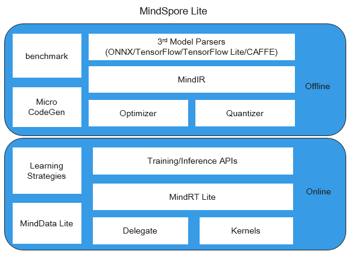

# Overall Architecture (Lite)

MindSpore Lite is an ultra-fast, intelligent, and simplified AI engine that enables intelligent applications in all scenarios, provides E2E solutions for users, and helps users enable AI capabilities.

MindSpore Lite is divided into two parts: offline module and online module. The overall architecture of MindSpore Lite is as follows:

- Offline module:

    - **3rd Model Parsers:** converts third-party models to a unified MindIR. Third-party models include TensorFlow, TensorFlow Lite, Caffe 1.0, and ONNX models.

    - **MindIR:** MindSpore device-cloud unified IR.

    - **Optimizer:** optimizes graphs based on IR, such as operator fusion and constant folding.

    - **Quantizer:** quantization module after training. Quantizer supports quantization methods after training, such as weight quantization and activation value quantization.

    - **benchmark:** a tool set for testing performance and debugging accuracy.

    - **Micro CodeGen:** a tool to directly compile models into executable files for IoT scenarios.

- Online module:

    - **Training/Inference APIs:** the unified C++/Java training inference interface for the device and cloud.

    - **MindRT Lite:** lightweight online runtime, it supports asynchronous execution.

    - **MindData Lite:** used for the device-side data processing.

    - **Delegate:** agent for docking professional AI hardware engine.

    - **Kernels:** the built-in high-performance operator library which provides CPU, GPU and NPU operators.

    - **Learning Strategies:** device-side learning strategies, such as transfer learning.
