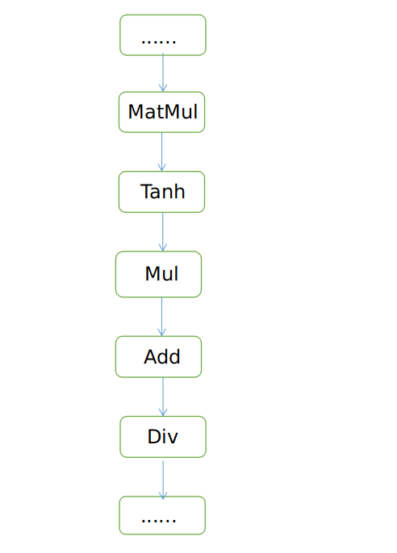

# Troubleshooting

[](https://gitee.com/mindspore/docs/blob/r2.6.0rc1/docs/lite/docs/source_en/reference/faq.md)

## Overview

If you encounter an issue when using MindSpore Lite, you can view logs first. In most scenarios, you can locate the issue based on the error information reported in logs. You can set the environment variable [GLOG_v](https://www.mindspore.cn/docs/en/r2.6.0rc1/api_python/env_var_list.html) to adjust the log level to print more debug logs. The following describes how to locate and rectify common faults.

> 1. The log line number may vary in different versions. In the following example, the line number in the error log information is represented by "**".
> 2. Only common information is listed in the example logs. Other information related to specific scenarios is displayed as "****".

## Failed to Convert a Model

1. The model path is incorrect or the file is damaged. The error log information is as follows:

    ```cpp
    WARNING: Logging before InitGoogleLogging() is written to STDERR
    [WARNING] LITE(11979,7fbdc90a8ec0,converter_lite):2021-12-13-16:20:49.506.071 [mindspore/lite/tools/common/protobuf_utils.cc:94] ReadProtoFromBinaryFile] Parse ***.onnx failed.
    [ERROR] LITE(11979,7fbdc90a8ec0,converter_lite):2021-12-13-16:20:49.506.122 [mindspore/lite/build/tools/converter/parser/onnx/onnx_op_parser.cc:3079] InitOriginModel] Read onnx model file failed, model path: ./ml_audio_kit_vocals_resunet.onnx
    [ERROR] LITE(11979,7fbdc90a8ec0,converter_lite):2021-12-13-16:20:49.506.131 [mindspore/lite/build/tools/converter/parser/onnx/onnx_op_parser.cc:3026] Parse] init origin model failed.
    [ERROR] LITE(11979,7fbdc90a8ec0,converter_lite):2021-12-13-16:20:49.506.137 [mindspore/lite/tools/converter/converter.cc:64] BuildFuncGraph] Get funcGraph failed for fmk: ONNX
    [ERROR] LITE(11979,7fbdc90a8ec0,converter_lite):2021-12-13-16:20:49.506.143 [mindspore/lite/tools/converter/converter.cc:133] Convert] Parser/Import model return nullptr
    [ERROR] LITE(11979,7fbdc90a8ec0,converter_lite):2021-12-13-16:20:49.506.162 [mindspore/lite/tools/converter/converter.cc:209] RunConverter] CONVERT RESULT FAILED:-1 Common error code.
    CONVERT RESULT FAILED:-1 Common error code.
    ```

    - Analysis: According to the error information, an error is reported during model import and the model import exits before the conversion process starts.

    - Solution: Check whether the model path in the command entered during model conversion is correct. If the path is correct, check whether the model is damaged. If the damaged file cannot be parsed, the system exits.

2. Unsupported operators exist. The error log information is as follows:

    ```cpp
    [mindspore/lite/tools/converter/converter.cc:**] BuildFuncGraph] Get funcGraph failed for fmk: ****
    [mindspore/lite/tools/converter/converter.cc:**] Converter] Parser/Import model return nullptr
    [mindspore/lite/tools/converter/converter_context.h:**] PrintOps] ===========================================
    [mindspore/lite/tools/converter/converter_context.h:**] PrintOps] UNSUPPORTED OP LIST:
    [mindspore/lite/tools/converter/converter_context.h:**] PrintOps] FMKTYPE: ****, OP TYPE: ****
    [mindspore/lite/tools/converter/converter_context.h:**] PrintOps] ===========================================
    [mindspore/lite/tools/converter/converter.cc:**] RunConverter] CONVERT RESULT FAILED:-300 Failed to find operator.
    ```

    - Analysis: The model contains operators not supported by the MindSpore Lite converter. As a result, the conversion fails.
    - Solution: For unsupported operators, add parsers by inheriting the API [NodeParser](https://mindspore.cn/lite/api/en/r2.6.0rc1/generate/classmindspore_converter_NodeParser.html) and register the parsers by using [NodeParserRegistry](https://mindspore.cn/lite/api/en/r2.6.0rc1/generate/classmindspore_registry_NodeParserRegistry.html). Alternatively, commit an [issue](https://gitee.com/mindspore/mindspore/issues) to MindSpore Lite developers in the community.

3. Unsupported operators exist. The error log information is as follows:

    ```cpp
    [mindspore/lite/tools/converter/parser/caffe/caffe_model_parser.cc:**] ConvertLayers] parse node **** failed.
    ```

    - Analysis: The converter supports the operator conversion, but does not support a special attribute or parameter of the operator. As a result, the model conversion fails. (The following uses caffe as an example. The log information of other frameworks is the same.)
    - Solution: Add the custom operator parsers by inheriting the API [NodeParser](https://mindspore.cn/lite/api/en/r2.6.0rc1/generate/classmindspore_converter_NodeParser.html) and register the parsers by using [NodeParserRegistry](https://mindspore.cn/lite/api/en/r2.6.0rc1/generate/classmindspore_registry_NodeParserRegistry.html). Alternatively, commit an [issue](https://gitee.com/mindspore/mindspore/issues) to MindSpore Lite developers in the community.

## Post-training Quantization Conversion Failed

### Full Quantization Conversion Failed

1. For dynamic shape models, you need to set `--inputShape=<INPUTSHAPE>` listed in the [Parameter Description](https://www.mindspore.cn/lite/docs/en/r2.6.0rc1/converter/converter_tool.html#parameter-description). For example:

    ```
    ./converter_lite --fmk=ModelType --modelFile=ModelFilePath --outputFile=ConvertedModelPath --configFile=/mindspore/lite/tools/converter/quantizer/config/full_quant.cfg --inputShape=intput_1:1,224,224,3;intput_2:1,48;
    ```

2. For a multi-batch model, the data preprocessing function cannot be directly used. You need to preprocess the calibration dataset in advance and then set the calibration dataset in the `BIN` format.

## Model Inference Failed

### Failed to Load the Graph

1. The model file is incorrect. The error log information is as follows:

    ```cpp
    [mindspore/lite/src/lite_model.cc:**] ConstructModel] The model buffer is invalid and fail to create graph.
    [mindspore/lite/src/lite_model.cc:**] ImportFromBuffer] construct model failed.
    ```

    - Analysis: The cached content read from the MS model file is invalid. As a result, the graph fails to be loaded.
    - Solution: Ensure that the model used for inference is the MS model file converted by the converter. If the model file is transferred or downloaded, check the MD5 value to determine whether the MS model file is damaged.

2. The model file is incompatible with the inference package version. The following error information is displayed in logs:

    ```cpp
    [mindspore/lite/src/lite_model.cc:**] ConstructModel] Maybe this is a model transferred out using the conversion tool before 1.1.0.
    [mindspore/lite/src/lite_model.cc:**] ImportFromBuffer] construct model failed.
    ```

    - Analysis: The version of the converter used by the MS model file is too early. As a result, the graph fails to be loaded.
    - Solution: Use MindSpore Lite 1.1.0 or later to convert the MS model again.

### CPU Inference Issues

#### Failed to Build a Graph

1. The model file is incompatible with the inference package version. The following error information is displayed in logs:

    ```cpp
    WARNING [mindspore/lite/src/lite_model.cc:**] ConstructModel] model version is MindSpore Lite 1.2.0, inference version is MindSpore Lite 1.5.0 not equal
    [mindspore/lite/src/litert/infer_manager.cc:**] KernelInferShape] Get infershape func failed! type: ****
    [mindspore/lite/src/scheduler.cc:**] ScheduleNodeToKernel] FindBackendKernel return nullptr, name: ****, type: ****
    [mindspore/lite/src/scheduler.cc:**] ScheduleSubGraphToKernels] schedule node return nullptr, name: ****, type: ****
    [mindspore/lite/src/scheduler.cc:**] ScheduleMainSubGraphToKernels] Schedule subgraph failed, index: 0
    [mindspore/lite/src/scheduler.cc:**] ScheduleGraphToKernels] ScheduleSubGraphToSubGraphKernel failed
    [mindspore/lite/src/scheduler.cc:**] Schedule] Schedule graph to kernels failed.
    [mindspore/lite/src/lite_session.cc:**] CompileGraph] Schedule kernels failed: -1.
    ```

    - Analysis: The version of MindSpore Lite used for inference is later than that of the converter used for model conversion. As a result, compatibility issues occur. Some operators may be added or removed during the version upgrade, and the operator implementation is missing during inference.
    - Solution: Use MindSpore Lite of the same version as the converter during inference. Generally, MindSpore Lite inference is compatible with MS models of earlier versions, but compatibility issues may occur if the versions differ greatly. In addition, MindSpore Lite inference does not guarantee backward compatibility with MS models converted from later versions.

2. The model input is a dynamic shape. The following error information is displayed in logs:

    ```cpp
    [mindspore/lite/src/common/tensor_util.cc:**] CheckTensorsInvalid] The shape of tensor contains negative dimension, check the model and assign the input shape with method Resize().
    [mindspore/lite/src/lite_session.cc:**] RunGraph] CheckInputs failed.
    ```

    - Analysis: The input shape of the MS model contains -1, that is, the model input is a dynamic shape. During direct inference, the shape is invalid. As a result, the inference fails.
    - Solution: MindSpore Lite requires that a proper shape be specified for a model that contains dynamic shape input during inference. When using the benchmark tool, set the [inputShapes](https://mindspore.cn/lite/docs/en/r2.6.0rc1/tools/benchmark_tool.html#parameter-description) parameter. When using MindSpore Lite for integration and development, call the [Resize](https://mindspore.cn/lite/api/en/r2.6.0rc1/generate/classmindspore_ops_Resize.html) method to set the shape.

### OpenCL GPU Inference Issues

#### Failed to Build a Graph

1. The model file is incompatible with the inference package version. The following error information is displayed in logs:

    ```cpp
    ERROR [mindspore/lite/src/lite_session.cc:1539] LoadModelByBuff] Please enable runtime convert.
    ERROR [mindspore/lite/src/lite_session.cc:1598] LoadModelAndCompileByPath] Read model file failed
    ERROR [mindspore/lite/src/cxx_api/model/model_impl.cc:93] Build] Init session failed
    ERROR [mindspore/lite/tools/benchmark/benchmark_unified_api.cc:845] RunBenchmark] ms_model_.Build failed while running
    ERROR [mindspore/lite/tools/benchmark/run_benchmark.cc:80] RunBenchmark] Run Benchmark Q888_CV_new_detect.pb.ms Failed : -1
    ms_model_.Build failed while running Run Benchmark Q888_CV_new_detect.pb.ms Failed : -1
    ```

    - Analysis: The converter is not used to convert the original model, or the version of MindSpore Lite used for inference is later than that of the converter used for model conversion. As a result, compatibility issues occur. Some operators may be added or removed during the version upgrade, and the operator implementation is missing during inference.
    - Solution: Use MindSpore Lite of the same version as the converter during inference. Generally, MindSpore Lite inference is compatible with MS models of earlier versions, but compatibility issues may occur if the versions differ greatly. In addition, MindSpore Lite inference does not guarantee backward compatibility with MS models converted from later versions.

#### Failed to Execute a Graph

1. The model input is a dynamic shape. The following error information is displayed in logs:

    ```cpp
    WARNING [mindspore/lite/src/litert/kernel/opencl/kernel/arithmetic_self.cc:40] CheckSpecs]  only support dim = 4 or 2 but your dim = 3
    ERROR [mindspore/lite/src/litert/kernel/opencl/opencl_kernel.cc:222] ReSize] ReSize failed for check kernel specs!
    ERROR [mindspore/lite/src/inner_kernel.cc:81] Execute] run kernel PreProcess failed, name: Exp_1234
    ERROR [mindspore/lite/src/litert/gpu/opencl/opencl_executor.cc:70] RunOrTune] run kernel failed, name: Exp_1234
    ERROR [mindspore/lite/src/litert/kernel/opencl/opencl_subgraph.cc:574] Execute] Run opencl executor failed: -1
    ERROR [mindspore/lite/src/lite_mindrt.h:58] RunKernel] run kernel failed, name: GpuSubGraph4_8
    WARNING [mindspore/lite/src/litert/gpu/opencl/opencl_allocator.cc:475] MapBuffer] Host ptr no need map
    WARNING [mindspore/lite/src/litert/gpu/opencl/opencl_allocator.cc:525] UnmapBuffer] Host ptr do not mapped
    ```

    - Analysis: The input shape of the MS model contains -1, that is, the model input is a dynamic shape. During GPU inference, the operator specifications check related to the shape is skipped in the graph build phase. By default, the GPU supports this operator, and the operator specifications are checked again in the prediction phase. If the operator specifications are not supported, an error is reported and the execution exits.
    - Solution: Some operators are not supported. You can modify the operator types or parameter types in the model as prompted to avoid some errors. In most cases, you need to [commit an issue](https://gitee.com/mindspore/mindspore/issues) in the MindSpore community to notify developers to fix and adapt the code.

2. Map buffer errors

    ```cpp
    WARNING [mindspore/lite/src/litert/gpu/opencl/opencl_allocator.cc:494] MapBuffer] Map buffer failed, can not found buffer or already mapped, dev_ptr=0x7244929ff0, host_ptr=0x722fbacd80
    ERROR [mindspore/lite/src/litert/kernel/arm/base/strided_slice.cc:179] FastRun] input_ptr_ must not be null!
    ERROR [mindspore/lite/src/inner_kernel.cc:88] Execute] run kernel failed, name: Slice_1147
    ERROR [mindspore/lite/src/sub_graph_kernel.cc:223] Execute] run kernel failed, name: Slice_1147
    ERROR [mindspore/lite/src/lite_mindrt.h:56] RunKernel] run kernel failed, name: CpuFP32SubGraph0_1
    ERROR [mindspore/lite/src/mindrt_executor.cc:193] Run] MindrtRun failed
    ERROR [mindspore/lite/src/lite_session.cc:709] RunGraph] RunGraph failed : -1
    ERROR [mindspore/lite/src/cxx_api/model/model_impl.cc:294] Predict] Run graph failed.
    ERROR [mindspore/lite/tools/benchmark/benchmark_unified_api.cc:721] MarkAccuracy] Inference error
    Inference error Run MarkAccuracy error: -1
    ```

    - Analysis: In the inference phase, the event check after the OpenCL operator is executed is ignored to improve the performance. However, the event check is inserted into the Enqueue class function in the OpenCL by default. If an error occurs during the execution of the OpenCL operator, an error is returned in the map phase.
    - Solution: The OpenCL operator has a bug. You are advised to [commit an issue](https://gitee.com/mindspore/mindspore/issues) in the MindSpore community to notify developers to fix and adapt the code.

### TensorRT GPU Inference Issues

#### Failed to Build a Graph

1. If the model input is a dynamic shape or the model has a shape operator, the following error information about dimensions is displayed in the log:

    ```cpp
    ERROR [mindspore/lite/src/delegate/tensorrt/tensorrt_runtime.h:31] log] Parameter check failed at: optimizationProfile.cpp::setDimensions::119, condition: std::all_of(dims.d, dims.d + dims.nbDims, [](int x) { return x >= 0; })
    ERROR [mindspore/lite/src/delegate/tensorrt/tensorrt_subgraph.cc:219] ParseInputDimsProfile] setDimensions of kMIN failed for input
    ERROR [mindspore/lite/src/delegate/tensorrt/tensorrt_runtime.h:31] log] xxx: xxx size cannot have negative dimension, size = [-1]
    ```

    - Analysis: TensorRT GPU graph construction does not support models with dynamic shapes. Specifically, the input shape of the model contains -1 or the model contains the shape operator.
    - Solution: When using the converter to convert the model to MS, set `--inputShape=<INPUTSHAPE>` in the [conversion command](https://www.mindspore.cn/lite/docs/en/r2.6.0rc1/converter/converter_tool.html#parameter-description) to specify the shape information of the input tensor. If you need to change the input shape during inference, you can set the [inputShapes](https://mindspore.cn/lite/docs/en/r2.6.0rc1/tools/benchmark_tool.html#parameter-description) parameter when using the benchmark tool or call the [Resize](https://mindspore.cn/lite/api/en/r2.6.0rc1/generate/classmindspore_ops_Resize.html) method when using MindSpore Lite for integration and development. Note: The shape dimension of the [Resize](https://mindspore.cn/lite/api/en/r2.6.0rc1/generate/classmindspore_ops_Resize.html) input must be less than or equal to the dimension of the [Build](https://www.mindspore.cn/lite/api/en/r2.6.0rc1/api_java/model.html#build) model.

#### Failed to Execute a Graph

1. Offline broadcast operators do not support resizing. An error message is displayed, indicating that the input dimension of an operator does not match. For example:

    ```cpp
    ERROR [mindspore/lite/src/delegate/tensorrt/tensorrt_runtime.h:31] log] xxx: dimensions not compatible for xxx
    ERROR [mindspore/lite/src/delegate/tensorrt/tensorrt_runtime.h:31] log] shapeMachine.cpp (252) - Shape Error in operator(): broadcast with incompatible Dimensions
    ERROR [mindspore/lite/src/delegate/tensorrt/tensorrt_runtime.h:31] log] Instruction: CHECK_BROADCAST xx xx
    ERROR [mindspore/lite/src/delegate/tensorrt/tensorrt_subgraph.cc:500] Execute] TensorRT execute failed.
    ```

    - Analysis: When an operator is in the offline converter, the operator is automatically broadcast offline by specifying `--inputShape=<INPUTSHAPE>`. Take the ones like operator as an example. 1 is broadcast to the corresponding constant tensor based on the input shape information. In this case, when the input is resized to different dimensions, an error is reported for operators (such as concat and matmul) that are sensitive to the input tensor dimensions on the network.
    - Solution: Replace this type of operator with the input of a model, assign a value by copying the memory during inference, and specify the corresponding shape information during resizing.

### NPU Inference Issues

#### Failed to Build a Graph

1. Failed to build an NPU graph. A tool is used to capture background logs and search for **MS_LITE** in the logs. The following error information is displayed:

    ```cpp
    MS_LITE : [mindspore/lite/src/delegate/npu/npu_subgraph.cc:**] BuildIRModel] Build IR model failed.
    MS_LITE : [mindspore/lite/src/delegate/npu/npu_subgraph.cc:**] Init] Build IR model failed.
    MS_LITE : [mindspore/lite/src/delegate/npu/npu_graph.cc:**] CreateNPUSubgraphKernel] NPU Subgraph Init failed.
    MS_LITE : [mindspore/lite/src/delegate/npu/npu_delegate.cc:**] Build] Create NPU Graph failed.
    ```

    - Analysis: This error is caused by the NPU online graph construction failure.
    - Solution: The graph construction is completed by calling the [HiAI DDK](https://developer.huawei.com/consumer/en/doc/development/HiAI-Library/ddk-download-0000001053590180) API. Therefore, the error is reported in the error log of HiAI. For some errors, you can modify the operator type or parameter type in the model as prompted. For most errors, you need to [commit an issue](https://gitee.com/mindspore/mindspore/issues) in the MindSpore community to notify the developers to fix and adapt the code. The following provides common HiAI error messages so that you can clearly describe the issue when asking questions in the community and improve the issue locating efficiency.

    (1) Search for the keyword **E AI_FMK** in the log file. If the following error log is found before the "MS_LITE" error is reported:

      ```cpp
      AI_FMK  : /conv_base_op_builder.cpp CheckShapeMatch(**)::"Input Channel ** does not match convolution weight channel ** * group **."
      AI_FMK  : /conv_base_op_builder.cpp Init(**)::"Shape of op **** does not match"
      AI_FMK  : /op_builder.cpp BuildOutputDesc(**)::""Init" failed. Node: ****."
      ```

    This indicates that the Transpose operator for tensor format conversion is inserted or omitted during graph construction. As a result, the input shape of the convolution does not match the weight format.

    (2) Search for the keyword **E AI_FMK** in the log file. If the following error log is found before the "MS_LITE" error is reported:

      ```cpp
      AI_FMK  : /model_compatibility_check.cpp GetIRGraphCompatibilityCheckResult(**)::"Node **** type **** don't support!"
      AI_FMK  : /model_compatibility_check.cpp CheckIRGraphCompatibility(**)::"CompleteExecuteDeviceConfig CheckIRGraphCompatibility failed"
      ```

    The error message indicates that the operator is not supported due to operator compatibility issues between HiAI ROM and HiAI DDK used by MindSpore Lite. You can update your phone system to update HiAI ROM, replace unsupported operators, or provide feedback in the open-source community.

#### Failed to Execute a Graph

1. NPU inference fails. A tool is used to capture background logs and search for **MS_LITE** in the logs. The following error information is displayed:

      ```cpp
      MS_LITE : [mindspore/lite/src/delegate/npu/npu_executor.cc:**] Run] NPU Process failed. code is 1
      MS_LITE : [mindspore/lite/src/delegate/npu/npu_graph.cc:**] Execute] NPU Subgraph **** execute failed.
      MS_LITE : [mindspore/lite/src/lite_mindrt.h:**] RunKernel] run kernel failed, name: ****
      ```

    - Analysis: This error is reported because the NPU fails to perform inference.
    - Solution: The underlying inference of the NPU model is implemented by HiAI. Therefore, the error is first displayed in the HiAI error log. The following describes common HiAI error information to help you locate the fault.

    Search for the keyword **E AI_FMK** in the log file. If the following error log is found before the **MS_LITE** error is reported:

      ```cpp
      AI_FMK  : /common_memory_allocator.cpp Allocate(**)::"Call rt api failed, ret: ****"
      ```

    Search for **DEVMM**. If the following error information is displayed in the first 10 lines of the previous logs:

      ```cpp
      /vendor/bin/hiaiserver: [DEVMM][E] DevmmJudgeAllocSize:** the alloc memory size exceeds the specification limit, already alloc total size = 0x3ff95000
      ```

    This indicates that the memory application of the NPU exceeds the limit. Check whether the model file is large or whether a tensor with a large shape exists in the model. According to [official HiAI requirements](https://developer.huawei.com/consumer/en/doc/development/hiai-References/modelbuildoptions-0000001139374903), the size of a single NPU's subgraph should not exceed 200 MB, and the memory requested for the array should not exceed the NPU's video memory. For example, in the log in this example, the NPU can apply for a maximum of 1 GB video memory. If you still need to run the NPU, adjust the model structure, split the model, or adjust the shape of the tensor.

## Model Inference Accuracy Issues

1. When MindSpore Lite is used for integration, the post-processing effect of the inference result is not ideal. How do I locate the issue of inference accuracy?
    - Check whether the input data is correct. In MindSpore Lite 1.3.0 and earlier versions, the input data format of the MS model is NHWC. In MindSpore Lite 1.5.0 and later versions, the [inputDataFormat](https://mindspore.cn/lite/docs/en/r2.6.0rc1/converter/converter_tool.html) parameter can be set to NHWC or NCHW. Ensure that the input data format is the same as that required by the MS model.
    - Use the [benchmark](https://mindspore.cn/lite/docs/en/r2.6.0rc1/tools/benchmark_tool.html) tool provided by MindSpore Lite to test the accuracy. If the following logs are displayed, the accuracy may be incorrect. Otherwise, the MindSpore Lite inference accuracy is correct. In this case, you need to check whether the data pre- and post-processing processes are correct.

      ```cpp
      Mean bias of all nodes/tensors is too big: **
      Compare output error -1
      Run MarkAccuracy error: -1
      ```

    - If the accuracy of the entire network inference performed by MindSpore Lite is incorrect, you can use the [Dump function](https://mindspore.cn/lite/docs/en/r2.6.0rc1/tools/benchmark_tool.html#dump) of the benchmark tool to save the output of the operator layer and compare the output with the inference result of the original framework to further locate the operator with incorrect accuracy.
    - For operators with accuracy issues, you can download the [MindSpore source code](https://gitee.com/mindspore/mindspore) to check the operator implementation and construct the corresponding single-operator network for debugging and fault locating. You can also [commit an issue](https://gitee.com/mindspore/mindspore/issues) in the MindSpore community to MindSpore Lite developers for troubleshooting.

2. What do I do if the FP32 inference result is correct but the FP16 inference result contains the NaN or Inf value?
    - If the NaN or Inf value is displayed in the result, value overflow occurs during inference. You can view the model structure, filter out the operator layer where value overflow may occur, and use the [Dump function](https://mindspore.cn/lite/docs/en/r2.6.0rc1/tools/benchmark_tool.html#dump) of the benchmark tool to save the output of the operator layer and confirm the operator where value overflow occurs.
    - MindSpore Lite 1.5.0 and later versions provide the mixed-precision inference capability. When FP16 is preferentially used for the entire network inference, an operator at a certain layer can be set for FP32 inference. For details, see [Mixed Precision Inference](https://mindspore.cn/lite/docs/en/r2.6.0rc1/infer/runtime_cpp.html#mixed-precision-inference). The overflow layer is set to FP32 to avoid the entire network inference accuracy issue during FP16 inference.

3. What do I do if the NaN or Inf value exists in the FP32 and FP16 inference results of MindSpore Lite?
    - Analysis: Operators that perform division operations exist on the entire network. During inference, if the division operation is performed and the divisor is 0, the NaN value may display. Take the following network structure as an example. If the network is used in the scenario where the input data is not normalized and the input data ranges from 0 to 255, the NaN value is displayed. The reason is that the input data is large and the output value of matmul is large when the input data is not normalized. As a result, the output value of the Tanh activation function is 1. As a result, the Div operator is divided by 0. However, if the network input data is normalized and the Tanh activation function is not 1, the network inference data does not have the NaN value.

      

    - Solution: If the input data is too large, you are advised to normalize the network input data during training. If the NaN value still exists after the input data is normalized, you need to use the [Dump function](https://mindspore.cn/lite/docs/en/r2.6.0rc1/tools/benchmark_tool.html#dump) of the benchmark tool to save the output of the operator layer to confirm the operator where the value overflow occurs and analyze the issue.

## Model Inference Performance Issues

1. Why is the actual inference performance the same as that of the CPU after the device is specified as the NPU?
    - If the device does not support the NPU but the NPU is specified in the context, the model automatically runs on a CPU instead of the NPU. In this case, the inference performance is the same as that of the CPU. You can use a tool (such as adb logcat) to capture background logs and search for the keyword **MS_LITE** in the logs to check whether the device supports NPUs. The common prompts and descriptions are as follows:

      ```cpp
      MS_LITE : [mindspore/lite/src/delegate/npu/npu_manager.cc:**] IsSupportNPU] The current devices NOT SUPPORT NPU.
      ```

    - If the log contains only the preceding information, check whether your device is a Huawei device with a HiSilicon Kirin processor. If not, NPUs are not supported.

      ```cpp
      MS_LITE : [mindspore/lite/src/delegate/npu/npu_manager.cc:**] IsKirinChip] Unsupported KirinChip ***.
      MS_LITE : [mindspore/lite/src/delegate/npu/npu_manager.cc:**] IsSupportNPU] The current devices NOT SUPPORT NPU.
      ```

    - If the log contains the preceding information, your device uses the Kirin chip, but the chip model does not support NPUs. Currently, the following Kirin chips support NPUs: Kirin 810, Kirin 820, Kirin 985, and later versions.

      ```cpp
      MS_LITE : [mindspore/lite/src/delegate/npu/npu_manager.cc:**] CheckDDKVerGreatEqual] DDK Version 100.***.***.*** less than 100.320.011.019.
      MS_LITE : [mindspore/lite/src/delegate/npu/npu_manager.cc:**] IsSupportNPU] The current devices NOT SUPPORT NPU.
      ```

    - If the log contains the preceding information, your device meets the hardware requirements, but the HiAI ROM version does not meet the requirements. As a result, the NPU operator cannot run. MindSpore Lite requires that the HiAI ROM version be later than 100.320.011.018.

      ```cpp
      MS_LITE : [mindspore/lite/src/delegate/npu/op/convolution_npu.cc:**] GetNPUConvOp] NPU does not support runtime inference shape.
      MS_LITE : [mindspore/lite/src/delegate/npu/op/npu_op.h:** GetNPUOp] NPU does not support runtime inference shape.
      ```

    - If either of the preceding two messages appears in the log for multiple times, check whether the model input is a dynamic shape and whether the input shape is specified before inference. If yes, the model cannot run on the NPU, and the program automatically switches to the CPU for execution.

2. Why is the actual inference performance poorer than that of the CPU after the device is specified as the NPU?
    - In most cases, the inference performance of the NPU is much better than that of the CPU. In a few cases, the inference performance of the NPU is poorer than that of the CPU.

    (1) Check whether there are a large number of Pad or StridedSlice operators in the model. The array format of the NPU is different from that of the CPU. The operation of these operators in the NPU involves array rearrangement. Therefore, the NPU has no advantage over the CPU and even is inferior to the CPU. If you need to run such an operator on the NPU, you are advised to remove or replace the operator.
    (2) Use a tool (such as adb logcat) to capture background logs and search for the keyword **BuildIRModel build successfully**. It is found that related logs appear multiple times, indicating that the model is partitioned into multiple NPU-related subgraphs during online graph construction. Generally, subgraph partitioning is caused by the existence of Transpose and/or unsupported NPU operators in the graph. Currently, a maximum of 20 subgraphs can be partitioned. The more the subgraphs, the more time the NPU takes. You are advised to refer to the [NPU operators](https://www.mindspore.cn/lite/docs/en/r2.6.0rc1/reference/operator_list_lite.html) supported by MindSpore Lite and avoid unsupported operators during model building. Alternatively, [commit an issue](https://gitee.com/mindspore/mindspore/issues) to MindSpore Lite developers.

## Issues Related to Using Visual Studio

1. When the static library is used, an error message is displayed, indicating that the Creator function of the Parameter cannot be found. The following error information is displayed in logs:

    ```text
    ERROR [mindspore\lite\src\ops\populate\populate_register.h:**] GetParameterCreator] Unsupported parameter type in Create : **
    ERROR [mindspore\lite\src\scheduler.cc:**] InferNodeShape] parameter generator is nullptr.
    ERROR [mindspore\lite\src\scheduler.cc:**] InferSubGraphShape] InferShape failed, name: **, type: **
    ERROR [mindspore\lite\src\scheduler.cc:**] SchedulePreProcess] op infer shape failed.
    ERROR [mindspore\lite\src\lite_session.cc:**] CompileGraph] Schedule kernels failed: -500
    ```

    - Analysis: When the static library is linked, not all symbols in the static library are imported by default. The Creator function of Parameter is registered with the singleton object through the global static object.

    - Solution: When linking the static library built by Visual Studio, choose "Properties > Linker > Command Line > Additional Options" and add /WHOLEARCHIVE:libmindspore-lite.lib.

2. The model verification fails. The error log information is as follows:

    ```text
    ERROR [mindspore\lite\src\lite_model.cc:**] ModelVerify] Model does not have inputs.
    ERROR [mindspore\lite\src\lite_model.cc:**] ConstructModel] ModelVerify failed.
    ERROR [mindspore\lite\src\lite_model.cc:**] ImportFromBuffer] construct model failed.
    ```

    - Analysis: The read model file is incomplete.

    - Solution: When using the Visual Studio compiler, add std::ios::binary to the model stream to be read.

## Issues Related to App Building Using Xcode

1. When Xcode uses a framework package to build an app, an error is reported indicating that a parameter is not supported when the GetParameterCreator function is executed. The log is as follows:

    ```text
    ERROR [mindspore/lite/src/ops/populate/populate_register.h:46] GetParameterCreator] Unsupported parameter type in Create : **
    ERROR [mindspore/lite/src/scheduler.cc:208] InferNodeShape] parameter generator is nullptr.
    ERROR [mindspore/lite/src/scheduler.cc:266] InferSubGraphShape] InferShape failed, name: **, type: **
    ERROR [mindspore/lite/src/scheduler.cc:78] SchedulePreProcess] op infer shape failed.
    ERROR [mindspore/lite/src/lite_session.cc:508] CompileGraph] Schedule kernels failed: -500
    ```

    - Analysis: When the static library in the framework is linked, not all symbols in the static library are imported. The Creator function of parameter is registered with the singleton object through the global static object.

    - Solution: When using the framework package to build an app in Xcode, choose "Build Settings > Linking > Other Linker Flags" and add the "mindspore_lite.framework/mindspore_lite" path.

2. When Xcode is used to build an app using the framework package, the following error message is displayed:

    ```text
    Undefined symbol:
    mindspore::session::LiteSession::CreateSession(**);
    ```

    - Analysis: The corresponding symbol is not found, and the framework package is not correctly imported to the Xcode project.

    - Solution: When using the framework package to build an app in Xcode, choose "Build Settings > Search Paths > Framework Search Paths" and add the "mindspore_lite.framework" path. In addition, choose "Build Settings > Search Paths > User Header Search Paths" and add the "mindspore_lite.framework/Headers" path.

## Other Issues

<font size=3>**Q: Why does a device not take effect after being specified as a GPU or NPU?*</font>

A: The device priority depends on the configuration sequence. Ensure that the GPU or NPU configuration in the context is prior to the CPU configuration.

<br/>

<font size=3>**Q: How many log levels are supported by MindSpore Lite? How can I set the log level?**</font>

A: Currently MindSpore Lite supports 4 log levels, including DEBUG, INFO, WARNING and ERROR. Users can set log level by set environment parameter GLOG_v. This environment parameter ranges from 0 to 3, which represents DEBUG, INFO, WARNING and ERROR. The default log level is WARNING or ERROR. For example, if the user sets GLOG_v to 1, MindSpore Lite will print the log of INFO level or higher.
<br/>

<font size=3>**Q: What are the limitations of NPU?**</font>

A:  Currently NPU only supports system ROM version EMUI>=11. Chip support includes Kirin 9000, Kirin 9000E, Kirin 990, Kirin 985, Kirin 820, Kirin 810, etc. For specific constraints and chip support, please see: <https://developer.huawei.com/consumer/en/doc/development/hiai-Guides/supported-platforms-0000001052830507#section94427279718>.

<br/>

<font size=3>**Q: Why does the static library after cutting with the cropper tool fail to compile during integration?**</font>

A:  Currently the cropper tool only supports CPU and GPU libraries. For details, please refer to [Use clipping tool to reduce library file size](https://www.mindspore.cn/lite/docs/en/r2.6.0rc1/tools/cropper_tool.html) document.

<br/>

<font size=3>**Q: Will MindSpore Lite run out of device memory, when running model?**</font>

A:  Currently the MindSpore Lite built-in memory pool has a maximum capacity limit 3GB. If a model is bigger than 3GB, MindSpore Lite will throw error.

<font size=3>**Q: How do I visualize the MindSpore Lite offline model (.ms file) to view the network structure?**</font>

A: Model visualization open-source repository `Netron` supports viewing MindSpore Lite models (MindSpore >= r1.2), which can be downloaded in the [Netron](https://github.com/lutzroeder/netron).

<br/>

<font size=3>**Q: Does MindSpore have a quantized inference tool?**</font>

A: [MindSpore Lite](https://www.mindspore.cn/lite/en) supports the inference of the quantization aware training model on the cloud. The MindSpore Lite converter tool provides the quantization after training and weight quantization functions which are being continuously improved.

<br/>

<font size=3>**Q: Does MindSpore have a lightweight on-device inference engine?**</font>

A:The MindSpore lightweight inference framework MindSpore Lite has been officially launched in r0.7. You are welcome to try it and give your comments. For details about the overview, tutorials, and documents, see [MindSpore Lite](https://www.mindspore.cn/lite/en).

<br/>

<font size=3>**Q: How to solve the problem of `sun.security.validator.ValidatorException: PKIX path building failed: sun.security.provider.certpath.SunCertPathBuilderException: unable to find valid certification path to requested target` when compiling JAVA library?**</font>

A: Use the `keytool` tool to import the security certificate of the relevant website into the cacerts certificate library of java. E.g `keytool -import -file "XX.cer" -keystore ${JAVA_HOME}/lib/security/cacerts" -storepass changeit`.

<br/>

<font size=3>**Q: How to solve the problem of `libpython3.7m.so.1.0: cannot open shared object file` when the reasoning version of MindSpore Lite on cloud is executed in the GPU environment?**</font>

A: `Libpython3.7.m.so.1.0` is the so of Python, which defaults to the lib directory of the system. If not, you need to use `export LD_LIBRARY_PATH=${USERPATH}/lib:{LD_LIBRARY_PATH}` to configure. `${USERPATH}/lib` is the path where `libpython3.7.m.so.1.0` is located.
<br/>