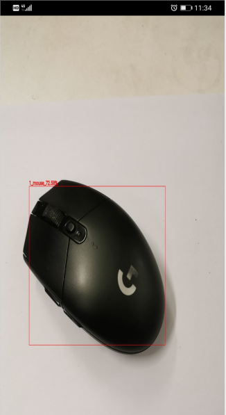

# Object Detection Model

## Object Detection Introduction

Object detection can identify the object in the image and its position in the image. For the following figure, the output of the object detection model is shown in the following table. The rectangular box is used to identify the position of the object in the graph and to mark the probability of the object category. The four numbers in the coordinates are Xmin, Ymin, Xmax, Ymax; the probability represents the probability of the detected object.

| Category | Probability | Coordinate       |
| -------- | ----------- | ---------------- |
| mouse    | 0.78        | [10, 25, 35, 43] |

## Object Detection Model List

The following table shows the data of some object detection models using MindSpore Lite inference.

> The performance of the table below is tested on the Mate30.

| Model name      | Size(Mb) | mAP(IoU=0.50:0.95) | CPU 4 thread delay (ms) |
|-----------------------| :----------: | :----------: | :-----------: |
| [MobileNetv2-SSD](https://download.mindspore.cn/model_zoo/official/lite/ssd_mobilenetv2_lite/ssd.ms) | 16.7 | 0.22 | 25.4 |
| [GhostNet-SSD](https://download.mindspore.cn/model_zoo/official/lite/ssd_ghostnet_lite/ssd.ms) | 25.7 | 0.24 | 24.1 |
