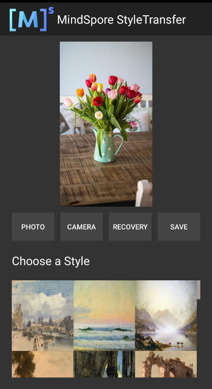
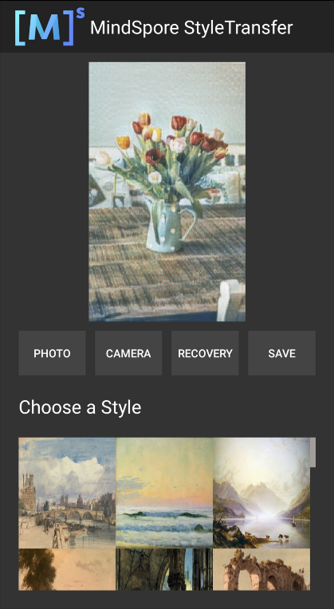

# Style Transfer Model

## Style Transfer Introduction

The style transfer model can change the artistic style of the user's target image according to the standard image built in this demo, and display it in the App image preview interface. Users can save the style transfer result or restore the original form of the target image.

Using demo to open the target image:

Selecting the first standard image from the left to perform the style transfer, as shown in the figure:

Using MindSpore Lite to realize style transfer [example](https://atomgit.com/mindspore-lab/models/tree/master/official/lite/style_transfer).
