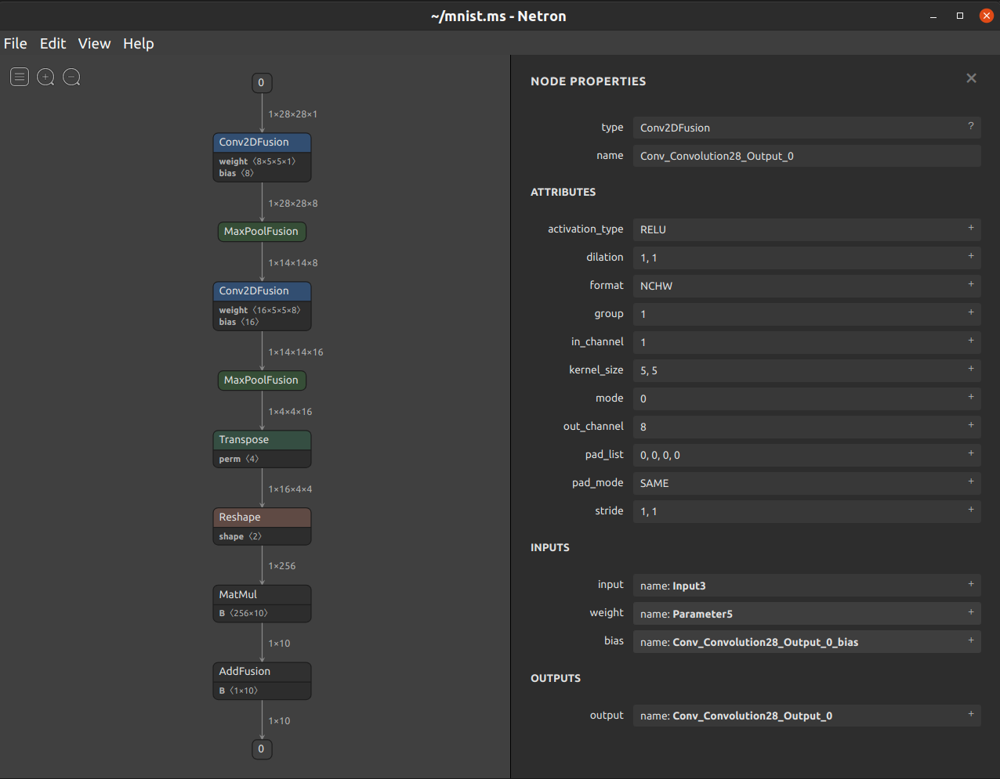

# Visualization Tool

## Overview

[Netron](https://github.com/lutzroeder/netron) is a neural network model visualization tool developed based on the [Electron](http://www.electronjs.org/) platform. It supports the visualization of many mainstream AI framework models and supports multiple platforms (such as Mac, Windows, and Linux). `Netron` supports MindSpore Lite models, allowing you to easily view model information. As shown in the following figure, after the `.ms` model is loaded using `Netron`, the topology structure, diagram, and node information of the model are displayed.

## Functions

- Load the `.ms` models. The MindSpore version must be 1.2.0 or later.
- Display subgraphs.
- Display the topology structure and data flow `shape`.
- Display the `format`, `input`, and `output` of a model.
- Display the `type`, `name`, `attribute`, `input`, and `output` of a node.
- Display and save structured data such as `weight` and `bias`.
- Export the visualization result as an image.

## Usage

The code that supports the MS model has been merged into the official repository. The `Netron` is downloaded from <https://github.com/lutzroeder/netron/releases/latest>. The author may update the releases from time to time. After `Netron` is installed as follows, you can drag a model to the window to open it.

- macOS: Download the `.dmg` file or run the `brew cask install netron` command.

- Linux: Download the `.AppImage` file or run the `snap install netron` command.

- Windows: Download the `.exe` file or run the `winget install netron` command.

- Python server: Run the `pip install netron` command to install Netron, and then run the `netron [FILE]` or `netron.start('[FILE]')` command to load a model.

- Browser: Open <https://netron.app/>.

## Development and Debugging

### Using the Development Version

Step 1: Use `git clone https://github.com/lutzroeder/netron` to clone and obtain a copy of the source code.

Step 2: Go to the `netron` directory and run the `npm install` command.

Step 3: Run the `make build` command for build and generate an executable program in the `./dist` directory.

### Debugging a Model Using Javascript

When debugging a model, add the information about the model to be debugged to the `./test/models.json` file in the `netron` folder, and then use the `node.js` file to debug the `./test/model.js` script.
