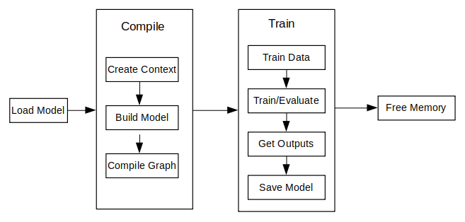

# Device-side Training (C++)

[](https://gitee.com/mindspore/docs/blob/master/docs/lite/docs/source_en/train/runtime_train_cpp.md)

## Overview

The principal procedures of lite training are as follows:

1. Design the network and export the `MindIR` model file by using the cloud side APIs.
2. Transfer the `MindIR` file to `ms` model file.
3. Train, evaluate and save `ms` model files.

> The model structure is saved in the transferred `ms` model file which will be loaded to the device platform for training.

The following figure shows the detailed training process:



> For the detailed C++ API description, refer to [API document](https://www.mindspore.cn/lite/api/en/master/index.html).

## Model Creating Loading and Building

[Model](https://www.mindspore.cn/lite/api/en/master/generate/classmindspore_Model.html#class-documentation) is the main entrance of the MindSpore Lite framework. We can compile and execute graph models through `Model` class.

### Reading Models

A Model file is flatbuffer-serialized file which was converted using the MindSpore Lite Model Converter Tool. These files have a `.ms` extension. Before model training or inference, the model needs to be loaded from the file system and parsed. Related operations are mainly implemented in the [Serialization](https://www.mindspore.cn/lite/api/en/master/generate/classmindspore_Serialization.html) class which holds the model data such as the network structure, weights data and operators attributes.

### Creating Contexts

[Context](https://www.mindspore.cn/lite/api/en/master/generate/classmindspore_Context.html) is a MindSpore Lite Object which contains basic configuration parameters required by the sessions to guide graph compilation and execution. It allows to define the device to run the model, e.g., CPU or GPU, the number of threads used for training and inference and the memory allocation scheme. Currently, only single threaded CPU device is supported in `Model`.

If the user creates a `Context` via `new` and no longer needs it, the user needs to release it via `delete`. Generally the `Context` object is released after the `Model` object is created.

### Creating TrainLoop

Currently, `MindSpore Lite` has removed `MindData` and its related high-level training APIs, including `Train`, `Evaluate`, as well as some dependent callback classes such as `AccuracyMetrics`, `CkptSaver`, `TrainAccuracy`, and `LossMonitor`.
As a result, model training via high-level APIs is not supported at this time. Training usage based on the `RunStep` API will be provided in future updates.

In addition, since `libmindspore-lite-train` has a weak dependency on `libmindspore-lite`, when using the C++ `RunStep` interface for training, the training capability must be explicitly enabled by forcibly linking the `libmindspore-lite-train` shared library (.so). This can be achieved by adding the linker option `-Wl,--no-as-needed`.

## Data Processing

Currently, due to the removal of the `MindData` module and its dependent high-level training APIs (`Train` and `Evaluate`), all dataset-related classes have been removed.
As a result, users are required to implement their own data preprocessing pipeline, converting image or text data into raw byte data, and then manually copying the processed data into the model inputs before inference or training.

## Executing Training and Evaluating

Currently, `MindSpore Lite` has removed `MindData` and its related high-level training APIs, including `Train`, `Evaluate`, as well as some dependent callback classes such as `AccuracyMetrics`, `CkptSaver`, `TrainAccuracy`, and `LossMonitor`.
As a result, model training via high-level APIs is not supported at this time. Training usage based on the `RunStep` API will be provided in future updates.

In addition, since `libmindspore-lite-train` has a weak dependency on `libmindspore-lite`, when using the C++ `RunStep` interface for training, the training capability must be explicitly enabled by forcibly linking the `libmindspore-lite-train` shared library (.so). This can be achieved by adding the linker option `-Wl,--no-as-needed`.

## Others

### Resizing the Input Dimension

When MindSpore Lite is used for inference, if the input shape needs to be resized, you can call the Resize API of [Model](https://www.mindspore.cn/lite/api/en/master/generate/classmindspore_Model.html#class-model) to resize the shape of the input tensor after a model is created and built.

> Some networks do not support variable dimensions. As a result, an error message is displayed and the model exits unexpectedly. For example, the model contains the MatMul operator, one input tensor of the MatMul operator is the weight, and the other input tensor is the input. If a variable dimension API is called, the input tensor does not match the shape of the weight tensor. As a result, the training fails.

The following sample code demonstrates how to perform Resize on the input tensor of MindSpore Lite:

```cpp
// Assume we have created a Model instance named model.
auto inputs = model->GetInputs();
std::vector<int64_t> resize_shape = {16, 32, 32, 1};
// Assume the model has only one input,resize input shape to [16, 32, 32, 1]
std::vector<std::vector<int64_t>> new_shapes;
new_shapes.push_back(resize_shape);
return model->Resize(inputs, new_shapes);
```

### Obtaining Input Tensors

Before graph execution, whether it is during training or inference, the input data must be filled-in into the model input tensors.
MindSpore Lite provides the following methods to obtain model input tensors:

1. Use the `GetInputByTensorName` method to obtain model input tensors that are connected to the model input node based on the tensor name.

    ```cpp
    /// \brief  Get MindSpore input Tensors of model by the tensor name.
    ///
    /// \param[in] tensor_name  Define tensor name.
    ///
    /// \return  MindSpore Lite MSTensor.
    inline MSTensor GetInputByTensorName(const std::string &tensor_name);
    ```

2. Use the `GetInputs` method to directly obtain the vectors of all model input tensors.

    ```cpp
    /// \brief  Get input MindSpore Lite MSTensors of model.
    ///
    /// \return  The vector of MindSpore Lite MSTensor.
    std::vector<MSTensor> GetInputs();
    ```

    If the model requires more than one input tensor (this is certainly the case during training, where both data and labels serve as inputs of the network), it is the user's responsibility to know the inputs order or their tensorName. This can be obtained from the Python model.
    Alternatively, one can deduce this information from the sizes of the input tensors.

3. Copying Data

    After model input tensors are obtained, the data must be copied into the tensors. The following methods allows to access the size of the data, the number of elements, the data type and the writable pointer. See also detailed description in the [MSTensor](https://www.mindspore.cn/lite/api/en/master/generate/classmindspore_MSTensor.html) API documentation.

    ```cpp
    /// \brief Obtains the length of the data of the MSTensor, in bytes.
    ///
    /// \return The length of the data of the MSTensor, in bytes.
    size_t DataSize() const;

    /// \brief Obtains the number of elements of the MSTensor.
    ///
    /// \return The number of elements of the MSTensor.
    int64_t ElementsNum() const;

    /// \brief Obtains the data type of the MSTensor.
    ///
    /// \return The data type of the MSTensor.
    enum DataType DataType() const;

    /// \brief Obtains the pointer to the data of the MSTensor. If the MSTensor is a device tensor, the data cannot be
    /// accessed directly on host.
    ///
    /// \return A pointer to the data of the MSTensor.
    void *MutableData();
    ```

    The following sample code shows how to obtain the complete graph input tensor from `Model` and how to convert the model input data to `MSTensor` type.

    ```cpp
    // Assuming model is a valid instance of Model
    auto inputs = model->GetInputs();

    // Assuming the model has two input tensors, the first is for data and the second for labels
    int data_index = 0;
    int label_index = 1;

    if (inputs.size() != 2) {
        std::cerr << "Unexpected amount of input tensors. Expected 2, model requires " << inputs.size() << std::endl;
        return -1;
    }

    // Assuming batch_size and data_size variables hold the Batch size and the size of a single data tensor, respectively:
    // And assuming sparse labels are used
    if ((inputs.at(data_index)->Size() != batch_size*data_size) ||
        (inputs.at(label_index)->ElementsNum() != batch_size)) {
        std::cerr << "Input data size does not match model input" << std::endl;
        return -1;
    }

    // Assuming data_ptr is the pointer to a batch of data tensors
    // and assuming label_ptr is a pointer to a batch of label indices (obtained by the DataLoader)
    auto *in_data = inputs.at(data_index)->MutableData();
    auto *in_labels = inputs.at(label_index)->MutableData();
    if ((in_data == nullptr) || (in_labels == nullptr)) {
        std::cerr << "Model's input tensor is nullptr" << std::endl;
        return -1;
    }

    memcpy(in_data, data_ptr, inputs.at(data_index)->Size());
    memcpy(in_labels, label_ptr, inputs.at(label_index)->Size());
    // After filling the input tensors the data_ptr and label_ptr may be freed
    // The input tensors themselves are managed by MindSpore Lite and users are not allowed to access them or delete them
    ```

    > - The data layout in the model input tensors of MindSpore Lite must be NHWC (batch size, height, weight and channel).
    > - The Tensors returned by `GetInputs` and `GetInputByTensorName` methods should not be released by users.

### Obtaining Output Tensors

MindSpore Lite provides the following methods to obtain the model's output `MSTensor`.

1. Use the `GetOutputsByNodeName` method to obtain the output tensors that belong to a certain node:

    ```cpp
    /// \brief Get output MSTensors of model by node name.
    ///
    /// \param[in] node_name Define node name.
    ///
    /// \note Deprecated, replace with GetOutputByTensorName
    ///
    /// \return The vector of output MSTensor.
    inline std::vector<MSTensor> GetOutputsByNodeName(const std::string &node_name);
    ```

    The following code is for getting the output tensor from the current session using the `GetOutputsByNodeName` method:

    ```cpp
    // Assume that model is a valid model instance
    // Assume that model has an output node named output_node_name_0.
    auto output_vec = model->GetOutputsByNodeName("output_node_name_0");
    // Assume that output node named output_node_name_0 has only one output tensor.
    auto out_tensor = output_vec.front();
    if (out_tensor == nullptr) {
        std::cerr << "Output tensor is nullptr" << std::endl;
        return -1;
    }
    ```

2. Use the `GetOutputByTensorName` method to obtain an output tensor, based on the tensor name.

    ```cpp
    /// \brief Obtains the output tensor of the model by name.
    ///
    /// \return The output tensor with the given name, if the name is not found, an invalid tensor is returned.
    inline MSTensor GetOutputByTensorName(const std::string &tensor_name);
    ```

    The following sample code shows how to obtain the output `MSTensor` from `Model` using the `GetOutputByTensorName` method.

    ```cpp
    // Assume that model is a valid model instance
    // We can use GetOutputByTensorName method to get the names of all the output tensors of the model
    auto tensor_names = model->GetOutputTensorNames();
    // Use output tensor name returned by GetOutputTensorNames as key
    for (auto tensor_name : tensor_names) {
        auto out_tensor = model->GetOutputByTensorName(tensor_name);
        if (out_tensor == nullptr) {
            std::cerr << "Output tensor is nullptr" << std::endl;
            return -1;
        }
    }
    ```

3. Use the `GetOutputs` method to obtain all the output tensors, ordered by their tensor name:

    ```cpp
    /// \brief Obtains all output tensors of the model.
    ///
    /// \return The vector that includes all output tensors.
    std::vector<MSTensor> GetOutputs();

    /// \brief Obtains the number of elements of the MSTensor.
    ///
    /// \return The number of elements of the MSTensor.
    int64_t ElementsNum() const;

    /// \brief Obtains the data type of the MSTensor.
    ///
    /// \return The data type of the MSTensor.
    enum DataType DataType() const;

    /// \brief Obtains the pointer to the data of the MSTensor. If the MSTensor is a device tensor, the data cannot be
    /// accessed directly on host.
    ///
    /// \return A pointer to the data of the MSTensor.
    void *MutableData();
    ```

    The following sample code shows how to obtain the output `MSTensor` from `Model` using the `GetOutputs` method and print the first ten data or all data records of each output `MSTensor`.

    ```cpp
    auto out_tensors = model->GetOutputs();
    for (auto out_tensor : out_tensors) {
      std::cout << "tensor name is:" << out_tensor.Name() << " tensor size is:" << out_tensor.DataSize()
                << " tensor elements num is:" << out_tensor.ElementsNum() << std::endl;
      // The model output data is float 32.
      if (out_tensor.DataType() != mindspore::DataType::kNumberTypeFloat32) {
        std::cerr << "Output should in float32" << std::endl;
        return;
      }
      auto out_data = reinterpret_cast<float *>(out_tensor.MutableData());
      if (out_data == nullptr) {
        std::cerr << "Data of out_tensor is nullptr" << std::endl;
        return -1;
      }
      std::cout << "output data is:";
      for (int i = 0; i < out_tensor.ElementsNum() && i < 10; i++) {
        std::cout << out_data[i] << " ";
      }
      std::cout << std::endl;
    }
    ```

    > Note that the vectors or map returned by the `GetOutputsByNodeName`, `GetOutputByTensorName` and `GetOutputs` methods do not need to be released by users.

### Saving Model

The function `Serialization` calls the function `ExportModel` actually. The `ExportModel` prototype is as follows:

```cpp
  static Status ExportModel(const Model &model, ModelType model_type, const std::string &model_file,
                            QuantizationType quantization_type = kNoQuant, bool export_inference_only = true,
                            std::vector<std::string> output_tensor_name = {});
```

You can load the saved model to perform training or inference.

> Please use [benchmark_train](https://www.mindspore.cn/lite/docs/en/master/tools/benchmark_train_tool.html) to measure the performance and accuracy of the trained models.
