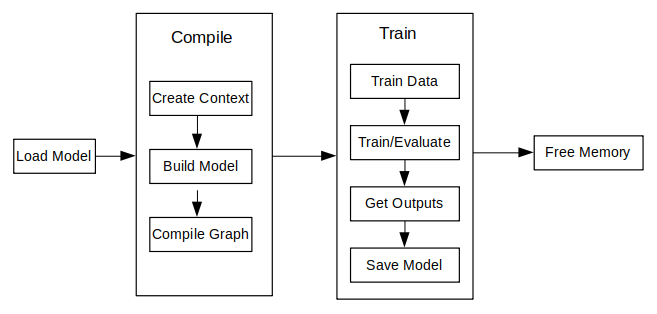

# Device-side Training (Java)

[](https://gitee.com/mindspore/docs/blob/r2.6.0rc1/docs/lite/docs/source_en/train/runtime_train_java.md)

## Overview

The principal procedures of lite training is as follows:

1. Design the network and export the `MindIR` model file by using the cloud side APIs.
2. Transfer the `MindIR` file to .ms model file.
3. Train, evaluate and save `ms` model files.

> The model structure is saved in the transferred `ms` model file which will be load to the device platform for training.

The following figure shows the detailed training process:



> For more javaAPI description, please refer to [API Documentation](https://www.mindspore.cn/lite/api/en/r2.6.0rc1/index.html).

## Model Creating, Loading and Building

[Model](https://www.mindspore.cn/lite/api/en/r2.6.0rc1/api_java/model.html#model) is the main entrance of the MindSpore Lite framework. We can compile and execute graph models through `Model` class.

### Reading Models

A Model file is flatbuffer-serialized file which was converted using the MindSpore Model Converter Tool. These files have a `.ms` extension. Before model training and/or inference, the model needs to be loaded from the file system and parsed. Related operations are mainly implemented in the [Graph](https://www.mindspore.cn/lite/api/en/r2.6.0rc1/api_java/graph.html#graph) class which holds the model data such as the network structure, weights data and operators attributes.

### Creating Contexts

[MSContext](https://www.mindspore.cn/lite/api/en/r2.6.0rc1/api_java/mscontext.html) is a MindSpore Lite Object which contains basic configuration parameters required by the sessions to guide graph compilation and execution. It allows to define the device to run the model, e.g., CPU or GPU, the number of threads used for training and inference and the memory allocation scheme.
Currently, only CPU device is supported in training.

### Creating TrainLoop

Users can create the object of the class `Model` by using the function `Build` to call MindData APIs. The member function `Build` of the class `Model`, its prototype is as follows:

`public boolean build(Graph graph, MSContext context, TrainCfg cfg);`

The following codes show how to create a training session based on the multi-threads CPU by using the class `Model`.

```java
Graph g = new Graph();
MSContext context = new MSContext();
context.init(1, 0);
context.addDeviceInfo(DeviceType.DT_CPU, false, 0);
TrainCfg cfg = new TrainCfg();
cfg.init();
Model liteModel = new Model();
liteModel.build(g, context, cfg);
```

> Refer to [Train a LeNet](https://gitee.com/mindspore/mindspore/blob/v2.6.0-rc1/mindspore/lite/examples/train_lenet_java/src/main/java/com/mindspore/lite/train_lenet/NetRunner.java) for more details.

## Data Processing

### Data Reading Pipeline

Currently, java does not provide data processing API such as C++ `Dataset` class and its extended classes. Users need to define the data preprocessing process by themselves. After processing the image or text data into byte data, copy it to the input of the model.

### Example

The following codes shows the Mnist data reading and data preprocessing process:

```java
    public void readMNISTFile(String inputFileName, String labelFileName, Vector<DataLabelTuple> dataset) {
        try {
            BufferedInputStream ibin = new BufferedInputStream(new FileInputStream(inputFileName));
            BufferedInputStream lbin = new BufferedInputStream(new FileInputStream(labelFileName));
            byte[] bytes = new byte[4];

            ...
            // read images
            int image_size = n_rows * n_cols;
            byte[] image_data = new byte[image_size];
            for (int i = 0; i < lnumber; i++) {
                byte [] hwc_bin_image = new byte[32 * 32];
                readFile(ibin, image_data, image_size);
                for (int r = 0; r < 32; r++) {
                    for (int c = 0; c < 32; c++) {
                        int index = r * 32 + c;
                        if (r < 2 || r > 29 || c < 2 || c > 29) {
                            hwc_bin_image[index] = 0;
                        } else {
                            hwc_bin_image[index] = image_data[(r-2)*28 + (c-2)];
                        }
                    }
                }

                DataLabelTuple data_label_tupel = new DataLabelTuple();
                data_label_tupel.data = hwc_bin_image;
                data_label_tupel.label = labels[i];
                dataset.add(data_label_tupel);
            }
        } catch (IOException e) {
            System.err.println("Read Dateset exception");
        }
    }
```

> Refer to [Train a LeNet](https://gitee.com/mindspore/mindspore/blob/v2.6.0-rc1/mindspore/lite/examples/train_lenet_java/src/main/java/com/mindspore/lite/train_lenet/NetRunner.java) for more details.

## Execute Training

MindSpore Lite java interface can obtain the output of the model through the interface provided by the `Model` class. In the training mode, the output of the model is loss, and in the inference mode, the output of the model is the predicted value. The training and inference modes can be switched through the `setTrainMode` interface. Execute the model through the `runStep` interface.

### Training

```java
model.setTrainMode(true);
for (int i = 0; i < cycles; i++) {
    for (int b = 0; b < virtualBatch; b++) {
        fillInputData(ds.getTrainData(), false);
        isSuccess = model.runStep();
        if (!isSuccess) {
            model.free();
            System.err.println("run step failed");
            return -1;
        }
        float loss = getLoss();
        if (min_loss > loss) {
            min_loss = loss;
        }
        if ((b == 0) && ((i + 1) % 500 == 0)) {
            float acc = calculateAccuracy(10); // only test 10 batch size
            if (max_acc < acc) {
                max_acc = acc;
            }
            System.out.println("step_" + (i + 1) + ": \tLoss is " + loss + " [min=" + min_loss + "]" + " " +
                    "max_acc=" + max_acc);
        }
    }
}
```

> Refer to [Train a LeNet](https://gitee.com/mindspore/mindspore/blob/v2.6.0-rc1/mindspore/lite/examples/train_lenet_java/src/main/java/com/mindspore/lite/train_lenet/NetRunner.java) for more details.

### Evaluating

Similarly, switch to inference mode through the `setTrainMode` interface:

```java
model.setTrainMode(false);
```

> With TrainSessions, a network can be used for both inference and training. These two modes differ in several aspects:
>
> - The input of the network: Running inference requires only the data, while running training requires both data and labels.
> - The output of the network: Running inference returns the predicted values in the output, while running in training mode returns the loss.
> - In training mode, the weights of the layers are updated in each Run, while in inference mode they are static.
> - Some layers behave differently in inference vs. training mode, e.g., updating the accumulated batch mean and variance in Batch Normalization layers.

## Others

### Model Mode Switching

The function prototype of `setTrainMode` in the `Model` class is as follows:

```java
public boolean setTrainMode(boolean isTrain)
```

### Resizing the Input Dimension

When MindSpore Lite is used for inference, if you need to Resize the input shape, you can call [resize](https://www.mindspore.cn/lite/api/en/r2.6.0rc1/api_java/model.html#resize) of Model after you have finished creating [Model](https://www.mindspore.cn/lite/api/en/r2.6.0rc1/api_java/model.html#model) and have completed model compilation [build](https://www.mindspore.cn/lite/api/en/r2.6.0rc1/api_java/model.html#build), to resize the shape of the input Tensor.

> Some networks do not support variable dimensions. As a result, an error message is displayed and the model exits unexpectedly. For example, the model contains the MatMul operator, one input tensor of the MatMul operator is the weight, and the other input tensor is the input. If a variable dimension API is called, the input tensor does not match the shape of the weight tensor. As a result, the training fails.

The following sample code demonstrates how to perform Resize on the input tensor of MindSpore Lite:

```java
List<MSTensor> inputs = session.getInputs();
int[][] dims = {{1, 300, 300, 3}};
bool ret = model.resize(inputs, dims);
```

### Obtaining Input Tensors

Before graph execution, whether it is during training or inference, the input data must be filled-in into the model input tensors.
MindSpore Lite provides the following methods to obtain model input tensors:

1. Use the [getInputsByTensorName](https://www.mindspore.cn/lite/api/en/r2.6.0rc1/api_java/model.html#getinputsbytensorname) method to obtain model input tensors that are connected to the model input node based on the tensor name.

    ```java
     /**
     * Get input tensor by tensor name.
     *
     * @param tensorName name.
     * @return input tensor.
     */
    public MSTensor getInputByTensorName(String tensorName);
    ```

2. Use the [getInputs](https://www.mindspore.cn/lite/api/en/r2.6.0rc1/api_java/model.html#getinputs) method to directly obtain the vectors of all model input tensors.

    ```java
    /**
     * Get model inputs tensor.
     *
     * @return input tensors.
     */
    public List<MSTensor> getInputs();
    ```

    If the model requires more than one input tensor (this is certainly the case during training, where both data and labels serve as inputs of the network) it is the user's responsibility to know the inputs order or their tensorName. This can be obtained from the Python model.
    Alternatively, one can deduce this information from the sizes of the input tensors.

3. Copying Data

    After model input tensors are obtained, the data must be copied into the tensors. The following methods allows to access the size of the data, the number of elements, the data type and the writable pointer. See also detailed description in the [MSTensor](https://www.mindspore.cn/lite/api/en/r2.6.0rc1/api_java/mstensor.html#mstensor) API documentation.

    The following sample code shows how to get the complete graph input tensor from `Model` and how to convert the model input data to `MSTensor` type.

    ```java
    // Assuming model is a valid instance of Model
    List<MSTensor> inputs = model.getInputs();
    imageTensor = inputs.get(dataIndex);
    imageInputBuf = ByteBuffer.allocateDirect((int) imageTensor.size());
    imageInputBuf.order(ByteOrder.nativeOrder());
    ```

### Obtaining Output Tensors

MindSpore Lite provides the following methods to obtain the output tensor of a model:

1. Use the [getOutputsByNodeName](https://www.mindspore.cn/lite/api/en/r2.6.0rc1/api_java/model.html#getoutputsbynodename) method to obtain the output tensors that belong to a certain node:

    ```java
    /**
     * Get output tensors by node name.
     *
     * @param nodeName output node name
     * @return output tensor
     */
    public List<MSTensor> getOutputsByNodeName(String nodeName);
    ```

2. Use the [getOutputByTensorName](https://www.mindspore.cn/lite/api/en/r2.6.0rc1/api_java/model.html#getoutputbytensorname) method to obtain an output tensor, based on the tensor name.

    ```java
          /**
        * Get output tensor names.
        *
        * @return output tensor name list.
        */
        public MSTensor getOutputByTensorName(String tensorName);
    ```

3. Use the [getOutputs](https://www.mindspore.cn/lite/api/en/r2.6.0rc1/api_java/model.html#getoutputs) method to obtain all the output tensors, ordered by their tensor names.

    ```java
        /**
        * Get model outputs.
        *
        * @return model outputs tensor.
        */
        public List<MSTensor> getOutputs();
    ```

### Saving Model

MindSpore Lite provides the `export` interface to save the model, the prototype is as follows:

```java
    /**
     * Export the model.
     *
     * @param fileName          Name Model file name.
     * @param quantizationType  The quant type.0,no_quant,1,weight_quant,2,full_quant.
     * @param isOnlyExportInfer if export only inferece.
     * @param outputTensorNames tensor name used for export inference graph.
     * @return Whether the export is successful.
     */
    public boolean export(String fileName, int quantizationType, boolean isOnlyExportInfer,List<String> outputTensorNames);
```

You can load the saved model to perform training or inference.
