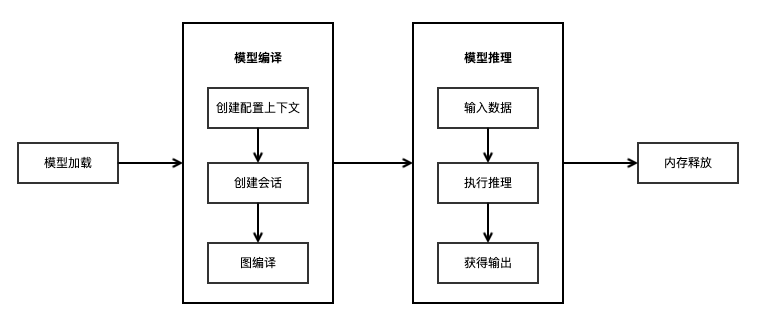

.. MindSpore documentation master file, created by
   sphinx-quickstart on Thu Aug 17 09:00:00 2020.
   You can adapt this file completely to your liking, but it should at least
   contain the root `toctree` directive.

MindSpore Lite端侧推理文档
=================================

MindSpore Lite推理包含云侧推理和端侧推理两部分，该文档主要介绍MindSpore Lite端侧推理，云侧推理请参考 `云侧推理文档 <https://www.mindspore.cn/lite/cloud_docs/zh-CN/master/index.html>`_ 。

使用场景
--------

MindSpore Lite端侧推理支持业界通用的CPU、Kirin NPU硬件设备，在HarmonyOS是系统内置的轻量化AI引擎，面向全场景构建支持多处理器架构的开放AI架构，使能鸿蒙全场景智能应用，同时支持基于Android/iOS平台进行开发，为开发者提供端到端的解决方案，为算法工程师和数据科学家提供开发友好、运行高效、部署灵活的体验，帮助人工智能软硬件应用生态繁荣发展。

目前已经在图像分类、目标识别、人脸识别、文字识别、语音识别等应用中广泛使用。常用场景如：

- 图像分类 (Image Classification)：最基础的计算机视觉应用，属于有监督学习类别，如给定一张图像（猫、狗、飞机、汽车等等），判断图像所属的类别。

- 目标检测 (Object Detection)：使用预置目标检测模型，检测标识摄像头输入帧中的对象并添加标签，并用边框标识出来。

- 图像分割 (Image Segmentation)：图像分割可用于检测目标在图片中的位置或者图片中某一像素是属于何种对象的。

- 语音识别 (Automatic Speech Recognition, ASR)：将人类的语音信号转化为机器可处理的文本。它涵盖了实时语音转写（如会议记录）、语音指令控制（如智能家居）、语音搜索等场景。通过集成声学模型与语言模型，AI能够克服背景噪音与口音干扰，实现人机自然交互。

优势
----

MindSpore Lite提供面向不同硬件设备的AI模型推理能力，使用MindSpore Lite的优势如下：

1. 更优性能：高效的内核算法和汇编级优化，支持CPU、Kirin NPU专用芯片高性能推理，最大化发挥硬件算力，最小化推理时延和功耗。

2. 轻量化：提供超轻量的解决方案，支持模型量化压缩，模型更小跑得更快，使能AI模型极限环境下的部署执行。

3. 全场景支持：支持多种操作系统以及嵌入式系统，适配多种软硬件智能设备上的AI应用。

4. 高效部署：支持MindSpore/TensorFlow Lite/Caffe/Onnx模型，提供模型压缩、数据处理等能力，统一训练和推理IR，方便用户快速部署。

开发流程
--------

使用MindSpore Lite框架端侧使用主要包括以下步骤：

1. 模型读取：MindSpore Lite端侧使用.ms格式模型进行推理。

   1. 跨平台兼容：对于第三方框架模型，比如 TensorFlow、TensorFlow Lite、Caffe、ONNX等，可以使用MindSpore Lite提供的模型转换工具转换为.ms模型。

   2. 优化策略：在转换过程中，可集成算子融合、权重量化等优化手段，以提升端侧运行效率。

2. 模型编译：推理前的准备阶段，主要完成运行环境的初始化、模型加载、图编译。

   1. 创建配置上下文：设置硬件后端（如CPU、GPU、NPU）、设置工作线程数及内存分配策略。

   2. 模型加载：将磁盘上的模型文件加载至内存并解析为运行时图结构。

   3. 图编译：运行时会对计算图进行深度优化（如常量折叠、内存复用、权重Pack）。\ **注意**\ ：图编译属于高耗时操作。可采用“\ **一次编译，多次推理**\ ”的策略，即Model 实例在初始化阶段构建一次，后续循环复用。

3. 模型推理：

   1. 在执行推理前，需根据模型输入张量的维度和数据类型，将预处理后的数据填充至输入缓冲区。

   2. 执行推理：使用调用模型推理函数进行模型推理。

   3. 获取输出：推理接口中的outputs出参为推理结果的返回值，可以通过对 MSTensor 对象的解析获取模型的推理结果以及输出的数据类型和大小。

4. 内存释放：在模型编译阶段会申请常驻内存、显存、线程池等资源，需要在模型推理结束后进行释放，从而避免资源泄漏。

.. toctree::
   :glob:
   :maxdepth: 1
   :caption: 获取MindSpore Lite
   :hidden:

   use/downloads
   use/build

.. toctree::
   :glob:
   :maxdepth: 1
   :caption: 快速入门
   :hidden:

   quick_start/one_hour_introduction

.. toctree::
   :glob:
   :maxdepth: 1
   :caption: 模型转换
   :hidden:

   converter/converter_tool

.. toctree::
   :glob:
   :maxdepth: 1
   :caption: 端侧推理
   :hidden:

   infer/runtime_cpp
   infer/runtime_java
   infer/device_infer_example

.. toctree::
   :glob:
   :maxdepth: 1
   :caption: 端侧训练
   :hidden:

   train/converter_train
   train/runtime_train
   train/device_train_example

.. toctree::
   :glob:
   :maxdepth: 1
   :caption: 端侧第三方接入
   :hidden:

   advanced/third_party/register
   advanced/third_party/delegate
   advanced/third_party/asic

.. toctree::
   :glob:
   :maxdepth: 1
   :caption: 高阶开发
   :hidden:

   advanced/image_processing
   advanced/quantization
   advanced/micro

.. toctree::
   :glob:
   :maxdepth: 1
   :caption: 端侧工具
   :hidden:

   tools/visual_tool
   tools/benchmark
   tools/cropper_tool
   tools/obfuscator_tool
   tools/benchmark_golden_data

.. toctree::
   :glob:
   :maxdepth: 1
   :caption: 参考文档
   :hidden:

   reference/operator_lite
   reference/operator_list_codegen
   reference/model_lite
   reference/faq
   reference/log

.. toctree::
   :maxdepth: 1
   :caption: RELEASE NOTES
   :hidden:

   RELEASE
