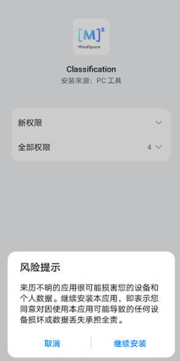

# 基于JNI接口的Android应用开发

[](https://gitee.com/mindspore/docs/blob/master/docs/lite/docs/source_zh_cn/infer/quick_start.md)

## 概述

我们推荐你从端侧Android图像分类demo入手，了解MindSpore Lite应用工程的构建、依赖项配置以及相关API的使用。

本教程基于MindSpore团队提供的Android“端侧图像分类”示例程序，演示了端侧部署的流程。

1. 选择图像分类模型。
2. 将模型转换成MindSpore Lite模型格式。
3. 在端侧使用MindSpore Lite推理模型。详细说明如何在端侧利用MindSpore Lite C++ API（Android JNI）和MindSpore Lite图像分类模型完成端侧推理，实现对设备摄像头捕获的内容进行分类，并在APP图像预览界面中，显示出最可能的分类结果。

> 你可以在这里找到[Android图像分类模型](https://download.mindspore.cn/model_zoo/official/lite/mobilenetv2_openimage_lite/1.5)和[图像分类示例代码](https://gitee.com/mindspore/models/tree/master/official/lite/image_classification)。
>
> 本示例中讲述了C++ API的应用方法，此外MindSpore Lite还支持Java API。关于Java API的使用请参考[图像分割demo](https://gitee.com/mindspore/models/tree/master/official/lite/image_segmentation)。

我们提供了本示例对应的APK文件，你可扫描下方的二维码或直接下载[APK文件](https://download.mindspore.cn/model_zoo/official/lite/apk/label/Classification.apk)，并部署到Android设备后使用。


## 选择模型

MindSpore团队提供了一系列预置终端模型，你可以在应用程序中使用这些预置的终端模型。
可下载[MindSpore Model Zoo中图像分类模型](https://download.mindspore.cn/model_zoo/official/lite/mobilenetv2_openimage_lite/1.5/mobilenetv2.ms)。
同时，你也可以使用预置模型做迁移学习，以实现自己的图像分类任务。

## 转换模型

如果预置模型已经满足你要求，请跳过本章节。如果你需要对MindSpore提供的模型进行重训，重训完成后，需要将模型导出为[.mindir格式](https://www.mindspore.cn/tutorials/zh-CN/master/beginner/save_load.html#保存和加载mindir)。然后使用MindSpore Lite[模型转换工具](https://www.mindspore.cn/lite/docs/zh-CN/master/converter/converter_tool.html)将.mindir格式转换成.ms格式。

以mobilenetv2模型为例，如下脚本将其转换为MindSpore Lite模型用于端侧推理。

```bash
call converter_lite --fmk=MINDIR --modelFile=mobilenetv2.mindir --outputFile=mobilenetv2
```

## 部署应用

接下来介绍如何构建和执行mindspore Lite端侧图像分类任务。

### 运行依赖

- Android Studio >= 3.2 (推荐4.0以上版本)
- NDK 21.3
- [CMake](https://cmake.org/download) >= 3.18.3
- Android SDK >= 26
- JDK >= 1.8  

### 构建与运行

1. 在Android Studio中加载本[示例源码](https://gitee.com/mindspore/models/tree/master/official/lite/image_classification)，并安装相应的SDK（指定SDK版本后，由Android Studio自动安装）。

    

    启动Android Studio后，点击`File->Settings->System Settings->Android SDK`，勾选相应的SDK。如下图所示，勾选后，点击`OK`，Android Studio即可自动安装SDK。

    

    （可选）若安装时出现NDK版本问题，可手动下载相应的[NDK版本](https://developer.android.com/ndk/downloads?hl=zh-cn)（本示例代码使用的NDK版本为21.3），并在`Project Structure`的`Android NDK location`设置中指定NDK的位置。

    

2. 连接Android设备，运行图像分类应用程序。

    通过USB连接Android设备调试，点击`Run 'app'`即可在你的设备上运行本示例项目。

    

    Android Studio连接设备调试操作，可参考<https://developer.android.com/studio/run/device?hl=zh-cn>。

    手机需开启“USB调试模式”，Android Studio才能识别到手机。华为手机一般在`设置->系统和更新->开发人员选项->USB调试`中打开“USB调试模式”。

3. 在Android设备上，点击“继续安装”，安装完即可查看到设备摄像头捕获的内容和推理结果。

    

    识别结果如下图所示。

    

## 示例程序详细说明  

本端侧图像分类Android示例程序分为JAVA层和JNI层，其中，JAVA层主要通过Android Camera 2 API实现摄像头获取图像帧，以及相应的图像处理等功能；JNI层在[Runtime](https://www.mindspore.cn/lite/docs/zh-CN/master/infer/runtime_cpp.html)中完成模型推理的过程。

> 此处详细说明示例程序的JNI层实现，JAVA层运用Android Camera 2 API实现开启设备摄像头以及图像帧处理等功能，读者需要具备一定的Android开发基础知识。

### 示例程序结构

```text
app
│
├── src/main
│   ├── assets # 资源文件
|   |   └── model # 模型文件
|   |       └── mobilenetv2.ms # 存放的模型文件
│   |
│   ├── cpp # 模型加载和预测主要逻辑封装类
|   |   ├── ...
|   |   ├── mindspore-lite-{version}-android-{arch} # MindSpore Lite版本
|   |   ├── MindSporeNetnative.cpp # MindSpore调用相关的JNI方法
│   |   ├── MindSporeNetnative.h # 头文件
│   |   └── MsNetWork.cpp # MindSpore接口封装
│   |
│   ├── java # java层应用代码
│   │   └── com.mindspore.classification
│   │       ├── gallery.classify # 图像处理及MindSpore JNI调用相关实现
│   │       │   └── ...
│   │       └── widget # 开启摄像头及绘制相关实现
│   │           └── ...
│   │
│   ├── res # 存放Android相关的资源文件
│   └── AndroidManifest.xml # Android配置文件
│
├── CMakeList.txt # cmake编译入口文件
│
├── build.gradle # 其他Android配置文件
├── download.gradle # 工程依赖文件下载
└── ...
```

### 配置MindSpore Lite依赖项

Android JNI层调用MindSpore C++ API时，需要相关库文件支持。可通过MindSpore Lite[源码编译](https://www.mindspore.cn/lite/docs/zh-CN/master/build/build.html)生成`mindspore-lite-{version}-android-{arch}.tar.gz`库文件包并解压缩（包含`libmindspore-lite.so`库文件和相关头文件），在本例中需使用生成带图像预处理模块的编译命令。

> version：输出件版本号，与所编译的分支代码对应的版本一致。
>
> arch：操作系统，arm64或arm32。

本示例中，build过程由`app/download.gradle`文件自动下载MindSpore Lite版本文件，并放置在`app/src/main/cpp/`目录下。

注：若自动下载失败，请手动下载操作系统为Android-aarch64/Android-aarch32的MindSpore Lite 模型推理框架相关库文件[mindspore-lite-{version}-android-{arch}.tar.gz](https://www.mindspore.cn/lite/docs/zh-CN/master/use/downloads.html)，解压后将`mindspore-lite-{version}-android-{arch}`的文件夹拷贝到`src/main/cpp`目录下。

```text
android{
    defaultConfig{
        externalNativeBuild{
            cmake{
                arguments "-DANDROID_STL=c++_shared"
            }
        }

        ndk{
            abiFilters'armeabi-v7a', 'arm64-v8a'
        }
    }
}
```

在`app/CMakeLists.txt`文件中建立`.so`库文件链接，如下所示。

```text
# ============== Set MindSpore Dependencies. =============
include_directories(${CMAKE_SOURCE_DIR}/src/main/cpp/${MINDSPORELITE_VERSION})
include_directories(${CMAKE_SOURCE_DIR}/src/main/cpp/${MINDSPORELITE_VERSION}/runtime)
include_directories(${CMAKE_SOURCE_DIR}/src/main/cpp/${MINDSPORELITE_VERSION}/runtime/include)
include_directories(${CMAKE_SOURCE_DIR}/src/main/cpp/${MINDSPORELITE_VERSION}/runtime/include/dataset)
include_directories(${CMAKE_SOURCE_DIR}/src/main/cpp/${MINDSPORELITE_VERSION}/runtime/include/dataset/lite_cv)
include_directories(${CMAKE_SOURCE_DIR}/src/main/cpp/${MINDSPORELITE_VERSION}/runtime/include/schema)
include_directories(${CMAKE_SOURCE_DIR}/src/main/cpp/${MINDSPORELITE_VERSION}/runtime/include/ir/dtype)
include_directories(${CMAKE_SOURCE_DIR}/src/main/cpp/${MINDSPORELITE_VERSION}/runtime/third_party)

add_library(mindspore-lite SHARED IMPORTED)
add_library(minddata-lite SHARED IMPORTED)
add_library(libmindspore-lite-train SHARED IMPORTED)
add_library(libjpeg SHARED IMPORTED)
add_library(libturbojpeg SHARED IMPORTED)

set_target_properties(mindspore-lite PROPERTIES IMPORTED_LOCATION
        ${CMAKE_SOURCE_DIR}/src/main/cpp/${MINDSPORELITE_VERSION}/runtime/lib/libmindspore-lite.so)
set_target_properties(minddata-lite PROPERTIES IMPORTED_LOCATION
        ${CMAKE_SOURCE_DIR}/src/main/cpp/${MINDSPORELITE_VERSION}/runtime/lib/libminddata-lite.so)
set_target_properties(libmindspore-lite-train PROPERTIES IMPORTED_LOCATION
        ${CMAKE_SOURCE_DIR}/src/main/cpp/${MINDSPORELITE_VERSION}/runtime/lib/libmindspore-lite-train.so)
set_target_properties(libjpeg PROPERTIES IMPORTED_LOCATION
        ${CMAKE_SOURCE_DIR}/src/main/cpp/${MINDSPORELITE_VERSION}/runtime/third_party/libjpeg-turbo/lib/libjpeg.so)
set_target_properties(libturbojpeg PROPERTIES IMPORTED_LOCATION
        ${CMAKE_SOURCE_DIR}/src/main/cpp/${MINDSPORELITE_VERSION}/runtime/third_party/libjpeg-turbo/lib/libturbojpeg.so)
# --------------- MindSpore Lite set End. --------------------

# Link target library.
target_link_libraries( # Specifies the target library.
        mlkit-label-MS

        # --- mindspore ---
        minddata-lite
        mindspore-lite
        libmindspore-lite-train
        libjpeg
        libturbojpeg

        # --- other dependencies.---
        -ljnigraphics
        android

        # Links the target library to the log library
        ${log-lib}
        )
```

### 下载及部署模型文件

从MindSpore Model Hub中下载模型文件，本示例程序中使用的终端图像分类模型文件为`mobilenetv2.ms`，同样通过`app/download.gradle`脚本在APP构建时自动下载，并放置在`app/src/main/assets/model`工程目录下。

注：若下载失败请手工下载模型文件[mobilenetv2.ms](https://download.mindspore.cn/model_zoo/official/lite/mobilenetv2_openimage_lite/1.5/mobilenetv2.ms)。

### 编写端侧推理代码

在JNI层调用MindSpore Lite C++ API实现端侧推理。

推理代码流程如下，完整代码请参见[MindSporeNetnative.cpp](https://gitee.com/mindspore/models/blob/master/official/lite/image_classification/app/src/main/cpp/MindSporeNetnative.cpp)。

1. 加载MindSpore Lite模型文件，构建上下文、会话以及用于推理的计算图。

    - 加载模型文件：

        在Android的Java层读取模型文件，转换成ByteBuffer类型文件`model_buffer`，通过JNI调用传输到C++层。最终将`model_buffer`转换成char类型文件`modelBuffer`。

        ```cpp
        // Buffer is the model data passed in by the Java layer
        jlong bufferLen = env->GetDirectBufferCapacity(model_buffer);
        if (0 == bufferLen) {
            MS_PRINT("error, bufferLen is 0!");
            return (jlong) nullptr;
        }

        char *modelBuffer = CreateLocalModelBuffer(env, model_buffer);
        if (modelBuffer == nullptr) {
            MS_PRINT("modelBuffer create failed!");
            return (jlong) nullptr;
        }
        ```

    - 构建上下文、会话以及用于推理的计算图：

        构建上下文，设置会话参数。通过上下文和模型数据创建会话。

        ```cpp
        // To create a MindSpore network inference environment.
        void **labelEnv = new void *;
        MSNetWork *labelNet = new MSNetWork;
        *labelEnv = labelNet;

        auto context = std::make_shared<mindspore::Context>();
        if (context == nullptr) {
            MS_PRINT("context create failed!");
            delete labelNet;
            delete labelEnv;
            return (jlong) nullptr;
        }

        context->SetThreadNum(num_thread);
        context->SetThreadAffinity(0);
        auto &device_list = context->MutableDeviceInfo();
        auto cpuDeviceInfo = std::make_shared<mindspore::CPUDeviceInfo>();
        cpuDeviceInfo->SetEnableFP16(false);
        device_list.push_back(cpuDeviceInfo);
        ```

        基于模型文件`modelBuffer`构建用于推理的计算图。

        ```cpp
        bool MSNetWork::BuildModel(char *modelBuffer, size_t bufferLen,
                                   std::shared_ptr<mindspore::Context> ctx) {
        model_ = std::make_shared<mindspore::Model>();
        if (model_ == nullptr) {
            MS_PRINT("MindSpore build model failed!.");
            return false;
        }
        auto ret = model_->Build(modelBuffer, bufferLen, mindspore::ModelType::kMindIR, ctx);
        return ret.IsOk();
        }
        ```

2. 将输入图片转换为传入MindSpore模型的Tensor格式。

    - 将待检测图片`srcBitmap`进行尺寸裁剪并转换为LiteMat格式`lite_norm_mat_cut`。对其宽高以及通道数信息转换成float格式数据`dataHWC`。最终把`dataHWC`拷贝到MindSpore模型的Tensor输入`inTensor`中。

        ```cpp
        void **labelEnv = reinterpret_cast<void **>(netEnv);
        if (labelEnv == nullptr) {
            MS_PRINT("MindSpore error, labelEnv is a nullptr.");
            return NULL;
        }
        MSNetWork *labelNet = static_cast<MSNetWork *>(*labelEnv);

        auto mModel = labelNet->model();
        if (mModel == nullptr) {
            MS_PRINT("MindSpore error, Model is a nullptr.");
            return NULL;
        }
        MS_PRINT("MindSpore get model.");

        auto msInputs = mModel->GetInputs();
        if (msInputs.empty()) {
            MS_PRINT("MindSpore error, msInputs.size() equals 0.");
            return NULL;
        }
        auto inTensor = msInputs.front();

        float *dataHWC = reinterpret_cast<float *>(lite_norm_mat_cut.data_ptr_);
        // Copy dataHWC to the model input tensor.
        memcpy(inTensor.MutableData(), dataHWC,
                inputDims.channel * inputDims.width * inputDims.height * sizeof(float));
        ```

    - 调整输入图片的尺寸，以及数据处理详细算法。

        ```cpp
        bool PreProcessImageData(const LiteMat &lite_mat_bgr, LiteMat *lite_norm_mat_ptr) {
            bool ret = false;
            LiteMat lite_mat_resize;
            LiteMat &lite_norm_mat_cut = *lite_norm_mat_ptr;
            ret = ResizeBilinear(lite_mat_bgr, lite_mat_resize, 256, 256);
            if (!ret) {
            MS_PRINT("ResizeBilinear error");
            return false;
            }
            LiteMat lite_mat_convert_float;
            ret = ConvertTo(lite_mat_resize, lite_mat_convert_float, 1.0 / 255.0);
            if (!ret) {
                MS_PRINT("ConvertTo error");
                return false;
            }
            LiteMat lite_mat_cut;
            ret = Crop(lite_mat_convert_float, lite_mat_cut, 16, 16, 224, 224);
            if (!ret) {
                MS_PRINT("Crop error");
                return false;
            }
            std::vector<float> means = {0.485, 0.456, 0.406};
            std::vector<float> stds = {0.229, 0.224, 0.225};
            SubStractMeanNormalize(lite_mat_cut, lite_norm_mat_cut, means, stds);
            return true;
        }
        ```

3. 对输入Tensor按照模型进行推理，获取输出Tensor，并进行后处理。

   - 图和模型加载完成，执行端侧推理。

        ```cpp
        std::vector<mindspore::MSTensor> outputs;
        // After the model and image tensor data is loaded, run inference.
        auto status = mModel->Predict(msInputs, &outputs);
        ```

   - 获取对MindSpore模型的Tensor输出`msOutputs`。通过`msOutputs`以及分类数组信息，计算得到在APP中显示的文本信息`resultCharData`。

        ```cpp
        auto names = mModel->GetOutputTensorNames();
        std::unordered_map<std::string, mindspore::MSTensor> msOutputs;
        for (const auto &name : names) {
            auto temp_dat = mModel->GetOutputByTensorName(name);
            msOutputs.insert(std::pair<std::string, mindspore::MSTensor>{name, temp_dat});
        }
        std::string resultStr = ProcessRunnetResult(::RET_CATEGORY_SUM,::labels_name_map, msOutputs);

        const char *resultCharData = resultStr.c_str();
        return (env)->NewStringUTF(resultCharData);
        ```

     输出数据的后续处理。通过`msOutputs`获取输出对象`outputTensor`，并和事物类别数组`labels_name_map`解析得到每个元素的训练的得分数组`scores[]`。设置可信度阀值为`unifiedThre`，根据训练数据统计可信度阀值。高于阀值，归属于这个类型。反之，则不是。最终返回一个对应事物类别名称和对应得分的数据`categoryScore`。

        ```cpp
        std::string ProcessRunnetResult(const int RET_CATEGORY_SUM, const char *const labels_name_map[],
                                        std::unordered_map<std::string, mindspore::MSTensor> msOutputs) {
        // Get the branch of the model output.
        // Use iterators to get map elements.
        std::unordered_map<std::string, mindspore::MSTensor>::iterator iter;
        iter = msOutputs.begin();

        // The mobilenetv2.ms model outputs just one branch.
        auto outputTensor = iter->second;

        int tensorNum = outputTensor.ElementNum();
        MS_PRINT("Number of tensor elements:%d", tensorNum);

        // Get a pointer to the first score.
        float *temp_scores = static_cast<float *>(outputTensor.MutableData());
        float scores[RET_CATEGORY_SUM];
        for (int i = 0; i < RET_CATEGORY_SUM; ++i) {
            scores[i] = temp_scores[i];
        }

        const float unifiedThre = 0.5;
        const float probMax = 1.0;
        for (size_t i = 0; i < RET_CATEGORY_SUM; ++i) {
            float threshold = g_thres_map[i];
            float tmpProb = scores[i];
            if (tmpProb < threshold) {
            tmpProb = tmpProb / threshold * unifiedThre;
            } else {
            tmpProb = (tmpProb - threshold) / (probMax - threshold) * unifiedThre + unifiedThre;
            }
            scores[i] = tmpProb;
        }

        for (int i = 0; i < RET_CATEGORY_SUM; ++i) {
            if (scores[i] > 0.5) {
            MS_PRINT("MindSpore scores[%d] : [%f]", i, scores[i]);
            }
        }

        // Score for each category.
        // Converted to text information that needs to be displayed in the APP.
        std::string categoryScore = "";
        for (int i = 0; i < RET_CATEGORY_SUM; ++i) {
            categoryScore += labels_name_map[i];
            categoryScore += ":";
            std::string score_str = std::to_string(scores[i]);
            categoryScore += score_str;
            categoryScore += ";";
        }
        return categoryScore;
        }
        ```
