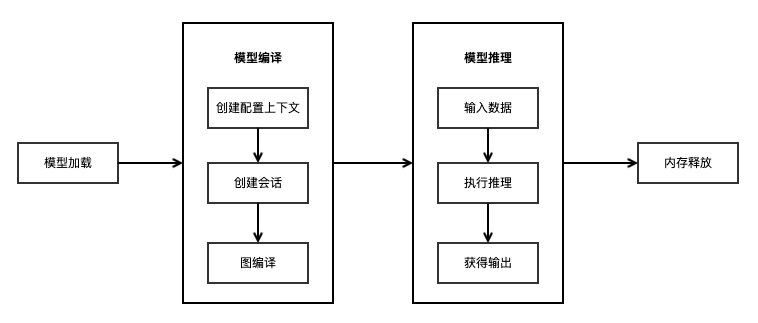

# 体验C++极简推理Demo

[](https://gitee.com/mindspore/docs/blob/r2.6.0rc1/docs/lite/docs/source_zh_cn/infer/quick_start_cpp.md)

> MindSpore已经统一了端边云推理API，如您想继续使用MindSpore Lite独立API进行端侧推理，可以参考[此文档](https://www.mindspore.cn/lite/docs/zh-CN/r1.3/quick_start/quick_start_cpp.html)。

## 概述

本教程提供了MindSpore Lite执行推理的示例程序，通过随机输入、执行推理、打印推理结果的方式，演示了C++进行端侧推理的基本流程，用户能够快速了解MindSpore Lite执行推理相关API的使用。本教程通过随机生成的数据作为输入数据，执行MobileNetV2模型的推理，打印获得输出数据。相关代码放置在[mindspore/lite/examples/quick_start_cpp](https://gitee.com/mindspore/mindspore/tree/v2.6.0-rc1/mindspore/lite/examples/quick_start_cpp)目录。

使用MindSpore Lite执行推理主要包括以下步骤：

1. 模型读取：从文件系统中读取由[模型转换工具](https://www.mindspore.cn/lite/docs/zh-CN/r2.6.0rc1/converter/converter_tool.html)转换得到的`.ms`模型。
2. 创建配置上下文：创建配置上下文[Context](https://www.mindspore.cn/lite/api/zh-CN/r2.6.0rc1/api_cpp/mindspore.html#context)，保存需要的一些基本配置参数，用于指导模型编译和模型执行。
3. 模型创建、加载与编译：执行推理之前，需要调用[Model](https://www.mindspore.cn/lite/api/zh-CN/r2.6.0rc1/api_cpp/mindspore.html#model)的[Build](https://www.mindspore.cn/lite/api/zh-CN/r2.6.0rc1/api_cpp/mindspore.html#build)接口进行模型加载和模型编译，并将上一步得到的Context配置到Model中。模型加载阶段将文件缓存解析成运行时的模型。模型编译阶段主要进行算子选型调度、子图切分等过程，该阶段会耗费较多时间，所以建议Model创建一次，编译一次，多次推理。
4. 输入数据：模型执行之前需要向`输入Tensor`中填充数据。
5. 执行推理：使用[Model](https://www.mindspore.cn/lite/api/zh-CN/r2.6.0rc1/api_cpp/mindspore.html#model)的[Predict](https://www.mindspore.cn/lite/api/zh-CN/r2.6.0rc1/api_cpp/mindspore.html#predict)接口进行模型推理。
6. 获得输出：模型执行结束之后，可以通过`输出Tensor`得到推理结果。
7. 释放内存：无需使用MindSpore Lite推理框架时，需要释放已创建的[Model](https://www.mindspore.cn/lite/api/zh-CN/r2.6.0rc1/api_cpp/mindspore.html#model)。



> 如需查看MindSpore Lite高级用法，请参考[使用Runtime执行推理（C++）](https://www.mindspore.cn/lite/docs/zh-CN/r2.6.0rc1/infer/runtime_cpp.html)。

## 构建与运行

### Linux X86

- 环境要求

    - 系统环境：Linux x86_64，推荐使用Ubuntu 18.04.02LTS
    - 编译依赖：
        - [CMake](https://cmake.org/download/) >= 3.18.3
        - [GCC](https://gcc.gnu.org/releases.html) >= 7.3.0

- 编译构建

  在`mindspore/lite/examples/quick_start_cpp`目录下执行[build脚本](https://gitee.com/mindspore/mindspore/blob/v2.6.0-rc1/mindspore/lite/examples/quick_start_cpp/build.sh)，将自动下载MindSpore Lite推理框架库以及文模型文件并编译Demo。

  ```bash
  bash build.sh
  ```

  > 若使用该build脚本下载MindSpore Lite推理框架失败，请手动下载硬件平台为CPU、操作系统为Ubuntu-x64的MindSpore Lite 模型推理框架[mindspore-lite-{version}-linux-x64.tar.gz](https://www.mindspore.cn/lite/docs/zh-CN/r2.6.0rc1/use/downloads.html)，将解压后`runtime/lib`目录下的`libmindspore-lite.so`文件拷贝到`mindspore/lite/examples/quick_start_cpp/lib`目录、`runtime/include`目录里的文件拷贝到`mindspore/lite/examples/quick_start_cpp/include`目录下、`runtime/third_party/glog/`目录下的`libmindspore_glog.so.0`文件拷贝到`mindspore/lite/examples/quick_start_cpp/lib`目录下的`libmindspore_glog.so`文件。
  >
  > 若MobileNetV2模型下载失败，请手动下载相关模型文件[mobilenetv2.ms](https://download.mindspore.cn/model_zoo/official/lite/quick_start/mobilenetv2.ms)，并将其拷贝到`mindspore/lite/examples/quick_start_cpp/model`目录。
  >
  > 通过手动下载并且将文件放到指定位置后，需要再次执行build.sh脚本才能完成编译构建。

- 执行推理

  编译构建后，进入`mindspore/lite/examples/quick_start_cpp/build`目录，并执行以下命令，体验MindSpore Lite推理MobileNetV2模型。

  ```bash
  ./mindspore_quick_start_cpp ../model/mobilenetv2.ms
  ```

  执行完成后将能得到如下结果，打印输出Tensor的名称、输出Tensor的大小，输出Tensor的数量以及前50个数据：

  ```text
  tensor name is:Softmax-65 tensor size is:4004 tensor elements num is:1001
  output data is:1.74225e-05 1.15919e-05 2.02728e-05 0.000106485 0.000124295 0.00140576 0.000185107 0.000762011 1.50996e-05 5.91942e-06 6.61469e-06 3.72883e-06 4.30761e-06 2.38897e-06 1.5163e-05 0.000192663 1.03767e-05 1.31953e-05 6.69638e-06 3.17411e-05 4.00895e-06 9.9641e-06 3.85127e-06 6.25101e-06 9.08853e-06 1.25043e-05 1.71761e-05 4.92751e-06 2.87637e-05 7.46446e-06 1.39375e-05 2.18824e-05 1.08861e-05 2.5007e-06 3.49876e-05 0.000384547 5.70778e-06 1.28909e-05 1.11038e-05 3.53906e-06 5.478e-06 9.76608e-06 5.32172e-06 1.10386e-05 5.35474e-06 1.35796e-05 7.12652e-06 3.10017e-05 4.34154e-06 7.89482e-05 1.79441e-05
  ```

### Windows

- 环境要求

    - 系统环境：Windows 7，Windows 10；64位。
    - 编译依赖：
        - [CMake](https://cmake.org/download/) >= 3.18.3
        - [MinGW GCC](https://sourceforge.net/projects/mingw-w64/files/ToolchainstargettingWin64/PersonalBuilds/mingw-builds/7.3.0/threads-posix/seh/x86_64-7.3.0-release-posix-seh-rt_v5-rev0.7z/download) = 7.3.0

- 编译构建

    - 库下载：请手动下载硬件平台为CPU、操作系统为Windows-x64的MindSpore Lite模型推理框架[mindspore-lite-{version}-win-x64.zip](https://www.mindspore.cn/lite/docs/zh-CN/r2.6.0rc1/use/downloads.html)，将解压后`runtime\lib`目录下的所有文件拷贝到`mindspore\lite\examples\quick_start_cpp\lib`工程目录、`runtime\include`目录里的文件拷贝到`mindspore\lite\examples\quick_start_cpp\include`工程目录下。（注意：工程项目下的`lib`、`include`目录需手工创建）

    - 模型下载：请手动下载相关模型文件[mobilenetv2.ms](https://download.mindspore.cn/model_zoo/official/lite/quick_start/mobilenetv2.ms)，并将其拷贝到`mindspore\lite\examples\quick_start_cpp\model`目录。

    - 编译：在`mindspore\lite\examples\quick_start_cpp`目录下执行[build脚本](https://gitee.com/mindspore/mindspore/blob/v2.6.0-rc1/mindspore/lite/examples/quick_start_cpp/build.bat)，将能够自动下载相关文件并编译Demo。

  ```bash
  call build.bat
  ```

- 执行推理

  编译构建后，进入`mindspore\lite\examples\quick_start_cpp\build`目录，并执行以下命令，体验MindSpore Lite推理MobileNetV2模型。

  ```bash
  set PATH=..\lib;%PATH%
  call mindspore_quick_start_cpp.exe ..\model\mobilenetv2.ms
  ```

  执行完成后将能得到如下结果，打印输出Tensor的名称、输出Tensor的大小，输出Tensor的数量以及前50个数据：

  ```text
  tensor name is:Softmax-65 tensor size is:4004 tensor elements num is:1001
  output data is:1.74225e-05 1.15919e-05 2.02728e-05 0.000106485 0.000124295 0.00140576 0.000185107 0.000762011 1.50996e-05 5.91942e-06 6.61469e-06 3.72883e-06 4.30761e-06 2.38897e-06 1.5163e-05 0.000192663 1.03767e-05 1.31953e-05 6.69638e-06 3.17411e-05 4.00895e-06 9.9641e-06 3.85127e-06 6.25101e-06 9.08853e-06 1.25043e-05 1.71761e-05 4.92751e-06 2.87637e-05 7.46446e-06 1.39375e-05 2.18824e-05 1.08861e-05 2.5007e-06 3.49876e-05 0.000384547 5.70778e-06 1.28909e-05 1.11038e-05 3.53906e-06 5.478e-06 9.76608e-06 5.32172e-06 1.10386e-05 5.35474e-06 1.35796e-05 7.12652e-06 3.10017e-05 4.34154e-06 7.89482e-05 1.79441e-05
  ```

## 配置CMake

以下是通过CMake集成`libmindspore-lite.a`静态库时的示例代码。

> 集成`libmindspore-lite.a`静态库时需要将`-Wl,--whole-archive`的选项传递给链接器。
>
> 由于在编译MindSpore Lite的时候增加了`-fstack-protector-strong`栈保护的编译选项，所以在Windows平台上还需要链接MinGW中的`ssp`库。
>
> 由于在编译MindSpore Lite的时候增加了对so库文件处理的支持，所以在Linux平台上还需要链接`dl`库。

```cmake
cmake_minimum_required(VERSION 3.18.3)
project(QuickStartCpp)

if(CMAKE_CXX_COMPILER_ID STREQUAL "GNU" AND CMAKE_CXX_COMPILER_VERSION VERSION_LESS 7.3.0)
    message(FATAL_ERROR "GCC version ${CMAKE_CXX_COMPILER_VERSION} must not be less than 7.3.0")
endif()

# Add directory to include search path
include_directories(${CMAKE_CURRENT_SOURCE_DIR})

# Add directory to linker search path
link_directories(${CMAKE_CURRENT_SOURCE_DIR}/lib)

file(GLOB_RECURSE QUICK_START_CXX ${CMAKE_CURRENT_SOURCE_DIR}/*.cc)
add_executable(mindspore_quick_start_cpp ${QUICK_START_CXX})

target_link_libraries(
        mindspore_quick_start_cpp
        -Wl,--whole-archive libmindspore-lite.a -Wl,--no-whole-archive
        pthread
)

# Due to the increased compilation options for stack protection,
# it is necessary to target link ssp library when Use the static library in Windows.
if(WIN32)
    target_link_libraries(
            mindspore_quick_start_cpp
            ssp
    )
else()
    target_link_libraries(
            mindspore_quick_start_cpp
            dl
    )
endif()
```

## 模型读取

模型读取需要从文件系统中读取MindSpore Lite模型，存放在内存缓冲区。

```c++
// Read model file.
size_t size = 0;
char *model_buf = ReadFile(model_path.c_str(), &size);
if (model_buf == nullptr) {
  std::cerr << "Read model file failed." << std::endl;
  return -1;
}
```

## 创建配置上下文

```c++
// Create and init context, add CPU device info
auto context = std::make_shared<mindspore::Context>();
if (context == nullptr) {
  std::cerr << "New context failed." << std::endl;
  return -1;
}
auto &device_list = context->MutableDeviceInfo();
auto device_info = std::make_shared<mindspore::CPUDeviceInfo>();
if (device_info == nullptr) {
  std::cerr << "New CPUDeviceInfo failed." << std::endl;
  return -1;
}
device_list.push_back(device_info);
```

## 模型创建加载与编译

模型加载与编译可以调用[Model](https://www.mindspore.cn/lite/api/zh-CN/r2.6.0rc1/api_cpp/mindspore.html#model)的复合[Build](https://www.mindspore.cn/lite/api/zh-CN/r2.6.0rc1/api_cpp/mindspore.html#build)接口，直接从文件缓存加载、编译得到运行时的模型。

```c++
// Create model
auto model = new (std::nothrow) mindspore::Model();
if (model == nullptr) {
  std::cerr << "New Model failed." << std::endl;
  return -1;
}
// Build model
auto build_ret = model->Build(model_buf, size, mindspore::kMindIR, context);
delete[](model_buf);
if (build_ret != mindspore::kSuccess) {
  std::cerr << "Build model error " << build_ret << std::endl;
  return -1;
}
```

也可以分别调用[Serialization](https://www.mindspore.cn/lite/api/zh-CN/r2.6.0rc1/api_cpp/mindspore.html#serialization)的[Load](https://www.mindspore.cn/lite/api/zh-CN/r2.6.0rc1/api_cpp/mindspore.html#load)接口去加载模型得到[Graph](https://www.mindspore.cn/lite/api/zh-CN/r2.6.0rc1/api_cpp/mindspore.html#graph)，调用[Model](https://www.mindspore.cn/lite/api/zh-CN/r2.6.0rc1/api_cpp/mindspore.html#model)的[Build](https://www.mindspore.cn/lite/api/zh-CN/r2.6.0rc1/api_cpp/mindspore.html#build)去构建模型。

```c++
// Load graph.
mindspore::Graph graph;
auto load_ret = mindspore::Serialization::Load(model_buf, size, mindspore::kMindIR, &graph);
delete[](model_buf);
if (load_ret != mindspore::kSuccess) {
  std::cerr << "Load graph file failed." << std::endl;
  return -1;
}

// Create model
auto model = new (std::nothrow) mindspore::Model();
if (model == nullptr) {
  std::cerr << "New Model failed." << std::endl;
  return -1;
}
// Build model
mindspore::GraphCell graph_cell(graph);
auto build_ret = model->Build(graph_cell, context);
if (build_ret != mindspore::kSuccess) {
  delete model;
  std::cerr << "Build model error " << build_ret << std::endl;
  return -1;
}
```

## 模型推理

模型推理主要包括输入数据、执行推理、获得输出等步骤，其中本示例中的输入数据是通过随机数据构造生成，最后将执行推理后的输出结果打印出来。

```c++
// Get Input
auto inputs = model->GetInputs();
// Generate random data as input data.
auto ret = GenerateInputDataWithRandom(inputs);
if (ret != mindspore::kSuccess) {
  delete model;
  std::cerr << "Generate Random Input Data failed." << std::endl;
  return -1;
}
// Get Output
auto outputs = model->GetOutputs();

// Model Predict
auto predict_ret = model->Predict(inputs, &outputs);
if (predict_ret != mindspore::kSuccess) {
  delete model;
  std::cerr << "Predict model error " << predict_ret << std::endl;
  return -1;
}

// Print Output Tensor Data.
for (auto tensor : outputs) {
  std::cout << "tensor name is:" << tensor.Name() << " tensor size is:" << tensor.DataSize()
            << " tensor elements num is:" << tensor.ElementNum() << std::endl;
  auto out_data = reinterpret_cast<const float *>(tensor.Data().get());
  std::cout << "output data is:";
  for (int i = 0; i < tensor.ElementNum() && i <= 50; i++) {
    std::cout << out_data[i] << " ";
  }
  std::cout << std::endl;
}
```

## 内存释放

无需使用MindSpore Lite推理框架时，需要释放已经创建的`Model`。

```c++
// Delete model.
delete model;
```
