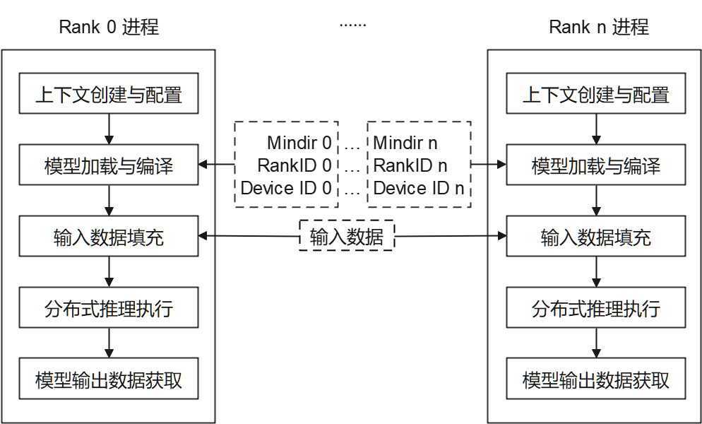

# 使用Python接口执行云侧分布式推理

[](https://gitee.com/mindspore/docs/blob/r2.6.0rc1/docs/lite/docs/source_zh_cn/mindir/runtime_distributed_python.md)

## 概述

针对大规模神经网络模型参数多、无法完全加载至单设备推理的场景，可利用多设备进行分布式推理。本教程介绍如何使用[Python接口](https://www.mindspore.cn/lite/api/zh-CN/r2.6.0rc1/mindspore_lite.html)执行MindSpore Lite云侧分布式推理。云侧分布式推理与[云侧单卡推理](https://www.mindspore.cn/lite/docs/zh-CN/r2.6.0rc1/mindir/runtime_python.html)流程大致相同，可以相互参考。MindSpore Lite云侧分布式推理针对性能方面具有更多的优化。

MindSpore Lite云侧分布式推理仅支持在Linux环境部署运行，支持的设备类型为Atlas训练系列产品和Nvidia GPU。如下图所示，当前通过多进程方式启动分布式推理，每个进程对应通信集合中的一个`Rank`，对各自已切分的模型进行加载、编译与执行，每个进程输入数据相同。



每个进程主要包括以下步骤：

1. 模型读取：通过MindSpore切分，并导出分布式MindIR模型，MindIR模型数量与设备数相同，用于加载到各个设备进行推理。
2. 上下文创建与配置：创建并配置上下文[Context](https://www.mindspore.cn/lite/api/zh-CN/r2.6.0rc1/mindspore_lite/mindspore_lite.Context.html#mindspore_lite.Context)，保存分布式推理参数，用于指导分布式模型编译和模型执行。
3. 模型加载与编译：使用[Model.build_from_file](https://www.mindspore.cn/lite/api/zh-CN/r2.6.0rc1/mindspore_lite/mindspore_lite.Model.html#mindspore_lite.Model.build_from_file)接口进行模型加载和模型编译。模型加载阶段将文件缓存解析成运行时的模型。模型编译阶段将前端计算图优化为高性能后端计算图，该过程耗时较长，建议一次编译，多次推理。
4. 模型输入数据填充。
5. 分布式推理执行：使用[Model.predict](https://www.mindspore.cn/lite/api/zh-CN/r2.6.0rc1/mindspore_lite/mindspore_lite.Model.html#mindspore_lite.Model.predict)接口进行模型分布式推理。
6. 模型输出数据获取。
7. 多进程执行分布式推理脚本。

## 准备工作

1. 下载云侧分布式推理python示例代码，请选择设备类型：[Ascend](https://gitee.com/mindspore/mindspore/tree/v2.6.0-rc1/mindspore/lite/examples/cloud_infer/ascend_ge_distributed_python)或[GPU](https://gitee.com/mindspore/mindspore/tree/v2.6.0-rc1/mindspore/lite/examples/cloud_infer/gpu_trt_distributed_python)。后文将该目录称为示例代码目录。

2. 通过MindSpore切分，并导出分布式MindIR模型，将其存放至示例代码目录。如需快速体验，可下载已切分的两个Matmul模型文件[Matmul0.mindir](https://download.mindspore.cn/model_zoo/official/lite/quick_start/Matmul0.mindir)、[Matmul1.mindir](https://download.mindspore.cn/model_zoo/official/lite/quick_start/Matmul1.mindir)。

3. 对于Ascend设备类型，通过hccl_tools.py按照需要生成组网信息文件，存放至示例代码目录，并将该文件路径填入示例代码目录下配置文件 `config_file.ini` 中。

4. 下载MindSpore Lite云侧推理安装包[mindspore-lite-{version}-linux-{arch}.whl](https://www.mindspore.cn/lite/docs/zh-CN/r2.6.0rc1/use/downloads.html)，存放至示例代码目录，并通过`pip`工具安装。

后续章节将结合代码讲述MindSpore Lite云侧分布式推理主要步骤，完整代码请参考示例代码目录下`main.py`。

## 创建上下文配置

上下文配置保存了所需基本配置参数与分布式推理参数，用于指导模型编译和模型分布式执行。如下示例代码演示如何通过[Context](https://www.mindspore.cn/lite/api/zh-CN/r2.6.0rc1/mindspore_lite/mindspore_lite.Context.html#mindspore_lite.Context)创建上下文。

```python
# init context
context = mslite.Context()
```

分布式推理场景下支持Ascend、Nvidia GPU，可通过[Context.target](https://www.mindspore.cn/lite/api/zh-CN/r2.6.0rc1/mindspore_lite/mindspore_lite.Context.html#mindspore_lite.Context.target)指定运行的设备。

### 配置Ascend设备上下文

当设备类型为Ascend时(目前分布式推理支持Atlas训练系列产品)，设置[Context.target](https://www.mindspore.cn/lite/api/zh-CN/r2.6.0rc1/mindspore_lite/mindspore_lite.Context.html#mindspore_lite.Context.target)为`Ascend`，并通过如下方式设置`DeviceID`、`RankID`。由于Ascend提供多个推理引擎后端，当前仅`ge`后端支持分布式推理，通过`ascend.provider`指定Ascend推理引擎后端为`ge`。示例代码如下：

```python
# set Ascend target and distributed info
context.target = ["Ascend"]
context.ascend.device_id = args.device_id
context.ascend.rank_id = args.rank_id
context.ascend.provider = "ge"
```

### 配置使用GPU设备上下文

当执行的后端为GPU时，设置[Context.target](https://www.mindspore.cn/lite/api/zh-CN/r2.6.0rc1/mindspore_lite/mindspore_lite.Context.html#mindspore_lite.Context.target)为`gpu`。GPU设备的分布式推理多进程应用由mpi拉起，mpi会自动设置每个进程的`RankID`，用户只需在环境变量中指定`CUDA_VISIBLE_DEVICES`，无需指定组网信息文件。因此，每个进程的`RankID`可以当作`DeviceID`使用。另外，GPU也提供多个推理引擎后端，当前仅`tensorrt`后端支持分布式推理，通过`gpu.provider`指定GPU推理引擎后端为`tensorrt`。示例代码如下：

```python
# set GPU target and distributed info
context.target = ["gpu"]
context.gpu.device_id = context.gpu.rank_id
context.gpu.provider = "tensorrt"
```

## 模型创建、加载与编译

与[MindSpore Lite云侧单卡推理](https://www.mindspore.cn/lite/docs/zh-CN/r2.6.0rc1/mindir/runtime_python.html)一致，分布式推理的主入口是[Model](https://www.mindspore.cn/lite/api/zh-CN/r2.6.0rc1/mindspore_lite/mindspore_lite.Model.html#mindspore_lite.Model)接口，可进行模型加载、编译和执行。创建[Model](https://www.mindspore.cn/lite/api/zh-CN/r2.6.0rc1/mindspore_lite/mindspore_lite.Model.html#mindspore_lite.Model)并调用[Model.build_from_file](https://www.mindspore.cn/lite/api/zh-CN/r2.6.0rc1/mindspore_lite/mindspore_lite.Model.html#mindspore_lite.Model.build_from_file)接口来实现模型加载与模型编译，示例代码如下：

```python
# create Model and build Model
model = mslite.Model()
model.build_from_file(model_path, mslite.ModelType.MINDIR, context, args.config_file)
```

## 模型输入数据填充

首先，使用[Model.get_inputs](https://www.mindspore.cn/lite/api/zh-CN/r2.6.0rc1/mindspore_lite/mindspore_lite.Model.html#mindspore_lite.Model.get_inputs)方法获取所有输入[Tensor](https://www.mindspore.cn/lite/api/zh-CN/r2.6.0rc1/mindspore_lite/mindspore_lite.Tensor.html#mindspore_lite.Tensor)，利用相关接口将Host数据填入。示例代码如下：

```python
# set model input as ones
inputs = model.get_inputs()
for input_i in inputs:
    input_i.set_data_from_numpy(np.ones(input_i.shape, dtype=np.float32))
```

也可通过以下方式构造MindSpore Lite输入。

```python
# np_inputs is a list or tuple of numpy array
inputs = [mslite.Tensor(np_input) for np_input in np_inputs]
```

## 分布式推理执行

调用[Model.predict](https://www.mindspore.cn/lite/api/zh-CN/r2.6.0rc1/mindspore_lite/mindspore_lite.Model.html#mindspore_lite.Model.predict)接口执行分布式推理，示例代码如下：

```python
# execute inference
outputs = model.predict(inputs)
```

## 模型输出数据获取

模型输出数据保存在上一步定义的输出[Tensor](https://www.mindspore.cn/lite/api/zh-CN/r2.6.0rc1/mindspore_lite/mindspore_lite.Tensor.html#mindspore_lite.Tensor)中，通过相关接口可访问输出数据。如下示例代码展示了如何访问输出数据并打印。

```python
# get output and print
for output in outputs:
    name = output.name.rstrip()
    data_size = output.data_size
    element_num = output.element_num
    print("tensor's name is:%s data size is:%s tensor elements num is:%s" %
          (name, data_size, element_num))
    data = output.get_data_to_numpy()
    data = data.flatten()
    print("output data is:", end=" ")
    for i in range(10):
        print(data[i], end=" ")
    print("")
```

## 执行分布式推理样例

按照如下多进程方式启动分布式推理。完整运行命令请参考示例代码目录下`run.sh`。运行成功后，将打印每个输出`Tensor`的名称、数据大小、元素个数与前10个元素值。

```bash
# for Ascend, run the executable file for each rank using shell commands
python3 ./ascend_ge_distributed.py --model_path=/your/path/to/Matmul0.mindir --device_id=0 --rank_id=0 --config_file=./config_file.ini &
python3 ./ascend_ge_distributed.py --model_path=/your/path/to/Matmul1.mindir --device_id=1 --rank_id=1 --config_file=./config_file.ini

# for GPU, run the executable file for each rank using mpi
RANK_SIZE=2
mpirun -n $RANK_SIZE python3 ./main.py --model_path=/your/path/to/Matmul.mindir
```

## 多模型共享权重

Ascend设备图编译等级为O2的场景下，单个卡可以部署多个模型，部署到同一张卡的模型可以共享权重，详情可参考[高级用法-多模型共享权重](https://www.mindspore.cn/lite/docs/zh-CN/r2.6.0rc1/mindir/runtime_cpp.html#%E5%A4%9A%E6%A8%A1%E5%9E%8B%E5%85%B1%E4%BA%AB%E6%9D%83%E9%87%8D)。
