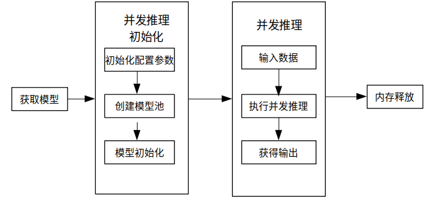

# 使用Python接口执行并发推理

[](https://gitee.com/mindspore/docs/blob/r2.6.0rc1/docs/lite/docs/source_zh_cn/mindir/runtime_parallel_python.md)

## 概述

MindSpore Lite提供多model并发推理接口[ModelParallelRunner](https://mindspore.cn/lite/api/zh-CN/r2.6.0rc1/mindspore_lite/mindspore_lite.ModelParallelRunner.html)，多model并发推理现支持Atlas 200/300/500推理产品、Atlas推理系列产品、Atlas训练系列产品、Nvidia GPU、CPU后端。

通过MindSpore导出`mindir`模型，或者由[模型转换工具](https://www.mindspore.cn/lite/docs/zh-CN/r2.6.0rc1/mindir/converter_tool.html)转换获得`mindir`模型后，即可在Runtime中执行模型的并发推理流程。本教程介绍如何使用[Python接口](https://mindspore.cn/lite/api/zh-CN/r2.6.0rc1/mindspore_lite.html)执行多model并发推理。

使用MindSpore Lite并发推理主要包括以下步骤：

1. 准备工作：安装MindSpore Lite云侧推理Python包。
2. 创建配置上下文：设置上下文[Context.parallel](https://mindspore.cn/lite/api/zh-CN/r2.6.0rc1/mindspore_lite/mindspore_lite.Context.html#mindspore_lite.Context)属性，用于配置多model并发。
3. 并发模型加载与编译：执行并发推理之前，需要调用[ModelParallelRunner](https://mindspore.cn/lite/api/zh-CN/r2.6.0rc1/mindspore_lite/mindspore_lite.ModelParallelRunner.html)的[build_from_file](https://mindspore.cn/lite/api/zh-CN/r2.6.0rc1/mindspore_lite/mindspore_lite.ModelParallelRunner.html#mindspore_lite.ModelParallelRunner.build_from_file)接口进行并发模型加载和并发模型编译。
4. 设置并发推理任务：创建多线程，绑定并发推理任务。
5. 执行并发推理：使用ModelParallelRunner的Predict接口进行多Model并发推理。
6. 释放内存：无需使用MindSpore Lite并发推理框架时，需要释放自己创建的ModelParallelRunner以及相关的Tensor。



## 准备工作

1. 以下代码样例来自于[使用Python接口执行云侧推理示例代码](https://gitee.com/mindspore/mindspore/tree/v2.6.0-rc1/mindspore/lite/examples/cloud_infer/quick_start_parallel_python)。

2. 通过MindSpore导出MindIR模型，或者由[模型转换工具](https://www.mindspore.cn/lite/docs/zh-CN/r2.6.0rc1/mindir/converter_tool.html)转换获得MindIR模型，并将其拷贝到`mindspore/lite/examples/cloud_infer/quick_start_parallel_python`目录。可以下载MobileNetV2模型文件[mobilenetv2.mindir](https://download.mindspore.cn/model_zoo/official/lite/quick_start/mobilenetv2.mindir)和输入数据[input.bin](https://download.mindspore.cn/model_zoo/official/lite/quick_start/input.bin)。

3. 通过pip安装Python3.7版本的MindSpore Lite云侧推理Python包。

    ```bash
    python -m pip install https://ms-release.obs.cn-north-4.myhuaweicloud.com/${MINDSPORE_LITE_VERSION}/MindSpore/lite/release/centos_x86/cloud_fusion/mindspore_lite-${MINDSPORE_LITE_VERSION}-cp37-cp37m-linux_x86.whl --trusted-host ms-release.obs.cn-north-4.myhuaweicloud.com -i https://pypi.tuna.tsinghua.edu.cn/simple
    ```

### 创建配置上下文

多model并发推理相关的上下文[Context.parallel](https://mindspore.cn/lite/api/zh-CN/r2.6.0rc1/mindspore_lite/mindspore_lite.Context.html#mindspore_lite.Context)属性会保存一些并发推理所需的基本配置参数，用于指导并发model数量以及模型编译和模型执行；

下面示例代码演示了如何设置Context.parallel属性，并配置并发推理的worker数量。

```python
import time
from threading import Thread
import numpy as np
import mindspore_lite as mslite

# the number of threads of one worker.
# WORKERS_NUM * THREAD_NUM should not exceed the number of cores of the machine.
THREAD_NUM = 1

# In parallel inference, the number of workers in one `ModelParallelRunner` in server.
# If you prepare to compare the time difference between parallel inference and serial inference,
# you can set WORKERS_NUM = 1 as serial inference.
WORKERS_NUM = 3

# Simulate 5 clients, and each client sends 2 inference tasks to the server at the same time.
PARALLEL_NUM = 5
TASK_NUM = 2
```

- `THREAD_NUM`：单个worker的线程数量。`WORKERS_NUM * THREAD_NUM`应该小于机器核心数量。

- `WORKERS_NUM`：在服务器端，指定在一个`ModelParallelRunner`中的workers的数量，即执行并发推理的单元。若想对比并发推理和非并发推理的推理时长差异，可以将`WORKERS_NUM`设置为1进行对比。

- `PARALLEL_NUM`：并发数量，即同时在发送推理任务请求的客户端数量。

- `TASK_NUM`：任务数量，即单个客户端发送的推理任务请求的数量。

```python
# Init RunnerConfig and context, and add CPU device info
context = mslite.Context()
context.target = ["cpu"]
context.cpu.thread_num = THREAD_NUM
context.cpu.inter_op_parallel_num = THREAD_NUM
context.parallel.workers_num = WORKERS_NUM
```

> Context的配置方法详细见[Context](https://www.mindspore.cn/lite/docs/zh-CN/r2.6.0rc1/mindir/runtime_python.html#创建配置上下文)。
>
> 多model并发推理不支持FP32类型数据推理，绑核只支持不绑核或者绑大核，不支持绑中核的参数设置，且不支持配置绑核列表。

### 并发模型加载与编译

使用MindSpore Lite执行并发推理时，ModelParallelRunner是并发推理的主入口，调用`ModelParallelRunner`的[build_from_file](https://mindspore.cn/lite/api/zh-CN/r2.6.0rc1/mindspore_lite/mindspore_lite.ModelParallelRunner.html#mindspore_lite.ModelParallelRunner.build_from_file)接口进行并发模型加载和并发模型编译。

```python
# Build ModelParallelRunner from file
model_parallel_runner = mslite.ModelParallelRunner()
model_parallel_runner.build_from_file(model_path="./model/mobilenetv2.mindir", context=context)
```

> 可以不设置context配置参数，表示设置target为cpu的Context，Context带有默认的parallel属性。

### 设置并发推理任务

创建多线程，绑定并发推理任务。推理任务包括向`输入Tensor`中填充数据、使用`ModelParallelRunner`的[predict](https://www.mindspore.cn/lite/api/zh-CN/r2.6.0rc1/mindspore_lite/mindspore_lite.ModelParallelRunner.html#mindspore_lite.ModelParallelRunner.predict)接口进行并发推理和通过`输出Tensor`得到推理结果。

```python
def parallel_runner_predict(parallel_runner, parallel_id):
    """
    One Runner with 3 workers, set model input, execute inference and get output.

    Args:
        parallel_runner (mindspore_lite.ModelParallelRunner): Actuator Supporting Parallel inference.
        parallel_id (int): Simulate which client's task to process
    """

    task_index = 0
    while True:
        if task_index == TASK_NUM:
            break
        task_index += 1
        # Set model input
        inputs = parallel_runner.get_inputs()
        in_data = np.fromfile("./model/input.bin", dtype=np.float32)
        inputs[0].set_data_from_numpy(in_data)
        once_start_time = time.time()
        # Execute inference
        outputs = parallel_runner.predict(inputs)
        once_end_time = time.time()
        print("parallel id: ", parallel_id, " | task index: ", task_index, " | run once time: ",
              once_end_time - once_start_time, " s")
        # Get output
        for output in outputs:
            tensor_name = output.name.rstrip()
            data_size = output.data_size
            element_num = output.element_num
            print("tensor name is:%s tensor size is:%s tensor elements num is:%s" % (tensor_name,
                                                                                     data_size,
                                                                                     element_num))
            data = output.get_data_to_numpy()
            data = data.flatten()
            print("output data is:", end=" ")
            for j in range(5):
                print(data[j], end=" ")
            print("")


# The server creates 5 threads to store the inference tasks of 5 clients.
threads = []
total_start_time = time.time()
for i in range(PARALLEL_NUM):
    threads.append(Thread(target=parallel_runner_predict, args=(model_parallel_runner, i,)))
```

### 执行并发推理

启动多线程，执行配置好的并发推理任务。执行过程中，打印并发推理中的单次推理耗时和推理结果，结束线程后打印并发推理总耗时。

```python
# Start threads to perform parallel inference.
for th in threads:
    th.start()
for th in threads:
    th.join()
total_end_time = time.time()
print("total run time: ", total_end_time - total_start_time, " s")
```

## 一键配置Python环境

在[mindspore/lite/examples/cloud_infer/quick_start_parallel_python](https://gitee.com/mindspore/mindspore/tree/v2.6.0-rc1/mindspore/lite/examples/cloud_infer/quick_start_parallel_python)目录下执行lite-server-cpu-pip.sh脚本。该脚本会安装python、pip、numpy以及wheel，下载模型文件和模型输入数据，重新安装MindSpore Lite whl包，检查MindSpore Lite whl包安装情况。

```bash
bash lite-server-cpu-pip.sh
```

## 执行Demo

一键安装后，在[mindspore/lite/examples/cloud_infer/quick_start_parallel_python](https://gitee.com/mindspore/mindspore/tree/v2.6.0-rc1/mindspore/lite/examples/cloud_infer/quick_start_parallel_python)目录，执行以下命令，体验MindSpore Lite并发推理MobileNetV2模型。

```bash
python quick_start_parallel_python.py
```

执行完成后将能得到如下结果，打印每个并发推理进程的id、单次推理时间、输出Tensor的名称、输出Tensor的数据大小、输出Tensor的元素数量以及前5个数据和并发推理总时间。

```bash
parallel id:  1  | task index:  1  | run once time:  0.0703895092010498  s
tensor name is:shape1 tensor size is:4000 tensor elements num is:1000
output data is: 5.3937547e-05 0.00037763786 0.00034193686 0.00037316754 0.00022436169
parallel id:  3  | task index:  1  | run once time:  0.08791518211364746  s
tensor name is:shape1 tensor size is:4000 tensor elements num is:1000
output data is: 5.3937547e-05 0.00037763786 0.00034193686 0.00037316754 0.00022436169
parallel id:  2  | task index:  1  | run once time:  0.0899653434753418  s
tensor name is:shape1 tensor size is:4000 tensor elements num is:1000
output data is: 5.3937547e-05 0.00037763786 0.00034193686 0.00037316754 0.00022436169
parallel id:  0  | task index:  1  | run once time:  0.09056544303894043  s
tensor name is:shape1 tensor size is:4000 tensor elements num is:1000
output data is: 5.3937547e-05 0.00037763786 0.00034193686 0.00037316754 0.00022436169
parallel id:  4  | task index:  1  | run once time:  0.10554099082946777  s
tensor name is:shape1 tensor size is:4000 tensor elements num is:1000
output data is: 5.3937547e-05 0.00037763786 0.00034193686 0.00037316754 0.00022436169
parallel id:  3  | task index:  2  | run once time:  0.01802825927734375  s
tensor name is:shape1 tensor size is:4000 tensor elements num is:1000
output data is: 5.3937547e-05 0.00037763786 0.00034193686 0.00037316754 0.00022436169
parallel id:  1  | task index:  2  | run once time:  0.03823208808898926  s
tensor name is:shape1 tensor size is:4000 tensor elements num is:1000
output data is: 5.3937547e-05 0.00037763786 0.00034193686 0.00037316754 0.00022436169
parallel id:  2  | task index:  2  | run once time:  0.03249311447143555  s
tensor name is:shape1 tensor size is:4000 tensor elements num is:1000
output data is: 5.3937547e-05 0.00037763786 0.00034193686 0.00037316754 0.00022436169
parallel id:  4  | task index:  2  | run once time:  0.01858806610107422  s
tensor name is:shape1 tensor size is:4000 tensor elements num is:1000
output data is: 5.3937547e-05 0.00037763786 0.00034193686 0.00037316754 0.00022436169
parallel id:  0  | task index:  2  | run once time:  0.0355989933013916  s
tensor name is:shape1 tensor size is:4000 tensor elements num is:1000
output data is: 5.3937547e-05 0.00037763786 0.00034193686 0.00037316754 0.00022436169
total run time:  0.13214898109436035  s
```

