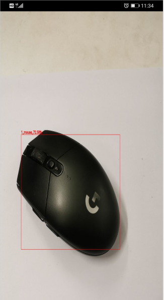

# 目标检测模型

## 目标检测介绍

目标检测可以识别出图片中的对象和该对象在图片中的位置。 如：对下图使用目标检测模型的输出如下表所示，使用矩形框识别图中目标对象的位置并且标注出目标对象类别的概率，其中坐标中的4个数字分别为Xmin，Ymin,，Xmax,，Ymax；概率表示反应被检测物理的可信程度。

| 类别  | 概率 | 坐标             |
| ----- | ---- | ---------------- |
| mouse | 0.78 | [10, 25, 35, 43] |

使用MindSpore Lite实现目标检测的[示例代码](https://gitee.com/mindspore/models/tree/r2.0/official/lite/object_detection)。

## 目标检测模型列表

下表是使用MindSpore Lite推理的部分目标检测模型的数据。

> 下表的性能是在mate30手机上测试的。

| 模型名称               | 大小(Mb) | mAP(IoU=0.50:0.95) | CPU 4线程时延(ms) |
|-----------------------| :----------: | :----------: | :-----------: |
| [MobileNetv2-SSD](https://download.mindspore.cn/model_zoo/official/lite/ssd_mobilenetv2_lite/ssd.ms) | 16.7 | 0.22 | 25.4 |
| [GhostNet-SSD](https://download.mindspore.cn/model_zoo/official/lite/ssd_ghostnet_lite/ssd.ms) | 25.7 | 0.24 | 24.1 |
