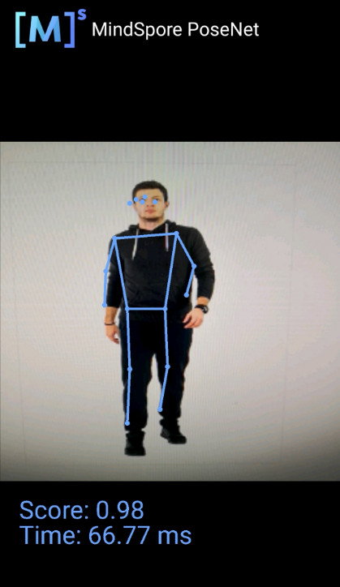

# 骨骼检测模型

## 骨骼检测介绍

骨骼检测可以识别摄像头中，不同姿势下人体的面部五官与肢体姿势。

使用骨骼检测模型的输出如图：

蓝色标识点检测人体面部的五官分布及上肢、下肢的骨骼走势。此次推理置信分数0.98/1，推理时延66.77ms。

使用MindSpore Lite实现骨骼检测的[示例代码](https://gitee.com/mindspore/models/tree/r1.7/official/lite/posenet)。
