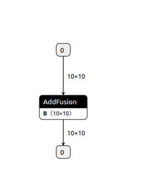
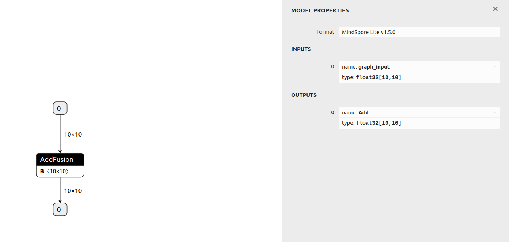
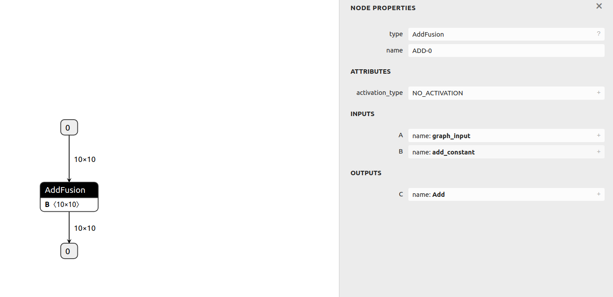
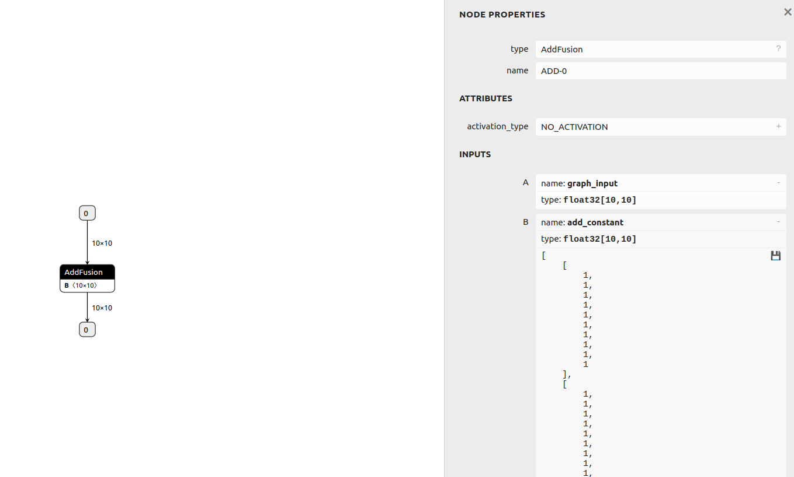

# 一小时入门

`Android` `C++` `全流程` `模型转换` `模型加载` `推理应用` `数据准备` `初级` `中级` `高级`

<a href="https://gitee.com/mindspore/docs/blob/master/docs/lite/docs/source_zh_cn/quick_start/one_hour_introduction.md" target="_blank"></a>

## 概述

本文通过使用MindSpore Lite对一个模型执行推理为例，向大家介绍MindSpore Lite的基础功能和用法。在开始本章的MindSpore Lite使用之旅之前，用户需拥有一个Linux（如Ubuntu/CentOS/EulerOS）或Windows的环境，以便随时操作验证。

通过MindSpore Lite对一个模型执行推理主要包括以下步骤：

1. 转换模型

    在对模型进行推理前，需将用户的模型转换为MindSpore Lite的模型文件。

2. 集成推理

    通过集成发布件内的`libmindspore-lite.so`库，调用相关API，将经过前处理之后的数据传递给框架运行，实现`ms`模型的前向推理。

## Linux篇

本篇以Linux系统环境为例，演示如何进行转换模型和集成推理。

### 模型转换

将用户的模型转换为MindSpore Lite的模型文件。该操作主要包括以下步骤：

1. 下载发布件

    在Windows和Linux的发布件中，都含有转换工具，用户可根据自己的平台，下载使用任一个发布件。
    通过发布件内的`converter_lite`工具，将非`ms`模型转换为MindSpore Lite使用的`ms`模型。
    该操作与平台无关，无论在哪个平台上执行转换，可得到相同的转换后模型文件。

2. 转换模型

    使用发布件内的`converter_lite`转换工具完成模型转换。

#### 下载发布件

用户可在MindSpore官网[下载页面](https://www.mindspore.cn/lite/docs/zh-CN/master/use/downloads.html)，得到各版本的MindSpore Lite发布件。
在本例中，我们选择的是软件系统为Linux、底层架构为x86_64的CPU发布件，以1.5.0版本为例，用户可点击此处直接[下载](https://ms-release.obs.cn-north-4.myhuaweicloud.com/1.5.0/MindSpore/lite/release/linux/mindspore-lite-1.5.0-linux-x64.tar.gz)。
每个发布件的包结构会有不同，本例中，Linux发布件的包结构如下（随着用户对MindSpore Lite各个功能的学习，我们将逐步讲解发布件中文件的作用，在此处，用户对发布件结构有个简略印象即可）：

```text
mindspore-lite-{version}-linux-x64
├── runtime
│   ├── include                        # MindSpore Lite集成开发的API头文件
│   ├── lib
│   │   ├── libminddata-lite.a         # 图像处理静态库
│   │   ├── libminddata-lite.so        # 图像处理动态库
│   │   ├── libmindspore-lite.a        # MindSpore Lite推理框架的静态库
│   │   ├── libmindspore-lite-jni.so   # MindSpore Lite推理框架的JNI动态库
│   │   ├── libmindspore-lite.so       # MindSpore Lite推理框架的动态库
│   │   ├── libmindspore-lite-train.a  # MindSpore Lite训练框架的静态库
│   │   ├── libmindspore-lite-train.so # MindSpore Lite训练框架的动态库
│   │   ├── libmsdeobfuscator-lite.so  # 混淆模型加载动态库文件，需开启`ENABLE_MODEL_OBF`选项。
│   │   └── mindspore-lite-java.jar    # MindSpore Lite推理框架jar包
│   └── third_party
│       └── libjpeg-turbo
└── tools
    ├── benchmark       # 基准测试工具目录
    ├── benchmark_train # 训练模型基准测试工具目录
    ├── codegen         # 代码生成工具目录
    ├── converter       # 模型转换工具目录
    ├── obfuscator      # 模型混淆工具目录
    └── cropper         # 库裁剪工具目录
```

#### 转换模型

解压刚刚下载的发布件，在位于`mindspore-lite-{version}-linux-x64/tools/converter/converter`目录，可以找到`converter_lite`工具。
`converter_lite`模型转换工具提供了离线转换模型功能，支持MindSpore、CAFFE、TensorFlow Lite、TensorFlow、ONNX类型的模型转换。
模型转换步骤如下：

1. 环境设置

    将转换工具需要的动态链接库加入环境变量LD_LIBRARY_PATH。

    ```bash
    export LD_LIBRARY_PATH=${PACKAGE_ROOT_PATH}/tools/converter/lib:${LD_LIBRARY_PATH}
    ```

    ${PACKAGE_ROOT_PATH}是发布件解压后的路径。

2. 进入转换工具所在目录

    执行如下命令，进入转换工具工具所在目录。

    ```bash
    cd ${PACKAGE_ROOT_PATH}/tools/converter/converter
    ```

    ${PACKAGE_ROOT_PATH}是发布件解压后的路径。

3. 转换参数说明

    在使用converter_lite执行转换时，需设定相关参数。本例中用到的相关参数定义如下表1所示。

    下面以各种类型模型的转换命令为例，说明各参数的使用方法。

    - 以Caffe模型`lenet.prototxt`为例，执行转换命令。

        ```bash
        ./converter_lite --fmk=CAFFE --modelFile=lenet.prototxt --weightFile=lenet.caffemodel --outputFile=lenet
        ```

        在转换Caffe模型时，将fmk配置为CAFFE（`--fmk=CAFFE`），同时分别通过modelFile和weightFile参数传入模型结构（lenet.prototxt）、模型权值（lenet.caffemodel）两个文件。
        同时通过outputFile，指定转换后输出的模型名，因未指定路径，生成的模型默认在当前路径，并带有`.ms`后缀，既`lenet.ms`。

    - 以MindSpore、TensorFlow Lite、TensorFlow和ONNX模型为例，执行转换命令。

        - MindSpore模型`lenet.mindir`。

            ```bash
            ./converter_lite --fmk=MINDIR --modelFile=lenet.mindir --outputFile=lenet
            ```

        - TensorFlow Lite模型`lenet.tflite`。

            ```bash
            ./converter_lite --fmk=TFLITE --modelFile=lenet.tflite --outputFile=lenet
            ```

        - TensorFlow模型`lenet.pb`。

            ```bash
            ./converter_lite --fmk=TF --modelFile=lenet.pb --outputFile=lenet
            ```

        - ONNX模型`lenet.onnx`。

            ```bash
            ./converter_lite --fmk=ONNX --modelFile=lenet.onnx --outputFile=lenet
            ```

        在转换各种模型时，将`fmk`配置为模型类型对应的标志符号，同时通过modelFile参数传入模型文件。
        通过outputFile，指定转换后输出的模型名，因未指定路径，生成的模型默认在当前路径，并带有`.ms`后缀，既`lenet.ms`。

4. 执行转换

    用户可使用自己的模型进行测试，也可使用我们提供的TensorFlow Lite小模型进行测试，下载链接[点击此处](https://download.mindspore.cn/model_zoo/official/lite/quick_start/add.tflite)。
    以下载的模型为例，将模型`add.tflite`拷贝到转换工具所在目录，根据上述转换参数的说明，可以知道该模型的转换命令如下：

   ```bash
    ./converter_lite --fmk=TFLITE --modelFile=add.tflite --outputFile=add
    ```

    执行命令后，若转换成功，结果显示如下，并在当前目录生成名为`add.ms`的新模型文件。

    ```text
    CONVERTER RESULT SUCCESS:0
    ```

5. 高级功能

    关于转换工具的更详细说明，可参考[推理模型转换](https://www.mindspore.cn/lite/docs/zh-CN/master/use/converter_tool.html)。

    关于如何使用转换工具实现模型训练后量化，可参考[训练后量化](https://www.mindspore.cn/lite/docs/zh-CN/master/use/post_training_quantization.html)。

    如果用户希望转换后的模型能进行训练，需进行训练模型转换，详细可参考[训练模型转换](https://www.mindspore.cn/lite/docs/zh-CN/master/use/converter_train.html)。

表1：converter_lite参数定义

| 参数                        | 是否必选            | 参数说明                                                    | 取值范围                        |
| --------------------------- | ------------------- | ----------------------------------------------------------- | ------------------------------- |
| `--fmk=<FMK>`               | 是                  | 待转换模型的原始格式。                                      | MINDIR、CAFFE、TFLITE、TF、ONNX |
| `--modelFile=<MODELFILE>`   | 是                  | 待转换模型的路径。                                          | -                               |
| `--outputFile=<OUTPUTFILE>` | 是                  | 转换后模型的路径及模型名，不需加后缀，可自动生成`.ms`后缀。 | -                               |
| `--weightFile=<WEIGHTFILE>` | 转换Caffe模型时必选 | 输入模型weight文件的路径。                                  | -                               |

> - 参数名和参数值之间用等号连接，中间不能有空格。
> - Caffe模型一般分为两个文件：`*.prototxt`模型结构，对应`--modelFile`参数；`*.caffemodel`模型权值，对应`--weightFile`参数。

#### Netron可视化

[Netron](https://github.com/lutzroeder/netron)是一个基于[Electron](http://www.electronjs.org/)平台开发的神经网络模型可视化工具，支持包括MindSpore Lite在内的许多主流AI框架模型的可视化，支持多种平台（Mac、Windows、Linux等）和浏览器在线使用。
使用`Netron`加载MindSpore Lite模型后，可以展示模型的拓扑结构及图、节点的信息等。
本例以浏览器在线使用`Netron`的方式，对上一节转换的模型`add.ms`进行可视化，用户也可以用`Netron`打开自己的模型，对模型进行查看。

1. 用浏览器打开<https://netron.app/>。

2. 等网页打开后，将模型文件`add.ms`拖到网页内，模型被加载打开。

3. 查看模型。

    模型被加载后如下图所示：

    

    可以观察到，模型由一个`AddFusion`算子组成。

    - 查看模型输入和输出

        点击图中的输入节点0或者输出节点0，可以看到下图所示：

        

        最上栏`MODEL PROPERTIES`为模型属性栏，可以观察到该模型的格式为`MindSpore Lite v1.5.0`，表明这是由1.5版本转换工具转换的模型。

        在模型输入`INPUTS`栏，可以看到有一个输入节点，表明模型有一个输入。输入节点名为`graph_input`，数据类型为`float32[10,10]`，即`float32`的`10x10`的张量。

        在输入节点前的`0`，为序号标识，表明该节点为模型输入节点数组中的第0个节点，无其他含义。

        在模型输出`OUTPUTS`栏，可以看到有一个输出节点，表明模型有一个输出。输出节点名为`Add`，数据类型为`float32[10,10]`，即`float32`的`10x10`的张量。

    - 查看算子

        点击图中的`AddFusion`算子，可以看到下图所示：

        

        通过该图，我们可以观察到：

        - 节点算子类型

            在最上栏节点属性`NODE PROPERTIES`中，可以观察到，节点的类型为`AddFusion`，这表明该节点将执行`AddFusion`算子操作。
            在本例中，该算子操作实现了张量之间的加法操作。

        - 节点名字

            在节点属性`NODE PROPERTIES`中，可以观察到，节点名为`ADD-0`。

        - 节点输入

            `INPUTS`栏为算子输入，可以观察到该算子有两个输入，即算子原型定义中的输入A和B。
            输入张量A的名字为`graph_input`，为之前看到的模型输入。
            输入张量B的名字为`add_constant`。

        - 节点输出

            `OUTPUTS`栏为算子输出，可以观察到该算子有一个输出，该输出张量名为`Add`。

    - 查看算子的输入张量值

        点击算子输入张量`graph_input`和`add_constant`右边的加号，可以看到下图所示：

        

        在图中，我们可以看到输入张量的类型、形状、值。
        张量`graph_input`前面已有过介绍，它没有值，为需要用户输入的张量。
        张量`add_constant`的数据类型为`float32[10,10]`，即`float32`的`10x10`的张量，它拥有值，为常量张量，且值都为1。

4. `add.ms`模型的理解。

   通过刚刚的查看，可以知道`add.ms`模型实现了如下计算：通过将输入张量`graph_input`加上全为1的张量`add_constant`，返回计算后的张量`Add`。

### 模型推理

用户需要集成发布件内的`mindspore-lite`库文件，并通过MindSpore Lite头文件中声明的API接口，来进行模型推理。
在进行集成前，用户也可以直接使用随发布件发布的`benchmark`基准测试工具（位于`mindspore-lite-{version}-linux-x64/tools/benchmark`），来进行推理测试。
`benchmark`工具是已集成`mindspore-lite`库的可执行程序，通过命令参数的形式，实现包括推理在内的多种功能。

#### 下载发布件

用户根据模型推理时的系统环境，下载对应的发布件。
在本例中，我们选择的是软件系统为Linux、底层架构为x86_64的CPU发布件，以1.5.0版本为例，用户可点击此处直接[下载](https://ms-release.obs.cn-north-4.myhuaweicloud.com/1.5.0/MindSpore/lite/release/linux/mindspore-lite-1.5.0-linux-x64.tar.gz)。

#### benchmark推理测试

1. 环境设置

    将运行`benchmark`推理时需要的动态链接库加入环境变量LD_LIBRARY_PATH。

    ```bash
    export LD_LIBRARY_PATH=${PACKAGE_ROOT_PATH}/runtime/lib:${LD_LIBRARY_PATH}
    ```

    其中${PACKAGE_ROOT_PATH}是发布件解压后的路径。

2. 进入`benchmark`工具所在目录

    执行如下命令，进入`benchmark`工具所在目录。

    ```bash
    cd ${PACKAGE_ROOT_PATH}/tools/benchmark
    ```

    ${PACKAGE_ROOT_PATH}是发布件解压后的路径。

3. `benchmark`参数说明

    在使用`benchmark`执行转换时，需设定相关参数。本例中用到的相关参数定义如下表2所示。

4. 执行推理，分析推理性能

    用户可使用上一节转换后的模型`add.ms`进行推理测试，将模型拷贝到`benchmark`工具所在目录后，使用如下命令执行推理：

    ```bash
    ./benchmark --modelFile=add.ms
    ```

    通过`modelFile`指定要进行推理的模型，其他参数使用默认值。
    本例中，未指定输入数据，将生成随机数值作为输入。
    执行命令后，若推理成功，则会输出类似如下统计信息，该信息显示了推理时的并发线程数，测试模型的单次推理最短耗时、单次推理最长耗时和平均推理耗时等性能指标。
    由于未指定`numThreads`参数，默认采用2线程推理，用户可通过设置不同的线程数，以测试不同线程下的推理性能（线程数不是越高越好，到了一定程度后，由于线程切换的开销，推理时间将延长）。

    ```text
    Model = add.ms, numThreads = 2, MinRunTime = 0.028996 ms, MaxRuntime = 0.100000 ms, AvgRunTime = 0.620000 ms
    ```

5. 执行推理，分析推理精度

    使用如下命令测试模型的推理精度：

    ```bash
    ./benchmark --modelFile=add.ms --inDataFile=add.bin --benchmarkDataFile=add.out
    ```

    本例中通过`modelFile`指定要进行推理的模型。

    通过`inDataFile`指定模型的输入数据文件`add.bin`。
    在之前的`Netron`打开模型，我们已经知道`add.ms`模型接收`float32`的`10x10`张量。
    `benchmark.exe`的`inDataFile`选项默认接收二进制格式数据文件，`add.bin`文件按顺保存了100个`float32`的二进制数值，跟模型要求的`10x10`数据量一致，且格式均为`float32`。
    用户可以通过运行以下Python脚本，或点击此处下载本例中的[add.bin文件](https://download.mindspore.cn/model_zoo/official/lite/quick_start/add.bin)，并将它放到benchmark目录内。

    ```python
    import numpy as np
    t = np.ones((10,10), np.float32)
    t.tofile("add.bin")
    ```

    通过`benchmarkDataFile`指定模型的输出标杆文件`add.out`。
    在之前的`Netron`打开模型章节，我们已经知道`add.ms`模型输出`float32`的`10x10`张量。
    我们提供的标杆数据也必须拥有相同的数据大小，才能跟模型输出进行对比，得到推理精度误差量。
    `benchmark.exe`的`benchmarkDataFile`选项接收特定格式的字符文本文件，它的格式如下：

    ```text
    [输出节点1名称] [输出节点1形状的维度长度] [输出节点1形状的第1维值] ... [输出节点1形状的第n维值]
    [节点1数据1]  [节点1数据2] ...
    [输出节点2名称] [输出节点2形状的维度长度] [输出节点2形状的第1维值] ... [输出节点2形状的第n维值]
    [节点2数据1]  [节点2数据2] ...
    ```

    在之前的`Netron`打开模型章节，我们已经知道`add.ms`模型，输出的节点名为`Add`，该节点输出的形状为`10x10`，节点形状的维度长度为2，节点形状的第1维值为10，节点形状的第2维值为10。
    输出节点值应全为2。故本例标杆数据如下：

    ```text
    Add 2 10 10
    2.0 2.0 2.0 2.0 2.0 2.0 2.0 2.0 2.0 2.0 2.0 2.0 2.0 2.0 2.0 2.0 2.0 2.0 2.0 2.0 2.0 2.0 2.0 2.0 2.0 2.0 2.0 2.0 2.0 2.0 2.0 2.0 2.0 2.0 2.0 2.0 2.0 2.0 2.0 2.0 2.0 2.0 2.0 2.0 2.0 2.0 2.0 2.0 2.0 2.0 2.0 2.0 2.0 2.0 2.0 2.0 2.0 2.0 2.0 2.0 2.0 2.0 2.0 2.0 2.0 2.0 2.0 2.0 2.0 2.0 2.0 2.0 2.0 2.0 2.0 2.0 2.0 2.0 2.0 2.0 2.0 2.0 2.0 2.0 2.0 2.0 2.0 2.0 2.0 2.0 2.0 2.0 2.0 2.0 2.0 2.0 2.0 2.0 2.0 2.0
    ```

    用户可以通过运行以下Python脚本，或点击此处下载本例中的[add.out文件](https://download.mindspore.cn/model_zoo/official/lite/quick_start/add.out)，并将它放到benchmark目录内。

    ```python
    import numpy as np

    t = np.ones((10, 10), np.float32)
    t = t + 1
    with open("add.out", "w") as f:
       f.write("Add " + str(len(t.shape)) + " ")
       f.write(" ".join([str(dat) for dat in t.shape]) + "\n")
       t.tofile(f, " ")
    ```

    在执行命令后，若推理成功，则会输出类似如下统计信息，在输出信息的最后，可以看到本例中，推理的精度误差为0%。

    ```text
    ModelPath = add.ms
    InDataPath = add.bin
    ConfigFilePath =
    InDataType = bin
    LoopCount = 10
    DeviceType = CPU
    AccuracyThreshold = 0.5
    WarmUpLoopCount = 3
    NumThreads = 2
    Fp16Priority = 0
    EnableParallel = 0
    calibDataPath = add.out
    cpuBindMode = HIGHER_CPU
    CalibDataType = FLOAT
    start reading model file
    PrepareTime = 8.215 ms
    WARNING [mindspore/lite/tools/benchmark/benchmark.cc:830] CheckInputNames] The benchmark input names is not set.
    MarkAccuracy
    InData0: 1 1 1 1 1 1 1 1 1 1 1 1 1 1 1 1 1 1 1 1
    ================ Comparing Output data ================
    Data of node Add : 2 2 2 2 2 2 2 2 2 2 2 2 2 2 2 2 2 2 2 2 2 2 2 2 2 2 2 2 2 2 2 2 2 2 2 2 2 2 2 2 2 2 2 2 2 2 2 2 2 2
    Mean bias of node/tensor Add : 0%
    Mean bias of all nodes/tensors: 0%
    =======================================================

    Run Benchmark add.ms Success.
    ```

6. 高级功能

    关于`benchmark`的更详细说明，以及关于如何使用`benchmark`来进行基准测试、耗时定量分析、误差分析、Dump数据等，可以参考[benchmark](https://www.mindspore.cn/lite/docs/zh-CN/master/use/benchmark_tool.html)。

表2：benchmark参数定义

| 参数名                                | 是否必选 | 参数说明                                                                                                                                                                 | 参数类型 | 默认值 |
| ------------------------------------- | -------- | ------------------------------------------------------------------------------------------------------------------------------------------------------------------------ | -------- | ------ |
| `--modelFile=<MODELPATH>`             | 必选     | 指定需要进行基准测试的MindSpore Lite模型文件路径。                                                                                                                       | String   | null   |
| `--numThreads=<NUMTHREADS>`           | 可选     | 指定模型推理程序运行的线程数。                                                                                                                                           | Integer  | 2      |
| `--inDataFile=<INDATAPATH>`           | 可选     | 指定测试模型输入数据的文件路径，默认接收二进制格式数据文件。如果未设置，则使用随机输入。                                                                                 | String   | null   |
| `--benchmarkDataFile=<CALIBDATAPATH>` | 可选     | 指定标杆数据（用于精度对比的数据）的文件路径，接收按规定格式排列的字符文本。标杆数据作为该测试模型的对比输出，是该测试模型使用相同输入并由其它深度学习框架前向推理而来。 | String   | null   |

> - 参数名和参数值之间用等号连接，中间不能有空格。

#### 集成推理

在上一节，我们使用了官方推理测试工具进行了模型推理测试，在本节，我们将以使用MindSpore Lite的C++接口进行集成为例，演示如何使用MindSpore Lite的发布件，进行集成开发，编写自己的推理程序。

1. 环境要求

    - 系统环境：Linux x86_64，推荐使用Ubuntu 18.04.02LTS
    - C++编译依赖
        - [GCC](https://gcc.gnu.org/releases.html) >= 7.3.0
        - [CMake](https://cmake.org/download/) >= 3.12

2. 得到版本发布件

    用户可通过MindSpore官网，获得MindSpore Lite发布件，点击[此处](https://www.mindspore.cn/lite/docs/zh-CN/master/use/downloads.html)查看各版本。
    在本例中，仍然采用了和前几节一样的发布件，用于本节集成开发，点击此处可直接[下载](https://ms-release.obs.cn-north-4.myhuaweicloud.com/1.5.0/MindSpore/lite/release/linux/mindspore-lite-1.5.0-linux-x64.tar.gz)。
    在本节简单的推理集成例子中，需要用到的发布件内容如下：

    ```text
    mindspore-lite-{version}-linux-x64
    └── runtime
        │── include                        # MindSpore Lite集成开发的API头文件
        └── lib
            └── libmindspore-lite.so       # MindSpore Lite推理框架的动态库
    ```

3. 构建工程目录

    本例的工程目录如下：

    ```text
    demo
    ├── CMakeLists.txt                  # cmake工程管理文件
    ├── main.cc                         # 用户代码
    ├── build                           # 编译用目录
    ├── model
    │    └── add.ms                     # 模型文件（之前转出的模型）
    └── runtime                         # 发布件的runtime目录
        ├── include                     # MindSpore Lite集成开发的API头文件
        └── lib
            └── libmindspore-lite.so    # MindSpore Lite推理框架的动态库
    ```

    新建一个`demo`文件夹，新建`main.cc`和`CMakeLists.txt`文件。
    新建`build`和`model`目录，将`add.ms`放到`model`内。
    将发布件中的`runtime`目录拷贝到`demo`中，`runtime`内的文件可以保持不动，也可以删除除`libmindspore-lite.so`和`include`文件夹外的其它库文件。

4. 构建cmake工程

    打开上一步创建的`CMakeLists.txt`，粘贴如下内容，其中每句话的含义见注释：

    ```cpp
    cmake_minimum_required(VERSION 3.12)  # cmake版本要求最低3.12
    project(Demo)  # 工程名为Demo

    # gcc 版本要求大于等于7.3.0
    if(CMAKE_CXX_COMPILER_ID STREQUAL "GNU" AND CMAKE_CXX_COMPILER_VERSION VERSION_LESS 7.3.0)
        message(FATAL_ERROR "GCC version ${CMAKE_CXX_COMPILER_VERSION} must not be less than 7.3.0")
    endif()

    include_directories(${CMAKE_CURRENT_SOURCE_DIR}/runtime/)  # 添加头文件寻找路径

    link_directories(${CMAKE_CURRENT_SOURCE_DIR}/runtime/lib)  # 添加库文件寻找路径

    add_executable(demo main.cc)  # 编译生成demo执行程序

    # 声明demo执行程序需要链接的库，mindspore-lite为MindSpore Lite推理框架的动态库
    target_link_libraries(
            demo
            mindspore-lite
            pthread
            dl
    )
    ```

    > 如果想要集成`libmindspore-lite.a`静态库，则使用`-Wl,--whole-archive mindspore-lite -Wl,--no-whole-archive`的选项。

5. 编写代码

    打开刚才创建的`mian.cc`，粘贴如下内容：

    ```cpp
    #include <iostream>
    #include <fstream>
    #include "include/api/model.h"
    #include "include/api/context.h"
    #include "include/api/status.h"
    #include "include/api/types.h"
    using mindspore::MSTensor;

    char *ReadFile(const char *file, size_t *size) {
      if (file == nullptr) {
        std::cerr << "file is nullptr." << std::endl;
        return nullptr;
      }

      std::ifstream ifs(file, std::ifstream::in | std::ifstream::binary);
      if (!ifs.good()) {
        std::cerr << "file: " << file << " is not exist." << std::endl;
        return nullptr;
      }

      if (!ifs.is_open()) {
        std::cerr << "file: " << file << " open failed." << std::endl;
        return nullptr;
      }

      ifs.seekg(0, std::ios::end);
      *size = ifs.tellg();
      std::unique_ptr<char[]> buf(new (std::nothrow) char[*size]);
      if (buf == nullptr) {
        std::cerr << "malloc buf failed, file: " << file << std::endl;
        ifs.close();
        return nullptr;
      }

      ifs.seekg(0, std::ios::beg);
      ifs.read(buf.get(), *size);
      ifs.close();

      return buf.release();
    }

    int main(int argc, const char **argv) {
      // Read model file.
      std::string model_path = "../model/add.ms";
      size_t size = 0;
      char *model_buf = ReadFile(model_path.c_str(), &size);
      if (model_buf == nullptr) {
        std::cerr << "Read model file failed." << std::endl;
        return -1;
      }

      // Create and init context, add CPU device info
      auto context = std::make_shared<mindspore::Context>();
      if (context == nullptr) {
        delete[](model_buf);
        std::cerr << "New context failed." << std::endl;
        return -1;
      }
      auto &device_list = context->MutableDeviceInfo();
      auto device_info = std::make_shared<mindspore::CPUDeviceInfo>();
      if (device_info == nullptr) {
        delete[](model_buf);
        std::cerr << "New CPUDeviceInfo failed." << std::endl;
        return -1;
      }
      device_list.push_back(device_info);

      // Create model
      auto model = new (std::nothrow) mindspore::Model();
      if (model == nullptr) {
        delete[](model_buf);
        std::cerr << "New Model failed." << std::endl;
        return -1;
      }

      // Build model
      auto build_ret = model->Build(model_buf, size, mindspore::kMindIR, context);
      delete[](model_buf);
      if (build_ret != mindspore::kSuccess) {
        delete model;
        std::cerr << "Build model error " << build_ret << std::endl;
        return -1;
      }

      // Get Input
      auto inputs = model->GetInputs();
      for (auto tensor : inputs) {
        auto input_data = reinterpret_cast<float *>(tensor.MutableData());
        if (input_data == nullptr) {
          std::cerr << "MallocData for inTensor failed." << std::endl;
          delete model;
          return -1;
        }
        for (int i = 0; i < tensor.ElementNum(); i++) {
          input_data[i] = 1;
        }
      }

      // Predict
      std::vector<MSTensor> outputs;
      auto status = model->Predict(inputs, &outputs);
      if (status != mindspore::kSuccess) {
        std::cerr << "Inference error." << std::endl;
        delete model;
        return -1;
      }

      // Get Output Tensor Data.
      std::cout << "\n------- print outputs ----------" << std::endl;
      for (auto tensor : outputs) {
        std::cout << "out tensor name is:" << tensor.Name() << "\nout tensor size is:" << tensor.DataSize()
                  << "\nout tensor elements num is:" << tensor.ElementNum() << std::endl;
        auto out_data = reinterpret_cast<float *>(tensor.MutableData());
        std::cout << "output data is:";
        for (int i = 0; i < tensor.ElementNum(); i++) {
          std::cout << out_data[i] << " ";
        }
        std::cout << std::endl;
      }
      std::cout << "------- print end ----------\n" << std::endl;

      // Delete model.
      delete model;
      return mindspore::kSuccess;
    }
    ```

    代码功能解析如下：

    (1) 读取模型文件到buf

    通过调用`ReadFile`函数，将模型文件读入到`model_buf`内存，用`size`变量保存模型的大小。

    ```cpp
    char *model_buf = ReadFile(model_path.c_str(), &size);
    ```

    (2) 初始化Context配置

    Context保存了模型推理时所需的相关配置，包括算子偏好、线程数、自动并发以及推理处理器相关的其他配置。
    关于Context的详细说明，请参考Context的[API接口说明](https://www.mindspore.cn/lite/api/zh-CN/master/api_cpp/mindspore.html#context)。
    在MindSpore Lite加载模型时，必须提供一个`Context`类的对象，所以在本例中，首先申请了一个`Context`类的对象`context`。

    ```cpp
    auto context = std::make_shared<mindspore::Context>();
    ```

    接着，通过`Context::MutableDeviceInfo`接口，得到`context`对象的设备管理列表。

    ```cpp
    auto &device_list = context->MutableDeviceInfo();
    ```

    在本例中，由于使用CPU进行推理，故需申请一个`CPUDeviceInfo`类的对象`device_info`。

    ```cpp
    auto device_info = std::make_shared<mindspore::CPUDeviceInfo>();
    ```

    因为采用了CPU的默认设置，所以不需对`device_info`对象做任何设置，直接添加到`context`的设备管理列表。

    ```cpp
    device_list.push_back(device_info);
    ```

    (3) 加载模型

    首先创建一个`Model`类对象`model`，`Model`类定义了MindSpore中的模型，用于计算图管理。
    关于`Model`类的详细说明，可参考[API文档](https://www.mindspore.cn/lite/api/zh-CN/master/api_cpp/mindspore.html#model)。

    ```cpp
    auto model = new (std::nothrow) mindspore::Model();
    ```

    接着调用`Build`接口传入模型，将模型编译至可在设备上运行的状态。
    在加载编译完模型之后，被解析的模型信息已记录在`model`变量中，原先的模型文件内存`model_buf`可以释放。
    由于`model_buf`是以`char`数组的方式申请的，故使用`delete[]`释放内存。

    ```cpp
    auto build_ret = model->Build(model_buf, size, mindspore::kMindIR, context);
    delete[](model_buf);
    ```

    (4) 传入数据

    在执行模型推理前，需要设置推理的输入数据。
    此例，通过`Model.GetInputs`接口，获取模型的所有输入张量。单个张量的格式为`MSTensor`。
    关于`MSTensor`张量的详细说明，请参考`MSTensor`的[API说明](https://www.mindspore.cn/lite/api/zh-CN/master/api_cpp/mindspore.html#mstensor)。

    ```cpp
    auto inputs = model->GetInputs();
    ```

    通过张量的`MutableData`接口，可以获取张量的数据内存指针。
    在本例中，模型的输入为浮点数格式，所以此处将指针强转为浮点指针。用户可根据自己模型的数据格式做不同处理，也可通过张量的`DataType`接口，得到该张量的数据类型。

    ```cpp
    auto input_data = reinterpret_cast<float *>(tensor.MutableData());
    ```

    接着，通过数据指针，将我们要推理的数据传入张量内部。
    此例中将推理数据全部设为1。
    在实际的推理中，用户在读取图片或音频等实际数据后，需进行算法特定的预处理操作，并将处理后的数据传入模型。

    ```cpp
    for (int i = 0; i < tensor.ElementNum(); i++) {
      input_data[i] = 1;
    }
    ```

    (5) 执行推理

    首先申请一个放置模型推理输出张量的数组`outputs`，然后调用模型推理接口`Predict`，将输入张量和输出张量作它的参数。
    在推理成功后，输出张量被保存在`outputs`内。

    ```cpp
    std::vector<MSTensor> outputs;
    auto status = model->Predict(inputs, &outputs);
    ```

    (6) 推理结果核验

    通过`MutableData`得到输出张量的数据指针。
    本例中，将它强转为浮点指针，用户可以根据自己模型的数据类型进行对应类型的转换，也可通过张量的`DataType`接口得到数据类型。

    ```cpp
    auto out_data = reinterpret_cast<float *>(tensor.MutableData());
    ```

    在本例中，直接通过打印来观察推理输出结果的准确性。

    ```cpp
    for (int i = 0; i < tensor.ElementNum(); i++) {
      std::cout << out_data[i] << " ";
    }
    ```

    (7) 释放model对象

    ```cpp
    delete model;
    ```

6. 编译

    进入`build`目录，输入`cmake ..`生成makefile文件，然后输入`make`编译工程。在编译成功后，可以在`build`目录下得到`demo`可执行程序。

7. 运行推理程序

    输入`./demo`执行`demo`程序，根据上文，我们知道`demo`程序将加载`add.ms`模型，并将全为1的输入张量传递给模型进行推理，将推理后的输出张量的值进行打印。
    推理成功，得到如下输出，可以看到输出张量的值全为2，这和我们在[Netron可视化](#Netron可视化)中得到的模型理解相一致的，在本例中，模型值将输入为1的张量加上1之后传递给了输出张量：

    ```text
    ------- print outputs ----------
    out tensor name is:Add
    out tensor size is:400
    out tensor elements num is:100
    output data is:2 2 2 2 2 2 2 2 2 2 2 2 2 2 2 2 2 2 2 2 2 2 2 2 2 2 2 2 2 2 2 2 2 2 2 2 2 2 2 2 2 2 2 2 2 2 2 2 2 2 2 2 2 2 2 2 2 2 2 2 2 2 2 2 2 2 2 2 2 2 2 2 2 2 2 2 2 2 2 2 2 2 2 2 2 2 2 2 2 2 2 2 2 2 2 2 2 2 2 2
    ------- print end ----------
    ```

8. 更详细的集成说明

    关于使用C++接口进行集成的更多细节及高级用法，可以参考[使用C++接口执行推理](https://www.mindspore.cn/lite/docs/zh-CN/master/use/runtime_cpp.html)。

    关于使用Java接口进行集成开发，可以参考[使用Java接口执行推理](https://www.mindspore.cn/lite/docs/zh-CN/master/use/runtime_java.html)。

    关于使用C接口进行集成开发，可以参考[使用C接口执行推理](https://www.mindspore.cn/lite/docs/zh-CN/master/use/runtime_cpp.html)。

## Windows篇

本篇以Windows系统环境为例，演示如何进行转换模型和集成推理。

### 模型转换

将用户的模型转换为MindSpore Lite的模型文件。该操作主要包括以下步骤：

1. 下载发布件

    在Windows和Linux的发布件中，都含有转换工具，用户可根据自己的平台，下载使用任一个发布件。
    通过发布件内的`converter_lite`工具，将非`ms`模型转换为MindSpore Lite使用的`ms`模型。
    该操作与平台无关，无论在哪个平台上执行转换，可得到相同的转换后模型文件。

2. 转换模型

    使用发布件内的`converter_lite`转换工具完成模型转换。

#### 下载发布件

用户可在MindSpore官网[下载页面](https://www.mindspore.cn/lite/docs/zh-CN/master/use/downloads.html)，得到各版本的MindSpore Lite发布件。
在本例中，我们选择的是软件系统为Windows、底层架构为x86_64的CPU发布件，以1.5.0版本为例，用户可点击此处直接[下载](https://ms-release.obs.cn-north-4.myhuaweicloud.com/1.5.0/MindSpore/lite/release/windows/mindspore-lite-1.5.0-win-x64.zip)。
每个发布件的包结构会有不同，本例中，Windows发布件的包结构如下：

```text
mindspore-lite-{version}-win-x64
├── runtime
│   ├── include
│   └── lib
│       ├── libgcc_s_seh-1.dll      # MinGW动态库
│       ├── libmindspore-lite.a     # MindSpore Lite推理框架的静态库
│       ├── libmindspore-lite.dll   # MindSpore Lite推理框架的动态库
│       ├── libmindspore-lite.dll.a # MindSpore Lite推理框架的动态库的链接文件
│       ├── libssp-0.dll            # MinGW动态库
│       ├── libstdc++-6.dll         # MinGW动态库
│       └── libwinpthread-1.dll     # MinGW动态库
└── tools
    ├── benchmark # 基准测试工具目录
    └── converter # 模型转换工具目录
```

#### 转换模型

解压刚刚下载的发布件，在位于`mindspore-lite-{version}-win-x64/tools/converter/converter`目录，可以找到`converter_lite.exe`工具。
`converter_lite.exe`模型转换工具提供了离线转换模型功能，支持MindSpore、CAFFE、TensorFlow Lite、TensorFlow、ONNX类型的模型转换。
模型转换步骤如下：

1. 环境设置

    将转换工具需要的动态链接库加入环境变量PATH。

    ```bash
    set PATH=%PACKAGE_ROOT_PATH%\tools\converter\lib;%PATH%
    ```

    %PACKAGE_ROOT_PATH%是发布件解压后的路径。

2. 进入转换工具所在目录

    执行如下命令，进入转换工具工具所在目录。

    ```bash
    cd %PACKAGE_ROOT_PATH%/tools/converter/converter
    ```

    %PACKAGE_ROOT_PATH%是发布件解压后的路径。

3. 转换参数说明

    在使用converter_lite.exe执行转换时，需设定相关参数。本例中用到的相关参数定义如下表3所示。

    下面以各种类型模型的转换命令为例，说明各参数的使用方法。

    - 以Caffe模型`lenet.prototxt`为例，执行转换命令。

        ```bash
        call converter_lite.exe --fmk=CAFFE --modelFile=lenet.prototxt --weightFile=lenet.caffemodel --outputFile=lenet
        ```

        在转换Caffe模型时，将fmk配置为CAFFE（`--fmk=CAFFE`），同时分别通过modelFile和weightFile参数传入模型结构（lenet.prototxt）、模型权值（lenet.caffemodel）两个文件。
        同时通过outputFile，指定转换后输出的模型名，因未指定路径，生成的模型默认在当前路径，并带有`.ms`后缀，既`lenet.ms`。

    - 以MindSpore、TensorFlow Lite、TensorFlow和ONNX模型为例，执行转换命令。

        - MindSpore模型`lenet.mindir`。

            ```bash
            call converter_lite.exe --fmk=MINDIR --modelFile=lenet.mindir --outputFile=lenet
            ```

        - TensorFlow Lite模型`lenet.tflite`。

            ```bash
            call converter_lite.exe --fmk=TFLITE --modelFile=lenet.tflite --outputFile=lenet
            ```

        - TensorFlow模型`lenet.pb`。

            ```bash
            call converter_lite.exe --fmk=TF --modelFile=lenet.pb --outputFile=lenet
            ```

        - ONNX模型`lenet.onnx`。

            ```bash
            call converter_lite.exe --fmk=ONNX --modelFile=lenet.onnx --outputFile=lenet
            ```

        在转换各种模型时，将`fmk`配置为模型类型对应的标志符号，同时通过modelFile参数传入模型文件。
        通过outputFile，指定转换后输出的模型名，因未指定路径，生成的模型默认在当前路径，并带有`.ms`后缀，既`lenet.ms`。

4. 执行转换

    用户可使用自己的模型进行测试，也可使用我们提供的TensorFlow Lite小模型进行测试，下载链接[点击此处](https://download.mindspore.cn/model_zoo/official/lite/quick_start/add.tflite)。
    以下载的模型为例，将模型`add.tflite`拷贝到转换工具所在目录，根据上述转换参数的说明，可以知道该模型的转换命令如下：

   ```bash
    call converter_lite.exe --fmk=TFLITE --modelFile=add.tflite --outputFile=add
    ```

    执行命令后，若转换成功，结果显示如下，并在当前目录生成名为`add.ms`的新模型文件。

    ```text
    CONVERTER RESULT SUCCESS:0
    ```

5. 高级功能

    关于转换工具的更详细说明，可参考[推理模型转换](https://www.mindspore.cn/lite/docs/zh-CN/master/use/converter_tool.html)。

    关于如何使用转换工具实现模型训练后量化，可参考[训练后量化](https://www.mindspore.cn/lite/docs/zh-CN/master/use/post_training_quantization.html)。

    如果用户希望转换后的模型能进行训练，需进行训练模型转换，详细可参考[训练模型转换](https://www.mindspore.cn/lite/docs/zh-CN/master/use/converter_train.html)。

表3：converter_lite.exe参数定义

| 参数                        | 是否必选            | 参数说明                                                    | 取值范围                        |
| --------------------------- | ------------------- | ----------------------------------------------------------- | ------------------------------- |
| `--fmk=<FMK>`               | 是                  | 待转换模型的原始格式。                                      | MINDIR、CAFFE、TFLITE、TF、ONNX |
| `--modelFile=<MODELFILE>`   | 是                  | 待转换模型的路径。                                          | -                               |
| `--outputFile=<OUTPUTFILE>` | 是                  | 转换后模型的路径及模型名，不需加后缀，可自动生成`.ms`后缀。 | -                               |
| `--weightFile=<WEIGHTFILE>` | 转换Caffe模型时必选 | 输入模型weight文件的路径。                                  | -                               |

> - 参数名和参数值之间用等号连接，中间不能有空格。
> - Caffe模型一般分为两个文件：`*.prototxt`模型结构，对应`--modelFile`参数；`*.caffemodel`模型权值，对应`--weightFile`参数。

#### Netron可视化

参考Linux篇的[Netron可视化](#id3)。

### 模型推理

用户需要集成发布件内的`mindspore-lite`库文件，并通过MindSpore Lite头文件中声明的API接口，来进行模型推理。
在进行集成前，用户也可以直接使用随发布件发布的`benchmark`基准测试工具（位于`mindspore-lite-{version}-win-x64/tools/benchmark`），来进行推理测试。
`benchmark`工具是已集成`mindspore-lite`库的可执行程序，通过命令参数的形式，实现包括推理在内的多种功能。

#### 下载发布件

用户根据模型推理时的系统环境，下载对应的发布件。
在本例中，我们选择的是软件系统为Linux、底层架构为x86_64的CPU发布件，以1.5.0版本为例，用户可点击此处直接[下载](https://ms-release.obs.cn-north-4.myhuaweicloud.com/1.5.0/MindSpore/lite/release/windows/mindspore-lite-1.5.0-win-x64.zip)。

#### benchmark推理测试

1. 环境设置

    将运行`benchmark`推理时需要的动态链接库加入环境变量PATH。

    ```bash
    set PATH=%PACKAGE_ROOT_PATH%\runtime\lib;%PATH%
    ```

    其中%PACKAGE_ROOT_PATH%是发布件解压后的路径。

2. 进入`benchmark`工具所在目录

    执行如下命令，进入`benchmark`工具所在目录

    ```bash
    cd %PACKAGE_ROOT_PATH%/tools/benchmark
    ```

    %PACKAGE_ROOT_PATH%是发布件解压后的路径。

3. `benchmark`参数说明

    在使用`benchmark`执行转换时，需设定相关参数。本例中用到的相关参数定义如下表4所示。

4. 执行推理，分析推理性能

    用户可使用上一节转换后的模型`add.ms`进行推理测试，将模型拷贝到`benchmark`工具所在目录后，使用如下命令执行推理：

    ```bash
    call benchmark.exe --modelFile=add.ms
    ```

    通过`modelFile`指定要进行推理的模型，其他参数使用默认值。
    本例中，未指定输入数据，将生成随机数值作为输入。
    执行命令后，若推理成功，则会输出类似如下统计信息，该信息显示了推理时的并发线程数，测试模型的单次推理最短耗时、单次推理最长耗时和平均推理耗时等性能指标。
    由于未指定`numThreads`参数，默认采用2线程推理，用户可通过设置不同的线程数，以测试不同线程下的推理性能（线程数不是越高越好，到了一定程度后，由于线程切换的开销，推理时间将延长）。

    ```text
    Model = add.ms, numThreads = 2, MinRunTime = 0.028996 ms, MaxRuntime = 0.100000 ms, AvgRunTime = 0.620000 ms
    ```

5. 执行推理，分析推理精度

    使用如下命令测试模型的推理精度：

    ```bash
    call benchmark.exe --modelFile=add.ms --inDataFile=add.bin --benchmarkDataFile=add.out
    ```

    本例中通过`modelFile`指定要进行推理的模型。

    通过`inDataFile`指定模型的输入数据文件`add.bin`。
    在之前的`Netron`打开模型，我们已经知道`add.ms`模型接收`float32`的`10x10`张量。
    `benchmark.exe`的`inDataFile`选项默认接收二进制格式数据文件，`add.bin`文件按顺保存了100个`float32`的二进制数值，跟模型要求的`10x10`数据量一致，且格式均为`float32`。
    用户可以通过运行以下Python脚本，或点击此处可下载本例中的[add.bin文件](https://download.mindspore.cn/model_zoo/official/lite/quick_start/add.bin)，并将它放到benchmark目录内。

    ```python
    import numpy as np
    t = np.ones((10,10), np.float32)
    t.tofile("add.bin")
    ```

    通过`benchmarkDataFile`指定模型的输出标杆文件`add.out`。
    在之前的`Netron`打开模型章节，我们已经知道`add.ms`模型输出`float32`的`10x10`张量。
    我们提供的标杆数据也必须拥有相同的数据大小，才能跟模型输出进行对比，得到推理精度误差量。
    `benchmark.exe`的`benchmarkDataFile`选项接收特定格式的字符文本文件，它的格式如下：

    ```text
    [输出节点1名称] [输出节点1形状的维度长度] [输出节点1形状的第1维值] ... [输出节点1形状的第n维值]
    [节点1数据1]  [节点1数据2] ...
    [输出节点2名称] [输出节点2形状的维度长度] [输出节点2形状的第1维值] ... [输出节点2形状的第n维值]
    [节点2数据1]  [节点2数据2] ...
    ```

    在之前的`Netron`打开模型章节，我们已经知道`add.ms`模型，输出的节点名为`Add`，该节点输出的形状为`10x10`，节点形状的维度长度为2，节点形状的第1维值为10，节点形状的第2维值为10。
    输出节点值应全为2。故本例标杆数据如下：

    ```text
    Add 2 10 10
    2.0 2.0 2.0 2.0 2.0 2.0 2.0 2.0 2.0 2.0 2.0 2.0 2.0 2.0 2.0 2.0 2.0 2.0 2.0 2.0 2.0 2.0 2.0 2.0 2.0 2.0 2.0 2.0 2.0 2.0 2.0 2.0 2.0 2.0 2.0 2.0 2.0 2.0 2.0 2.0 2.0 2.0 2.0 2.0 2.0 2.0 2.0 2.0 2.0 2.0 2.0 2.0 2.0 2.0 2.0 2.0 2.0 2.0 2.0 2.0 2.0 2.0 2.0 2.0 2.0 2.0 2.0 2.0 2.0 2.0 2.0 2.0 2.0 2.0 2.0 2.0 2.0 2.0 2.0 2.0 2.0 2.0 2.0 2.0 2.0 2.0 2.0 2.0 2.0 2.0 2.0 2.0 2.0 2.0 2.0 2.0 2.0 2.0 2.0 2.0
    ```

    用户可以通过运行以下Python脚本，或点击此处可下载本例中的[add.out文件](https://download.mindspore.cn/model_zoo/official/lite/quick_start/add.out)，并放到benchmark目录内。

    ```python
    import numpy as np

    t = np.ones((10, 10), np.float32)
    t = t + 1
    with open("add.out", "w") as f:
       f.write("Add " + str(len(t.shape)) + " ")
       f.write(" ".join([str(dat) for dat in t.shape]) + "\n")
       t.tofile(f, " ")
    ```

    在执行命令后，若推理成功，则会输出类似如下统计信息，在输出信息的最后，可以看到本例中，推理的精度误差为0%。

    ```text
    ModelPath = add.ms
    InDataPath = add.bin
    ConfigFilePath =
    InDataType = bin
    LoopCount = 10
    DeviceType = CPU
    AccuracyThreshold = 0.5
    WarmUpLoopCount = 3
    NumThreads = 2
    Fp16Priority = 0
    EnableParallel = 0
    calibDataPath = add.out
    cpuBindMode = HIGHER_CPU
    CalibDataType = FLOAT
    start reading model file
    PrepareTime = 8.215 ms
    WARNING [mindspore/lite/tools/benchmark/benchmark.cc:830] CheckInputNames] The benchmark input names is not set.
    MarkAccuracy
    InData0: 1 1 1 1 1 1 1 1 1 1 1 1 1 1 1 1 1 1 1 1
    ================ Comparing Output data ================
    Data of node Add : 2 2 2 2 2 2 2 2 2 2 2 2 2 2 2 2 2 2 2 2 2 2 2 2 2 2 2 2 2 2 2 2 2 2 2 2 2 2 2 2 2 2 2 2 2 2 2 2 2 2
    Mean bias of node/tensor Add : 0%
    Mean bias of all nodes/tensors: 0%
    =======================================================

    Run Benchmark add.ms Success.
    ```

6. 高级功能

    关于`benchmark`的更详细说明，以及关于如何使用`benchmark`来进行基准测试、耗时定量分析、误差分析、Dump数据等，可以参考[benchmark](https://www.mindspore.cn/lite/docs/zh-CN/master/use/benchmark_tool.html)。

表4：benchmark参数定义

| 参数名            | 是否必选 | 参数说明                                                     | 参数类型                                                 | 默认值 |
| ----------------- | ---- | ------------------------------------------------------------ | ------ | -------- |
| `--modelFile=<MODELPATH>` | 必选 | 指定需要进行基准测试的MindSpore Lite模型文件路径。 | String | null  |
| `--numThreads=<NUMTHREADS>` | 可选 | 指定模型推理程序运行的线程数。 | Integer | 2 |
| `--inDataFile=<INDATAPATH>` | 可选 | 指定测试模型输入数据的文件路径，默认接收二进制格式数据文件。如果未设置，则使用随机输入。 | String | null |
| `--benchmarkDataFile=<CALIBDATAPATH>` | 可选 | 指定标杆数据（用于精度对比的数据）的文件路径，接收按规定格式排列的字符文本。标杆数据作为该测试模型的对比输出，是该测试模型使用相同输入并由其它深度学习框架前向推理而来。 | String | null |

> - 参数名和参数值之间用等号连接，中间不能有空格。

#### 集成推理

在上一节，我们使用了官方推理测试工具进行了模型推理测试，在本节，我们将以使用MindSpore Lite的C++接口进行集成为例，演示如何使用MindSpore Lite的发布件，进行集成开发，编写自己的推理程序。

1. 环境要求

    - 系统环境：Windows 7，Windows 10；64位。

    - MinGW 编译依赖
        - [CMake](https://cmake.org/download/) >= 3.18.3
        - 编译64位：[MinGW-W64 x86_64](https://sourceforge.net/projects/mingw-w64/files/Toolchains%20targetting%20Win64/Personal%20Builds/mingw-builds/7.3.0/threads-posix/seh/x86_64-7.3.0-release-posix-seh-rt_v5-rev0.7z) = GCC-7.3.0
        - 编译32位：[MinGW-W64 i686](https://sourceforge.net/projects/mingw-w64/files/Toolchains%20targetting%20Win32/Personal%20Builds/mingw-builds/7.3.0/threads-posix/dwarf/i686-7.3.0-release-posix-dwarf-rt_v5-rev0.7z) = GCC-7.3.0

2. 得到版本发布件

    用户可通过MindSpore官网，获得MindSpore Lite发布件，点击[此处](https://www.mindspore.cn/lite/docs/zh-CN/master/use/downloads.html)查看各版本。
    在本例中，仍然采用了和前几节一样的发布件，用于本节集成开发，点击此处可直接[下载](https://ms-release.obs.cn-north-4.myhuaweicloud.com/1.5.0/MindSpore/lite/release/windows/mindspore-lite-1.5.0-win-x64.zip)。
    在本节简单的推理集成例子中，需要用到的发布件内容如下：

    ```text
    mindspore-lite-{version}-win-x64
    └── runtime
        ├── include
        └── lib
            ├── libgcc_s_seh-1.dll      # MinGW动态库
            ├── libmindspore-lite.dll   # MindSpore Lite推理框架的动态库
            ├── libmindspore-lite.dll.a # MindSpore Lite推理框架的动态库的链接文件
            ├── libssp-0.dll            # MinGW动态库
            ├── libstdc++-6.dll         # MinGW动态库
            └── libwinpthread-1.dll     # MinGW动态库
    ```

3. 构建工程目录

    本例的工程目录如下：

    ```text
    demo
    ├── CMakeLists.txt                  # cmake工程管理文件
    ├── main.cc                         # 用户代码
    ├── build                           # 编译用目录
    ├── model
    │    └── add.ms                     # 模型文件（之前转出的模型）
    └── runtime                         # 发布件的runtime目录
        ├── include                     # MindSpore Lite集成开发的API头文件
        └── lib
            └── libmindspore-lite.so    # MindSpore Lite推理框架的动态库
    ```

    新建一个`demo`文件夹，新建`main.cc`和`CMakeLists.txt`文件。
    新建`build`和`model`目录，将`add.ms`放到`model`内。
    将发布件中的`runtime`目录拷贝到`demo`中，`runtime`内的文件可以保持不动，也可以删除除`libmindspore-lite.so`和`include`文件夹外的其它库文件。

4. 构建cmake工程

    打开上一步创建的`CMakeLists.txt`，粘贴如下内容，其中每句话的含义见注释：

    ```cpp
    cmake_minimum_required(VERSION 3.12)  # cmake版本要求最低3.12
    project(Demo)  # 工程名为Demo

    # gcc 版本要求大于等于7.3.0
    if(CMAKE_CXX_COMPILER_ID STREQUAL "GNU" AND CMAKE_CXX_COMPILER_VERSION VERSION_LESS 7.3.0)
        message(FATAL_ERROR "GCC version ${CMAKE_CXX_COMPILER_VERSION} must not be less than 7.3.0")
    endif()

    include_directories(${CMAKE_CURRENT_SOURCE_DIR}/runtime/)  # 添加头文件寻找路径

    link_directories(${CMAKE_CURRENT_SOURCE_DIR}/runtime/lib)  # 添加库文件寻找路径

    add_executable(demo main.cc)  # 编译生成demo执行程序

    # 声明demo执行程序需要链接的库，mindspore-lite为MindSpore Lite推理框架的动态库
    target_link_libraries(
            demo
            mindspore-lite
            pthread
            dl
    )
    # 链接ssp
    target_link_libraries(
        demo
        ssp
    )
    ```

    > 如果想要集成`libmindspore-lite.a`静态库，则使用`-Wl,--whole-archive mindspore-lite -Wl,--no-whole-archive`的选项。

5. 编写代码

    打开刚才创建的`mian.cc`，粘贴如下内容：

    ```cpp
    #include <iostream>
    #include <fstream>
    #include "include/api/model.h"
    #include "include/api/context.h"
    #include "include/api/status.h"
    #include "include/api/types.h"
    using mindspore::MSTensor;

    char *ReadFile(const char *file, size_t *size) {
      if (file == nullptr) {
        std::cerr << "file is nullptr." << std::endl;
        return nullptr;
      }

      std::ifstream ifs(file, std::ifstream::in | std::ifstream::binary);
      if (!ifs.good()) {
        std::cerr << "file: " << file << " is not exist." << std::endl;
        return nullptr;
      }

      if (!ifs.is_open()) {
        std::cerr << "file: " << file << " open failed." << std::endl;
        return nullptr;
      }

      ifs.seekg(0, std::ios::end);
      *size = ifs.tellg();
      std::unique_ptr<char[]> buf(new (std::nothrow) char[*size]);
      if (buf == nullptr) {
        std::cerr << "malloc buf failed, file: " << file << std::endl;
        ifs.close();
        return nullptr;
      }

      ifs.seekg(0, std::ios::beg);
      ifs.read(buf.get(), *size);
      ifs.close();

      return buf.release();
    }

    int main(int argc, const char **argv) {
      // Read model file.
      std::string model_path = "../model/add.ms";
      size_t size = 0;
      char *model_buf = ReadFile(model_path.c_str(), &size);
      if (model_buf == nullptr) {
        std::cerr << "Read model file failed." << std::endl;
        return -1;
      }

      // Create and init context, add CPU device info
      auto context = std::make_shared<mindspore::Context>();
      if (context == nullptr) {
        delete[](model_buf);
        std::cerr << "New context failed." << std::endl;
        return -1;
      }
      auto &device_list = context->MutableDeviceInfo();
      auto device_info = std::make_shared<mindspore::CPUDeviceInfo>();
      if (device_info == nullptr) {
        delete[](model_buf);
        std::cerr << "New CPUDeviceInfo failed." << std::endl;
        return -1;
      }
      device_list.push_back(device_info);

      // Create model
      auto model = new (std::nothrow) mindspore::Model();
      if (model == nullptr) {
        delete[](model_buf);
        std::cerr << "New Model failed." << std::endl;
        return -1;
      }

      // Build model
      auto build_ret = model->Build(model_buf, size, mindspore::kMindIR, context);
      delete[](model_buf);
      if (build_ret != mindspore::kSuccess) {
        delete model;
        std::cerr << "Build model error " << build_ret << std::endl;
        return -1;
      }

      // Get Input
      auto inputs = model->GetInputs();
      for (auto tensor : inputs) {
        auto input_data = reinterpret_cast<float *>(tensor.MutableData());
        if (input_data == nullptr) {
          std::cerr << "MallocData for inTensor failed." << std::endl;
          delete model;
          return -1;
        }
        for (int i = 0; i < tensor.ElementNum(); i++) {
          input_data[i] = 1;
        }
      }

      // Predict
      std::vector<MSTensor> outputs;
      auto status = model->Predict(inputs, &outputs);
      if (status != mindspore::kSuccess) {
        std::cerr << "Inference error." << std::endl;
        delete model;
        return -1;
      }

      // Get Output Tensor Data.
      std::cout << "\n------- print outputs ----------" << std::endl;
      for (auto tensor : outputs) {
        std::cout << "out tensor name is:" << tensor.Name() << "\nout tensor size is:" << tensor.DataSize()
                  << "\nout tensor elements num is:" << tensor.ElementNum() << std::endl;
        auto out_data = reinterpret_cast<float *>(tensor.MutableData());
        std::cout << "output data is:";
        for (int i = 0; i < tensor.ElementNum(); i++) {
          std::cout << out_data[i] << " ";
        }
        std::cout << std::endl;
      }
      std::cout << "------- print end ----------\n" << std::endl;

      // Delete model.
      delete model;
      return mindspore::kSuccess;
    }
    ```

    代码功能解析如下：

    (1) 读取模型文件到buf

    通过调用`ReadFile`函数，将模型文件读入到`model_buf`内存，用`size`变量保存模型的大小。

    ```cpp
    char *model_buf = ReadFile(model_path.c_str(), &size);
    ```

    (2) 初始化Context配置

    Context保存了模型推理时所需的相关配置，包括算子偏好、线程数、自动并发以及推理处理器相关的其他配置。
    关于Context的详细说明，请参考Context的[API接口说明](https://www.mindspore.cn/lite/api/zh-CN/master/api_cpp/mindspore.html#context)。
    在MindSpore Lite加载模型时，必须提供一个`Context`类的对象，所以在本例中，首先申请了一个`Context`类的对象`context`。

    ```cpp
    auto context = std::make_shared<mindspore::Context>();
    ```

    接着，通过`Context::MutableDeviceInfo`接口，得到`context`对象的设备管理列表。

    ```cpp
    auto &device_list = context->MutableDeviceInfo();
    ```

    在本例中，由于使用CPU进行推理，故需申请一个`CPUDeviceInfo`类的对象`device_info`。

    ```cpp
    auto device_info = std::make_shared<mindspore::CPUDeviceInfo>();
    ```

    因为采用了CPU的默认设置，所以不需对`device_info`对象做任何设置，直接添加到`context`的设备管理列表。

    ```cpp
    device_list.push_back(device_info);
    ```

    (3) 加载模型

    首先创建一个`Model`类对象`model`，`Model`类定义了MindSpore中的模型，用于计算图管理。
    关于`Model`类的详细说明，可参考[API文档](https://www.mindspore.cn/lite/api/zh-CN/master/api_cpp/mindspore.html#model)。

    ```cpp
    auto model = new (std::nothrow) mindspore::Model();
    ```

    接着调用`Build`接口传入模型，将模型编译至可在设备上运行的状态。
    在加载编译完模型之后，被解析的模型信息已记录在`model`变量中，原先的模型文件内存`model_buf`可以释放。
    由于`model_buf`是以`char`数组的方式申请的，故使用`delete[]`释放内存。

    ```cpp
    auto build_ret = model->Build(model_buf, size, mindspore::kMindIR, context);
    delete[](model_buf);
    ```

    (4) 传入数据

    在执行模型推理前，需要设置推理的输入数据。
    此例，通过`Model.GetInputs`接口，获取模型的所有输入张量。单个张量的格式为`MSTensor`。
    关于`MSTensor`张量的详细说明，请参考`MSTensor`的[API说明](https://www.mindspore.cn/lite/api/zh-CN/master/api_cpp/mindspore.html#mstensor)。

    ```cpp
    auto inputs = model->GetInputs();
    ```

    通过张量的`MutableData`接口，可以获取张量的数据内存指针。
    在本例中，模型的输入为浮点数格式，所以此处将指针强转为浮点指针。用户可根据自己模型的数据格式做不同处理，也可通过张量的`DataType`接口，得到该张量的数据类型。

    ```cpp
    auto input_data = reinterpret_cast<float *>(tensor.MutableData());
    ```

    接着，通过数据指针，将我们要推理的数据传入张量内部。
    此例中将推理数据全部设为1。
    在实际的推理中，用户在读取图片或音频等实际数据后，需进行算法特定的预处理操作，并将处理后的数据传入模型。

    ```cpp
    for (int i = 0; i < tensor.ElementNum(); i++) {
      input_data[i] = 1;
    }
    ```

    (5) 执行推理

    首先申请一个放置模型推理输出张量的数组`outputs`，然后调用模型推理接口`Predict`，将输入张量和输出张量作它的参数。
    在推理成功后，输出张量被保存在`outputs`内。

    ```cpp
    std::vector<MSTensor> outputs;
    auto status = model->Predict(inputs, &outputs);
    ```

    (6) 推理结果核验

    通过`MutableData`得到输出张量的数据指针。
    本例中，将它强转为浮点指针，用户可以根据自己模型的数据类型进行对应类型的转换，也可通过张量的`DataType`接口得到数据类型。

    ```cpp
    auto out_data = reinterpret_cast<float *>(tensor.MutableData());
    ```

    在本例中，直接通过打印来观察推理输出结果的准确性。

    ```cpp
    for (int i = 0; i < tensor.ElementNum(); i++) {
      std::cout << out_data[i] << " ";
    }
    ```

    (7) 释放model对象

    ```cpp
    delete model;
    ```

6. 编译

    进入`build`目录，输入`cmake ..`生成makefile文件，然后输入`make`编译工程。在编译成功后，可以在`build`目录下得到`demo`可执行程序。

7. 运行推理程序

    输入`call demo`执行`demo`程序，根据上文，我们知道`demo`程序将加载`add.ms`模型，并将全为1的输入张量传递给模型进行推理，将推理后的输出张量的值进行打印。
    推理成功，得到如下输出，可以看到输出张量的值全为2，这和我们在[Netron可视化](#Netron可视化)中得到的模型理解相一致的，在本例中，模型值将输入为1的张量加上1之后传递给了输出张量：

    ```text
    ------- print outputs ----------
    out tensor name is:Add
    out tensor size is:400
    out tensor elements num is:100
    output data is:2 2 2 2 2 2 2 2 2 2 2 2 2 2 2 2 2 2 2 2 2 2 2 2 2 2 2 2 2 2 2 2 2 2 2 2 2 2 2 2 2 2 2 2 2 2 2 2 2 2 2 2 2 2 2 2 2 2 2 2 2 2 2 2 2 2 2 2 2 2 2 2 2 2 2 2 2 2 2 2 2 2 2 2 2 2 2 2 2 2 2 2 2 2 2 2 2 2 2 2
    ------- print end ----------
    ```

8. 更详细的集成说明

    关于使用C++接口进行集成的更多细节及高级用法，可以参考[使用C++接口执行推理](https://www.mindspore.cn/lite/docs/zh-CN/master/use/runtime_cpp.html)。

    关于使用Java接口进行集成开发，可以参考[使用Java接口执行推理](https://www.mindspore.cn/lite/docs/zh-CN/master/use/runtime_java.html)。

    关于使用C接口进行集成开发，可以参考[使用C接口执行推理](https://www.mindspore.cn/lite/docs/zh-CN/master/use/runtime_cpp.html)。
