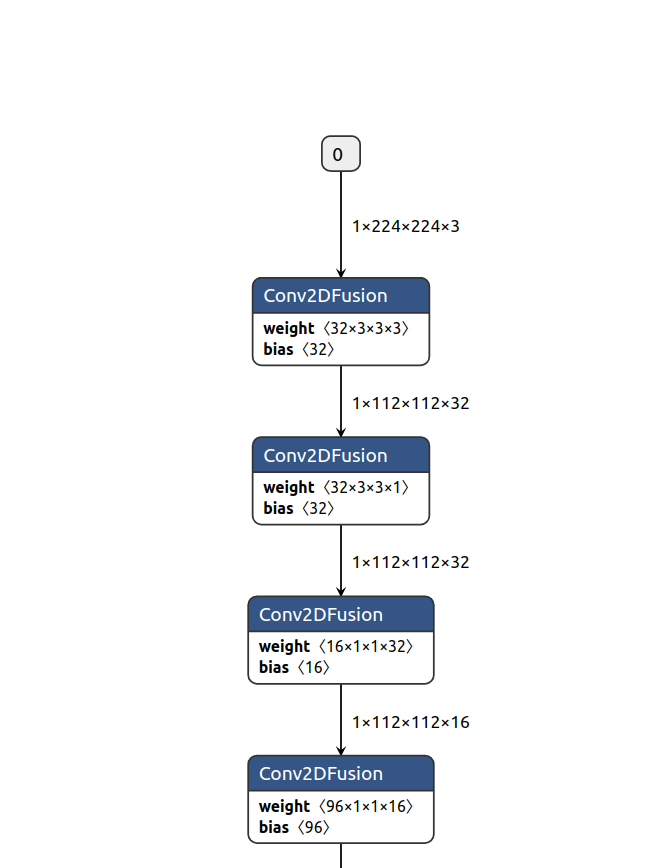
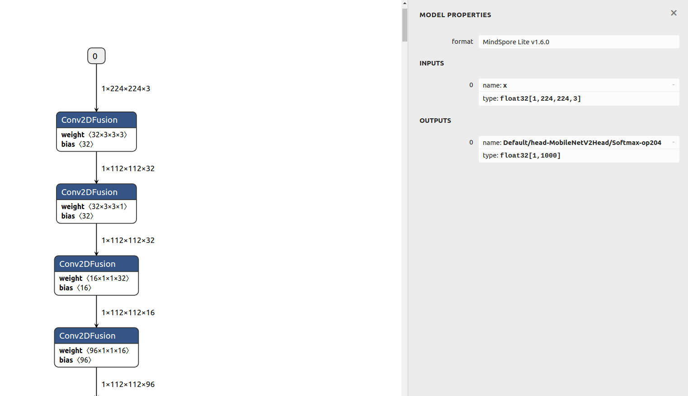

# 端侧推理快速入门

[](https://gitee.com/mindspore/docs/blob/r2.6.0rc1/docs/lite/docs/source_zh_cn/quick_start/one_hour_introduction.md)

## 概述

本文通过使用MindSpore Lite对一个模型执行推理为例，向大家介绍MindSpore Lite的基础功能和用法。在开始本章的MindSpore Lite使用之旅之前，用户需拥有一个Linux（如Ubuntu/CentOS/EulerOS）或Windows的环境，以便随时操作验证。

通过MindSpore Lite对一个模型执行推理主要包括以下步骤：

1. 转换模型

    在对模型进行推理前，需将用户的模型转换为MindSpore Lite的模型文件。

2. 集成推理

    通过集成发布件内的`libmindspore-lite.so`库，调用相关API，将经过前处理之后的数据传递给框架运行，实现`ms`模型的前向推理。

## Linux篇

本篇以Linux系统环境为例，演示如何进行转换模型和集成推理。

### 模型转换

将用户的模型转换为MindSpore Lite的模型文件。该操作主要包括以下步骤：

1. 下载发布件

    在Windows和Linux的发布件中，都含有转换工具，用户可根据自己的平台，下载使用任一个发布件。
    通过发布件内的`converter_lite`工具，将非`ms`模型转换为MindSpore Lite使用的`ms`模型。
    该操作与平台无关，无论在哪个平台上执行转换，可得到相同的转换后模型文件。

2. 转换模型

    使用发布件内的`converter_lite`转换工具完成模型转换。

#### 下载发布件

用户可在MindSpore官网[下载页面](https://www.mindspore.cn/lite/docs/zh-CN/r2.6.0rc1/use/downloads.html)，得到各版本的MindSpore Lite发布件。
在本例中，我们选择的是软件系统为Linux、底层架构为x86_64的CPU发布件，以1.6.0版本为例，用户可点击此处直接[下载](https://ms-release.obs.cn-north-4.myhuaweicloud.com/1.6.0/MindSpore/lite/release/linux/x86_64/mindspore-lite-1.6.0-linux-x64.tar.gz)。
每个发布件的包结构会有不同，本例中，Linux发布件的包结构如下（随着用户对MindSpore Lite各个功能的学习，我们将逐步讲解发布件中文件的作用，在此处，用户对发布件结构有个简略印象即可）：

```text
mindspore-lite-{version}-linux-x64
├── runtime
│   ├── include                        # MindSpore Lite集成开发的API头文件
│   ├── lib
│   │   ├── libminddata-lite.a         # 图像处理静态库
│   │   ├── libminddata-lite.so        # 图像处理动态库
│   │   ├── libmindspore-lite.a        # MindSpore Lite推理框架的静态库
│   │   ├── libmindspore-lite-jni.so   # MindSpore Lite推理框架的JNI动态库
│   │   ├── libmindspore-lite.so       # MindSpore Lite推理框架的动态库
│   │   ├── libmindspore-lite-train.a  # MindSpore Lite训练框架的静态库
│   │   ├── libmindspore-lite-train.so # MindSpore Lite训练框架的动态库
│   │   ├── libmsdeobfuscator-lite.so  # 混淆模型加载动态库文件，需开启`MSLITE_ENABLE_MODEL_OBF`选项。
│   │   └── mindspore-lite-java.jar    # MindSpore Lite推理框架jar包
│   └── third_party
│       └── libjpeg-turbo
└── tools
    ├── benchmark       # 基准测试工具目录
    ├── benchmark_train # 训练模型基准测试工具目录
    ├── codegen         # 代码生成工具目录
    ├── converter       # 模型转换工具目录
    ├── obfuscator      # 模型混淆工具目录
    └── cropper         # 库裁剪工具目录
```

#### 转换模型

解压刚刚下载的发布件，在位于`mindspore-lite-{version}-linux-x64/tools/converter/converter`目录，可以找到`converter_lite`工具。
`converter_lite`模型转换工具提供了离线转换模型功能，支持MindSpore、CAFFE、TensorFlow Lite、TensorFlow、ONNX类型的模型转换。
模型转换步骤如下：

1. 环境设置

    将转换工具需要的动态链接库加入环境变量LD_LIBRARY_PATH。

    ```bash
    export LD_LIBRARY_PATH=${PACKAGE_ROOT_PATH}/tools/converter/lib:${LD_LIBRARY_PATH}
    ```

    ${PACKAGE_ROOT_PATH}是发布件解压后的路径。

2. 进入转换工具所在目录

    执行如下命令，进入转换工具所在目录。

    ```bash
    cd ${PACKAGE_ROOT_PATH}/tools/converter/converter
    ```

    ${PACKAGE_ROOT_PATH}是发布件解压后的路径。

3. 转换参数说明

    在使用converter_lite执行转换时，需设定相关参数。本例中用到的相关参数定义如下表1所示。

    下面以各种类型模型的转换命令为例，说明各参数的使用方法。

    - 以Caffe模型`lenet.prototxt`为例，执行转换命令。

        ```bash
        ./converter_lite --fmk=CAFFE --modelFile=lenet.prototxt --weightFile=lenet.caffemodel --outputFile=lenet
        ```

        在转换Caffe模型时，将fmk配置为CAFFE（`--fmk=CAFFE`），同时分别通过modelFile和weightFile参数传入模型结构（lenet.prototxt）、模型权值（lenet.caffemodel）两个文件。
        同时通过outputFile，指定转换后输出的模型名，因未指定路径，生成的模型默认在当前路径，并带有`.ms`后缀，既`lenet.ms`。

    - 以MindSpore、TensorFlow Lite、TensorFlow和ONNX模型为例，执行转换命令。

        - MindSpore模型`lenet.mindir`。

            ```bash
            ./converter_lite --fmk=MINDIR --modelFile=lenet.mindir --outputFile=lenet
            ```

        - TensorFlow Lite模型`lenet.tflite`。

            ```bash
            ./converter_lite --fmk=TFLITE --modelFile=lenet.tflite --outputFile=lenet
            ```

        - TensorFlow模型`lenet.pb`。

            ```bash
            ./converter_lite --fmk=TF --modelFile=lenet.pb --outputFile=lenet
            ```

        - ONNX模型`lenet.onnx`。

            ```bash
            ./converter_lite --fmk=ONNX --modelFile=lenet.onnx --outputFile=lenet
            ```

        在转换各种模型时，将`fmk`配置为模型类型对应的标志符号，同时通过modelFile参数传入模型文件。
        通过outputFile，指定转换后输出的模型名，因未指定路径，生成的模型默认在当前路径，并带有`.ms`后缀，即`lenet.ms`。

4. 执行转换

    用户可使用自己的模型进行测试，也可使用我们提供的MindSpore模型进行测试，下载链接[点击此处](https://download.mindspore.cn/model_zoo/official/lite/quick_start/mobilenetv2.mindir)。
    以下载的模型为例，将模型`mobilenetv2.mindir`拷贝到转换工具所在目录，根据上述转换参数的说明，可以知道该模型的转换命令如下：

   ```bash
    ./converter_lite --fmk=MINDIR --modelFile=mobilenetv2.mindir --outputFile=mobilenetv2
   ```

    执行命令后，若转换成功，结果显示如下，并在当前目录生成名为`mobilenetv2.ms`的新模型文件。

    ```text
    CONVERT RESULT SUCCESS:0
    ```

5. 高级功能

    关于转换工具的更详细说明，可参考[端侧模型转换](https://www.mindspore.cn/lite/docs/zh-CN/r2.6.0rc1/converter/converter_tool.html)。

    关于如何使用转换工具实现模型训练后量化，可参考[量化](https://www.mindspore.cn/lite/docs/zh-CN/r2.6.0rc1/advanced/quantization.html)。

    如果用户希望转换后的模型能进行训练，需进行训练模型转换，详细可参考[端侧训练模型转换](https://www.mindspore.cn/lite/docs/zh-CN/r2.6.0rc1/train/converter_train.html)。

表1：converter_lite参数定义

| 参数                        | 是否必选            | 参数说明                                                    | 取值范围                        |
| --------------------------- | ------------------- | ----------------------------------------------------------- | ------------------------------- |
| `--fmk=<FMK>`               | 是                  | 待转换模型的原始格式。                                      | MINDIR、CAFFE、TFLITE、TF、ONNX |
| `--modelFile=<MODELFILE>`   | 是                  | 待转换模型的路径。                                          | -                               |
| `--outputFile=<OUTPUTFILE>` | 是                  | 转换后模型的路径及模型名，不需加后缀，可自动生成`.ms`后缀。 | -                               |
| `--weightFile=<WEIGHTFILE>` | 转换Caffe模型时必选 | 输入模型weight文件的路径。                                  | -                               |

> - 参数名和参数值之间用等号连接，中间不能有空格。
> - Caffe模型一般分为两个文件：`*.prototxt`模型结构，对应`--modelFile`参数；`*.caffemodel`模型权值，对应`--weightFile`参数。

#### Netron可视化

[Netron](https://github.com/lutzroeder/netron)是一个基于[Electron](http://www.electronjs.org/)平台开发的神经网络模型可视化工具，支持包括MindSpore Lite在内的许多主流AI框架模型的可视化，支持多种平台（Mac、Windows、Linux等）和浏览器在线使用。
使用`Netron`加载MindSpore Lite模型后，可以展示模型的拓扑结构及图、节点的信息等。
本例以浏览器在线使用`Netron`的方式，对上一节转换的模型`mobilenetv2.ms`进行可视化，用户也可以用`Netron`打开自己的模型，对模型进行查看。

1. 用浏览器打开<https://netron.app/>。

2. 等网页打开后，将模型文件`mobilenetv2.ms`拖到网页内，模型被加载打开。

3. 查看模型。

    模型被加载后如下图所示：

    

    *图1 模型加载后页面*

    可以观察到，模型由一系列序列连接的算子节点构成，在本模型中，出现最多的为`Conv2DFusion`算子。

    - 查看模型输入和输出

        点击图中的输入节点0或者输出节点0，可以看到下图所示：

        

        *图2 模型输入与输出节点*

        最上栏`MODEL PROPERTIES`为模型属性栏，可以观察到该模型的格式为`MindSpore Lite v1.6.0`，表明这是由1.6版本转换工具转换的模型。

        在模型输入`INPUTS`栏，可以看到有一个输入节点，表明模型有一个输入。输入节点名为`x`，数据类型为`float32[1,224,224,3]`，即`float32`的`1x224x224x3`的张量。

        在输入节点前的`0`，为序号标识，表明该节点为模型输入中的第0个节点。

        在模型输出`OUTPUTS`栏，可以看到有一个输出节点，表明模型有一个输出。输出节点名为`Default/head-MobileNetV2Head/Softmax-op204`，数据类型为`float32[1,1000]`，即`float32`的`1x1000`的张量。

    - 查看算子

        点击图中的`Conv2DFusion`算子，可以看到下图所示：

        

        *图3 `Conv2DFusion`算子*

        通过该图，我们可以观察到：

        - 节点算子类型

            在最上栏节点属性`NODE PROPERTIES`中，在`type`栏，可以观察到，节点的类型为`Conv2DFusion`，这表明该节点将执行`Conv2DFusion`算子操作，即二维卷积操作。

        - 节点名字

            在节点属性`NODE PROPERTIES`中，在`name`栏，可以观察到，节点名为`Default/backbone-MobileNetV2Backbone/features-SequentialCell/0-ConvBNReLU/features-SequentialCell/0-Conv2d/Conv2D-op0`。

        - 算子属性

            `Attributes`栏为算子属性，保存算子计算时需要的参数值。

        - 节点输入

            `INPUTS`栏为算子输入，可以观察到该算子有三个输入，即`input`、`weight`、`bias`。
            输入张量`input`的名字为`x`，为之前看到的模型输入。
            输入张量`weight`的名字为`Default/backbone-MobileNetV2Backbone/features-SequentialCell/0-ConvBNReLU/features-SequentialCell/0-Conv2d/Conv2D-op0features.0.features.0.weight`。
            点击右边的加号，可以看到该张量的数值。

        - 节点输出

            `OUTPUTS`栏为算子输出，可以观察到该算子有一个输出张量，该张量的名为`Default/backbone-MobileNetV2Backbone/features-SequentialCell/0-ConvBNReLU/features-SequentialCell/0-Conv2d/Conv2D-op0`。

4. `mobilenetv2.ms`模型的理解。

    通过对模型的查看，可以知道`mobilenetv2.ms`模型定义了如下计算：
    对格式为`float32[1,224,224,3]`的输入张量`x`进行不断卷积，最后通过`MatMulFusion`全连接层的矩阵乘法操作，并执行Softmax运算，得到`1x1000`的输出张量，该输出张量名为`Default/head-MobileNetV2Head/Softmax-op204`。

    本例提供的`mobilenetv2.ms`模型为1000分类的图片分类模型，具体的分类类别本处不做叙述，但通过对模型的查看，可以知道该模型不包含对图片的前处理操作，接收1x224x224x3的float32数值，并得到1x1000的float32输出。
    故在使用该模型进行推理时，用户需自行编码完成图片的前处理操作，将处理后的数据，传递给推理框架，进行前向推理，并对推理得到的1x1000的输出进行后处理。

### 模型推理

用户需要集成发布件内的`mindspore-lite`库文件，并通过MindSpore Lite头文件中声明的API接口，来进行模型推理。
在进行集成前，用户也可以直接使用随发布件发布的`benchmark`基准测试工具（位于`mindspore-lite-{version}-linux-x64/tools/benchmark`），来进行推理测试。
`benchmark`工具是已集成`mindspore-lite`库的可执行程序，通过命令参数的形式，实现包括推理在内的多种功能。

#### 下载发布件

用户根据模型推理时的系统环境，下载对应的发布件。
在本例中，选择的是软件系统为Linux、底层架构为x86_64的CPU发布件，以1.6.0版本为例，用户可点击此处直接[下载](https://ms-release.obs.cn-north-4.myhuaweicloud.com/1.6.0/MindSpore/lite/release/linux/x86_64/mindspore-lite-1.6.0-linux-x64.tar.gz)。

#### benchmark推理测试

1. 环境设置

    将运行`benchmark`推理时需要的动态链接库加入环境变量LD_LIBRARY_PATH。

    ```bash
    export LD_LIBRARY_PATH=${PACKAGE_ROOT_PATH}/runtime/lib:${LD_LIBRARY_PATH}
    ```

    其中${PACKAGE_ROOT_PATH}是发布件解压后的路径。

2. 进入`benchmark`工具所在目录

    执行如下命令，进入`benchmark`工具所在目录。

    ```bash
    cd ${PACKAGE_ROOT_PATH}/tools/benchmark
    ```

    ${PACKAGE_ROOT_PATH}是发布件解压后的路径。

3. `benchmark`参数说明

    在使用`benchmark`执行推理时，需设定相关参数。本例中用到的相关参数定义如下表2所示。

4. 执行推理，分析推理性能

    用户可使用上一节转换后的模型`mobilenetv2.ms`进行推理测试，将模型拷贝到`benchmark`工具所在目录后，使用如下命令执行推理：

    ```bash
    ./benchmark --modelFile=mobilenetv2.ms
    ```

    通过`modelFile`指定要进行推理的模型，其他参数使用默认值。
    本例中，未指定输入数据，将生成随机数值作为输入。
    执行命令后，若推理成功，则会输出类似如下统计信息，该信息显示了推理时的并发线程数（`NumThreads = 2`），测试模型的单次推理最短耗时（`6.677000 ms`）、单次推理最长耗时（`8.656000 ms`）和平均推理耗时（`7.291000 ms`）等性能指标。性能值随环境不同而不同。
    由于未指定`numThreads`参数，默认采用2线程推理，用户可通过设置不同的线程数，以测试不同线程下的推理性能（线程数不是越高越好，到了一定程度后，由于线程切换的开销，推理时间将延长）。

    ```text
    ModelPath = mobilenetv2.ms
    ModelType = MindIR
    InDataPath =
    ConfigFilePath =
    InDataType = bin
    LoopCount = 10
    DeviceType = CPU
    AccuracyThreshold = 0.5
    CosineDistanceThreshold = -1.1
    WarmUpLoopCount = 3
    NumThreads = 2
    Fp16Priority = 0
    EnableParallel = 0
    calibDataPath =
    cpuBindMode = HIGHER_CPU
    CalibDataType = FLOAT
    start unified benchmark run
    PrepareTime = 30.013 ms
    Running warm up loops...
    Running benchmark loops...
    Model = mobilenetv2.ms, NumThreads = 2, MinRunTime = 6.677000 ms, MaxRuntime = 8.656000 ms, AvgRunTime = 7.291000 ms
    Run Benchmark mobilenetv2.ms Success.
    ```

5. 执行推理，分析推理精度

    用户可以使用`benchmark`工具测试MindSpore Lite的推理精度，使用如下命令测试模型的推理精度：

    ```bash
    ./benchmark --modelFile=mobilenetv2.ms --inDataFile=input.bin --benchmarkDataFile=output.txt
    ```

    本例中通过`modelFile`指定要进行推理的模型。

    通过`inDataFile`指定模型的输入数据文件`input.bin`。
    在之前的`Netron`打开模型，我们已经知道`mobilenetv2.ms`模型接收`float32`的`1x224x224x3`张量。
    `benchmark`的`inDataFile`选项默认接收二进制格式数据文件，`input.bin`文件按顺保存了150528个`float32`的二进制数值，跟模型要求的`1x224x224x3`数据量一致，且格式均为`float32`。

    通常输入数据文件可以采用以下方式生成：

    - 保存训练输入：将模型训练数据集内的数据进行前处理，将前处理后的数据保存。

    - 随机生成：通过随机生成的方式，生成指定范围内的随机数据。

    本例采用随机生成数作为输入，用户可以通过运行以下Python脚本，或点击此处下载本例中的[input.bin文件](https://download.mindspore.cn/model_zoo/official/lite/quick_start/input.bin)，并将它放到benchmark目录内。

    ```python
    import numpy as np
    np.random.seed(1)
    t = np.random.rand(1,224,224,3)
    t.astype(np.float32).tofile("input.bin")
    ```

    在提供了输入数据之后，用户还需提供用于跟推理结果进行对比的标杆数据，以进行精度误差分析。
    本例通过`benchmarkDataFile`指定模型的输出标杆文件`output.txt`。标杆文件的格式需如下所示：

    ```text
    [输出节点1名称] [输出节点1形状的维度长度] [输出节点1形状的第一维值] ... [输出节点1形状的第n维值]
    [节点1数据1]  [节点1数据2] ...
    [输出节点2名称] [输出节点2形状的维度长度] [输出节点2形状的第一维值] ... [输出节点2形状的第n维值]
    [节点2数据1]  [节点2数据2] ...
    ```

    通常标杆文件可以采用以下方式生成：

    - 跟其他框架进行对比：使用其它深度学习模型推理框架，并使用相同输入，将推理结果按照上面的要求格式保存。

    - 跟模型训练时进行对比：在训练框架中，将经过前处理后的数据保存作为`inDataFile`指定的输入数据。并将模型推理后，还未经过后处理的输出数据按标杆格式进行保存，作为标杆。

    - 跟不同设备或数据类型推理对比：使用不同的数据类型（例如FP16）或者设备（例如GPU/NPU）进行推理，得到该环境下标杆。

    - 跟理论值进行对比：针对一些简单模型，用户也可以根据对模型的理解，手动构造对应输入的输出标杆。

    提供的标杆数据必须和模型输出拥有相同的数据大小，才能跟模型输出进行对比，以得到推理精度误差量。
    在之前的`Netron`打开模型章节，我们已经知道`mobilenetv2.ms`模型，输出的节点名为`Default/head-MobileNetV2Head/Softmax-op204`，该节点输出的形状为`1x1000`（如图2中所示），故节点形状的维度长度为2，节点形状的第一维值为1，节点形状的第二维值为1000。
    本例采用跟其他框架进行对比的方式生成标杆，将之前得到的`input.bin`文件，通过其他框架生成推理后的数据，并按照标杆格式保存文件。
    得到标杆数据如下所示：

    ```text
    Default/head-MobileNetV2Head/Softmax-op204 2 1 1000
    4.75662418466527e-05 0.00044544308912009 ...
    ```

    标杆中第二行的数据，就是采用其他框架对相同的输入（`input.bin`）得到的推理输出，用户可以点击此处下载本例中的[output.txt文件](https://download.mindspore.cn/model_zoo/official/lite/quick_start/output.txt)，并将它放到benchmark目录内。
    在执行`benchmark`命令后，若推理成功，则会输出类似如下统计信息：

    ```text
    ModelPath = mobilenetv2.ms
    ModelType = MindIR
    InDataPath = input.bin
    ConfigFilePath =
    InDataType = bin
    LoopCount = 10
    DeviceType = CPU
    AccuracyThreshold = 0.5
    CosineDistanceThreshold = -1.1
    WarmUpLoopCount = 3
    NumThreads = 2
    Fp16Priority = 0
    EnableParallel = 0
    calibDataPath = output.txt
    cpuBindMode = HIGHER_CPU
    CalibDataType = FLOAT
    start unified benchmark run
    PrepareTime = 31.709 ms
    MarkAccuracy
    InData 0: 0.417022 0.720325 0.000114375 0.302333 0.146756 0.0923386 0.18626 0.345561 0.396767 0.538817 0.419195 0.68522 0.204452 0.878117 0.0273876 0.670467 0.417305 0.55869 0.140387 0.198101
    ================ Comparing Output data ================
    Data of node Default/head-MobileNetV2Head/Softmax-op204 : 4.75662e-05 0.000445443 0.000294212 0.000354572 0.000165406 8.36175e-05 0.000198424 0.000329004 0.000288576 0.000203605 0.000962143 0.00421465 0.0019162 0.00129701 0.00260928 0.0012302 0.000879829 0.000609378 0.000691054 0.00119472 0.000516733 0.00160048 0.000959531 0.00176164 0.000365934 0.00013575 0.000245539 0.000414651 0.000165337 0.000480154 0.000216396 0.00101303 0.000105544 0.000475172 0.000761407 0.000305815 0.000294882 0.000307003 0.00188077 0.000454868 0.000897518 0.00051352 0.000595383 0.000644214 0.000513376 0.000343709 0.00103984 0.000197185 7.54722e-05 8.89811e-05
    Mean bias of node/tensor Default/head-MobileNetV2Head/Softmax-op204 : 0%
    Mean bias of all nodes/tensors: 0%
    =======================================================

    Run Benchmark mobilenetv2.ms Success.
    ```

    在输出信息中，`InData 0`行打印的是该次推理的输入数据（只打印了前20个），`Data of node Default/head-MobileNetV2Head/Softmax-op204`行打印的是相关输出节点（`Default/head-MobileNetV2Head/Softmax-op204`）的推理结果（只打印前50个值），可以直接观察它们跟标杆文件的差异，以获得直观感受。
    `Mean bias of node/tensor Default/head-MobileNetV2Head/Softmax-op204`行，给出了`Default/head-MobileNetV2Head/Softmax-op204`输出张量与标杆数据对比的平均误差，该误差计算方法为`benchmark`工具自带的比较算法。
    在最后，`Mean bias of all nodes/tensors`给出了所有张量与标杆对比的平均误差，在本例中，只有1个输出张量，故总平均误差和`Default/head-MobileNetV2Head/Softmax-op204`张量误差一致。可以观察到，推理的总平均误差为0%。

6. 高级功能

    关于`benchmark`的更详细说明，以及关于如何使用`benchmark`来进行基准测试、耗时定量分析、误差分析、Dump数据等，可以参考[benchmark](https://www.mindspore.cn/lite/docs/zh-CN/r2.6.0rc1/tools/benchmark_tool.html)。

表2：benchmark参数定义

| 参数名                                | 是否必选 | 参数说明                                                                                                                                                                 | 参数类型 | 默认值 |
| ------------------------------------- | -------- | ------------------------------------------------------------------------------------------------------------------------------------------------------------------------ | -------- | ------ |
| `--modelFile=<MODELPATH>`             | 必选     | 指定需要进行基准测试的MindSpore Lite模型文件路径。                                                                                                                       | String   | null   |
| `--numThreads=<NUMTHREADS>`           | 可选     | 指定模型推理程序运行的线程数。                                                                                                                                           | Integer  | 2      |
| `--inDataFile=<INDATAPATH>`           | 可选     | 指定测试模型输入数据的文件路径，默认接收二进制格式数据文件。在精度测试中，该输入作为标杆输入。如果未设置，则使用随机输入。                                                                                 | String   | null   |
| `--benchmarkDataFile=<CALIBDATAPATH>` | 可选     | 指定对比标杆数据（用于精度对比的数据）的文件路径，接收按规定格式排列的字符文本。 | String | null |

> - 参数名和参数值之间用等号连接，中间不能有空格。

#### 集成推理

在上一节，我们使用了官方推理测试工具进行了模型推理测试。在本节，我们将以使用MindSpore Lite的C++接口进行集成为例，演示如何使用MindSpore Lite的发布件，进行集成开发，编写自己的推理程序。

1. 环境要求

    - 系统环境：Linux x86_64，推荐使用Ubuntu 18.04.02LTS
    - C++编译依赖
        - [GCC](https://gcc.gnu.org/releases.html) >= 7.3.0
        - [CMake](https://cmake.org/download/) >= 3.12

2. 获得版本发布件

    用户可通过MindSpore官网，获得MindSpore Lite发布件，点击[此处](https://www.mindspore.cn/lite/docs/zh-CN/r2.6.0rc1/use/downloads.html)查看各版本。
    在本例中，仍然采用了和前几节一样的发布件，用于本节集成开发，点击此处可直接[下载](https://ms-release.obs.cn-north-4.myhuaweicloud.com/1.6.0/MindSpore/lite/release/linux/x86_64/mindspore-lite-1.6.0-linux-x64.tar.gz)。
    在本节简单的推理集成例子中，需要用到的发布件内容如下：

    ```text
    mindspore-lite-{version}-linux-x64
    └── runtime
        │── include                        # MindSpore Lite集成开发的API头文件
        └── lib
            └── libmindspore-lite.so       # MindSpore Lite推理框架的动态库
    ```

3. 构建工程目录

    本例的工程目录如下：

    ```text
    demo
    ├── CMakeLists.txt                  # cmake工程管理文件
    ├── main.cc                         # 用户代码
    ├── build                           # 编译用目录
    ├── model
    │    └── mobilenetv2.ms             # 模型文件（之前转出的模型）
    └── runtime                         # 发布件的runtime目录
        ├── include                     # MindSpore Lite集成开发的API头文件
        └── lib
            └── libmindspore-lite.so    # MindSpore Lite推理框架的动态库
    ```

    新建一个`demo`文件夹，新建`main.cc`和`CMakeLists.txt`文件。
    新建`build`和`model`目录，将`mobilenetv2.ms`放到`model`内。
    将发布件中的`runtime`目录拷贝到`demo`中，`runtime`内的文件可以保持不动，也可以删除除`libmindspore-lite.so`和`include`文件夹外的其它库文件。

4. 构建cmake工程

    打开上一步创建的`CMakeLists.txt`，粘贴如下内容，其中每句话的含义见注释：

    ```cpp
    cmake_minimum_required(VERSION 3.12)  # cmake版本要求最低3.12
    project(Demo)  # 工程名为Demo

    # gcc 版本要求大于等于7.3.0
    if(CMAKE_CXX_COMPILER_ID STREQUAL "GNU" AND CMAKE_CXX_COMPILER_VERSION VERSION_LESS 7.3.0)
        message(FATAL_ERROR "GCC version ${CMAKE_CXX_COMPILER_VERSION} must not be less than 7.3.0")
    endif()

    include_directories(${CMAKE_CURRENT_SOURCE_DIR}/runtime/)  # 添加头文件寻找路径

    link_directories(${CMAKE_CURRENT_SOURCE_DIR}/runtime/lib)  # 添加库文件寻找路径

    add_executable(demo main.cc)  # 编译生成demo执行程序

    # 声明demo执行程序需要链接的库，mindspore-lite为MindSpore Lite推理框架的动态库
    target_link_libraries(
            demo
            mindspore-lite
            pthread
            dl
    )
    ```

    > 如果想要集成`libmindspore-lite.a`静态库，则使用`-Wl,--whole-archive libmindspore-lite.a -Wl,--no-whole-archive`的选项来替换`mindspore-lite`。

5. 编写代码

    打开刚才创建的`main.cc`，粘贴如下内容：

    ```cpp
    #include <iostream>
    #include <fstream>
    #include <random>
    #include "include/api/model.h"
    #include "include/api/context.h"
    #include "include/api/status.h"
    #include "include/api/types.h"
    using mindspore::MSTensor;

    char *ReadFile(const char *file, size_t *size) {
      if (file == nullptr) {
        std::cerr << "file is nullptr." << std::endl;
        return nullptr;
      }

      std::ifstream ifs(file, std::ifstream::in | std::ifstream::binary);
      if (!ifs.good()) {
        std::cerr << "file: " << file << " is not exist." << std::endl;
        return nullptr;
      }

      if (!ifs.is_open()) {
        std::cerr << "file: " << file << " open failed." << std::endl;
        return nullptr;
      }

      ifs.seekg(0, std::ios::end);
      *size = ifs.tellg();
      std::unique_ptr<char[]> buf(new (std::nothrow) char[*size]);
      if (buf == nullptr) {
        std::cerr << "malloc buf failed, file: " << file << std::endl;
        ifs.close();
        return nullptr;
      }

      ifs.seekg(0, std::ios::beg);
      ifs.read(buf.get(), *size);
      ifs.close();

      return buf.release();
    }

    template <typename T, typename Distribution>
    void GenerateRandomData(int size, void *data, Distribution distribution) {
      std::mt19937 random_engine;
      int elements_num = size / sizeof(T);
      (void)std::generate_n(static_cast<T *>(data), elements_num,
                            [&distribution, &random_engine]() { return static_cast<T>(distribution(random_engine)); });
    }

    int main(int argc, const char **argv) {
      // Read model file.
      std::string model_path = "../model/mobilenetv2.ms";
      size_t size = 0;
      char *model_buf = ReadFile(model_path.c_str(), &size);
      if (model_buf == nullptr) {
        std::cerr << "Read model file failed." << std::endl;
        return -1;
      }

      // Create and init context, add CPU device info
      auto context = std::make_shared<mindspore::Context>();
      if (context == nullptr) {
        delete[](model_buf);
        std::cerr << "New context failed." << std::endl;
        return -1;
      }
      auto &device_list = context->MutableDeviceInfo();
      auto device_info = std::make_shared<mindspore::CPUDeviceInfo>();
      if (device_info == nullptr) {
        delete[](model_buf);
        std::cerr << "New CPUDeviceInfo failed." << std::endl;
        return -1;
      }
      device_list.push_back(device_info);

      // Create model
      auto model = new (std::nothrow) mindspore::Model();
      if (model == nullptr) {
        delete[](model_buf);
        std::cerr << "New Model failed." << std::endl;
        return -1;
      }

      // Build model
      auto build_ret = model->Build(model_buf, size, mindspore::kMindIR, context);
      delete[](model_buf);
      if (build_ret != mindspore::kSuccess) {
        delete model;
        std::cerr << "Build model error " << std::endl;
        return -1;
      }

      // Get Input
      auto inputs = model->GetInputs();
      for (auto tensor : inputs) {
        auto input_data = reinterpret_cast<float *>(tensor.MutableData());
        if (input_data == nullptr) {
          std::cerr << "MallocData for inTensor failed." << std::endl;
          delete model;
          return -1;
        }
        GenerateRandomData<float>(tensor.DataSize(), input_data, std::uniform_real_distribution<float>(0.1f, 1.0f));
      }

      // Predict
      std::vector<MSTensor> outputs;
      auto status = model->Predict(inputs, &outputs);
      if (status != mindspore::kSuccess) {
        std::cerr << "Inference error." << std::endl;
        delete model;
        return -1;
      }

      // Get Output Tensor Data.
      std::cout << "\n------- print outputs ----------" << std::endl;
      for (auto tensor : outputs) {
        std::cout << "out tensor name is:" << tensor.Name() << "\nout tensor size is:" << tensor.DataSize()
                  << "\nout tensor elements num is:" << tensor.ElementNum() << std::endl;
        auto out_data = reinterpret_cast<float *>(tensor.MutableData());
        std::cout << "output data is:";
        for (int i = 0; i < tensor.ElementNum(); i++) {
          std::cout << out_data[i] << " ";
        }
        std::cout << std::endl;
      }
      std::cout << "------- print end ----------\n" << std::endl;

      // Delete model.
      delete model;
      return mindspore::kSuccess;
    }
    ```

    代码功能解析如下：

    (1) 读取模型文件到buf

    通过调用`ReadFile`函数，将模型文件读入到`model_buf`内存，用`size`变量保存模型的大小。

    ```cpp
    char *model_buf = ReadFile(model_path.c_str(), &size);
    ```

    (2) 初始化Context配置

    Context保存了模型推理时所需的相关配置，包括算子偏好、线程数、自动并发以及推理处理器相关的其他配置。
    关于Context的详细说明，请参考Context的[API接口说明](https://www.mindspore.cn/lite/api/zh-CN/r2.6.0rc1/api_cpp/mindspore.html#context)。
    在MindSpore Lite加载模型时，必须提供一个`Context`类的对象，所以在本例中，首先申请了一个`Context`类的对象`context`。

    ```cpp
    auto context = std::make_shared<mindspore::Context>();
    ```

    接着，通过`Context::MutableDeviceInfo`接口，得到`context`对象的设备管理列表。

    ```cpp
    auto &device_list = context->MutableDeviceInfo();
    ```

    在本例中，由于使用CPU进行推理，故需申请一个`CPUDeviceInfo`类的对象`device_info`。

    ```cpp
    auto device_info = std::make_shared<mindspore::CPUDeviceInfo>();
    ```

    因为采用了CPU的默认设置，所以不需对`device_info`对象做任何设置，直接添加到`context`的设备管理列表。

    ```cpp
    device_list.push_back(device_info);
    ```

    (3) 加载模型

    首先创建一个`Model`类对象`model`，`Model`类定义了MindSpore中的模型，用于计算图管理。
    关于`Model`类的详细说明，可参考[API文档](https://www.mindspore.cn/lite/api/zh-CN/r2.6.0rc1/api_cpp/mindspore.html#model)。

    ```cpp
    auto model = new (std::nothrow) mindspore::Model();
    ```

    接着调用`Build`接口传入模型，将模型编译至可在设备上运行的状态。
    在加载编译完模型之后，被解析的模型信息已记录在`model`变量中，原先的模型文件内存`model_buf`可以释放。
    由于`model_buf`是以`char`数组的方式申请的，故使用`delete[]`释放内存。

    ```cpp
    auto build_ret = model->Build(model_buf, size, mindspore::kMindIR, context);
    delete[](model_buf);
    ```

    (4) 传入数据

    在执行模型推理前，需要设置推理的输入数据。
    此例，通过`Model.GetInputs`接口，获取模型的所有输入张量。单个张量的格式为`MSTensor`。
    关于`MSTensor`张量的详细说明，请参考`MSTensor`的[API说明](https://www.mindspore.cn/lite/api/zh-CN/r2.6.0rc1/api_cpp/mindspore.html#mstensor)。

    ```cpp
    auto inputs = model->GetInputs();
    ```

    通过张量的`MutableData`接口，可以获取张量的数据内存指针。
    在本例中，模型的输入为浮点数格式，所以此处将指针强转为浮点指针。用户可根据自己模型的数据格式做不同处理，也可通过张量的`DataType`接口，得到该张量的数据类型。

    ```cpp
    auto input_data = reinterpret_cast<float *>(tensor.MutableData());
    ```

    接着，通过数据指针，将我们要推理的数据传入张量内部。
    在本例中我们传入的是随机生成的0.1至1的浮点数据，且数据呈平均分布。
    在实际的推理中，用户在读取图片或音频等实际数据后，需进行算法特定的预处理操作，并将处理后的数据传入模型。

    ```cpp
    template <typename T, typename Distribution>
    void GenerateRandomData(int size, void *data, Distribution distribution) {
      std::mt19937 random_engine;
      int elements_num = size / sizeof(T);
      (void)std::generate_n(static_cast<T *>(data), elements_num,
                           [&distribution, &random_engine]() { return static_cast<T>(distribution(random_engine)); });
    }

    ...

    GenerateRandomData<float>(tensor.DataSize(), input_data, std::uniform_real_distribution<float>(0.1f, 1.0f));
    ```

    (5) 执行推理

    首先申请一个放置模型推理输出张量的数组`outputs`，然后调用模型推理接口`Predict`，将输入张量和输出张量作为参数。
    在推理成功后，输出张量被保存在`outputs`内。

    ```cpp
    std::vector<MSTensor> outputs;
    auto status = model->Predict(inputs, &outputs);
    ```

    (6) 推理结果核验

    通过`MutableData`得到输出张量的数据指针。
    本例中，将它强转为浮点指针，用户可以根据自己模型的数据类型进行对应类型的转换，也可通过张量的`DataType`接口得到数据类型。

    ```cpp
    auto out_data = reinterpret_cast<float *>(tensor.MutableData());
    ```

    在本例中，直接通过打印来观察推理输出结果的准确性。

    ```cpp
    for (int i = 0; i < tensor.ElementNum(); i++) {
      std::cout << out_data[i] << " ";
    }
    ```

    (7) 释放model对象

    ```cpp
    delete model;
    ```

6. 编译

    进入`build`目录，输入`cmake ..`生成makefile文件，然后输入`make`编译工程。在编译成功后，可以在`build`目录下得到`demo`可执行程序。

7. 运行推理程序

    输入`./demo`执行`demo`程序，根据上文，我们知道`demo`程序将加载`mobilenetv2.ms`模型，并将随机生成的输入张量传递给模型进行推理，将推理后的输出张量的值进行打印。
    推理成功，得到如下输出，可以看到输出张量包含1000个数值，这和我们在[Netron可视化](#netron可视化)中得到的模型理解相一致的，由于本例传入的是0.1至1平均分布的数据（可视为噪声），所以输出并无分类特征：

    ```text
    ------- print outputs ----------
    out tensor name is:Default/head-MobileNetV2Head/Softmax-op204
    out tensor size is:4000
    out tensor elements num is:1000
    output data is:5.26822e-05 0.000497521 0.000296722 0.000377606 0.000177048 8.02106e-05 0.000212863 0.000422287 0.000273189 0.000234106 0.000998072 0.00423312 0.00204994 0.00124968 0.00294459 0.00139796 0.00111545 0.00065636 0.000809462 0.00153732 0.000621052 0.00224638 0.00127046 0.00187558 0.000420145 0.000150638 0.000266477 0.000438629 0.000187774 0.00054668 0.000212853 0.000921661 0.000127179 0.000565873 0.00100395 0.00030016 0.000282677 0.000358068 0.00215288 0.000477846 0.00107597 0.00065134 0.000722135 0.000807503 0.000631416 0.000432471 0.00125898 0.000255094 8.26058e-05 9.91919e-05 0.000794514 0.00031873 0.000525145 0.000564177 0.000390949 0.000239435 0.000769301 0.000522169 0.000489711 0.00106033 0.00188065 0.00162756 0.000154417 0.000423661 0.00114033 0.000521169 0.00104491 0.000394101 0.000574376 0.00103071 0.000328134 0.00220263 0.000588063 0.00114022 0.000639888 0.00160103 0.000883627 0.00168485 0.00749697 0.00378326 0.00049545 0.000697699 0.00094152 0.000694751 0.000361998 0.00249769 0.00224123 0.00144733 0.000867953 0.000409967 0.000414645 0.000921754 0.00362981 0.000598768 0.00939566 0.000354318 0.0011853 0.000582604 0.000977179 0.000363443 0.000252788 0.000161903 0.000498172 0.000835043 0.000125615 0.000150972 0.000271722 0.000391777 8.49806e-05 0.000175627 0.000255629 0.0104205 0.000473356 0.000470714 0.00154926 3.52034e-05 0.00017297 0.000381467 0.000286569 0.00022002 0.000270967 0.00012511 0.000102305 0.000113712 0.000152496 0.00216914 0.000232594 0.00118621 0.00120123 0.000756038 0.000361149 0.000279887 0.00072076 0.0030916 0.000839053 0.000305989 0.000185089 0.00106419 0.00141358 0.000819862 0.000874739 0.00194274 0.000707348 0.00158608 0.000395842 0.000749171 0.00119562 0.000445385 0.000481742 7.57984e-05 0.000101538 0.000709718 0.000151491 0.00051427 0.000212376 0.000216051 9.55411e-05 0.000147092 0.00030403 9.3476e-05 5.85228e-05 0.000247954 0.000708926 0.00022098 0.000342199 0.000117494 0.000191572 3.63169e-05 0.000411851 0.000342481 0.000239097 0.000764161 0.000259073 0.000524563 0.000426145 0.000111397 0.000177984 8.50417e-05 0.000275155 0.000141314 0.000509691 0.000179604 0.000770131 0.000168981 0.000312896 0.000104055 9.1071e-05 0.000408717 8.05139e-05 0.000312057 0.000296877 0.000172418 0.00024341 0.000300782 0.000146993 0.00109211 0.000191816 8.35939e-05 0.000299942 0.000315375 0.000193755 0.000319056 0.000516599 0.000504943 0.000136374 0.000324095 0.000102209 0.000352826 0.000103771 0.000373529 0.000360807 0.000296265 0.000313525 0.000118756 0.000198175 0.000219075 0.000174439 0.000216093 0.000438399 0.000296872 0.000128021 0.00017442 0.000189079 0.000399597 0.000100693 0.000123358 5.15012e-05 0.000218214 0.000222177 0.000299965 0.000147799 0.000234641 0.000149353 4.5897e-05 0.000133614 0.000225688 0.000322703 0.000510069 0.000426839 0.000150078 6.61004e-05 4.68818e-05 0.000280284 0.000124997 0.000113089 0.000687338 0.000183928 0.000232998 0.00018996 0.00016634 9.61161e-05 0.000261457 7.62777e-05 0.000892919 0.00027851 4.25679e-05 0.00012095 0.000143962 0.000543232 0.00019522 0.000152532 8.21291e-05 5.86343e-05 0.000454828 0.000232324 0.000326869 0.00050617 8.3308e-05 8.23556e-05 7.82488e-05 0.000349937 0.000162254 0.000584313 0.000380654 7.41325e-05 0.000328623 0.00052962 0.000750176 0.000374926 0.000511254 0.000546927 0.000420431 0.000673729 0.000211782 0.00163466 0.000524799 0.000383476 0.000244811 7.51562e-05 6.57744e-05 0.000155914 0.000270638 0.000106245 0.000186127 0.000346968 0.000485479 0.000271254 0.00036631 0.000252093 0.000184659 0.000340458 0.00393658 0.00120467 0.00258523 0.000523741 0.00142551 0.00168216 0.00274844 0.00230136 0.000254464 0.000689839 0.00200172 0.000789165 0.00147548 0.00497233 0.00245074 0.00351014 0.000964297 0.0116707 0.00263743 0.000911238 0.000140097 0.000427111 0.000229297 0.000354368 0.000327572 0.000399973 0.000969767 0.000753985 0.000151906 0.000319341 0.00177747 0.00014731 0.000247144 0.00028714 0.000162237 0.000406454 0.000167767 0.000141812 8.20427e-05 0.000140652 0.000154833 0.000414694 0.000191989 0.00028065 0.000298302 0.000326194 0.000358242 0.000218887 0.000214568 0.000456112 0.000153574 5.4711e-05 0.000176373 0.000716305 6.97331e-05 0.000924458 0.00036906 0.000147747 0.000464726 0.000195069 0.000472077 0.000196377 0.000422707 0.000132992 5.76273e-05 0.000180634 0.000355361 0.000247252 0.000157627 0.000537573 0.00020566 0.000577524 0.00019596 0.000227313 0.000237615 0.000251934 0.000581737 0.000156606 0.000377661 0.000534264 9.59369e-05 0.000165362 0.000174582 7.18626e-05 0.000134693 4.02814e-05 0.000179219 0.000100272 9.8463e-05 0.000262976 0.000178799 0.000224355 8.18936e-05 0.000143329 0.000117873 8.40231e-05 0.000588662 0.000158744 0.00069335 0.000287121 0.000151016 0.00152298 0.00024393 0.000737831 0.00115437 5.96499e-05 0.000118379 0.000228003 0.0041712 5.89845e-05 0.00273432 0.00321251 0.00269996 0.000762481 4.82307e-05 0.000160988 0.00115545 0.0155078 0.00138022 0.0025505 0.000223013 0.000251236 0.000123665 5.52253e-05 0.000267688 0.000453393 0.00029877 0.000429822 0.00099786 0.000183652 0.000397013 0.00108393 0.000333911 0.0008731 0.000275806 0.000101959 0.000920896 0.000532173 0.000526293 0.0006834 0.000935434 0.000351484 0.00198101 0.000158832 0.00025276 0.0309715 0.000236896 0.000507701 7.17417e-05 0.000136413 0.00511946 0.001006 0.00030655 0.000170018 0.00102066 0.000676819 0.00111926 0.00101352 0.00122263 0.000436026 0.000709552 0.00280173 0.000343102 0.000684757 0.00250305 8.5246e-05 8.35988e-05 8.50596e-05 0.000745612 0.000384923 0.000115974 0.000104449 0.00142474 0.000464432 0.00013609 4.29949e-05 0.000410546 0.000318726 8.40787e-05 0.00206693 0.00057538 0.000382494 0.000160234 0.000307552 0.000529971 0.000586405 0.00398225 0.00151492 0.00026454 0.000511842 9.7473e-05 0.000163672 0.000160056 0.000816508 3.00784e-05 0.00037759 0.00014328 8.48268e-05 0.00142338 6.22116e-05 0.000788073 0.00155491 0.00121945 0.000680781 0.000758789 0.000459647 0.00708145 0.00120801 7.03766e-05 0.000364867 0.000123017 0.00420891 0.000513928 0.00123761 0.000267312 0.000333363 0.00122328 0.000298812 0.000238888 0.000615765 8.10465e-05 0.000246716 0.00123949 0.000508113 7.77746e-05 0.000487965 0.000462255 0.000310659 0.000585418 0.00176246 0.000181668 0.000288837 0.000232032 0.00549264 0.000113551 0.000251434 0.000276892 0.000604927 0.00410441 0.000628254 0.000532845 0.00177639 0.000769542 0.000172925 0.00065605 0.0015078 4.19799e-05 0.000255064 0.00488681 0.000521465 0.000326431 0.00111252 0.00235686 0.000651842 8.37604e-05 0.00319951 0.000679279 0.00160411 0.000953606 0.00047153 8.01442e-05 0.00192255 0.0110213 0.000130118 0.00018916 0.00082058 0.000194114 0.000183411 0.000152358 0.000211961 5.22587e-05 0.00303399 0.000128953 0.00159357 0.000101542 5.38654e-05 0.000206161 0.000293241 0.000191215 7.02916e-05 0.000230206 0.000109719 0.000682147 0.000378998 0.000515589 0.000204293 0.00115819 0.00252224 0.00132761 4.51228e-05 0.00333054 0.000486169 0.000733327 0.000177619 9.41916e-05 0.00120342 0.00432701 0.000222835 0.000197637 0.00449768 0.00115172 0.000184445 0.000111001 0.00112382 0.0018688 0.00320062 0.000278918 0.000906152 0.000116432 0.00164653 0.000537722 0.000249092 0.00221725 0.000161599 0.000414339 0.00299422 0.000435541 0.00880695 0.00490311 0.00325869 6.05041e-05 0.00458625 0.00517385 0.00024982 0.000220774 0.0032148 0.000275533 0.00222638 0.00206151 0.000420763 0.00028658 0.0149218 0.000693565 6.89355e-05 0.000175107 0.000611934 0.000185402 0.00048781 0.00104491 0.000305031 0.000719747 0.000464874 0.000902618 0.00710998 0.00028243 0.000266798 0.000557195 0.00018203 0.000165886 0.00432344 0.0018616 0.00081676 0.000688068 0.000116212 0.00375912 0.00011202 0.0119426 0.000395667 0.00134768 0.000107723 8.29395e-05 0.00874447 0.000217795 0.00201653 0.000200428 0.000784866 0.000739253 0.000223862 0.000716373 9.37279e-05 1.64484e-05 0.000103597 0.00134084 0.00208305 6.15101e-05 0.000264137 0.00421874 0.000816694 0.019055 0.000882248 0.0265989 0.000885313 0.00189269 0.000819798 0.000479354 0.000194866 4.39721e-05 0.000374197 0.00102411 0.000391648 0.000144945 0.000320067 0.000943551 6.28455e-05 0.000563089 0.00319211 0.000219879 8.42234e-05 0.000555672 0.00231883 0.0037087 0.000302303 0.000149123 0.000789137 7.45903e-05 0.000133478 0.000470522 0.000542576 0.000413181 0.000967243 0.00134348 0.000439858 0.0010091 0.00714279 0.000202303 0.000809548 8.99185e-05 0.000199892 0.00059308 0.00129059 0.00162076 0.00793667 0.000529655 0.000417269 0.00100714 0.000160703 0.00097642 0.000691081 7.56624e-05 0.000217106 0.00290805 0.000661668 0.00104081 0.000133569 0.000945062 0.00132827 0.000932787 0.00482219 3.9986e-05 0.000903322 0.000455647 0.00143754 0.000103266 0.00367346 0.000897197 0.000118318 0.00149419 0.000865034 0.00126782 0.00090065 0.000132982 0.0039552 0.00210961 0.000428278 0.000123607 0.000284831 2.11637e-05 0.000587767 0.000752392 0.00159891 0.00253384 4.46648e-05 0.00597254 0.00373919 0.000849701 4.3499e-05 0.000935258 0.000311729 0.00719802 0.000368296 0.00284921 0.00317468 0.000813635 0.0011214 0.000610401 0.000484875 0.00417738 0.000496244 9.79432e-05 0.000734274 0.000259079 0.00247699 0.00460816 0.00708891 0.000724271 0.00048205 0.000174656 0.000596118 0.000401012 8.25042e-05 0.000161686 0.00197722 0.000806688 0.00684481 0.000596325 0.00131103 0.000204451 0.00100593 0.00151624 8.50725e-05 0.000122174 0.00021799 0.000259111 0.002961 0.000829398 0.000533044 5.0536e-05 0.000946751 6.78423e-05 0.000485367 0.00306399 0.00523905 0.00123471 0.000224707 0.000101096 0.0014873 0.000104553 0.00355624 0.000205465 0.000169472 5.07939e-05 0.000195914 0.000791247 0.000246651 0.000205654 0.000285258 0.000651622 0.00211643 6.79842e-05 0.000138115 0.00103942 0.000187132 0.000409764 0.00214586 0.000292729 0.00031472 0.000691548 0.000382784 0.000125186 0.00233764 0.000536727 0.000502022 4.95937e-05 0.0264263 0.00477407 0.00376776 0.00014371 0.00137865 0.00109858 0.000563498 0.00261839 0.00397829 0.000242258 0.000141749 0.00157776 0.00031561 0.000136863 0.000277254 0.000887197 5.00407e-05 0.0031923 0.000459011 9.37109e-05 0.000129428 9.72145e-05 0.000116087 5.26294e-05 0.000929531 0.00363911 0.000738978 0.000344878 0.00242673 0.000193775 4.87371e-05 0.0010458 0.00015866 0.000108444 7.05613e-05 0.000979656 0.000203967 0.000434424 0.00147155 0.00623083 0.000167943 0.00654287 0.000231375 0.000144977 7.44322e-05 0.000271412 0.000257479 0.000125951 0.0084965 0.00708424 0.000741149 0.000327848 0.00072125 0.00155309 0.000849641 0.000468936 0.000597561 0.000343363 0.0013401 0.000644772 0.00296955 0.00203899 0.000344333 0.000654109 0.000579819 0.000307663 0.00295462 0.00098848 0.000224191 0.000616008 0.000192669 0.000124413 0.000265971 6.58702e-05 0.00031542 0.000253495 0.000276654 0.00289865 0.000574721 0.000131497 0.000204278 0.000568842 9.16333e-05 0.000257384 0.000243244 0.000443263 0.000109194 0.000139178 0.000500078 0.000198004 0.000107967 0.000169954 0.000123934 0.000258871 9.86871e-05 0.000293493 0.000323952 0.000504283 0.00036182 0.000316952 0.000177675 0.00168864 8.59652e-05 7.83207e-05 0.000429965 0.000663861 0.000506927 0.000768278 0.000391109 0.000419152 0.000638448 0.000214176 0.00016114 0.000515638 0.000709203 0.000154853 0.000343536 0.000326896 0.000130624 7.31075e-05 6.40462e-05 0.000139256 0.000695747 0.000437555 0.00208446 0.000180979 0.000100821 0.000760209 0.000238104 9.52171e-05 0.000459536 0.000388741 0.000291907 0.000577998 0.000439995 9.34035e-05 0.000309451 0.000308385 0.00012725 6.17104e-05 0.000231779 0.000489432 0.00012118 0.000211306 0.000357186 0.000356726 0.000311104 0.000615516 0.000252385 0.000400029 0.000204223 0.000195018 7.65522e-05 0.00028094 0.000303784 0.00186481
    ------- print end ----------
    ```

8. 更详细的集成说明

    关于使用C++接口进行集成的更多细节及高级用法，可以参考[模型推理（C++接口）](https://www.mindspore.cn/lite/docs/zh-CN/r2.6.0rc1/infer/runtime_cpp.html)。

    关于使用Java接口进行集成开发，可以参考[模型推理（Java接口）](https://www.mindspore.cn/lite/docs/zh-CN/r2.6.0rc1/infer/runtime_java.html)。

    关于Android上的集成开发，请查看[基于JNI接口的Android应用开发](https://www.mindspore.cn/lite/docs/zh-CN/r2.6.0rc1/infer/quick_start.html)、[基于Java接口的Android应用开发](https://www.mindspore.cn/lite/docs/zh-CN/r2.6.0rc1/infer/image_segmentation.html)及[模型支持](https://www.mindspore.cn/lite/docs/zh-CN/r2.6.0rc1/reference/model_lite.html)。

## Windows篇

本篇以Windows系统环境为例，演示如何进行转换模型和集成推理。

### 模型转换

将用户的模型转换为MindSpore Lite的模型文件。该操作主要包括以下步骤：

1. 下载发布件

    在Windows和Linux的发布件中，都含有转换工具，用户可根据自己的平台，下载使用任一个发布件。
    通过发布件内的`converter_lite`工具，将非`ms`模型转换为MindSpore Lite使用的`ms`模型。
    该操作与平台无关，无论在哪个平台上执行转换，可得到相同的转换后模型文件。

2. 转换模型

    使用发布件内的`converter_lite`转换工具完成模型转换。

#### 下载发布件

用户可在MindSpore官网[下载页面](https://www.mindspore.cn/lite/docs/zh-CN/r2.6.0rc1/use/downloads.html)，得到各版本的MindSpore Lite发布件。
在本例中，我们选择的是软件系统为Windows、底层架构为x86_64的CPU发布件，以1.6.0版本为例，用户可点击此处直接[下载](https://ms-release.obs.cn-north-4.myhuaweicloud.com/1.6.0/MindSpore/lite/release/windows/mindspore-lite-1.6.0-win-x64.zip)。
每个发布件的包结构会有不同。本例中，Windows发布件的包结构如下：

```text
mindspore-lite-{version}-win-x64
├── runtime
│   ├── include
│   └── lib
│       ├── libgcc_s_seh-1.dll      # MinGW动态库
│       ├── libmindspore-lite.a     # MindSpore Lite推理框架的静态库
│       ├── libmindspore-lite.dll   # MindSpore Lite推理框架的动态库
│       ├── libmindspore-lite.dll.a # MindSpore Lite推理框架的动态库的链接文件
│       ├── libssp-0.dll            # MinGW动态库
│       ├── libstdc++-6.dll         # MinGW动态库
│       └── libwinpthread-1.dll     # MinGW动态库
└── tools
    ├── benchmark # 基准测试工具目录
    └── converter # 模型转换工具目录
```

#### 转换模型

解压刚刚下载的发布件，在位于`mindspore-lite-{version}-win-x64\tools\converter\converter`目录，可以找到`converter_lite.exe`工具。
`converter_lite.exe`模型转换工具提供了离线转换模型功能，支持MindSpore、CAFFE、TensorFlow Lite、TensorFlow、ONNX类型的模型转换。
模型转换步骤如下：

1. 环境设置

    将转换工具需要的动态链接库加入环境变量PATH。

    ```bash
    set PATH=%PACKAGE_ROOT_PATH%\tools\converter\lib;%PATH%
    ```

    %PACKAGE_ROOT_PATH%是发布件解压后的路径。

2. 进入转换工具所在目录

    执行如下命令，进入转换工具所在目录。

    ```bash
    cd %PACKAGE_ROOT_PATH%\tools\converter\converter
    ```

    %PACKAGE_ROOT_PATH%是发布件解压后的路径。

3. 转换参数说明

    在使用converter_lite.exe执行转换时，需设定相关参数。本例中用到的相关参数定义如下表3所示。

    下面以各种类型模型的转换命令为例，说明各参数的使用方法。

    - 以Caffe模型`lenet.prototxt`为例，执行转换命令。

        ```bash
        call converter_lite.exe --fmk=CAFFE --modelFile=lenet.prototxt --weightFile=lenet.caffemodel --outputFile=lenet
        ```

        在转换Caffe模型时，将fmk配置为CAFFE（`--fmk=CAFFE`），同时分别通过modelFile和weightFile参数传入模型结构（lenet.prototxt）、模型权值（lenet.caffemodel）两个文件。
        同时通过outputFile，指定转换后输出的模型名，因未指定路径，生成的模型默认在当前路径，并带有`.ms`后缀，既`lenet.ms`。

    - 以MindSpore、TensorFlow Lite、TensorFlow和ONNX模型为例，执行转换命令。

        - MindSpore模型`lenet.mindir`。

            ```bash
            call converter_lite.exe --fmk=MINDIR --modelFile=lenet.mindir --outputFile=lenet
            ```

        - TensorFlow Lite模型`lenet.tflite`。

            ```bash
            call converter_lite.exe --fmk=TFLITE --modelFile=lenet.tflite --outputFile=lenet
            ```

        - TensorFlow模型`lenet.pb`。

            ```bash
            call converter_lite.exe --fmk=TF --modelFile=lenet.pb --outputFile=lenet
            ```

        - ONNX模型`lenet.onnx`。

            ```bash
            call converter_lite.exe --fmk=ONNX --modelFile=lenet.onnx --outputFile=lenet
            ```

        在转换各种模型时，将`fmk`配置为模型类型对应的标志符号，同时通过modelFile参数传入模型文件。
        通过outputFile，指定转换后输出的模型名，因未指定路径，生成的模型默认在当前路径，并带有`.ms`后缀，既`lenet.ms`。

4. 执行转换

    用户可使用自己的模型进行测试，也可使用我们提供的MindSpore模型进行测试，下载链接[点击此处](https://download.mindspore.cn/model_zoo/official/lite/quick_start/mobilenetv2.mindir)。
    以下载的模型为例，将模型`mobilenetv2.mindir`拷贝到转换工具所在目录，根据上述转换参数的说明，可以知道该模型的转换命令如下：

   ```bash
    call converter_lite.exe --fmk=MINDIR --modelFile=mobilenetv2.mindir --outputFile=mobilenetv2
   ```

    执行命令后，若转换成功，结果显示如下，并在当前目录生成名为`mobilenetv2.ms`的新模型文件。

    ```text
    CONVERT RESULT SUCCESS:0
    ```

5. 高级功能

    关于转换工具的更详细说明，可参考[端侧模型转换](https://www.mindspore.cn/lite/docs/zh-CN/r2.6.0rc1/converter/converter_tool.html)。

    关于如何使用转换工具实现模型训练后量化，可参考[量化](https://www.mindspore.cn/lite/docs/zh-CN/r2.6.0rc1/advanced/quantization.html)。

    如果用户希望转换后的模型能进行训练，需进行训练模型转换，详细可参考[端侧训练模型转换](https://www.mindspore.cn/lite/docs/zh-CN/r2.6.0rc1/train/converter_train.html)。

表3：converter_lite.exe参数定义

| 参数                        | 是否必选            | 参数说明                                                    | 取值范围                        |
| --------------------------- | ------------------- | ----------------------------------------------------------- | ------------------------------- |
| `--fmk=<FMK>`               | 是                  | 待转换模型的原始格式。                                      | MINDIR、CAFFE、TFLITE、TF、ONNX |
| `--modelFile=<MODELFILE>`   | 是                  | 待转换模型的路径。                                          | -                               |
| `--outputFile=<OUTPUTFILE>` | 是                  | 转换后模型的路径及模型名，不需加后缀，可自动生成`.ms`后缀。 | -                               |
| `--weightFile=<WEIGHTFILE>` | 转换Caffe模型时必选 | 输入模型weight文件的路径。                                  | -                               |

> - 参数名和参数值之间用等号连接，中间不能有空格。
> - Caffe模型一般分为两个文件：`*.prototxt`模型结构，对应`--modelFile`参数；`*.caffemodel`模型权值，对应`--weightFile`参数。

#### Netron可视化

参考Linux篇的[Netron可视化](#netron可视化)。

### 模型推理

用户需要集成发布件内的`mindspore-lite`库文件，并通过MindSpore Lite头文件中声明的API接口，来进行模型推理。
在进行集成前，用户也可以直接使用随发布件发布的`benchmark`基准测试工具（位于`mindspore-lite-{version}-win-x64/tools/benchmark`），来进行推理测试。
`benchmark`工具是已集成`mindspore-lite`库的可执行程序，通过命令参数的形式，实现包括推理在内的多种功能。

#### 下载发布件

用户根据模型推理时的系统环境，下载对应的发布件。
在本例中，我们选择的是软件系统为Windows、底层架构为x86_64的CPU发布件，以1.6.0版本为例，用户可点击此处直接[下载](https://ms-release.obs.cn-north-4.myhuaweicloud.com/1.6.0/MindSpore/lite/release/windows/mindspore-lite-1.6.0-win-x64.zip)。

#### benchmark推理测试

1. 环境设置

    将运行`benchmark`推理时需要的动态链接库加入环境变量PATH。

    ```bash
    set PATH=%PACKAGE_ROOT_PATH%\runtime\lib;%PATH%
    ```

    其中%PACKAGE_ROOT_PATH%是发布件解压后的路径。

2. 进入`benchmark`工具所在目录

    执行如下命令，进入`benchmark`工具所在目录

    ```bash
    cd %PACKAGE_ROOT_PATH%\tools\benchmark
    ```

    %PACKAGE_ROOT_PATH%是发布件解压后的路径。

3. `benchmark`参数说明

    在使用`benchmark.exe`执行推理时，需设定相关参数。本例中用到的相关参数定义如下表4所示。

4. 执行推理，分析推理性能

    用户可使用上一节转换后的模型`mobilenetv2.ms`进行推理测试，将模型拷贝到`benchmark`工具所在目录后，使用如下命令执行推理：

    ```bash
    call benchmark.exe --modelFile=mobilenetv2.ms
    ```

    通过`modelFile`指定要进行推理的模型，其他参数使用默认值。
    本例中，未指定输入数据，将生成随机数值作为输入。
    执行命令后，若推理成功，则会输出类似如下统计信息，该信息显示了推理时的并发线程数（`NumThreads = 2`），测试模型的单次推理最短耗时（`6.677000 ms`）、单次推理最长耗时（`8.656000 ms`）和平均推理耗时（`7.291000 ms`）等性能指标。性能值随环境不同而不同。
    由于未指定`numThreads`参数，默认采用2线程推理，用户可通过设置不同的线程数，以测试不同线程下的推理性能（线程数不是越高越好，到了一定程度后，由于线程切换的开销，推理时间将延长）。

    ```text
    ModelPath = mobilenetv2.ms
    ModelType = MindIR
    InDataPath =
    ConfigFilePath =
    InDataType = bin
    LoopCount = 10
    DeviceType = CPU
    AccuracyThreshold = 0.5
    CosineDistanceThreshold = -1.1
    WarmUpLoopCount = 3
    NumThreads = 2
    Fp16Priority = 0
    EnableParallel = 0
    calibDataPath =
    cpuBindMode = HIGHER_CPU
    CalibDataType = FLOAT
    start unified benchmark run
    PrepareTime = 30.013 ms
    Running warm up loops...
    Running benchmark loops...
    Model = mobilenetv2.ms, NumThreads = 2, MinRunTime = 6.677000 ms, MaxRuntime = 8.656000 ms, AvgRunTime = 7.291000 ms
    Run Benchmark mobilenetv2.ms Success.
    ```

5. 执行推理，分析推理精度

    用户可以使用`benchmark.exe`工具测试MindSpore Lite的推理精度，使用如下命令测试模型的推理精度：

    ```bash
    call benchmark.exe --modelFile=mobilenetv2.ms --inDataFile=input.bin --benchmarkDataFile=output.txt
    ```

    本例中通过`modelFile`指定要进行推理的模型。

    通过`inDataFile`指定模型的输入数据文件`input.bin`。
    在之前的`Netron`打开模型，我们已经知道`mobilenetv2.ms`模型接收`float32`的`1x224x224x3`张量。
    `benchmark`的`inDataFile`选项默认接收二进制格式数据文件，`input.bin`文件按顺保存了150528个`float32`的二进制数值，跟模型要求的`1x224x224x3`数据量一致，且格式均为`float32`。

    通常输入数据文件可以采用以下方式生成：

    - 将模型训练数据集内的数据进行前处理，将前处理后的数据保存。

    - 通过随机生成的方式，生成指定范围内的随机数据。

    本例采用随机生成数作为输入，用户可以通过运行以下Python脚本，或点击此处下载本例中的[input.bin文件](https://download.mindspore.cn/model_zoo/official/lite/quick_start/input.bin)，并将它放到benchmark目录内。

    ```python
    import numpy as np
    np.random.seed(1)
    t = np.random.rand(1,224,224,3)
    t.astype(np.float32).tofile("input.bin")
    ```

    在提供了输入数据之后，用户还需提供用于跟推理结果进行对比的标杆数据，以进行精度误差分析。
    本例通过`benchmarkDataFile`指定模型的输出标杆文件`output.txt`。标杆文件的格式需如下所示：

    ```text
    [输出节点1名称] [输出节点1形状的维度长度] [输出节点1形状的第一维值] ... [输出节点1形状的第n维值]
    [节点1数据1]  [节点1数据2] ...
    [输出节点2名称] [输出节点2形状的维度长度] [输出节点2形状的第一维值] ... [输出节点2形状的第n维值]
    [节点2数据1]  [节点2数据2] ...
    ```

    通常标杆文件可以采用以下方式生成：

    - 跟其他框架进行对比：使用其它深度学习模型推理框架，并使用相同输入，将推理结果按照上面的要求格式保存。

    - 跟模型训练时进行对比：在训练框架中，将经过前处理后的数据保存作为`inDataFile`指定的输入数据。并将模型推理后，还未经过后处理的输出数据按标杆格式进行保存，作为标杆。

    - 跟不同设备或数据类型推理对比：使用不同的数据类型（例如FP16）或者设备（例如GPU/NPU）进行推理，得到该环境下标杆。

    - 跟理论值进行对比：针对一些简单模型，用户也可以根据对模型的理解，手动构造对应输入的输出标杆。

    提供的标杆数据必须和模型输出拥有相同的数据大小，才能跟模型输出进行对比，以得到推理精度误差量。
    在之前的`Netron`打开模型章节，我们已经知道`mobilenetv2.ms`模型，输出的节点名为`Default/head-MobileNetV2Head/Softmax-op204`，该节点输出的形状为`1x1000`（如图2中所示），故节点形状的维度长度为2，节点形状的第一维值为1，节点形状的第二维值为1000。
    本例采用跟其他框架进行对比的方式生成标杆，将之前得到的`input.bin`文件，通过其他框架生成推理后的数据，并按照标杆格式保存文件。
    得到标杆数据如下所示：

    ```text
    Default/head-MobileNetV2Head/Softmax-op204 2 1 1000
    4.75662418466527e-05 0.00044544308912009 ...
    ```

    标杆中第二行的数据，就是采用其他框架对相同的输入（`input.bin`）得到的推理输出，用户可以点击此处下载本例中的[output.txt文件](https://download.mindspore.cn/model_zoo/official/lite/quick_start/output.txt)，并将它放到benchmark目录内。
    在执行`benchmark`命令后，若推理成功，则会输出类似如下统计信息：

    ```text
    ModelPath = mobilenetv2.ms
    ModelType = MindIR
    InDataPath = input.bin
    ConfigFilePath =
    InDataType = bin
    LoopCount = 10
    DeviceType = CPU
    AccuracyThreshold = 0.5
    CosineDistanceThreshold = -1.1
    WarmUpLoopCount = 3
    NumThreads = 2
    Fp16Priority = 0
    EnableParallel = 0
    calibDataPath = output.txt
    cpuBindMode = HIGHER_CPU
    CalibDataType = FLOAT
    start unified benchmark run
    PrepareTime = 31.709 ms
    MarkAccuracy
    InData 0: 0.417022 0.720325 0.000114375 0.302333 0.146756 0.0923386 0.18626 0.345561 0.396767 0.538817 0.419195 0.68522 0.204452 0.878117 0.0273876 0.670467 0.417305 0.55869 0.140387 0.198101
    ================ Comparing Output data ================
    Data of node Default/head-MobileNetV2Head/Softmax-op204 : 4.75662e-05 0.000445443 0.000294212 0.000354572 0.000165406 8.36175e-05 0.000198424 0.000329004 0.000288576 0.000203605 0.000962143 0.00421465 0.0019162 0.00129701 0.00260928 0.0012302 0.000879829 0.000609378 0.000691054 0.00119472 0.000516733 0.00160048 0.000959531 0.00176164 0.000365934 0.00013575 0.000245539 0.000414651 0.000165337 0.000480154 0.000216396 0.00101303 0.000105544 0.000475172 0.000761407 0.000305815 0.000294882 0.000307003 0.00188077 0.000454868 0.000897518 0.00051352 0.000595383 0.000644214 0.000513376 0.000343709 0.00103984 0.000197185 7.54722e-05 8.89811e-05
    Mean bias of node/tensor Default/head-MobileNetV2Head/Softmax-op204 : 0%
    Mean bias of all nodes/tensors: 0%
    =======================================================

    Run Benchmark mobilenetv2.ms Success.
    ```

    在输出信息中，`InData 0`行打印的是该次推理的输入数据（只打印了前20个），`Data of node Default/head-MobileNetV2Head/Softmax-op204`行打印的是相关输出节点（`Default/head-MobileNetV2Head/Softmax-op204`）的推理结果（只打印前50个值），可以直接观察它们跟标杆文件的差异，以获得直观感受。
    `Mean bias of node/tensor Default/head-MobileNetV2Head/Softmax-op204`行，给出了`Default/head-MobileNetV2Head/Softmax-op204`输出张量与标杆数据对比的平均误差，该误差计算方法为`benchmark`工具自带的比较算法。
    在最后，`Mean bias of all nodes/tensors`给出了所有张量与标杆对比的平均误差，在本例中，只有1个输出张量，故总平均误差和`Default/head-MobileNetV2Head/Softmax-op204`张量误差一致。可以观察到，推理的总平均误差为0%。

6. 高级功能

    关于`benchmark`的更详细说明，以及关于如何使用`benchmark`来进行基准测试、耗时定量分析、误差分析、Dump数据等，可以参考[benchmark](https://www.mindspore.cn/lite/docs/zh-CN/r2.6.0rc1/tools/benchmark_tool.html)。

表4：benchmark参数定义

| 参数名            | 是否必选 | 参数说明                                                     | 参数类型                                                 | 默认值 |
| ----------------- | ---- | ------------------------------------------------------------ | ------ | -------- |
| `--modelFile=<MODELPATH>` | 必选 | 指定需要进行基准测试的MindSpore Lite模型文件路径。 | String | null  |
| `--numThreads=<NUMTHREADS>` | 可选 | 指定模型推理程序运行的线程数。 | Integer | 2 |
| `--inDataFile=<INDATAPATH>` | 可选 | 指定测试模型输入数据的文件路径，默认接收二进制格式数据文件。如果未设置，则使用随机输入。 | String | null |
| `--benchmarkDataFile=<CALIBDATAPATH>` | 可选 | 指定对比标杆数据（用于精度对比的数据）的文件路径，接收按规定格式排列的字符文本。 | String | null |

> - 参数名和参数值之间用等号连接，中间不能有空格。

#### 集成推理

在上一节，我们使用了官方推理测试工具进行了模型推理测试，在本节，我们将以使用MindSpore Lite的C++接口进行集成为例，演示如何使用MindSpore Lite的发布件，进行集成开发，编写自己的推理程序。

1. 环境要求

    - 系统环境：Windows 7，Windows 10；64位。

    - MinGW 编译依赖
        - [CMake](https://cmake.org/download/) >= 3.18.3
        - 编译64位：[MinGW-W64 x86_64](https://sourceforge.net/projects/mingw-w64/files/Toolchains%20targetting%20Win64/Personal%20Builds/mingw-builds/7.3.0/threads-posix/seh/x86_64-7.3.0-release-posix-seh-rt_v5-rev0.7z) = GCC-7.3.0
        - 编译32位：[MinGW-W64 i686](https://sourceforge.net/projects/mingw-w64/files/Toolchains%20targetting%20Win32/Personal%20Builds/mingw-builds/7.3.0/threads-posix/dwarf/i686-7.3.0-release-posix-dwarf-rt_v5-rev0.7z) = GCC-7.3.0

2. 得到版本发布件

    用户可通过MindSpore官网，获得MindSpore Lite发布件，点击[此处](https://www.mindspore.cn/lite/docs/zh-CN/r2.6.0rc1/use/downloads.html)查看各版本。
    在本例中，仍然采用了和前几节一样的发布件，用于本节集成开发，点击此处可直接[下载](https://ms-release.obs.cn-north-4.myhuaweicloud.com/1.6.0/MindSpore/lite/release/windows/mindspore-lite-1.6.0-win-x64.zip)。
    在本节简单的推理集成例子中，需要用到的发布件内容如下：

    ```text
    mindspore-lite-{version}-win-x64
    └── runtime
        ├── include
        └── lib
            ├── libgcc_s_seh-1.dll      # MinGW动态库
            ├── libmindspore-lite.a     # MindSpore Lite推理框架的静态库
            ├── libmindspore-lite.dll   # MindSpore Lite推理框架的动态库
            ├── libmindspore-lite.dll.a # MindSpore Lite推理框架的动态库的链接文件
            ├── libssp-0.dll            # MinGW动态库
            ├── libstdc++-6.dll         # MinGW动态库
            └── libwinpthread-1.dll     # MinGW动态库
    ```

3. 构建工程目录

    本例的工程目录如下：

    ```text
    demo
    ├── CMakeLists.txt                  # cmake工程管理文件
    ├── main.cc                         # 用户代码
    ├── build                           # 编译用目录
    ├── model
    │    └── mobilenetv2.ms             # 模型文件（之前转出的模型）
    └── runtime                         # 发布件的runtime目录
        ├── include                     # MindSpore Lite集成开发的API头文件
        └── lib
            └── libmindspore-lite.so    # MindSpore Lite推理框架的动态库
    ```

    新建一个`demo`文件夹，新建`main.cc`和`CMakeLists.txt`文件。
    新建`build`和`model`目录，将`mobilenetv2.ms`放到`model`内。
    将发布件中的`runtime`目录拷贝到`demo`中，`runtime`内的文件可以保持不动，也可以删除除`libmindspore-lite.so`和`include`文件夹外的其它库文件。

4. 构建cmake工程

    打开上一步创建的`CMakeLists.txt`，粘贴如下内容，其中每句话的含义见注释：

    ```cpp
    cmake_minimum_required(VERSION 3.12)  # cmake版本要求最低3.12
    project(Demo)  # 工程名为Demo

    # gcc 版本要求大于等于7.3.0
    if(CMAKE_CXX_COMPILER_ID STREQUAL "GNU" AND CMAKE_CXX_COMPILER_VERSION VERSION_LESS 7.3.0)
        message(FATAL_ERROR "GCC version ${CMAKE_CXX_COMPILER_VERSION} must not be less than 7.3.0")
    endif()

    include_directories(${CMAKE_CURRENT_SOURCE_DIR}/runtime/)  # 添加头文件寻找路径

    link_directories(${CMAKE_CURRENT_SOURCE_DIR}/runtime/lib)  # 添加库文件寻找路径

    add_executable(demo main.cc)  # 编译生成demo执行程序

    # 声明demo执行程序需要链接的库，mindspore-lite为MindSpore Lite推理框架的动态库
    target_link_libraries(
            demo
            mindspore-lite
            pthread
            ssp
    )
    ```

    > 如果想要集成`libmindspore-lite.a`静态库，则使用`-Wl,--whole-archive libmindspore-lite.a -Wl,--no-whole-archive`的选项来替换`mindspore-lite`。

5. 编写代码

    打开刚才创建的`main.cc`，粘贴如下内容：

    ```cpp
    #include <iostream>
    #include <fstream>
    #include <random>
    #include "include/api/model.h"
    #include "include/api/context.h"
    #include "include/api/status.h"
    #include "include/api/types.h"
    using mindspore::MSTensor;

    char *ReadFile(const char *file, size_t *size) {
      if (file == nullptr) {
        std::cerr << "file is nullptr." << std::endl;
        return nullptr;
      }

      std::ifstream ifs(file, std::ifstream::in | std::ifstream::binary);
      if (!ifs.good()) {
        std::cerr << "file: " << file << " is not exist." << std::endl;
        return nullptr;
      }

      if (!ifs.is_open()) {
        std::cerr << "file: " << file << " open failed." << std::endl;
        return nullptr;
      }

      ifs.seekg(0, std::ios::end);
      *size = ifs.tellg();
      std::unique_ptr<char[]> buf(new (std::nothrow) char[*size]);
      if (buf == nullptr) {
        std::cerr << "malloc buf failed, file: " << file << std::endl;
        ifs.close();
        return nullptr;
      }

      ifs.seekg(0, std::ios::beg);
      ifs.read(buf.get(), *size);
      ifs.close();

      return buf.release();
    }

    template <typename T, typename Distribution>
    void GenerateRandomData(int size, void *data, Distribution distribution) {
      std::mt19937 random_engine;
      int elements_num = size / sizeof(T);
      (void)std::generate_n(static_cast<T *>(data), elements_num,
                            [&distribution, &random_engine]() { return static_cast<T>(distribution(random_engine)); });
    }

    int main(int argc, const char **argv) {
      // Read model file.
      std::string model_path = "../model/mobilenetv2.ms";
      size_t size = 0;
      char *model_buf = ReadFile(model_path.c_str(), &size);
      if (model_buf == nullptr) {
        std::cerr << "Read model file failed." << std::endl;
        return -1;
      }

      // Create and init context, add CPU device info
      auto context = std::make_shared<mindspore::Context>();
      if (context == nullptr) {
        delete[](model_buf);
        std::cerr << "New context failed." << std::endl;
        return -1;
      }
      auto &device_list = context->MutableDeviceInfo();
      auto device_info = std::make_shared<mindspore::CPUDeviceInfo>();
      if (device_info == nullptr) {
        delete[](model_buf);
        std::cerr << "New CPUDeviceInfo failed." << std::endl;
        return -1;
      }
      device_list.push_back(device_info);

      // Create model
      auto model = new (std::nothrow) mindspore::Model();
      if (model == nullptr) {
        delete[](model_buf);
        std::cerr << "New Model failed." << std::endl;
        return -1;
      }

      // Build model
      auto build_ret = model->Build(model_buf, size, mindspore::kMindIR, context);
      delete[](model_buf);
      if (build_ret != mindspore::kSuccess) {
        delete model;
        std::cerr << "Build model error " << std::endl;
        return -1;
      }

      // Get Input
      auto inputs = model->GetInputs();
      for (auto tensor : inputs) {
        auto input_data = reinterpret_cast<float *>(tensor.MutableData());
        if (input_data == nullptr) {
          std::cerr << "MallocData for inTensor failed." << std::endl;
          delete model;
          return -1;
        }
        GenerateRandomData<float>(tensor.DataSize(), input_data, std::uniform_real_distribution<float>(0.1f, 1.0f));
      }

      // Predict
      std::vector<MSTensor> outputs;
      auto status = model->Predict(inputs, &outputs);
      if (status != mindspore::kSuccess) {
        std::cerr << "Inference error." << std::endl;
        delete model;
        return -1;
      }

      // Get Output Tensor Data.
      std::cout << "\n------- print outputs ----------" << std::endl;
      for (auto tensor : outputs) {
        std::cout << "out tensor name is:" << tensor.Name() << "\nout tensor size is:" << tensor.DataSize()
                  << "\nout tensor elements num is:" << tensor.ElementNum() << std::endl;
        auto out_data = reinterpret_cast<float *>(tensor.MutableData());
        std::cout << "output data is:";
        for (int i = 0; i < tensor.ElementNum(); i++) {
          std::cout << out_data[i] << " ";
        }
        std::cout << std::endl;
      }
      std::cout << "------- print end ----------\n" << std::endl;

      // Delete model.
      delete model;
      return mindspore::kSuccess;
    }
    ```

    代码功能解析如下：

    (1) 读取模型文件到buf

    通过调用`ReadFile`函数，将模型文件读入到`model_buf`内存，用`size`变量保存模型的大小。

    ```cpp
    char *model_buf = ReadFile(model_path.c_str(), &size);
    ```

    (2) 初始化Context配置

    Context保存了模型推理时所需的相关配置，包括算子偏好、线程数、自动并发以及推理处理器相关的其他配置。
    关于Context的详细说明，请参考Context的[API接口说明](https://www.mindspore.cn/lite/api/zh-CN/r2.6.0rc1/api_cpp/mindspore.html#context)。
    在MindSpore Lite加载模型时，必须提供一个`Context`类的对象，所以在本例中，首先申请了一个`Context`类的对象`context`。

    ```cpp
    auto context = std::make_shared<mindspore::Context>();
    ```

    接着，通过`Context::MutableDeviceInfo`接口，得到`context`对象的设备管理列表。

    ```cpp
    auto &device_list = context->MutableDeviceInfo();
    ```

    在本例中，由于使用CPU进行推理，故需申请一个`CPUDeviceInfo`类的对象`device_info`。

    ```cpp
    auto device_info = std::make_shared<mindspore::CPUDeviceInfo>();
    ```

    因为采用了CPU的默认设置，所以不需对`device_info`对象做任何设置，直接添加到`context`的设备管理列表。

    ```cpp
    device_list.push_back(device_info);
    ```

    (3) 加载模型

    首先创建一个`Model`类对象`model`，`Model`类定义了MindSpore中的模型，用于计算图管理。
    关于`Model`类的详细说明，可参考[API文档](https://www.mindspore.cn/lite/api/zh-CN/r2.6.0rc1/api_cpp/mindspore.html#model)。

    ```cpp
    auto model = new (std::nothrow) mindspore::Model();
    ```

    接着调用`Build`接口传入模型，将模型编译至可在设备上运行的状态。
    在加载编译完模型之后，被解析的模型信息已记录在`model`变量中，原先的模型文件内存`model_buf`可以释放。
    由于`model_buf`是以`char`数组的方式申请的，故使用`delete[]`释放内存。

    ```cpp
    auto build_ret = model->Build(model_buf, size, mindspore::kMindIR, context);
    delete[](model_buf);
    ```

    (4) 传入数据

    在执行模型推理前，需要设置推理的输入数据。
    此例，通过`Model.GetInputs`接口，获取模型的所有输入张量。单个张量的格式为`MSTensor`。
    关于`MSTensor`张量的详细说明，请参考`MSTensor`的[API说明](https://www.mindspore.cn/lite/api/zh-CN/r2.6.0rc1/api_cpp/mindspore.html#mstensor)。

    ```cpp
    auto inputs = model->GetInputs();
    ```

    通过张量的`MutableData`接口，可以获取张量的数据内存指针。
    在本例中，模型的输入为浮点数格式，所以此处将指针强转为浮点指针。用户可根据自己模型的数据格式做不同处理，也可通过张量的`DataType`接口，得到该张量的数据类型。

    ```cpp
    auto input_data = reinterpret_cast<float *>(tensor.MutableData());
    ```

    接着，通过数据指针，将我们要推理的数据传入张量内部。
    在本例中我们传入的是随机生成的0.1至1的浮点数据，且数据呈平均分布。
    在实际的推理中，用户在读取图片或音频等实际数据后，需进行算法特定的预处理操作，并将处理后的数据传入模型。

    ```cpp
    template <typename T, typename Distribution>
    void GenerateRandomData(int size, void *data, Distribution distribution) {
      std::mt19937 random_engine;
      int elements_num = size / sizeof(T);
      (void)std::generate_n(static_cast<T *>(data), elements_num,
                           [&distribution, &random_engine]() { return static_cast<T>(distribution(random_engine)); });
    }

    ...

    GenerateRandomData<float>(tensor.DataSize(), input_data, std::uniform_real_distribution<float>(0.1f, 1.0f));
    ```

    (5) 执行推理

    首先申请一个放置模型推理输出张量的数组`outputs`，然后调用模型推理接口`Predict`，将输入张量和输出张量作它的参数。
    在推理成功后，输出张量被保存在`outputs`内。

    ```cpp
    std::vector<MSTensor> outputs;
    auto status = model->Predict(inputs, &outputs);
    ```

    (6) 推理结果核验

    通过`MutableData`得到输出张量的数据指针。
    本例中，将它强转为浮点指针，用户可以根据自己模型的数据类型进行对应类型的转换，也可通过张量的`DataType`接口得到数据类型。

    ```cpp
    auto out_data = reinterpret_cast<float *>(tensor.MutableData());
    ```

    在本例中，直接通过打印来观察推理输出结果的准确性。

    ```cpp
    for (int i = 0; i < tensor.ElementNum(); i++) {
      std::cout << out_data[i] << " ";
    }
    ```

    (7) 释放model对象

    ```cpp
    delete model;
    ```

6. 编译

    进入`build`目录，输入`cmake -G "CodeBlocks - MinGW Makefiles" ..`生成makefile文件，然后输入`cmake --build .`编译工程。在编译成功后，可以在`build`目录下得到`demo`可执行程序。

7. 运行推理程序

    将`libmindspore-lite.so`动态库的地址加入环境变量PATH。

    ```bash
    set PATH=..\runtime\lib;%PATH%
    ```

    输入`call demo`执行`demo`程序，根据上文，我们知道`demo`程序将加载`mobilenetv2.ms`模型，并将随机生成的输入张量传递给模型进行推理，将推理后的输出张量的值进行打印。
    推理成功，得到如下输出，可以看到输出张量包含1000个数值，这和我们在[Netron可视化](#netron可视化)中得到的模型理解相一致的，由于本例传入的是0.1至1平均分布的数据（可视为噪声），所以输出并无分类特征：

    ```text
    ------- print outputs ----------
    out tensor name is:Default/head-MobileNetV2Head/Softmax-op204
    out tensor size is:4000
    out tensor elements num is:1000
    output data is:5.26822e-05 0.000497521 0.000296722 0.000377606 0.000177048 8.02106e-05 0.000212863 0.000422287 0.000273189 0.000234106 0.000998072 0.00423312 0.00204994 0.00124968 0.00294459 0.00139796 0.00111545 0.00065636 0.000809462 0.00153732 0.000621052 0.00224638 0.00127046 0.00187558 0.000420145 0.000150638 0.000266477 0.000438629 0.000187774 0.00054668 0.000212853 0.000921661 0.000127179 0.000565873 0.00100395 0.00030016 0.000282677 0.000358068 0.00215288 0.000477846 0.00107597 0.00065134 0.000722135 0.000807503 0.000631416 0.000432471 0.00125898 0.000255094 8.26058e-05 9.91919e-05 0.000794514 0.00031873 0.000525145 0.000564177 0.000390949 0.000239435 0.000769301 0.000522169 0.000489711 0.00106033 0.00188065 0.00162756 0.000154417 0.000423661 0.00114033 0.000521169 0.00104491 0.000394101 0.000574376 0.00103071 0.000328134 0.00220263 0.000588063 0.00114022 0.000639888 0.00160103 0.000883627 0.00168485 0.00749697 0.00378326 0.00049545 0.000697699 0.00094152 0.000694751 0.000361998 0.00249769 0.00224123 0.00144733 0.000867953 0.000409967 0.000414645 0.000921754 0.00362981 0.000598768 0.00939566 0.000354318 0.0011853 0.000582604 0.000977179 0.000363443 0.000252788 0.000161903 0.000498172 0.000835043 0.000125615 0.000150972 0.000271722 0.000391777 8.49806e-05 0.000175627 0.000255629 0.0104205 0.000473356 0.000470714 0.00154926 3.52034e-05 0.00017297 0.000381467 0.000286569 0.00022002 0.000270967 0.00012511 0.000102305 0.000113712 0.000152496 0.00216914 0.000232594 0.00118621 0.00120123 0.000756038 0.000361149 0.000279887 0.00072076 0.0030916 0.000839053 0.000305989 0.000185089 0.00106419 0.00141358 0.000819862 0.000874739 0.00194274 0.000707348 0.00158608 0.000395842 0.000749171 0.00119562 0.000445385 0.000481742 7.57984e-05 0.000101538 0.000709718 0.000151491 0.00051427 0.000212376 0.000216051 9.55411e-05 0.000147092 0.00030403 9.3476e-05 5.85228e-05 0.000247954 0.000708926 0.00022098 0.000342199 0.000117494 0.000191572 3.63169e-05 0.000411851 0.000342481 0.000239097 0.000764161 0.000259073 0.000524563 0.000426145 0.000111397 0.000177984 8.50417e-05 0.000275155 0.000141314 0.000509691 0.000179604 0.000770131 0.000168981 0.000312896 0.000104055 9.1071e-05 0.000408717 8.05139e-05 0.000312057 0.000296877 0.000172418 0.00024341 0.000300782 0.000146993 0.00109211 0.000191816 8.35939e-05 0.000299942 0.000315375 0.000193755 0.000319056 0.000516599 0.000504943 0.000136374 0.000324095 0.000102209 0.000352826 0.000103771 0.000373529 0.000360807 0.000296265 0.000313525 0.000118756 0.000198175 0.000219075 0.000174439 0.000216093 0.000438399 0.000296872 0.000128021 0.00017442 0.000189079 0.000399597 0.000100693 0.000123358 5.15012e-05 0.000218214 0.000222177 0.000299965 0.000147799 0.000234641 0.000149353 4.5897e-05 0.000133614 0.000225688 0.000322703 0.000510069 0.000426839 0.000150078 6.61004e-05 4.68818e-05 0.000280284 0.000124997 0.000113089 0.000687338 0.000183928 0.000232998 0.00018996 0.00016634 9.61161e-05 0.000261457 7.62777e-05 0.000892919 0.00027851 4.25679e-05 0.00012095 0.000143962 0.000543232 0.00019522 0.000152532 8.21291e-05 5.86343e-05 0.000454828 0.000232324 0.000326869 0.00050617 8.3308e-05 8.23556e-05 7.82488e-05 0.000349937 0.000162254 0.000584313 0.000380654 7.41325e-05 0.000328623 0.00052962 0.000750176 0.000374926 0.000511254 0.000546927 0.000420431 0.000673729 0.000211782 0.00163466 0.000524799 0.000383476 0.000244811 7.51562e-05 6.57744e-05 0.000155914 0.000270638 0.000106245 0.000186127 0.000346968 0.000485479 0.000271254 0.00036631 0.000252093 0.000184659 0.000340458 0.00393658 0.00120467 0.00258523 0.000523741 0.00142551 0.00168216 0.00274844 0.00230136 0.000254464 0.000689839 0.00200172 0.000789165 0.00147548 0.00497233 0.00245074 0.00351014 0.000964297 0.0116707 0.00263743 0.000911238 0.000140097 0.000427111 0.000229297 0.000354368 0.000327572 0.000399973 0.000969767 0.000753985 0.000151906 0.000319341 0.00177747 0.00014731 0.000247144 0.00028714 0.000162237 0.000406454 0.000167767 0.000141812 8.20427e-05 0.000140652 0.000154833 0.000414694 0.000191989 0.00028065 0.000298302 0.000326194 0.000358242 0.000218887 0.000214568 0.000456112 0.000153574 5.4711e-05 0.000176373 0.000716305 6.97331e-05 0.000924458 0.00036906 0.000147747 0.000464726 0.000195069 0.000472077 0.000196377 0.000422707 0.000132992 5.76273e-05 0.000180634 0.000355361 0.000247252 0.000157627 0.000537573 0.00020566 0.000577524 0.00019596 0.000227313 0.000237615 0.000251934 0.000581737 0.000156606 0.000377661 0.000534264 9.59369e-05 0.000165362 0.000174582 7.18626e-05 0.000134693 4.02814e-05 0.000179219 0.000100272 9.8463e-05 0.000262976 0.000178799 0.000224355 8.18936e-05 0.000143329 0.000117873 8.40231e-05 0.000588662 0.000158744 0.00069335 0.000287121 0.000151016 0.00152298 0.00024393 0.000737831 0.00115437 5.96499e-05 0.000118379 0.000228003 0.0041712 5.89845e-05 0.00273432 0.00321251 0.00269996 0.000762481 4.82307e-05 0.000160988 0.00115545 0.0155078 0.00138022 0.0025505 0.000223013 0.000251236 0.000123665 5.52253e-05 0.000267688 0.000453393 0.00029877 0.000429822 0.00099786 0.000183652 0.000397013 0.00108393 0.000333911 0.0008731 0.000275806 0.000101959 0.000920896 0.000532173 0.000526293 0.0006834 0.000935434 0.000351484 0.00198101 0.000158832 0.00025276 0.0309715 0.000236896 0.000507701 7.17417e-05 0.000136413 0.00511946 0.001006 0.00030655 0.000170018 0.00102066 0.000676819 0.00111926 0.00101352 0.00122263 0.000436026 0.000709552 0.00280173 0.000343102 0.000684757 0.00250305 8.5246e-05 8.35988e-05 8.50596e-05 0.000745612 0.000384923 0.000115974 0.000104449 0.00142474 0.000464432 0.00013609 4.29949e-05 0.000410546 0.000318726 8.40787e-05 0.00206693 0.00057538 0.000382494 0.000160234 0.000307552 0.000529971 0.000586405 0.00398225 0.00151492 0.00026454 0.000511842 9.7473e-05 0.000163672 0.000160056 0.000816508 3.00784e-05 0.00037759 0.00014328 8.48268e-05 0.00142338 6.22116e-05 0.000788073 0.00155491 0.00121945 0.000680781 0.000758789 0.000459647 0.00708145 0.00120801 7.03766e-05 0.000364867 0.000123017 0.00420891 0.000513928 0.00123761 0.000267312 0.000333363 0.00122328 0.000298812 0.000238888 0.000615765 8.10465e-05 0.000246716 0.00123949 0.000508113 7.77746e-05 0.000487965 0.000462255 0.000310659 0.000585418 0.00176246 0.000181668 0.000288837 0.000232032 0.00549264 0.000113551 0.000251434 0.000276892 0.000604927 0.00410441 0.000628254 0.000532845 0.00177639 0.000769542 0.000172925 0.00065605 0.0015078 4.19799e-05 0.000255064 0.00488681 0.000521465 0.000326431 0.00111252 0.00235686 0.000651842 8.37604e-05 0.00319951 0.000679279 0.00160411 0.000953606 0.00047153 8.01442e-05 0.00192255 0.0110213 0.000130118 0.00018916 0.00082058 0.000194114 0.000183411 0.000152358 0.000211961 5.22587e-05 0.00303399 0.000128953 0.00159357 0.000101542 5.38654e-05 0.000206161 0.000293241 0.000191215 7.02916e-05 0.000230206 0.000109719 0.000682147 0.000378998 0.000515589 0.000204293 0.00115819 0.00252224 0.00132761 4.51228e-05 0.00333054 0.000486169 0.000733327 0.000177619 9.41916e-05 0.00120342 0.00432701 0.000222835 0.000197637 0.00449768 0.00115172 0.000184445 0.000111001 0.00112382 0.0018688 0.00320062 0.000278918 0.000906152 0.000116432 0.00164653 0.000537722 0.000249092 0.00221725 0.000161599 0.000414339 0.00299422 0.000435541 0.00880695 0.00490311 0.00325869 6.05041e-05 0.00458625 0.00517385 0.00024982 0.000220774 0.0032148 0.000275533 0.00222638 0.00206151 0.000420763 0.00028658 0.0149218 0.000693565 6.89355e-05 0.000175107 0.000611934 0.000185402 0.00048781 0.00104491 0.000305031 0.000719747 0.000464874 0.000902618 0.00710998 0.00028243 0.000266798 0.000557195 0.00018203 0.000165886 0.00432344 0.0018616 0.00081676 0.000688068 0.000116212 0.00375912 0.00011202 0.0119426 0.000395667 0.00134768 0.000107723 8.29395e-05 0.00874447 0.000217795 0.00201653 0.000200428 0.000784866 0.000739253 0.000223862 0.000716373 9.37279e-05 1.64484e-05 0.000103597 0.00134084 0.00208305 6.15101e-05 0.000264137 0.00421874 0.000816694 0.019055 0.000882248 0.0265989 0.000885313 0.00189269 0.000819798 0.000479354 0.000194866 4.39721e-05 0.000374197 0.00102411 0.000391648 0.000144945 0.000320067 0.000943551 6.28455e-05 0.000563089 0.00319211 0.000219879 8.42234e-05 0.000555672 0.00231883 0.0037087 0.000302303 0.000149123 0.000789137 7.45903e-05 0.000133478 0.000470522 0.000542576 0.000413181 0.000967243 0.00134348 0.000439858 0.0010091 0.00714279 0.000202303 0.000809548 8.99185e-05 0.000199892 0.00059308 0.00129059 0.00162076 0.00793667 0.000529655 0.000417269 0.00100714 0.000160703 0.00097642 0.000691081 7.56624e-05 0.000217106 0.00290805 0.000661668 0.00104081 0.000133569 0.000945062 0.00132827 0.000932787 0.00482219 3.9986e-05 0.000903322 0.000455647 0.00143754 0.000103266 0.00367346 0.000897197 0.000118318 0.00149419 0.000865034 0.00126782 0.00090065 0.000132982 0.0039552 0.00210961 0.000428278 0.000123607 0.000284831 2.11637e-05 0.000587767 0.000752392 0.00159891 0.00253384 4.46648e-05 0.00597254 0.00373919 0.000849701 4.3499e-05 0.000935258 0.000311729 0.00719802 0.000368296 0.00284921 0.00317468 0.000813635 0.0011214 0.000610401 0.000484875 0.00417738 0.000496244 9.79432e-05 0.000734274 0.000259079 0.00247699 0.00460816 0.00708891 0.000724271 0.00048205 0.000174656 0.000596118 0.000401012 8.25042e-05 0.000161686 0.00197722 0.000806688 0.00684481 0.000596325 0.00131103 0.000204451 0.00100593 0.00151624 8.50725e-05 0.000122174 0.00021799 0.000259111 0.002961 0.000829398 0.000533044 5.0536e-05 0.000946751 6.78423e-05 0.000485367 0.00306399 0.00523905 0.00123471 0.000224707 0.000101096 0.0014873 0.000104553 0.00355624 0.000205465 0.000169472 5.07939e-05 0.000195914 0.000791247 0.000246651 0.000205654 0.000285258 0.000651622 0.00211643 6.79842e-05 0.000138115 0.00103942 0.000187132 0.000409764 0.00214586 0.000292729 0.00031472 0.000691548 0.000382784 0.000125186 0.00233764 0.000536727 0.000502022 4.95937e-05 0.0264263 0.00477407 0.00376776 0.00014371 0.00137865 0.00109858 0.000563498 0.00261839 0.00397829 0.000242258 0.000141749 0.00157776 0.00031561 0.000136863 0.000277254 0.000887197 5.00407e-05 0.0031923 0.000459011 9.37109e-05 0.000129428 9.72145e-05 0.000116087 5.26294e-05 0.000929531 0.00363911 0.000738978 0.000344878 0.00242673 0.000193775 4.87371e-05 0.0010458 0.00015866 0.000108444 7.05613e-05 0.000979656 0.000203967 0.000434424 0.00147155 0.00623083 0.000167943 0.00654287 0.000231375 0.000144977 7.44322e-05 0.000271412 0.000257479 0.000125951 0.0084965 0.00708424 0.000741149 0.000327848 0.00072125 0.00155309 0.000849641 0.000468936 0.000597561 0.000343363 0.0013401 0.000644772 0.00296955 0.00203899 0.000344333 0.000654109 0.000579819 0.000307663 0.00295462 0.00098848 0.000224191 0.000616008 0.000192669 0.000124413 0.000265971 6.58702e-05 0.00031542 0.000253495 0.000276654 0.00289865 0.000574721 0.000131497 0.000204278 0.000568842 9.16333e-05 0.000257384 0.000243244 0.000443263 0.000109194 0.000139178 0.000500078 0.000198004 0.000107967 0.000169954 0.000123934 0.000258871 9.86871e-05 0.000293493 0.000323952 0.000504283 0.00036182 0.000316952 0.000177675 0.00168864 8.59652e-05 7.83207e-05 0.000429965 0.000663861 0.000506927 0.000768278 0.000391109 0.000419152 0.000638448 0.000214176 0.00016114 0.000515638 0.000709203 0.000154853 0.000343536 0.000326896 0.000130624 7.31075e-05 6.40462e-05 0.000139256 0.000695747 0.000437555 0.00208446 0.000180979 0.000100821 0.000760209 0.000238104 9.52171e-05 0.000459536 0.000388741 0.000291907 0.000577998 0.000439995 9.34035e-05 0.000309451 0.000308385 0.00012725 6.17104e-05 0.000231779 0.000489432 0.00012118 0.000211306 0.000357186 0.000356726 0.000311104 0.000615516 0.000252385 0.000400029 0.000204223 0.000195018 7.65522e-05 0.00028094 0.000303784 0.00186481
    ------- print end ----------
    ```

8. 更详细的集成说明

    关于使用C++接口进行集成的更多细节及高级用法，可以参考[模型推理（C++接口）](https://www.mindspore.cn/lite/docs/zh-CN/r2.6.0rc1/infer/runtime_cpp.html)。

    关于使用Java接口进行集成开发，可以参考[模型推理（Java接口）](https://www.mindspore.cn/lite/docs/zh-CN/r2.6.0rc1/infer/runtime_java.html)。

    关于Android上的集成开发，请查看[基于JNI接口的Android应用开发](https://www.mindspore.cn/lite/docs/zh-CN/r2.6.0rc1/infer/quick_start.html)、[基于Java接口的Android应用开发](https://www.mindspore.cn/lite/docs/zh-CN/r2.6.0rc1/infer/image_segmentation.html)及[模型支持](https://www.mindspore.cn/lite/docs/zh-CN/r2.6.0rc1/reference/model_lite.html)。
