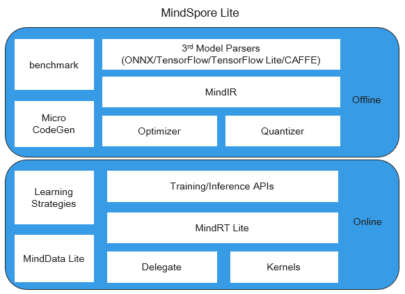

# 总体架构

MindSpore Lite是一款极速、极智、极简的AI引擎，使能全场景智能应用，为用户提供端到端的解决方案，帮助用户使能AI能力。

MindSpore Lite 分为离线模块和在线模块两个部分，其框架的总体架构如下所示：

- 离线模块：

    - **3rd Model Parsers:** 将第三方模型转换为统一的MindIR，其中第三方模型包括TensorFlow、TensorFlow Lite、Caffe 1.0和ONNX模型。

    - **MindIR:** MindSpore端云统一的IR。

    - **Optimizer:** 基于IR进行图优化，如算子融合、常量折叠等。

    - **Quantizer:** 训练后量化模块，支持权重量化、激活值量化等训练后量化手段。

    - **benchmark:** 测试性能以及调试精度的工具集。

    - **Micro CodeGen:** 针对IoT场景，将模型直接编译为可执行文件的工具。

- 在线模块：

    - **Training/Inference APIs:** 端云统一的C++/Java训练推理接口。

    - **MindRT Lite:** 轻量化的在线运行时，支持异步执行。

    - **MindData Lite:** 用于端侧数据处理。

    - **Delegate:** 用于对接专业AI硬件引擎的代理。

    - **Kernels:** 内置的高性能算子库，提供CPU、GPU和NPU算子。

    - **Learning Strategies:** 端侧学习策略，如迁移学习。
