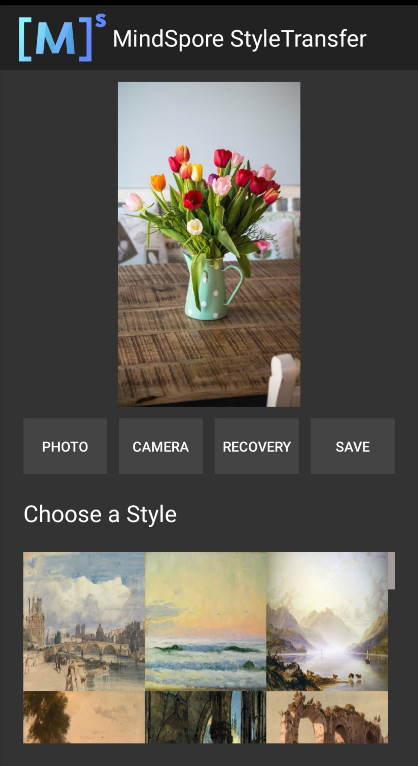

# 风格迁移模型

## 风格迁移介绍

风格迁移模型可以根据demo内置的标准图片改变用户目标图片的艺术风格，并在App图像预览界面中显示出来。用户可保存风格迁移结果，或者恢复图片的原始形态。

使用demo打开目标图片：

选择左起第一张标准图片进行风格迁移，效果如图：

使用MindSpore Lite实现风格迁移的[示例代码](https://gitee.com/mindspore/models/tree/master/official/lite/style_transfer)。
