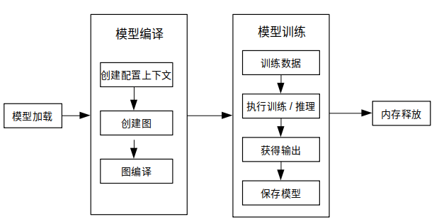

# 端侧训练（C++接口）

[](https://atomgit.com/mindspore/docs/blob/r2.9.0/docs/lite/docs/source_zh_cn/train/runtime_train_cpp.md)

## 概述

端侧训练主要步骤：

1. 使用云侧接口设计模型并导出`MindIR`模型文件。
2. 将`MindIR`模型文件转换为`ms`模型文件。
3. 在设备端训练、验证和保存`ms`模型文件。

> 转换得到的`ms`模型文件包含模型结构，该文件将被载入设备端进行训练。

下图展示了训练详细流程：



> 更多C++ API说明，请参考[API文档](https://www.mindspore.cn/lite/api/zh-CN/r2.9.0/index.html)。

## 模型创建加载与编译

MindSpore Lite训练框架中的[Model](https://www.mindspore.cn/lite/api/zh-CN/r2.9.0/generate/classmindspore_Model.html)是训练的主入口。通过`Model`，我们可以实现模型加载、模型编译和模型执行。

### 读取模型

模型文件是一个flatbuffer序列化文件，它通过MindSpore Lite模型转换工具得到，其文件扩展名为`.ms`。在模型训练或推理之前，模型需要从文件系统中加载。相关操作主要在[Serialization](https://www.mindspore.cn/lite/api/zh-CN/r2.9.0/generate/classmindspore_Serialization.html)类中实现，该类实现了模型文件读写的方法。

### 创建上下文

[Context](https://www.mindspore.cn/lite/api/zh-CN/r2.9.0/generate/classmindspore_Context.html)是一个MindSpore Lite对象，它包含了`Model`用来加载模型文件、引导图编译和执行的基础配置参数。它能够让你指定模型运行的设备类型（例如CPU或GPU），模型训练和推理时使用的线程数量，以及内存分配策略。目前`Model`只支持单线程的CPU设备。

如果用户通过`new`创建`Context`，不再需要时，需要用户通过`delete`释放。一般在`Model`对象创建完成后，`Context`对象即可释放。

### 创建迭代训练

当前`MindSpore Lite`已移除`MindData`及其相关高阶训练接口，包括`Train`、`Evaluate`，以及部分依赖的回调类（如`AccuracyMetrics`、`CkptSaver`、`TrainAccuracy`、`LossMonitor` 等）。
因此，暂不支持通过高阶接口进行模型训练。后续将补充基于 `RunStep` 接口的训练使用说明。

另外，由于`libmindspore-lite-train`与`libmindspore-lite`之间为弱依赖关系，在使用 C++ 接口`RunStep`进行训练时，如需启用训练能力，需要显式强制链接`libmindspore-lite-train`对应的动态库（.so），可通过链接选项`-Wl,--no-as-needed`实现。

## 数据处理

当前由于移除了 `MindData` 模块及其依赖的高阶接口 `Train` 和 `Evaluate`，所有与 `dataset` 相关的类均已删除。因此，用户需要自行实现数据预处理流程，将图像或文本等原始数据处理为字节数据，并手动拷贝到模型输入中进行推理或训练。

## 执行训练和推理

当前`MindSpore Lite`已移除`MindData`及其相关高阶训练接口，包括`Train`、`Evaluate`，以及部分依赖的回调类（如`AccuracyMetrics`、`CkptSaver`、`TrainAccuracy`、`LossMonitor` 等）。
因此，暂不支持通过高阶接口进行模型训练。后续将补充基于 `RunStep` 接口的训练使用说明。

另外，由于`libmindspore-lite-train`与`libmindspore-lite`之间为弱依赖关系，在使用 C++ 接口`RunStep`进行训练时，如需启用训练能力，需要显式强制链接`libmindspore-lite-train`对应的动态库（.so），可通过链接选项`-Wl,--no-as-needed`实现。

## 其他

### 输入维度Resize

使用MindSpore Lite进行推理时，如果需要对输入的shape进行Resize，则可以在已完成创建[Model](https://www.mindspore.cn/lite/api/zh-CN/r2.9.0/generate/classmindspore_Model.html)与模型编译[Build](https://www.mindspore.cn/lite/api/zh-CN/r2.9.0/generate/classmindspore_Model.html#build)之后调用Model的[Resize](https://www.mindspore.cn/lite/api/zh-CN/r2.9.0/generate/classmindspore_Model.html#resize)接口，对输入的Tensor重新设置shape。

> 某些网络不支持可变维度，会提示错误信息后异常退出，比如，模型中有MatMul算子，并且MatMul的一个输入Tensor是权重，另一个输入Tensor是变量时，调用可变维度接口可能会导致输入Tensor和权重Tensor的Shape不匹配，最终导致训练失败。

下面示例代码演示训练时如何对MindSpore Lite的输入Tensor进行Resize：

```cpp
// Assume we have created a Model instance named model.
auto inputs = model->GetInputs();
std::vector<int64_t> resize_shape = {16, 32, 32, 1};
// Assume the model has only one input,resize input shape to [16, 32, 32, 1]
std::vector<std::vector<int64_t>> new_shapes;
new_shapes.push_back(resize_shape);
return model->Resize(inputs, new_shapes);
```

### 获取输入张量

在图执行之前，无论执行训练或推理，输入数据必须载入模型的输入张量。MindSpore Lite提供了以下函数来获取模型的输入张量：

1. 使用[GetInputByTensorName](https://www.mindspore.cn/lite/api/zh-CN/r2.9.0/generate/classmindspore_Model.html#getinputbytensorname)方法，获取基于张量名称的模型输入张量。

    ```cpp
    /// \brief  Get input MindSpore Lite MSTensors of model by tensor    name.
    ///
    /// \param[in] tensor_name  Define tensor name.
    ///
    /// \return  MindSpore Lite MSTensor.
    inline MSTensor GetInputByTensorName(const std::string &tensor_name);
    ```

2. 使用[GetInputs](https://www.mindspore.cn/lite/api/zh-CN/r2.9.0/generate/classmindspore_Model.html#getinputs)方法，直接获取所有模型输入张量的向量。

    ```cpp
    /// \brief  Get input MindSpore Lite MSTensors of model.
    ///
    /// \return  The vector of MindSpore Lite MSTensor.
    std::vector<MSTensor> GetInputs();
    ```

    如果模型需要1个以上的输入张量（例如训练过程中，数据和标签都作为网络的输入），用户有必要知道输入顺序和张量名称，这些信息可以从Python对应的模型中获取。此外，用户也可以根据输入张量的大小推导出这些信息。

3. 拷贝数据

    一旦获取到了模型的输入张量，数据需要拷贝到张量中。下列方法可以获取数据字节大小、数据维度、元素个数、数据类型和写指针。详见 [MSTensor](https://www.mindspore.cn/lite/api/zh-CN/r2.9.0/generate/classmindspore_MSTensor.html) API 文档。

    ```cpp
    /// \brief Obtains the length of the data of the MSTensor, in bytes.
    ///
    /// \return The length of the data of the MSTensor, in bytes.
    size_t DataSize() const;

    /// \brief Obtains the number of elements of the MSTensor.
    ///
    /// \return The number of elements of the MSTensor.
    int64_t ElementsNum() const;

    /// \brief Obtains the data type of the MSTensor.
    ///
    /// \return The data type of the MSTensor.
    enum DataType DataType() const;

    /// \brief Obtains the pointer to the data of the MSTensor. If the MSTensor is a device tensor, the data cannot be
    /// accessed directly on host.
    ///
    /// \return A pointer to the data of the MSTensor.
    void *MutableData();
    ```

    以下示例代码展示了如何从`Model`中获取完整的图输入张量和如何将模型输入数据转换为`MSTensor`类型。

    ```cpp
    // Assuming model is a valid instance of Model
    auto inputs = model->GetInputs();

    // Assuming the model has two input tensors, the first is for data and the second for labels
    int data_index = 0;
    int label_index = 1;

    if (inputs.size() != 2) {
        std::cerr << "Unexpected amount of input tensors. Expected 2, model requires " << inputs.size() << std::endl;
        return -1;
    }

    // Assuming batch_size and data_size variables hold the Batch size and the size of a single data tensor, respectively:
    // And assuming sparse labels are used
    if ((inputs.at(data_index)->Size() != batch_size*data_size) ||
        (inputs.at(label_index)->ElementsNum() != batch_size)) {
        std::cerr << "Input data size does not match model input" << std::endl;
        return -1;
    }

    // Assuming data_ptr is the pointer to a batch of data tensors
    // and assuming label_ptr is a pointer to a batch of label indices (obtained by the DataLoader)
    auto *in_data = inputs.at(data_index)->MutableData();
    auto *in_labels = inputs.at(label_index)->MutableData();
    if ((in_data == nullptr) || (in_labels == nullptr)) {
        std::cerr << "Model's input tensor is nullptr" << std::endl;
        return -1;
    }

    memcpy(in_data, data_ptr, inputs.at(data_index)->Size());
    memcpy(in_labels, label_ptr, inputs.at(label_index)->Size());
    // After filling the input tensors the data_ptr and label_ptr may be freed
    // The input tensors themselves are managed by MindSpore Lite and users are not allowed to access them or delete them
    ```

    > - MindSpore Lite模型输入张量的数据维度必须为NHWC（批次数，高度，宽度和通道数）。
    > - 用户不能主动释放`GetInputs`和`GetInputByTensorName`函数返回的张量。

### 获取输出张量

MindSpore Lite提供下列方法来获取模型的输出张量：

1. 使用[GetOutputsByNodeName](https://www.mindspore.cn/lite/api/zh-CN/r2.9.0/generate/classmindspore_Model.html#getoutputsbynodename)方法获取一个确定节点的输出张量。

    ```cpp
    /// \brief Get output MSTensors of model by node name.
    ///
    /// \param[in] node_name Define node name.
    ///
    /// \note Deprecated, replace with GetOutputByTensorName
    ///
    /// \return The vector of output MSTensor.
    inline std::vector<MSTensor> GetOutputsByNodeName(const std::string &node_name);
    ```

    下列代码为使用`GetOutputsByNodeName`方法从当前会话中获取输出张量：

    ```cpp
    // Assume that model is a valid model instance
    // Assume that model has an output node named output_node_name_0.
    auto output_vec = model->GetOutputsByNodeName("output_node_name_0");
    // Assume that output node named output_node_name_0 has only one output tensor.
    auto out_tensor = output_vec.front();
    if (out_tensor == nullptr) {
        std::cerr << "Output tensor is nullptr" << std::endl;
        return -1;
    }
    ```

2. 使用[GetOutputByTensorName](https://www.mindspore.cn/lite/api/zh-CN/r2.9.0/generate/classmindspore_Model.html#getoutputbytensorname)方法，依据张量名称获取输出张量。

    ```cpp
    /// \brief Obtains the output tensor of the model by name.
    ///
    /// \return The output tensor with the given name, if the name is not found, an invalid tensor is returned.
    inline MSTensor GetOutputByTensorName(const std::string &tensor_name);
    ```

    下列代码为使用`GetOutputByTensorName`方法从当前会话中获取输出张量：

    ```cpp
    // Assume that model is a valid model instance
    // We can use GetOutputByTensorName method to get the names of all the output tensors of the model
    auto tensor_names = model->GetOutputTensorNames();
    // Use output tensor name returned by GetOutputTensorNames as key
    for (auto tensor_name : tensor_names) {
        auto out_tensor = model->GetOutputByTensorName(tensor_name);
        if (out_tensor == nullptr) {
            std::cerr << "Output tensor is nullptr" << std::endl;
            return -1;
        }
    }
    ```

3. 使用[GetOutputs](https://www.mindspore.cn/lite/api/zh-CN/r2.9.0/generate/classmindspore_Model.html#getoutputs)方法，获取根据张量名称排序的所有输出张量。

    ```cpp
    /// \brief Obtains all output tensors of the model.
    ///
    /// \return The vector that includes all output tensors.
    std::vector<MSTensor> GetOutputs();

    /// \brief Obtains the number of elements of the MSTensor.
    ///
    /// \return The number of elements of the MSTensor.
    int64_t ElementsNum() const;

    /// \brief Obtains the data type of the MSTensor.
    ///
    /// \return The data type of the MSTensor.
    enum DataType DataType() const;

    /// \brief Obtains the pointer to the data of the MSTensor. If the MSTensor is a device tensor, the data cannot be
    /// accessed directly on host.
    ///
    /// \return A pointer to the data of the MSTensor.
    void *MutableData();
    ```

    下列代码展示了如何使用`GetOutputs`方法从会话中获取输出张量，并打印前10个数据或每个输出张量的数据记录。

    ```cpp
    auto out_tensors = model->GetOutputs();
    for (auto out_tensor : out_tensors) {
      std::cout << "tensor name is:" << out_tensor.Name() << " tensor size is:" << out_tensor.DataSize()
                << " tensor elements num is:" << out_tensor.ElementsNum() << std::endl;
      // The model output data is float 32.
      if (out_tensor.DataType() != mindspore::DataType::kNumberTypeFloat32) {
        std::cerr << "Output should in float32" << std::endl;
        return;
      }
      auto out_data = reinterpret_cast<float *>(out_tensor.MutableData());
      if (out_data == nullptr) {
        std::cerr << "Data of out_tensor is nullptr" << std::endl;
        return -1;
      }
      std::cout << "output data is:";
      for (int i = 0; i < out_tensor.ElementsNum() && i < 10; i++) {
        std::cout << out_data[i] << " ";
      }
      std::cout << std::endl;
    }
    ```

    > 用户无需手动释放 `GetOutputsByNodeName`、`GetOutputByTensorName`和`GetOutputs`函数返回的数组或是哈希表。

### 保存模型

MindSpore Lite的`Serialization`类实际调用的是`ExportModel`函数，`ExportModel`原型如下：

```cpp
  static Status ExportModel(const Model &model, ModelType model_type, const std::string &model_file,
                            QuantizationType quantization_type = kNoQuant, bool export_inference_only = true,
                            std::vector<std::string> output_tensor_name = {});
```

保存的模型可继续用于训练或推理。

> 请使用[benchmark_train](https://www.mindspore.cn/lite/docs/zh-CN/r2.9.0/tools/benchmark_train_tool.html)进行训练模型性能和精度评估。
