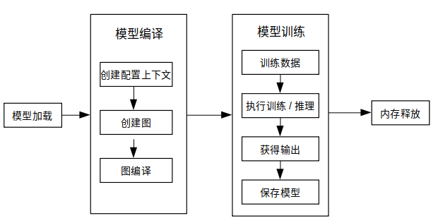

# 端侧训练（C++接口）

[](https://gitee.com/mindspore/docs/blob/r2.6.0/docs/lite/docs/source_zh_cn/train/runtime_train_cpp.md)

## 概述

端侧训练主要步骤：

1. 使用云侧接口设计模型并导出`MindIR`模型文件。
2. 将`MindIR`模型文件转换为`ms`模型文件。
3. 在设备端训练、验证和保存`ms`模型文件。

> 转换得到的`ms`模型文件包含模型结构，该文件将被载入设备端进行训练。

下图展示了训练详细流程：



> 更多C++ API说明，请参考[API文档](https://www.mindspore.cn/lite/api/zh-CN/r2.6.0/index.html)。

## 模型创建加载与编译

MindSpore Lite训练框架中的[Model](https://www.mindspore.cn/lite/api/zh-CN/r2.6.0/api_cpp/mindspore.html#model)是训练的主入口。通过`Model`，我们可以实现模型加载、模型编译和模型执行。

### 读取模型

模型文件是一个flatbuffer序列化文件，它通过MindSpore模型转换工具得到，其文件扩展名为`.ms`。在模型训练或推理之前，模型需要从文件系统中加载。相关操作主要在[Serialization](https://www.mindspore.cn/lite/api/zh-CN/r2.6.0/api_cpp/mindspore.html#serialization)类中实现，该类实现了模型文件读写的方法。

### 创建上下文

[Context](https://www.mindspore.cn/lite/api/zh-CN/r2.6.0/api_cpp/mindspore.html#context)是一个MindSpore Lite对象，它包含了`Model`用来加载模型文件、引导图编译和执行的基础配置参数。它能够让你指定模型运行的设备类型（例如CPU或GPU），模型训练和推理时使用的线程数量，以及内存分配策略。目前`Model`只支持单线程的CPU设备。

如果用户通过`new`创建`Context`，不再需要时，需要用户通过`delete`释放。一般在`Model`对象创建完成后，`Context`对象即可释放。

### 创建迭代训练

用户可通过`Model`的`Build`方法将模型编译至可运行状态。`Build`原型如下：

  `Status Build(GraphCell graph, const std::shared_ptr<Context> &model_context = nullptr, const std::shared_ptr<TrainCfg> &train_cfg = nullptr);`

下面示例代码演示了如何使用`Model`类在CPU多线程上创建训练会话：

```cpp
int CreateSession() {
  auto context = std::make_shared<mindspore::Context>();
  auto cpu_context = std::make_shared<mindspore::CPUDeviceInfo>();
  cpu_context->SetEnableFP16(enable_fp16_);
  context->MutableDeviceInfo().push_back(cpu_context);

  graph_ = new mindspore::Graph();
  auto status = mindspore::Serialization::Load(ms_file_, mindspore::kFlatBuffer, graph_);
  if (status != mindspore::kSuccess) {
    std::cout << "Error " << status << " during serialization of graph " << ms_file_;
    MS_ASSERT(status != mindspore::kSuccess);
  }

  auto cfg = std::make_shared<mindspore::TrainCfg>();
  if (enable_fp16_) {
    cfg.get()->optimization_level_ = mindspore::kO2;
  }

  model_ = new mindspore::Model();
  status = model_->Build(mindspore::GraphCell(*graph_), context, cfg);
  if (status != mindspore::kSuccess) {
    std::cout << "Error " << status << " during build of model " << ms_file_;
    MS_ASSERT(status != mindspore::kSuccess);
  }
  return;
}
```

> 参见[训练一个LeNet](https://gitee.com/mindspore/mindspore/blob/v2.6.0/mindspore/lite/examples/train_lenet_cpp/src/net_runner.cc)获取完整代码。

## 数据处理

### 数据输入流

`Dataset`类及其扩展类（例如`MnistDataset`和`AlbumDataset`）为用户提供了丰富的数据处理API，用户只需要指定数据集的路径，通过接口函数返回对应类型的共享指针来设定训练中执行的数据处理操作，输入流会在训练过程中加载并解析数据。API说明详见[Dataset](https://www.mindspore.cn/lite/api/zh-CN/r2.6.0/generate/classmindspore_dataset_Dataset.html)。

### 数据预处理流

`TensorTransform`类其扩展类（例如`TypeCast`和`OneHot`）为用户提供了丰富的数据预处理API，其功能与云侧Python接口相同，例如维度重塑、数据类型转换和独热编码等，用户只需要创建`TensorTransform`扩展类的对象并传递给Map函数，Map会在训练过程中顺序调用预处理函数处理已加载的数据。API说明详见[Vision](https://www.mindspore.cn/lite/api/zh-CN/r2.6.0/generate/namespace_mindspore__dataset__vision.html)。

### 使用示例

下述代码展示了如何使用`Dataset`类和`TensorTransform`类读取和处理数据：

```cpp
int DataSetPipeline() {
    train_ds_ = Mnist(data_dir_ + "/train", "all", std::make_shared<SequentialSampler>(0, 0));

    TypeCast typecast_f(mindspore::DataType::kNumberTypeFloat32);
    Resize resize({h_, w_});
    train_ds_ = train_ds_->Map({&resize, &typecast_f}, {"image"});

    TypeCast typecast(mindspore::DataType::kNumberTypeInt32);
    train_ds_ = train_ds_->Map({&typecast}, {"label"});

    train_ds_ = train_ds_->Batch(batch_size_, true);
    if (verbose_) {
    std::cout << "DatasetSize is " << train_ds_->GetDatasetSize() << std::endl;
    }
    if (train_ds_->GetDatasetSize() == 0) {
    std::cout << "No relevant data was found in " << data_dir_ << std::endl;
    MS_ASSERT(train_ds_->GetDatasetSize() != 0);
    }
    return 0;
}
```

示例中用户可通过Mnist函数返回的`MnistDataset`类共享指针调用`Dataset`类和`TensorTransform`类的现有函数来定义训练数据处理流程。

## 执行训练

MindSpore为用户提供了现有的回调类：`AccuracyMetrics`、`CkptSaver`、`TrainAccuracy`、`LossMonitor`和`Metrics`。`Model`类的`Train`和`Evaluate`函数分别将模型设置为训练和验证模式，指定数据预处理方法并监测会话状态。

### 训练

创建现有回调类对象并调用`Model`类的`Train`函数进行训练：

```cpp
int Train() {
  mindspore::LossMonitor lm(kPrintTimes);
  mindspore::TrainAccuracy am(1);

  mindspore::CkptSaver cs(kSaveEpochs, std::string("lenet"));
  Rescaler rescale(kScalePoint);
  Measurement measure(epochs_);

  if (virtual_batch_ > 0) {
    model_->Train(epochs_, train_ds_, {&rescale, &lm, &cs, &measure});
  } else {
    struct mindspore::StepLRLambda step_lr_lambda(1, kGammaFactor);
    mindspore::LRScheduler step_lr_sched(mindspore::StepLRLambda, static_cast<void *>(&step_lr_lambda), 1);
    model_->Train(epochs_, train_ds_, {&rescale, &lm, &cs, &am, &step_lr_sched, &measure});
  }

  return 0;
}
```

### 推理

同样，我们调用`Model`类的`Evaluate`函数进行推理：

```cpp
float Evaluate() {
  test_ds_ = Mnist(data_dir_ + "/test", "all");
  TypeCast typecast_f(mindspore::DataType::kNumberTypeFloat32);
  Resize resize({h_, w_});
  test_ds_ = test_ds_->Map({&resize, &typecast_f}, {"image"});

  TypeCast typecast(mindspore::DataType::kNumberTypeInt32);
  test_ds_ = test_ds_->Map({&typecast}, {"label"});
  test_ds_ = test_ds_->Batch(batch_size_, true);

  model_->Evaluate(test_ds_, {});
  std::cout << "Accuracy is " << acc_metrics_->Eval() << std::endl;

  return 0.0;
}
```

> 推理和训练模式的不同点：
>
> - 网络输入：训练需要数据和标签，而推理只需要数据。
> - 网络输出：训练返回损失值，而推理返回预测标签值。
> - 每一轮训练都会更新网络的各层权重值，但推理不会。
> - 网络的某些层在训练和推理具有不同的输出，例如在批量标准化 (Batch Normalization) 层中更新批次累计均值和方差。

## 其他

### 会话模式切换

`Model`类中的`Train`和`Evaluate`的函数原型如下：

```cpp
/// \brief Set model to train mode
/// \return STATUS as an error code of compiling graph, STATUS is defined in errorcode.h
Status Train(int epochs, std::shared_ptr<dataset::Dataset> ds, std::vector<TrainCallBack *> cbs);

/// \brief Set model to Evaluate mode
/// \return STATUS as an error code of compiling graph, STATUS is defined in errorcode.h
Status Evaluate(std::shared_ptr<dataset::Dataset> ds, std::vector<TrainCallBack *> cbs);
```

下述代码展示了如何将一个当前训练会话设置为训练或验证模式：

```cpp
auto ret = model->Train();
if (ret != RET_OK) {
    std::cerr << "Could not set to train mode" << std::endl;
    return -1;
}

auto ret = model->Evaluate();
if (ret != RET_OK) {
    std::cerr << "Could not set to evaluate mode" << std::endl;
    return -1;
}
```

### 输入维度Resize

使用MindSpore Lite进行推理时，如果需要对输入的shape进行Resize，则可以在已完成创建[Model](https://www.mindspore.cn/lite/api/zh-CN/r2.6.0/api_cpp/mindspore.html#model)与模型编译[Build](https://www.mindspore.cn/lite/api/zh-CN/r2.6.0/api_cpp/mindspore.html#build)之后调用Model的[Resize](https://www.mindspore.cn/lite/api/zh-CN/r2.6.0/api_cpp/mindspore.html#resize)接口，对输入的Tensor重新设置shape。

> 某些网络不支持可变维度，会提示错误信息后异常退出，比如，模型中有MatMul算子，并且MatMul的一个输入Tensor是权重，另一个输入Tensor是变量时，调用可变维度接口可能会导致输入Tensor和权重Tensor的Shape不匹配，最终导致训练失败。

下面示例代码演示训练时如何对MindSpore Lite的输入Tensor进行Resize：

```cpp
// Assume we have created a Model instance named model.
auto inputs = model->GetInputs();
std::vector<int64_t> resize_shape = {16, 32, 32, 1};
// Assume the model has only one input,resize input shape to [16, 32, 32, 1]
std::vector<std::vector<int64_t>> new_shapes;
new_shapes.push_back(resize_shape);
return model->Resize(inputs, new_shapes);
```

### 获取输入张量

在图执行之前，无论执行训练或推理，输入数据必须载入模型的输入张量。MindSpore Lite提供了以下函数来获取模型的输入张量：

1. 使用[GetInputByTensorName](https://www.mindspore.cn/lite/api/zh-CN/r2.6.0/api_cpp/mindspore.html#getinputbytensorname)方法，获取连接到基于张量名称的模型输入节点模型输入张量。

    ```cpp
    /// \brief  Get input MindSpore Lite MSTensors of model by tensor    name.
    ///
    /// \param[in] tensor_name  Define tensor name.
    ///
    /// \return  MindSpore Lite MSTensor.
    inline MSTensor GetInputByTensorName(const std::string &tensor_name);
    ```

2. 使用[GetInputs](https://www.mindspore.cn/lite/api/zh-CN/r2.6.0/api_cpp/mindspore.html#getinputs)方法，直接获取所有模型输入张量的向量。

    ```cpp
    /// \brief  Get input MindSpore Lite MSTensors of model.
    ///
    /// \return  The vector of MindSpore Lite MSTensor.
    std::vector<MSTensor> GetInputs();
    ```

    如果模型需要1个以上的输入张量（例如训练过程中，数据和标签都作为网络的输入），用户有必要知道输入顺序和张量名称，这些信息可以从Python对应的模型中获取。此外，用户也根据输入张量的大小推导出这些信息。

3. 拷贝数据

    一旦获取到了模型的输入张量，数据需要拷贝到张量中。下列方法可以获取数据字节大小、数据维度、元素个数、数据类型和写指针。详见 [MSTensor](https://www.mindspore.cn/lite/api/zh-CN/r2.6.0/api_cpp/mindspore.html#mstensor) API 文档。

    ```cpp
    /// \brief Obtains the length of the data of the MSTensor, in bytes.
    ///
    /// \return The length of the data of the MSTensor, in bytes.
    size_t DataSize() const;

    /// \brief Obtains the number of elements of the MSTensor.
    ///
    /// \return The number of elements of the MSTensor.
    int64_t ElementNum() const;

    /// \brief Obtains the data type of the MSTensor.
    ///
    /// \return The data type of the MSTensor.
    enum DataType DataType() const;

    /// \brief Obtains the pointer to the data of the MSTensor. If the MSTensor is a device tensor, the data cannot be
    /// accessed directly on host.
    ///
    /// \return A pointer to the data of the MSTensor.
    void *MutableData();
    ```

    以下示例代码展示了如何从`Model`中获取完整的图输入张量和如何将模型输入数据转换为`MSTensor`类型。

    ```cpp
    // Assuming model is a valid instance of Model
    auto inputs = model->GetInputs();

    // Assuming the model has two input tensors, the first is for data and the second for labels
    int data_index = 0;
    int label_index = 1;

    if (inputs.size() != 2) {
        std::cerr << "Unexpected amount of input tensors. Expected 2, model requires " << inputs.size() << std::endl;
        return -1;
    }

    // Assuming batch_size and data_size variables hold the Batch size and the size of a single data tensor, respectively:
    // And assuming sparse labels are used
    if ((inputs.at(data_index)->Size() != batch_size*data_size) ||
        (inputs.at(label_index)->ElementsNum() != batch_size)) {
        std::cerr << "Input data size does not match model input" << std::endl;
        return -1;
    }

    // Assuming data_ptr is the pointer to a batch of data tensors
    // and assuming label_ptr is a pointer to a batch of label indices (obtained by the DataLoder)
    auto *in_data = inputs.at(data_index)->MutableData();
    auto *in_labels = inputs.at(label_index)->MutableData();
    if ((in_data == nullptr)|| (in_labels == nullptr)) {
        std::cerr << "Model's input tensor is nullptr" << std::endl;
        return -1;
    }

    memcpy(in_data, data_ptr, inputs.at(data_index)->Size());
    memcpy(in_labels, label_ptr, inputs.at(label_index)->Size());
    // After filling the input tensors the data_ptr and label_ptr may be freed
    // The input tensors themselves are managed by MindSpore Lite and users are not allowed to access them or delete them
    ```

    > - MindSpore Lite模型输入张量的数据维度必须为NHWC（批次数，高度，宽度和通道数）。
    > - 用户不能主动释放`GetInputs`和`GetInputByTensorName`函数返回的张量。

### 获取输出张量

MindSpore Lite提供下列方法来获取模型的输出张量：

1. 使用[GetOutputsByNodeName](https://www.mindspore.cn/lite/api/zh-CN/r2.6.0/api_cpp/mindspore.html#getoutputsbynodename)方法获取一个确定节点的输出张量。

    ```cpp
    /// \brief Get output MSTensors of model by node name.
    ///
    /// \param[in] node_name Define node name.
    ///
    /// \note Deprecated, replace with GetOutputByTensorName
    ///
    /// \return The vector of output MSTensor.
    inline std::vector<MSTensor> GetOutputsByNodeName(const std::string &node_name);
    ```

    下列代码为使用`GetOutputsByNodeName`方法从当前会话中获取输出张量：

    ```cpp
    // Assume that model is a valid model instance
    // Assume that model has an output node named output_node_name_0.
    auto output_vec = model->GetOutputsByNodeName("output_node_name_0");
    // Assume that output node named output_node_name_0 has only one output tensor.
    auto out_tensor = output_vec.front();
    if (out_tensor == nullptr) {
        std::cerr << "Output tensor is nullptr" << std::endl;
        return -1;
    }
    ```

2. 使用[GetOutputByTensorName](https://www.mindspore.cn/lite/api/zh-CN/r2.6.0/api_cpp/mindspore.html#getoutputbytensorname)方法，依据张量名称获取输出张量。

    ```cpp
    /// \brief Obtains the output tensor of the model by name.
    ///
    /// \return The output tensor with the given name, if the name is not found, an invalid tensor is returned.
    inline MSTensor GetOutputByTensorName(const std::string &tensor_name);
    ```

    下列代码为使用`GetOutputByTensorName`方法从当前会话中获取输出张量：

    ```cpp
    // Assume that model is a valid model instance
    // We can use GetOutputByTensorName method to get the names of all the output tensors of the model
    auto tensor_names = model->GetOutputTensorNames();
    // Use output tensor name returned by GetOutputTensorNames as key
    for (auto tensor_name : tensor_names) {
        auto out_tensor = model->GetOutputByTensorName(tensor_name);
        if (out_tensor == nullptr) {
            std::cerr << "Output tensor is nullptr" << std::endl;
            return -1;
        }
    }
    ```

3. 使用[GetOutputs](https://www.mindspore.cn/lite/api/zh-CN/r2.6.0/api_cpp/mindspore.html#getoutputs)方法，根据张量名称排序的所有输出张量。

    ```cpp
    /// \brief Obtains all output tensors of the model.
    ///
    /// \return The vector that includes all output tensors.
    std::vector<MSTensor> GetOutputs();

    /// \brief Obtains the number of elements of the MSTensor.
    ///
    /// \return The number of elements of the MSTensor.
    int64_t ElementNum() const;

    /// \brief Obtains the data type of the MSTensor.
    ///
    /// \return The data type of the MSTensor.
    enum DataType DataType() const;

    /// \brief Obtains the pointer to the data of the MSTensor. If the MSTensor is a device tensor, the data cannot be
    /// accessed directly on host.
    ///
    /// \return A pointer to the data of the MSTensor.
    void *MutableData();
    ```

    下列代码展示了如何使用`GetOutputs`方法从会话中获取输出张量，并打印前10个数据或每个输出张量的数据记录。

    ```cpp
    auto out_tensors = model->GetOutputs();
    for (auto out_tensor : out_tensors) {
      std::cout << "tensor name is:" << out_tensor.Name() << " tensor size is:" << out_tensor.DataSize()
                << " tensor elements num is:" << out_tensor.ElementNum() << std::endl;
      // The model output data is float 32.
      if (out_tensor.DataType() != mindspore::DataType::kNumberTypeFloat32) {
        std::cerr << "Output should in float32" << std::endl;
        return;
      }
      auto out_data = reinterpret_cast<float *>(out_tensor.MutableData());
      if (out_data == nullptr) {
        std::cerr << "Data of out_tensor is nullptr" << std::endl;
        return -1;
      }
      std::cout << "output data is:";
      for (int i = 0; i < out_tensor.ElementNum() && i < 10; i++) {
        std::cout << out_data[i] << " ";
      }
      std::cout << std::endl;
    }
    ```

    > 用户无需手动释放 `GetOutputsByNodeName`、`GetOutputByTensorName`和`GetOutputs`函数返回的数组或是哈希表。

### 执行回调

MindSpore Lite框架允许用户设置两个在每个节点计算前后调用的回调函数。这两个函数能够帮助用户跟踪、调试网络，并测量各节点的计算时间。回调参数如下：

- 计算节点的当前输入张量。
- 计算节点的当前输出张量。
- 计算节点的名称和类型。

尽管节点计算前后的名称和类型一致，两个回调函数的输出张量却不同。对于某些计算操作，输入张量也不同。

```cpp
/// \brief  CallBackParam defines input arguments for callback function.
struct CallBackParam {
  std::string node_name; /**< node name argument */
  std::string node_type; /**< node type argument */
};

/// \brief KernelCallBack defined the function pointer for callBack.
using KernelCallBack = std::function<bool(std::vector<tensor::MSTensor *> inputs,
 std::vector<tensor::MSTensor *> outputs,  const CallBackParam &opInfo)>;
```

以下代码为如何在执行训练前后使用回调函数：

```cpp
// Assuming model is a valid instance of Model and that data was assigned to the input tensors

// Definition of a callback function that will be called before forwarding operator
bool before_callback(const std::vector<mindspore::tensor::MSTensor *> &inputs,
 const std::vector<mindspore::tensor::MSTensor *> &outputs,
 const mindspore::MSCallBackParam &call_param) {
    std::cout << call_param.node_name << std::endl;
    std::cout << "Before forwarding: input size is " << inputs.size() << std::endl;
    return true;
};
// Definition of callback function that will be called after forwarding operator
bool after_callback(const std::vector<mindspore::tensor::MSTensor *> &inputs,
 const std::vector<mindspore::tensor::MSTensor *> &outputs,
 const mindspore::MSCallBackParam &call_param) {
    std::cout << "After forwarding: output size is " << outputs.size() << std::endl;
    return true;
};

// Hand over the callback functions to RunGraph when performing the training or inference
ret = model_->Train(epochs_, train_ds_, {&before_callback, &after_callback});
if (ret != RET_OK) {
  MS_LOG(ERROR) << "Run graph failed.";
  return RET_ERROR;
}
```

### 保存模型

MindSpore的`Serialization`类实际调用的是`ExportModel`函数，`ExportModel`原型如下：

```cpp
  static Status ExportModel(const Model &model, ModelType model_type, const std::string &model_file,
                            QuantizationType quantization_type = kNoQuant, bool export_inference_only = true,
                            std::vector<std::string> output_tensor_name = {});
```

保存的模型可继续用于训练或推理。

> 请使用[benchmark_train](https://www.mindspore.cn/lite/docs/zh-CN/r2.6.0/tools/benchmark_train_tool.html)进行训练模型性能和精度评估。
