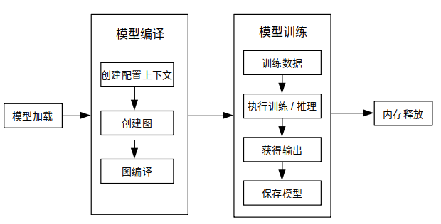

# 端侧训练（Java接口）

[](https://gitee.com/mindspore/docs/blob/r2.6.0rc1/docs/lite/docs/source_zh_cn/train/runtime_train_java.md)

## 概述

端侧训练主要步骤：

1. 使用云侧接口设计模型并导出`MindIR`模型文件。
2. 将`MindIR`模型文件转换为`ms`模型文件。
3. 在设备端训练、验证和保存`ms`模型文件。

> 转换得到的 *.ms 模型文件包含模型结构，.ms模型文件将被载入设备端进行训练。

下图展示了训练详细流程：



> 更多java API说明，请参考[API文档](https://www.mindspore.cn/lite/api/zh-CN/r2.6.0rc1/index.html)。

## 模型创建加载与编译

MindSpore Lite训练框架中的[Model](https://www.mindspore.cn/lite/api/zh-CN/r2.6.0rc1/api_java/model.html#model)是训练的主入口，通过`Model`我们可以实现模型加载、模型编译和模型执行。

### 读取模型

模型文件是一个flatbuffer序列化文件，它通过MindSpore模型转换工具得到，其文件扩展名为`.ms`。在模型训练或推理之前，模型需要从文件系统中加载。相关操作主要在[Graph](https://www.mindspore.cn/lite/api/zh-CN/r2.6.0rc1/api_java/graph.html#graph)类中实现，该类实现了模型文件读写的方法。

### 创建上下文

[MSContext](https://www.mindspore.cn/lite/api/zh-CN/r2.6.0rc1/api_java/mscontext.html)是一个MindSpore Lite对象，它包含了`Model`用来加载模型文件、引导图编译和执行的基础配置参数。它能够让你指定模型运行的设备类型（例如CPU或GPU），模型训练和推理时使用的线程数量，以及内存分配策略。目前模型训练只支持CPU设备。

### 创建迭代训练

用户可通过`Model`的`Build`方法将模型编译至可运行状态。`Build`原型如下：

`public boolean build(Graph graph, MSContext context, TrainCfg cfg);`

下面示例代码演示了如何使用`Model`类在CPU多线程上创建训练会话：

```java
Graph g = new Graph();
MSContext context = new MSContext();
context.init(1, 0);
context.addDeviceInfo(DeviceType.DT_CPU, false, 0);
TrainCfg cfg = new TrainCfg();
cfg.init();
Model liteModel = new Model();
liteModel.build(g, context, cfg);
```

> 参照[训练一个LeNet](https://gitee.com/mindspore/mindspore/blob/v2.6.0-rc1/mindspore/lite/examples/train_lenet_java/src/main/java/com/mindspore/lite/train_lenet/NetRunner.java)获取完整代码。

## 数据处理

### 数据输入流

目前Java未提供如C++的数据处理`Dataset`类及其扩展类的数据处理API，用户需自行定义数据预处理流程，将图像或文本数据处理成字节数据后，拷贝到模型的输入。

### 使用示例

下述代码展示了Mnist数据读取和数据预处理过程：

```java
    public void readMNISTFile(String inputFileName, String labelFileName, Vector<DataLabelTuple> dataset) {
        try {
            BufferedInputStream ibin = new BufferedInputStream(new FileInputStream(inputFileName));
            BufferedInputStream lbin = new BufferedInputStream(new FileInputStream(labelFileName));
            byte[] bytes = new byte[4];

            ...
            // read images
            int image_size = n_rows * n_cols;
            byte[] image_data = new byte[image_size];
            for (int i = 0; i < lnumber; i++) {
                byte [] hwc_bin_image = new byte[32 * 32];
                readFile(ibin, image_data, image_size);
                for (int r = 0; r < 32; r++) {
                    for (int c = 0; c < 32; c++) {
                        int index = r * 32 + c;
                        if (r < 2 || r > 29 || c < 2 || c > 29) {
                            hwc_bin_image[index] = 0;
                        } else {
                            hwc_bin_image[index] = image_data[(r-2)*28 + (c-2)];
                        }
                    }
                }

                DataLabelTuple data_label_tupel = new DataLabelTuple();
                data_label_tupel.data = hwc_bin_image;
                data_label_tupel.label = labels[i];
                dataset.add(data_label_tupel);
            }
        } catch (IOException e) {
            System.err.println("Read Dateset exception");
        }
    }
```

> 参照[训练一个LeNet](https://gitee.com/mindspore/mindspore/blob/v2.6.0-rc1/mindspore/lite/examples/train_lenet_java/src/main/java/com/mindspore/lite/train_lenet/NetRunner.java)获取完整代码。

## 执行训练

MindSpore Lite Java 接口可通过`Model`类提供的接口获取模型的输出，在训练模式下，模型的输出为loss，推理模式下，模型的输出为预测值。可通过`setTrainMode`接口来切换训练和推理模式。通过`runStep`接口来执行模型。

### 训练

```java
model.setTrainMode(true);
for (int i = 0; i < cycles; i++) {
    for (int b = 0; b < virtualBatch; b++) {
        fillInputData(ds.getTrainData(), false);
        isSuccess = model.runStep();
        if (!isSuccess) {
            model.free();
            System.err.println("run step failed");
            return -1;
        }
        float loss = getLoss();
        if (min_loss > loss) {
            min_loss = loss;
        }
        if ((b == 0) && ((i + 1) % 500 == 0)) {
            float acc = calculateAccuracy(10); // only test 10 batch size
            if (max_acc < acc) {
                max_acc = acc;
            }
            System.out.println("step_" + (i + 1) + ": \tLoss is " + loss + " [min=" + min_loss + "]" + " " +
                    "max_acc=" + max_acc);
        }
    }
}
```

> 参照[训练一个LeNet](https://gitee.com/mindspore/mindspore/blob/v2.6.0-rc1/mindspore/lite/examples/train_lenet_java/src/main/java/com/mindspore/lite/train_lenet/NetRunner.java)获取完整代码。

### 推理

同样，通过`setTrainMode`接口来切换成推理模式：

```java
model.setTrainMode(false);
```

> 推理和训练模式的不同点：
>
> - 网络输入：训练需要数据和标签，而推理只需要数据。
> - 网络输出：训练返回损失值，而推理返回预测标签值。
> - 每一轮训练都会更新网络的各层权重值，但推理不会。
> - 网络的某些层在训练和推理具有不同的输出，例如在批量标准化（Batch Normalization）层中更新批次累计均值和方差。

## 其他

### 会话模式切换

`Model`类中的`setTrainMode`的函数原型如下：

```java
public boolean setTrainMode(boolean isTrain)
```

### 输入维度Resize

使用MindSpore Lite进行推理时，如果需要对输入的shape进行Resize，则可以在已完成创建[Model](https://www.mindspore.cn/lite/api/zh-CN/r2.6.0rc1/api_java/model.html#model)与模型编译[build](https://www.mindspore.cn/lite/api/zh-CN/r2.6.0rc1/api_java/model.html#build)之后调用Model的[resize](https://www.mindspore.cn/lite/api/zh-CN/r2.6.0rc1/api_java/model.html#resize)接口，对输入的Tensor重新设置shape。

> 某些网络不支持可变维度，会提示错误信息后异常退出，比如，模型中有MatMul算子，并且MatMul的一个输入Tensor是权重，另一个输入Tensor是变量时，调用可变维度接口可能会导致输入Tensor和权重Tensor的Shape不匹配，最终导致训练失败。

下面示例代码演示训练时如何对MindSpore Lite的输入Tensor进行Resize：

```java
List<MSTensor> inputs = session.getInputs();
int[][] dims = {{1, 300, 300, 3}};
bool ret = model.resize(inputs, dims);
```

### 获取输入张量

在图执行之前，无论执行训练或推理，输入数据必须载入模型的输入张量。MindSpore Lite提供了以下函数来获取模型的输入张量：

1. 使用[getInputsByTensorName](https://www.mindspore.cn/lite/api/zh-CN/r2.6.0rc1/api_java/model.html#getinputsbytensorname)方法，获取连接到基于张量名称的模型输入节点模型输入张量。

    ```java
     /**
     * Get input tensor by tensor name.
     *
     * @param tensorName name.
     * @return input tensor.
     */
    public MSTensor getInputByTensorName(String tensorName);
    ```

2. 使用[getInputs](https://www.mindspore.cn/lite/api/zh-CN/r2.6.0rc1/api_java/model.html#getinputs)方法，直接获取所有模型输入张量的向量。

    ```java
    /**
     * Get model inputs tensor.
     *
     * @return input tensors.
     */
    public List<MSTensor> getInputs();
    ```

    如果模型需要1个以上的输入张量（例如训练过程中，数据和标签都作为网络的输入），用户有必要知道输入顺序和张量名称，这些信息可以从Python对应的模型中获取。此外，用户也根据输入张量的大小推导出这些信息。

3. 拷贝数据

    一旦获取到了模型的输入张量，数据需要拷贝到张量中。下列方法可以获取数据字节大小、数据维度、元素个数、数据类型和写指针。详见 [MSTensor](https://www.mindspore.cn/lite/api/zh-CN/r2.6.0rc1/api_java/mstensor.html#mstensor) API 文档。

    以下示例代码展示了如何从`Model`中获取完整的图输入张量和如何将模型输入数据转换为`MSTensor`类型。

    ```java
    // Assuming model is a valid instance of Model
    List<MSTensor> inputs = model.getInputs();
    imageTensor = inputs.get(dataIndex);
    imageInputBuf = ByteBuffer.allocateDirect((int) imageTensor.size());
    imageInputBuf.order(ByteOrder.nativeOrder());
    ```

### 获取输出张量

MindSpore Lite提供下列方法来获取模型的输出张量：

1. 使用[getOutputsByNodeName](https://www.mindspore.cn/lite/api/zh-CN/r2.6.0rc1/api_java/model.html#getoutputsbynodename)方法获取一个确定节点的输出张量。

    ```java
        /**
        * Get output tensors by node name.
        *
        * @param nodeName output node name
        * @return output tensor
        */
        public List<MSTensor> getOutputsByNodeName(String nodeName);
    ```

2. 使用[getOutputByTensorName](https://www.mindspore.cn/lite/api/zh-CN/r2.6.0rc1/api_java/model.html#getoutputbytensorname)方法，依据张量名称获取输出张量。

    ```java
          /**
        * Get output tensor names.
        *
        * @return output tensor name list.
        */
        public MSTensor getOutputByTensorName(String tensorName);
    ```

3. 使用[getOutputs](https://www.mindspore.cn/lite/api/zh-CN/r2.6.0rc1/api_java/model.html#getoutputs)方法，根据张量名称排序的所有输出张量。

    ```java
        /**
        * Get model outputs.
        *
        * @return model outputs tensor.
        */
        public List<MSTensor> getOutputs();
    ```

### 保存模型

MindSpore Lite提供了`export`接口用于保存模型，原型如下：

```java
    /**
     * Export the model.
     *
     * @param fileName          Name Model file name.
     * @param quantizationType  The quant type.0,no_quant,1,weight_quant,2,full_quant.
     * @param isOnlyExportInfer if export only inferece.
     * @param outputTensorNames tensor name used for export inference graph.
     * @return Whether the export is successful.
     */
    public boolean export(String fileName, int quantizationType, boolean isOnlyExportInfer,List<String> outputTensorNames);
```

保存的模型可继续用于训练或推理。
