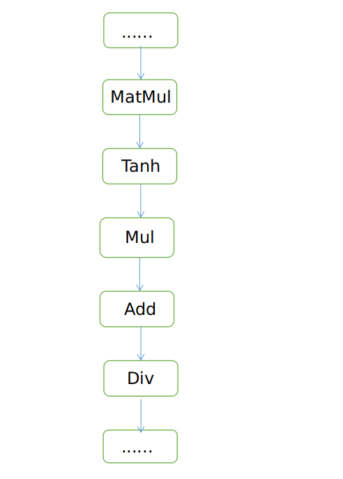

# 问题定位指南

<!-- TOC -->

- [概述](#概述)
- [模型转换失败](#模型转换失败)
- [模型推理失败](#模型推理失败)
    - [图加载失败](#图加载失败)
    - [CPU推理问题](#CPU推理问题)
        - [图编译失败](#图编译失败)
        - [图执行失败](#图执行失败)
    - [NPU推理问题](#NPU推理问题)
        - [图编译失败](#图编译失败)
        - [图执行失败](#图执行失败)
- [模型推理精度问题](#模型推理精度问题)
- [模型推理性能问题](#模型推理性能问题)
- [其他问题](#其他问题)

<!-- /TOC -->

<a href="https://gitee.com/mindspore/docs/blob/master/docs/lite/docs/source_zh_cn/troubleshooting_guide.md" target="_blank"></a>

## 概述

在MindSpore Lite使用中遇到问题时，可首先查看日志，多数场景下的问题可以通过日志报错信息直接定位（通过设置环境变量[GLOG_v](https://mindspore.cn/docs/programming_guide/zh-CN/master/custom_debugging_info.html#id11) 调整日志等级可以打印更多调试日志），这里简单介绍几种常见报错场景的问题定位与解决方法。

> 1. 因不同版本中日志行号可能存在差异，下述示例日志报错信息中的行号信息均用”**”表示；
> 2. 示例日志中只列出了通用信息，其他涉及具体场景的信息均用“****”表示。

## 模型转换失败

1. 模型路径错误或文件损坏，日志报错信息：

    ```cpp
    WARNING: Logging before InitGoogleLogging() is written to STDERR
    [WARNING] LITE(11979,7fbdc90a8ec0,converter_lite):2021-12-13-16:20:49.506.071 [mindspore/lite/tools/common/protobuf_utils.cc:94] ReadProtoFromBinaryFile] Parse ***.onnx failed.
    [ERROR] LITE(11979,7fbdc90a8ec0,converter_lite):2021-12-13-16:20:49.506.122 [mindspore/lite/build/tools/converter/parser/onnx/onnx_op_parser.cc:3079] InitOriginModel] Read onnx model file failed, model path: ./ml_audio_kit_vocals_resunet.onnx
    [ERROR] LITE(11979,7fbdc90a8ec0,converter_lite):2021-12-13-16:20:49.506.131 [mindspore/lite/build/tools/converter/parser/onnx/onnx_op_parser.cc:3026] Parse] init origin model failed.
    [ERROR] LITE(11979,7fbdc90a8ec0,converter_lite):2021-12-13-16:20:49.506.137 [mindspore/lite/tools/converter/converter.cc:64] BuildFuncGraph] Get funcGraph failed for fmk: ONNX
    [ERROR] LITE(11979,7fbdc90a8ec0,converter_lite):2021-12-13-16:20:49.506.143 [mindspore/lite/tools/converter/converter.cc:133] Convert] Parser/Import model return nullptr
    [ERROR] LITE(11979,7fbdc90a8ec0,converter_lite):2021-12-13-16:20:49.506.162 [mindspore/lite/tools/converter/converter.cc:209] RunConverter] CONVERT RESULT FAILED:-1 Common error code.
    CONVERT RESULT FAILED:-1 Common error code.
    ```

    - 问题分析：根据报错信息可以看出，模型导入直接报错，还没进入转换流程就退出。

    - 解决方法：这种报错首先排除模型转换时输入的命令中，模型路径是否正确，如果路径正确，那么需要排除模型是否破损，破损的文件无法解析，会直接退出。

2. 存在不支持的算子，日志报错信息：

    ```cpp
    [mindspore/lite/tools/converter/converter.cc:**] BuildFuncGraph] Get funcGraph failed for fmk: ****
    [mindspore/lite/tools/converter/converter.cc:**] Converter] Parser/Import model return nullptr
    [mindspore/lite/tools/converter/converter_context.h:**] PrintOps] ===========================================
    [mindspore/lite/tools/converter/converter_context.h:**] PrintOps] UNSUPPORTED OP LIST:
    [mindspore/lite/tools/converter/converter_context.h:**] PrintOps] FMKTYPE: ****, OP TYPE: ****
    [mindspore/lite/tools/converter/converter_context.h:**] PrintOps] ===========================================
    [mindspore/lite/tools/converter/converter.cc:**] RunConverter] CONVERT RESULT FAILED:-300 Failed to find operator.
    ```

    - 问题分析：模型中存在MindSpore Lite转换工具不支持的算子导致转换失败。
    - 解决方法：对于不支持的算子可以尝试通过继承API接口[NodeParser](https://mindspore.cn/lite/api/zh-CN/master/api_cpp/mindspore_converter.html#nodeparser) 自行添加parser并通过[NodeParserRegistry](https://mindspore.cn/lite/api/zh-CN/master/api_cpp/mindspore_registry.html#nodeparserregistry) 进行Parser注册；或者在社区提[ISSUE](https://gitee.com/mindspore/mindspore/issues) 给MindSpore Lite开发人员处理。

3. 存在不支持的算子，日志报错信息：

    ```cpp
    [mindspore/lite/tools/converter/parser/caffe/caffe_model_parser.cc:**] ConvertLayers] parse node **** failed.
    ```

    - 问题分析：转换工具支持该算子转换，但是不支持该算子的某种特殊属性或参数导致模型转换失败（示例日志以caffe为例，其他框架日志信息相同）。
    - 解决方法：可以尝试通过继承API接口[NodeParser](https://mindspore.cn/lite/api/zh-CN/master/api_cpp/mindspore_converter.html#nodeparser) 添加自定义算子parser并通过[NodeParserRegistry](https://mindspore.cn/lite/api/zh-CN/master/api_cpp/mindspore_registry.html#nodeparserregistry) 进行Parser注册；或者在社区提[ISSUE](https://gitee.com/mindspore/mindspore/issues) 给MindSpore Lite开发人员处理。

## 图加载失败

1. 模型文件错误，日志报错信息：

    ```cpp
    [mindspore/lite/src/lite_model.cc:**] ConstructModel] The model buffer is invalid and fail to create graph.
    [mindspore/lite/src/lite_model.cc:**] ImportFromBuffer] construct model failed.
    ```

    - 问题分析：从ms模型文件读取的缓存内容无效，导致图加载失败。
    - 解决方法：确认推理使用的模型是直接通过转换工具转出的ms模型文件，若模型文件为经过传输或下载得到的，可以通过检查md5值进行校验以查看ms模型文件是否损坏。

2. 模型文件和推理包版本不兼容，日志报错信息：

    ```cpp
    [mindspore/lite/src/lite_model.cc:**] ConstructModel] Maybe this is a model transferred out using the conversion tool before 1.1.0.
    [mindspore/lite/src/lite_model.cc:**] ImportFromBuffer] construct model failed.
    ```

    - 问题分析：该ms模型文件所使用的转换工具版本较低，导致图加载失败。
    - 解决方法：请使用MindSpore Lite 1.1.0 以上的版本重新转出ms模型。

## CPU推理问题

### 图编译失败

1. 模型文件和推理包版本不兼容，日志报错信息：

    ```cpp
    WARNING [mindspore/lite/src/lite_model.cc:**] ConstructModel] model version is MindSpore Lite 1.2.0, inference version is MindSpore Lite 1.5.0 not equal
    [mindspore/lite/src/runtime/infer_manager.cc:**] KernelInferShape] Get infershape func failed! type: ****
    [mindspore/lite/src/scheduler.cc:**] ScheduleNodeToKernel] FindBackendKernel return nullptr, name: ****, type: ****
    [mindspore/lite/src/scheduler.cc:**] ScheduleSubGraphToKernels] schedule node return nullptr, name: ****, type: ****
    [mindspore/lite/src/scheduler.cc:**] ScheduleMainSubGraphToKernels] Schedule subgraph failed, index: 0
    [mindspore/lite/src/scheduler.cc:**] ScheduleGraphToKernels] ScheduleSubGraphToSubGraphKernel failed
    [mindspore/lite/src/scheduler.cc:**] Schedule] Schedule graph to kernels failed.
    [mindspore/lite/src/lite_session.cc:**] CompileGraph] Schedule kernels failed: -1.
    ```

    - 问题分析：推理使用的MindSpore Lite版本高于模型转换使用的转换工具版本，导致存在兼容性问题：版本升级可能会新增或移除某些算子，推理时缺少算子的实现。
    - 解决方法：使用和转换模型使用的转换工具版本相同的MindSpore Lite进行推理。通常情况下，MindSpore Lite推理兼容较低版本ms模型但是版本差异过大的情况下可能存在兼容性问题；同时，MindSpore Lite推理不保证向后兼容较高版本转换出的ms模型。

2. 模型输入为动态shape，日志报错信息：

    ```cpp
    [mindspore/lite/src/common/tensor_util.cc:**] CheckTensorsInvalid] The shape of tensor contains negative dimension, check the model and assign the input shape with method Resize().
    [mindspore/lite/src/lite_session.cc:**] RunGraph] CheckInputs failed.
    ```

    - 问题分析：ms模型的输入shape包含-1，即模型输入为动态shape，直接推理时由于shape无效导致推理失败。
    - 解决方法：MindSpore Lite在对包含动态shape输入的模型推理时要求指定合理的shape，使用benchmark工具时可通过设置[inputShapes](https://mindspore.cn/lite/docs/zh-CN/master/use/benchmark_tool.html#id3) 参数指定，使用MindSpore Lite集成开发时可通过调用[Resize](https://mindspore.cn/lite/api/zh-CN/master/api_cpp/mindspore.html#resize) 方法设置。

## NPU推理问题

### 图编译失败

1. NPU图编译失败，通过工具抓取后台日志，并在日志中搜索“**MS_LITE**”关键字，得到报错提示如下：

    ```cpp
    MS_LITE : [mindspore/lite/src/delegate/npu/npu_subgraph.cc:**] BuildIRModel] Build IR model failed.
    MS_LITE : [mindspore/lite/src/delegate/npu/npu_subgraph.cc:**] Init] Build IR model failed.
    MS_LITE : [mindspore/lite/src/delegate/npu/npu_graph.cc:**] CreateNPUSubgraphKernel] NPU Subgraph Init failed.
    MS_LITE : [mindspore/lite/src/delegate/npu/npu_delegate.cc:**] Build] Create NPU Graph failed.
    ```

    - 问题分析：此报错为NPU在线构图失败。
    - 解决方法：由于构图系通过调用[HiAI DDK](https://developer.huawei.com/consumer/cn/doc/development/HiAI-Library/ddk-download-0000001053590180) 的接口完成，因此报错一般会首先出现在HiAI的错误日志中，部分报错用户可根据提示修改模型中的算子类型或参数类型来进行规避，但大部分可能需要通过在MindSpore社区[提ISSUE](https://gitee.com/mindspore/mindspore/issues) 来通知开发人员进行代码修复和适配。因此，我们下面仅给出较为常见的HiAI报错信息，以便您在社区提问时对问题有更清晰的描述，并加快问题定位的效率。

    （1）在日志中搜索“**E AI_FMK**”关键字，若在“MS_LITE”日志报错之前的位置处得到报错日志如下：

      ```cpp
      AI_FMK  : /conv_base_op_builder.cpp CheckShapeMatch(**)::"Input Channel ** does not match convolution weight channel ** * group **."
      AI_FMK  : /conv_base_op_builder.cpp Init(**)::"Shape of op **** does not match"
      AI_FMK  : /op_builder.cpp BuildOutputDesc(**)::""Init" failed. Node: ****."
      ```

    说明构图时多插或漏插了用于Tensor format转换的Transpose算子，导致卷积的输入Shape和权重的格式无法匹配。

    （2）在日志中搜索“**E AI_FMK**”关键字，若在“MS_LITE”日志报错之前的位置处得到报错日志如下：

      ```cpp
      AI_FMK  : /model_compatibility_check.cpp GetIRGraphCompatibilityCheckResult(**)::"Node **** type **** don't support!"
      AI_FMK  : /model_compatibility_check.cpp CheckIRGraphCompatibility(**)::"CompleteExecuteDeviceConfig CheckIRGraphCompatibility failed"
      ```

    说明HiAI ROM和当前MindSpore Lite使用的HiAI DDK版本存在算子兼容性问题，报错信息中提示的算子不支持。您可以尝试通过更新手机系统来升级HiAI ROM、替换当前不支持的算子来规避，或在开源社区进行反馈。

### 图执行失败

1. NPU推理失败，通过工具抓取后台日志，并在日志中搜索“**MS_LITE**”关键字，得到报错提示如下：

      ```cpp
      MS_LITE : [mindspore/lite/src/delegate/npu/npu_executor.cc:**] Run] NPU Process failed. code is 1
      MS_LITE : [mindspore/lite/src/delegate/npu/npu_graph.cc:**] Execute] NPU Subgraph **** execute failed.
      MS_LITE : [mindspore/lite/src/lite_mindrt.h:**] RunKernel] run kernel failed, name: ****
      ```

    - 问题分析：此报错为NPU执行推理失败。
    - 解决方法：由于NPU模型的底层推理实际由HiAI完成，因此报错同样会首先出现在HiAI的错误日志中，我们下面仅给出较为常见的HiAI报错信息，以方便您定位。

    在日志中搜索“**E AI_FMK**”关键字，若在“**MS_LITE**”日志报错之前的位置处得到报错日志如下：

      ```cpp
      AI_FMK  : /common_memory_allocator.cpp Allocate(**)::"Call rt api failed, ret: ****"
      ```

    再搜索“**DEVMM**”关键字，若在上一条日志的前10行左右，显示报错日志如下：

      ```cpp
      /vendor/bin/hiaiserver: [DEVMM][E] DevmmJudgeAllocSize:** the alloc memory size exceeds the specification limit, already alloc total size = 0x3ff95000
      ```

    说明NPU的内存申请超出了限制。请确认模型文件是否比较大，或模型中存在shape较大的tensor。根据HiAI[官方要求](https://developer.huawei.com/consumer/cn/doc/development/hiai-References/modelbuildoptions-0000001139374903) ，单张NPU子图的大小不应超过200MB，数组的内存申请也不要超过NPU的显存大小，比如在本例的日志中，NPU可申请的显存上限为1GB。若仍需要跑NPU，请调整模型结构、将模型进行拆分或者调整tensor的shape大小。

## 模型推理精度问题

1. 使用MindSpore Lite集成时对推理结果后处理后发现效果不理想，怀疑推理精度存在问题要如何定位？
    - 首先确认输入数据是否正确：在MindSpore Lite 1.3.0及之前版本ms模型的输入数据格式为NHWC，MindSpore Lite 1.5.0之后的版本支持[inputDataFormat](https://mindspore.cn/lite/docs/zh-CN/master/use/converter_tool.html) 参数设置输入数据格式为NHWC或NCHW，需要检查输入数据的格式确保和ms模型要求的输入格式一致；
    - 通过MindSpore Lite提供的基准测试工具[benchmark](https://mindspore.cn/lite/docs/zh-CN/master/use/benchmark_tool.html) 进行精度测试验证，日志如下则可能存在精度问题；否则MindSpore Lite推理精度正常，需要检查数据前/后处理过程是否有误。

      ```cpp
      Mean bias of all nodes/tensors is too big: **
      Compare output error -1
      Run MarkAccuracy error: -1
      ```

    - 若MindSpore Lite进行整网推理存在精度问题，可以通过benchmark工具的[Dump功能](https://mindspore.cn/lite/docs/zh-CN/master/use/benchmark_tool.html#dump) 保存算子层输出，和原框架推理结果进行对比进一步定位出现精度异常的算子。
    - 针对存在精度问题的算子，可以下载[MindSpore源码](https://gitee.com/mindspore/mindspore) 检查算子实现并构造相应单算子网络进行调试与问题定位；也可以在MindSpore社区[提ISSUE](https://gitee.com/mindspore/mindspore/issues) 给MindSpore Lite的开发人员处理。

2. MindSpore Lite使用fp32推理结果正确，但是fp16推理结果出现NaN或者Inf值怎么办？
    - 结果出现NaN或者Inf值一般为推理过程中出现数值溢出，可以查看模型结构，筛选可能出数值溢出的算子层，然后通过benchmark工具的[Dump功能](https://mindspore.cn/lite/docs/zh-CN/master/use/benchmark_tool.html#dump) 保存算子层输出确认出现数值溢出的算子。
    - MindSpore Lite 1.5.0之后版本提供混合精度推理能力，在整网推理优先使用fp16时支持设置某一层算子进行fp32推理，具体使用方法可参考官网文档[混合精度运行](https://mindspore.cn/lite/docs/zh-CN/master/use/runtime_cpp.html#id13) ，通过将溢出层设置为fp32避免在fp16推理时出现的整网推理精度问题。

3. MindSpore Lite使用fp32和fp16推理结果同时出现NaN或者Inf值怎么办？
    - 问题分析：检查整个网络存在做除法操作的算子。在做推理时如果执行了除法操作，且除数是0时容易出现NaN值。比如下面的网络结构，如果该网络用于输入数据不做归一化的场景，输入数据在0-255范围，则会出现NaN值，原因在于不做归一化时，输入数据比较大，导致matmul的输出值会很大，导致Tanh激活函数输出等于1，最终导致Div算子除0。但如果网络输入数据做了归一化，Tanh激活函数不等于1，网络推理数据不存在NaN值。

      

    - 解决方法：如果是输入数据太大导致的，建议训练时把网络输入数据做归一化。如果输入数据归一化了还存在NaN值，这种需要通过benchmark工具的[Dump功能](https://mindspore.cn/lite/docs/zh-CN/master/use/benchmark_tool.html#dump) 保存算子层输出确认出现数值溢出的算子，具体分析。

## 模型推理性能问题

1. 为何将设备指定为NPU后，实际推理性能和CPU并没有差别？
    - 若设备不支持NPU但在上下文中进行了指定，则模型并不会运行在NPU上，而是会自动切换到CPU来执行，此时的推理性能自然与CPU一致。可以通过工具（如adb logcat）抓取后台日志，并在日志中搜索“**MS_LITE**”关键字，以确认设备是否支持NPU。常见的提示信息及说明如下：

      ```cpp
      MS_LITE : [mindspore/lite/src/delegate/npu/npu_manager.cc:**] IsSupportNPU] The current devices NOT SUPPORT NPU.
      ```

    - 若日志中仅包含以上这一行提示，请检查您的设备是否为包含海思麒麟处理器的华为设备，否则不支持NPU。

      ```cpp
      MS_LITE : [mindspore/lite/src/delegate/npu/npu_manager.cc:**] IsKirinChip] Unsupported KirinChip ***.
      MS_LITE : [mindspore/lite/src/delegate/npu/npu_manager.cc:**] IsSupportNPU] The current devices NOT SUPPORT NPU.
      ```

    - 若日志中包含以上这两行提示，说明您的设备虽然使用的是麒麟芯片，但芯片型号不支持NPU。当前支持NPU的麒麟处理器芯片为：Kirin 810、Kirin 820、Kirin 985及其他高于此版本的型号。

      ```cpp
      MS_LITE : [mindspore/lite/src/delegate/npu/npu_manager.cc:**] CheckDDKVerGreatEqual] DDK Version 100.***.***.*** less than 100.320.011.019.
      MS_LITE : [mindspore/lite/src/delegate/npu/npu_manager.cc:**] IsSupportNPU] The current devices NOT SUPPORT NPU.
      ```

    - 若日志中包含以上这两行提示，说明您的设备虽然满足硬件要求，但系统的HiAI ROM版本不满足要求，同样无法运行NPU算子。当前MindSpore Lite要求HiAI ROM版本必须大于100.320.011.018。

      ```cpp
      MS_LITE : [mindspore/lite/src/delegate/npu/op/convolution_npu.cc:**] GetNPUConvOp] NPU does not support runtime inference shape.
      MS_LITE : [mindspore/lite/src/delegate/npu/op/npu_op.h:** GetNPUOp] NPU does not support runtime inference shape.
      ```

    - 若以上两条提示（或其中一条）在日志中出现多次，请确认您的模型输入是否为动态shape且在推理前对输入shape进行了指定，若是则不支持在NPU上运行，程序会自动切换到CPU执行。

2. 为何将设备指定为NPU后，实际推理性能比CPU还要差？
    - 绝大多数情况下，NPU的推理性能要大幅优于CPU，但在少数情况下会比CPU更劣：

    （1）检查模型中是否存在大量Pad或StridedSlice等算子，由于NPU中的数组格式与CPU有所不同，这类算子在NPU中运算时涉及数组的重排，因此相较CPU不存在任何优势，甚至劣于CPU。若确实需要在NPU上运行，建议尝试去除或替换此类算子。
    （2）通过工具（如adb logcat）抓取后台日志，搜索所有“**BuildIRModel build successfully**”关键字，发现相关日志出现了多次，说明模型在线构图时切分为了多张NPU子图，子图的切分一般都是由图中存在Transpose或/和当前不支持的NPU算子引起。目前我们支持最多20张子图的切分，子图数量越多，NPU的整体耗时增加越明显。建议比对MindSpore Lite当前支持的NPU[算子列表](https://www.mindspore.cn/lite/docs/zh-CN/master/operator_list_lite.html#lite)，在模型搭建时规避不支持的算子，或在MindSpore社区[提ISSUE](https://gitee.com/mindspore/mindspore/issues) 询问MindSpore Lite的开发人员。

## 其他问题
