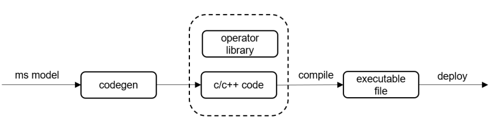

# 在轻量和小型系统上执行推理

<a href="https://gitee.com/mindspore/docs/blob/master/docs/lite/docs/source_zh_cn/use/micro.md" target="_blank"></a>

## 概述

相较于移动设备，IoT设备上通常使用MicroControllerUnits(MCUs)，不仅设备系统ROM资源非常有限，而且硬件资源内存和算力都非常弱小。
因此IOT设备上的AI应用对AI模型推理的运行时内存和功耗都有严格限制。
MindSpore Lite针对MCUs部署硬件后端，提供了一种超轻量Micro AI部署解决方案：离线阶段直接将模型生成轻量化代码，不再需要在线解析模型和图编译，生成的Micro推理代码非常直观易懂，运行时内存小，代码体积也更小。
用户使用MindSpore Lite转换工具非常容易生成可在x86/ARM64/ARM32A/ARM32M平台部署的推理代码，其中在x86/ARM64/ARM32A平台上推理会调用NNACL算子库，
在ARM32M平台上调用CMSIS-NN算子库。

通过MindSpore Lite转换工具[Converter](https://www.mindspore.cn/lite/docs/zh-CN/master/use/converter_tool.html)，
输入Micro配置文件，就能把输入模型生成代码。



## 模型生成代码

可以通过两种方式获取：

1. MindSpore官网下载[Release版本](https://www.mindspore.cn/lite/docs/zh-CN/master/use/downloads.html)。
2. 从源码开始[编译构建](https://www.mindspore.cn/lite/docs/zh-CN/master/use/build.html)。

以MNIST分类模型为例，如下命令将模型生成代码：

```shell
./converter_lite --fmk=TFLITE --modelFile=${model_dir}/mnist.tflite --outputFile=${SOURCE_CODE_DIR} --configFile=${COFIG_FILE}
```

其中 config 文件配置字段如下

```txt
[micro_param]

# enable code-generation for MCU HW

enable_micro=true

# specify HW target, support x86,ARM32M, AMR32A, ARM64 only.

target=x86

# code generation for Inference or Train

codegen_mode=Inference

# enable parallel inference or not

support_parallel=false

# enable debug

debug_mode=false
```

其中

| 参数            | 是否必选 | 参数说明                         | 取值范围                   | 默认值    |
| --------------- | -------- | ------------------------------| --------------------------| --------- |
| enable_micro    | 是       | 模型会生成代码，否则生成.ms       | true, false                | false      |
| target          | 是       | 生成代码针对的平台               | x86, ARM32M, ARM32A, ARM64 | x86       |
| codegen_mode    | 是       | 生成推理还是训练代码             | Inference, Train           | Inference |
| supportParallel | 否       | 是否生成支持多线程的代码          | true, false                | false     |
| debugMode       | 否       | 是否以生成调试模式的代码          | true, false                | false     |

> os不支持文件系统时，debugMode不可用。
>
> 生成的推理接口详细使用说明，请参考[API文档](https://www.mindspore.cn/lite/api/zh-CN/master/index.html)。
>
> 以下三个接口暂不支持：
>
> 1. `virtual std::unordered_map<String, mindspore::tensor::MSTensor *> GetOutputs() const = 0;`
> 2. `virtual Vector<tensor::MSTensor *> GetOutputsByNodeName(const String &node_name) const = 0;`
> 3. `virtual int Resize(const Vector<tensor::MSTensor *> &inputs, const Vector<Vector<int>> &dims) = 0;`

转换工具执行成功后，生成的代码在指定的outputFile路径下，内容如下：

```text
mnist
├── benchmark                  # 集成调试相关的例程
│   ├── benchmark.c
│   ├── calib_output.c
│   ├── calib_output.h
│   ├── load_input.c
│   └── load_input.h
├── CMakeLists.txt
└── src                        # 源文件
    ├── CMakeLists.txt
    ├── net.bin                # 二进制形式的模型权重
    ├── net.c
    ├── net.cmake
    ├── net.h
    ├── model.c
    ├── context.c
    ├── context.h
    ├── tensor.c
    ├── tensor.h
    ├── weight.c
    └── weight.h
```

## 自动生成的代码部署时依赖的头文件和lib的目录结构

```text
mindspore-lite-{version}-linux-x64
└── tools
    └── codegen # 代码生成的source code 依赖include和lib
        ├── include          # 推理框架头文件
        │   ├── nnacl        # nnacl 算子头文件
        │   └── wrapper
        ├── lib
        │   └── libwrapper.a # MindSpore Lite codegen生成代码依赖的部分算子静态库
        └── third_party
            ├── include
            │   └── CMSIS    # ARM CMSIS NN 算子头文件
            └── lib
                └── libcmsis_nn.a # ARM CMSIS NN 算子静态库
```

## 在STM开发板上执行推理

本教程以在STM32F746单板上编译部署生成模型代码为例，演示了codegen编译模型在Cortex-M平台的使用。更多关于Arm Cortex-M的详情可参见其[官网](https://developer.arm.com/ip-products/processors/cortex-m)。

### STM32F746编译依赖

模型推理代码的编译部署需要在Windows上安装[J-Link](https://www.segger.com/)、[STM32CubeMX](https://www.st.com/content/st_com/en.html)、[GNU Arm Embedded Toolchain](https://developer.arm.com/tools-and-software/open-source-software/developer-tools/gnu-toolchain/gnu-rm)等工具来进行交叉编译。

- [STM32CubeMX Windows版本](https://www.st.com/content/ccc/resource/technical/software/sw_development_suite/group0/0b/05/f0/25/c7/2b/42/9d/stm32cubemx_v6-1-1/files/stm32cubemx_v6-1-1.zip/jcr:content/translations/en.stm32cubemx_v6-1-1.zip) >= 6.0.1

- [GNU Arm Embedded Toolchain](https://developer.arm.com/tools-and-software/open-source-software/developer-tools/gnu-toolchain/gnu-rm/downloads)  >= 9-2019-q4-major-win32

- [J-Link Windows版本](https://www.segger.com/downloads/jlink/) >= 6.56
- [GCC](https://gcc.gnu.org/releases.html) >= 7.3.0
- [CMake](https://cmake.org/download/) >= 3.18.3

### STM32F746工程构建

- 需要组织的工程目录如下：

    ```text
    ├── mnist              # codegen生成的模型推理代码
    ├── include            # 模型推理对外API头文件目录(需要自建)
    └── operator_library   # 模型推理算子相关文件(需要自建)
    ```

> 模型推理对外API头文件可由MindSpore团队发布的[Release包](https://www.mindspore.cn/lite/docs/zh-CN/master/use/downloads.html)中获取。
>
> 在编译此工程之前需要预先获取对应平台所需要的算子文件，由于Cortex-M平台工程编译一般涉及到较复杂的交叉编译，此处不提供直接预编译的算子库静态库，而是用户根据模型自行组织文件，自主编译Cortex-M7 、Coretex-M4、Cortex-M3等工程(对应工程目录结构已在示例代码中给出，用户可自主将对应ARM官方的CMSIS源码放置其中即可)。

- 使用codegen编译[MNIST手写数字识别模型](https://download.mindspore.cn/model_zoo/official/lite/quick_start/micro/mnist.tar.gz)，生成对应的STM32F46推理代码。具体命令如下：

```shell
./converter_lite --fmk=TFLITE --modelFile=mnist.tflite --outputFile=${SOURCE_CODE_DIR} --configFile=${COFIG_FILE}
```

其中config 文件中配置target = ARM32M。

- 生成代码工程目录如下：

    ```text
    ├── mnist               # 生成代码的根目录
        ├── benchmark       # 生成代码的benchmark目录
        └── src             # 模型推理代码目录
    ```

- 预置算子静态库的目录如下：

    ```text
    ├── operator_library    # 平台算子库目录
        ├── include         # 平台算子库头文件目录
        └── nnacl           # MindSpore团队提供的平台算子库源文件
        └── wrapper         # MindSpore团队提供的平台算子库源文件
        └── CMSIS           # Arm官方提供的CMSIS平台算子库源文件
    ```

    > 在使用过程中，引入CMSIS v5.7.0 Softmax相关的CMSIS算子文件时，头文件中需要加入`arm_nnfunctions.h`。

#### 代码工程编译

1. 环境测试

    安装好交叉编译所需环境后，需要在Windows环境中依次将其加入到环境变量中。

    ```text
    gcc -v               # 查看GCC版本
    arm-none-eabi-gdb -v # 查看交叉编译环境
    jlink -v             # 查看J-Link版本
    make -v              # 查看Make版本
    ```

    以上命令均成功返回值时，表明环境准备已完成，可以继续进入下一步，否则请务必先安装上述环境。

2. 生成STM32F746单板初始化代码（[详情示例代码](https://gitee.com/mindspore/mindspore/tree/master/mindspore/lite/examples/quick_start_micro/mnist_stm32f746）

    - 启动 STM32CubeMX，新建project，选择单板STM32F746IG。
    - 成功以后，选择`Makefile` ，`generator code`。
    - 在生成的工程目录下打开`cmd`，执行`make`，测试初始代码是否成功编译。

    ```text
    # make成功结果
    arm-none-eabi-size build/test_stm32f746.elf
      text    data     bss     dec     hex filename
      3660      20    1572    5252    1484 build/test_stm32f746.elf
    arm-none-eabi-objcopy -O ihex build/test_stm32f746.elf build/test_stm32f746.hex
    arm-none-eabi-objcopy -O binary -S build/test_stm32f746.elf build/test_stm32f746.bin
    ```

#### 编译模型

1. 拷贝MindSpore团队提供算子文件以及对应头文件到STM32CubeMX生成的工程目录中。

2. 拷贝codegen生成模型推理代码到 STM32CubeMX生成的代码工程目录中。

    ```text
    ├── .mxproject
    ├── build             # 工程编译输出目录
    ├── Core
    ├── Drivers
    ├── mnist             # codegen生成的cortex-m7 模型推理代码
    ├── Makefile          # 编写工程makefile文件组织mnist && operator_library源文件到工程目录中
    ├── startup_stm32f746xx.s
    ├── STM32F746IGKx_FLASH.ld
    └── test_stm32f746.ioc
    ```

3. 修改makefile文件，组织算子静态库以及模型推理代码，具体makefile文件内容参见[示例](https://gitee.com/mindspore/mindspore/tree/master/mindspore/lite/examples/quick_start_micro/mnist_stm32f746)。

    ```text
    # C includes
    C_INCLUDES =  \
    -ICore/Inc \
    -IDrivers/STM32F7xx_HAL_Driver/Inc \
    -IDrivers/STM32F7xx_HAL_Driver/Inc/Legacy \
    -IDrivers/CMSIS/Device/ST/STM32F7xx/Include \
    -Imnist/operator_library/include \                # 新增，指定算子库头文件目录
    -Imnist/include \                                 # 新增，指定模型推理代码头文件
    -Imnist/src                                       # 新增，指定模型推理代码源文件
    ......
    ```

4. 在工程目录的Core/Src的main.c编写模型调用代码，参考代码如下：

    ```cpp
    while (1) {
        /* USER CODE END WHILE */
        SEGGER_RTT_printf(0, "***********mnist test start***********\n");
        MSContextHandle ms_context_handle = NULL;
        ms_context_handle = MSContextCreate();
        if (ms_context_handle) {
          MSContextSetThreadNum(ms_context_handle, 1);
          MSContextSetThreadAffinityMode(ms_context_handle, 0);
        }
        int model_size = 0;
        // read net.bin
        void *model_buffer = ReadInputData("net.bin", &model_size);
        MSModelHandle model_handle = MSModelCreate();
        int ret = MSModelBuild(model_handle, model_buffer, model_size, kMSModelTypeMindIR, ms_context_handle);
        MSContextDestroy(&ms_context_handle);
        if (model_buffer) {
          free(model_buffer);
          model_buffer = NULL;
        }
        // read input_data.bin
        MSTensorHandleArray inputs_handle = MSModelGetInputs(model_handle);
        size_t inputs_num = inputs_handle.handle_num;
        void *inputs_binbuf[inputs_num];
        int inputs_size[inputs_num];
        for (size_t i = 0; i < inputs_num; ++i) {
          MSTensorHandle tensor = inputs_handle.handle_list[i];
          inputs_size[i] = (int)MSTensorGetDataSize(tensor);
        }
        ret = ReadInputsFile("input.bin" inputs_binbuf, inputs_size, (int)inputs_num);
        for (size_t i = 0; i < inputs_num; ++i) {
          void *input_data = MSTensorGetMutableData(inputs_handle.handle_list[i]);
          memcpy(input_data, inputs_binbuf[i], inputs_size[i]);
          free(inputs_binbuf[i]);
          inputs_binbuf[i] = NULL;
        }
        MSTensorHandleArray outputs_handle = MSModelGetOutputs(model_handle);
        ret = MSModelPredict(model_handle, inputs_handle, &outputs_handle, NULL, NULL);
        if (ret != kMSStatusSuccess) {
          MSModelDestroy(&model_handle);
          SEGGER_RTT_printf("MSModelPredict failed, ret: %d", kMSStatusSuccess);
          return ret;
        }
        for (size_t i = 0; i < outputs_handle.handle_num; i++) {
          MSTensorHandle output = outputs_handle.handle_list[i];
          PrintTensorHandle(output);
        }
        SEGGER_RTT_printf(0, "***********mnist test end***********\n");
    ```

5. 在工程跟目中目录使用管理员权限打开`cmd` 执行 `make`进行编译。

    ```bash
    make
    ```

### STM32F746工程部署

使用J-Link将可执行文件拷贝到单板上并做推理。

```text
jlinkgdbserver           # 启动jlinkgdbserver 选定target device为STM32F746IG
jlinkRTTViewer           # 启动jlinkRTTViewer 选定target devices为STM32F746IG
arm-none-eabi-gdb        # 启动arm-gcc gdb服务
file build/target.elf    # 打开调测文件
target remote 127.0.0.1  # 连接jlink服务器
monitor reset            # 重置单板
monitor halt             # 挂起单板
load                     # 加载可执行文件到单板
c                        # 执行模型推理
```

## 在轻鸿蒙设备上执行推理

### 安装轻鸿蒙编译环境

详细请参考[Ubuntu编译环境准备](https://device.harmonyos.com/cn/docs/start/introduce/quickstart-lite-env-setup-lin-0000001105407498)。

### 开发板环境配置

以Hi3516开发板为例，请参考[安装开发板环境](https://device.harmonyos.com/cn/docs/start/introduce/quickstart-lite-steps-board3516-setting-0000001105829366)。

### 编译模型

使用codegen编译[lenet模型](https://download.mindspore.cn/model_zoo/official/lite/quick_start/micro/mnist.tar.gz)，生成对应轻鸿蒙平台的推理代码，命令如下:

```shell
./converter_lite --fmk=TFLITE --modelFile=mnist.tflite --outputFile=${SOURCE_CODE_DIR} --configFile=${COFIG_FILE}
```

其中config配置文件设置target = ARM32A。

### 编写构建脚本

轻鸿蒙应用程序开发请先参考[运行Hello OHOS](https://device.harmonyos.com/cn/docs/start/introduce/quickstart-lite-steps-board3516-running-0000001151888681)。将上一步生成的mnist目录拷贝到任意鸿蒙源码路径下，假设为applications/sample/，然后新建BUILD.gn文件：

   ```text
   <harmony-source-path>/applications/sample/mnist
   ├── benchmark
   ├── CMakeLists.txt
   ├── BUILD.gn
   └── src  
   ```

下载适用于OpenHarmony的[预编译推理runtime包](https://www.mindspore.cn/lite/docs/zh-CN/master/use/downloads.html)，然后将其解压至任意鸿蒙源码路径下。编写BUILD.gn文件：

   ```text
   import("//build/lite/config/component/lite_component.gni")
   import("//build/lite/ndk/ndk.gni")

   lite_component("mnist_benchmark") {
       target_type = "executable"
       sources = [
            "benchmark/benchmark.cc",
            "benchmark/calib_output.cc",
            "benchmark/load_input.c",
            "src/net.c",
            "src/weight.c",
            "src/session.cc",
            "src/tensor.cc",
       ]
       features = []
       include_dirs = [
            "<YOUR MINDSPORE LITE RUNTIME PATH>/runtime",
            "<YOUR MINDSPORE LITE RUNTIME PATH>/tools/codegen/include",
            "//applications/sample/mnist/benchmark",
            "//applications/sample/mnist/src",
       ]
       ldflags = [
            "-fno-strict-aliasing",
            "-Wall",
            "-pedantic",
            "-std=gnu99",
       ]
       libs = [
            "<YOUR MINDSPORE LITE RUNTIME PATH>/runtime/lib/libmindspore-lite.a",
            "<YOUR MINDSPORE LITE RUNTIME PATH>/tools/codegen/lib/libwrapper.a",
       ]
       defines = [
           "NOT_USE_STL",
           "ENABLE_NEON",
           "ENABLE_ARM",
           "ENABLE_ARM32"
       ]
       cflags = [
            "-fno-strict-aliasing",
            "-Wall",
            "-pedantic",
            "-std=gnu99",
       ]
       cflags_cc = [
           "-fno-strict-aliasing",
           "-Wall",
           "-pedantic",
           "-std=c++17",
       ]
   }
   ```

  `<YOUR MINDSPORE LITE RUNTIME PATH>`是解压出来的推理runtime包路径，比如//applications/sample/mnist/mindspore-lite-1.3.0-ohos-aarch32。
   修改文件build/lite/components/applications.json，添加组件mnist_benchmark的配置：

   ```text
   {
      "component": "mnist_benchmark",
      "description": "Communication related samples.",
      "optional": "true",
      "dirs": [
        "applications/sample/mnist"
      ],
      "targets": [
        "//applications/sample/mnist:mnist_benchmark"
      ],
      "rom": "",
      "ram": "",
      "output": [],
      "adapted_kernel": [ "liteos_a" ],
      "features": [],
      "deps": {
        "components": [],
        "third_party": []
      }
    },
   ```

修改文件vendor/hisilicon/hispark_taurus/config.json，新增mnist_benchmark组件的条目:

   ```text
    { "component": "mnist_benchmark", "features":[] }
   ```

### 编译benchmark

   ```text
   cd <openharmony-source-path>
   hb set(设置编译路径)
   .（选择当前路径）
   选择ipcamera_hispark_taurus@hisilicon并回车
   hb build mnist_benchmark（执行编译）
   ```

   生成结果文件out/hispark_taurus/ipcamera_hispark_taurus/bin/mnist_benchmark。

### 执行benchmark

将mnist_benchmark、权重文件（mnist/src/net.bin）以及[输入文件](https://download.mindspore.cn/model_zoo/official/lite/quick_start/micro/mnist.tar.gz)解压后拷贝到开发板上，然后执行：

   ```text
    OHOS # ./mnist_benchmark mnist_input.bin net.bin 1
    OHOS # =======run benchmark======
    input 0: mnist_input.bin

    loop count: 1
    total time: 10.11800ms, per time: 10.11800ms

    outputs:
    name: int8toft32_Softmax-7_post0/output-0, DataType: 43, Elements: 10, Shape: [1 10 ], Data:
    0.000000, 0.000000, 0.003906, 0.000000, 0.000000, 0.992188, 0.000000, 0.000000, 0.000000, 0.000000,
    ========run success=======
   ```

## 自定义算子

使用前请先参考[自定义南向算子](https://www.mindspore.cn/lite/docs/zh-CN/master/use/register_kernel.html)了解基本概念。Codegen目前仅支持custom类型的自定义算子注册和实现，暂不支持内建算子（比如conv2d、fc等）的注册和自定义实现。下面以海思Hi3516D开发板为例，说明如何在codegen中使用自定义算子。

使用最新的转换工具生成带NNIE类型custom算子具体步骤请参考[集成NNIE使用说明](https://www.mindspore.cn/lite/docs/zh-CN/master/use/nnie.html)。

模型生成代码方式与非定义算子模型保持一致：

```shell

./converter_lite --fmk=TFLITE --modelFile=mnist.tflite --outputFile=${SOURCE_CODE_DIR} --configFile=${COFIG_FILE}

```

其中config配置文件设置target = ARM32A。

### 用户实现自定义算子

上一步会在当前路径下生成nnie源码目录，其有一个叫registered_kernel.h的头文件指定了custom算子的函数声明：

``` C++

int CustomKernel(TensorC *inputs, int input_num, TensorC *outputs, int output_num, CustomParameter *param);

```

用户需要提供该函数的实现，并将相关源码或者库集成到生成代码的cmake工程中。例如，我们提供了支持海思NNIE的custom kernel示例动态库libmicro_nnie.so，该文件包含在[官网下载页](https://www.mindspore.cn/lite/docs/zh-CN/master/use/downloads.html)《NNIE 推理runtime及benchmark工具》组件中。用户需要修改生成代码的CMakeLists.txt，填加链接的库名称和路径。例如：

``` shell

link_directories(<YOUR_PATH>/mindspore-lite-1.5.0-linux-aarch32/providers/Hi3516D)

link_directories(<HI3516D_SDK_PATH>)

target_link_libraries(benchmark net micro_nnie nnie mpi VoiceEngine upvqe securec -lm -pthread)

```

最后进行源码编译：

``` shell

cd nnie && mkdir buid && cd build

cmake -DCMAKE_TOOLCHAIN_FILE=<MS_SRC_PATH>/mindspore/lite/cmake/himix200.toolchain.cmake -DPLATFORM_ARM32=ON -DPKG_PATH=<RUNTIME_PKG_PATH> ..

make

```

## 其它平台使用说明

### [Linux_x86_64平台编译部署](https://gitee.com/mindspore/mindspore/tree/master/mindspore/lite/examples/quick_start_micro/mnist_x86)

### [Android平台编译部署](https://gitee.com/mindspore/mindspore/tree/master/mindspore/lite/examples/quick_start_micro/mobilenetv2_arm64)
