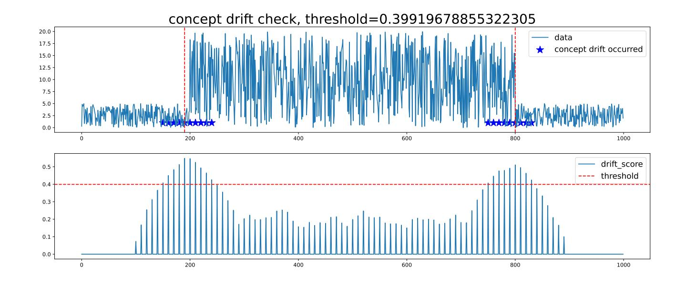

# Implementing the Concept Drift Detection Application of Time Series Data

<a href="https://gitee.com/mindspore/docs/blob/master/docs/mindarmour/docs/source_en/concept_drift_time_series.md" target="_blank"></a>

## Overview

Concept drift is an important data phenomenon in the AI learning field, representing that the online inference data (real-time distribution) is inconsistent with the training data (historical distribution).
 The concept drift detection can detect data distribution changes in time and identify model failure symptoms in advance, which is significant for timely adjustment of AI models.

The concept drift detection is essentially used to detect data distribution changes. The following example provides a method for detecting data changes to check whether the features of data in the new window deviate from those in the historical window. If the deviation degree is greater than a threshold, the concept drift occurs.

The following is a simple example showing the overall process of detecting concept drift of time series data:

1. Download a public dataset or construct the data.
2. Define concept drift parameters.
3. Call the concept drift detection function.
4. View the execution result.

> You can obtain the complete executable sample code at <https://gitee.com/mindspore/mindarmour/blob/master/examples/reliability/concept_drift_time_series.py>.

## Preparations

Ensure that the MindSpore is correctly installed. If not, install MindSpore by following the [Installation Guide](https://www.mindspore.cn/install/en).

### Downloading the Dataset

The example uses a public dataset in the financial field: the historical stock prices found on the S&P 500 index.
> Download the dataset at <https://www.kaggle.com/camnugent/sandp500>.

Decompress the downloaded dataset to a local path. The directory structure is as follows:

```bash
├── archive
  ├── individual_stocks_5yr
      ├──individual_stocks_5yr
```

Data path: archive/individual_stocks_5yr/individual_stocks_5yr. Each CSV file in the folder is a group of data cases.

### Importing the Python Library and Modules

Before start, you need to import the Python library.

```python
import numpy
import matplotlib
import itertools
import mindarmour
```

## Processing Data

Open a data case in the data path `archive/individual_stocks_5yr/individual_stocks_5yr`.

```python
import numpy as np
DATA_FILE = r'archive/individual_stocks_5yr/individual_stocks_5yr/AEE_data.csv'
data = np.loadtxt(DATA_FILE, str, delimiter=",")
```

The `data` contains the `date`, `open`, `high`, `low`, `close`, `volume` and `Name` columns, where the `open`, `high`, `low`, `close` and `volume` columns are value columns. You can select one or more value columns for concept drift detection.

```python
data = data[1:, 2].astype('float64')  # Select the second column.
```

Or,

```python
data = data[1:, 2: 4].astype('float64')  # Select columns 2 to 4.
```

To facilitate the use of the sample, you can construct the data. The code is as follows:

```python
import numpy as np
data = 5*np.random.rand(1000)
data[200: 800] = 50*np.random.rand(600)
```

## Initializing the Concept Drift Detection Module

Import and initialize the concept drift detection module. The sample code is as follows:

```python
from mindarmour import ConceptDriftCheckTimeSeries

concept = ConceptDriftCheckTimeSeries(window_size=100, rolling_window=10, step=10, threshold_index=1.5,need_label=False)
```

The initialization parameters are described as follows:

- `window_size(int)`: concept window. The value must be greater than or equal to 10. If the length of the input `data` is specified, the value range of `window_size` is [10,1/3*len(`data`)]. Generally, if the time series data is a periodic function, the value of `window_size` can be two to five times the period length. For example, if the length of `data` is 1000 and the period is 30, the range of `window_size` can be [10,333]. As the data period is considered, the value of `window_size` can be 90.
- `rolling_window(int)`: smoothing window. The value range is [1,`window_size`]. Default value: 10.
- `step(int)`: window sliding step. The value range is [1,`window_size`]. Default value: 10.
- `threshold_index(float)`: threshold coefficient. The higher the threshold coefficient is, the larger the threshold is. Default value: 1.5.
- `need_label(bool)`: determines whether the label is required. The value is False or True. If the value is True, the concept drift label is required. If the value is False, the concept drift label is not required. Default value: False.

## Starting the Concept Drift Detection

After the module is initialized, call the concept drift detection function `concept_check`.

```python
drift_score, threshold, concept_drift_location = concept.concept_check(data)
```

Return values

- `drift_score(numpy.ndarray)`: indicates the concept drift score. For the input `data`, the confidence score of the concept drift is obtained. The higher the score, the greater the possibility of concept drift.
- `threshold(float)`: concept drift threshold. The threshold is calculated based on `threshold_index(float)`.
- `concept_drift_location(list)`: location where the concept drift occurs. The return value is a location of the X axis where the concept drift occurs. Generally, the location is in an X axis area.

## Viewing the Result

After `concept.concept_check(data)` is executed, the execution result is saved as a PDF file named `concept_drift_check.pdf`.

See the following figure:



**Chart 1**: `data` entered by the user. In the data, the locations where the concept drifts occur are marked by blue stars, and the red dotted lines (in vertical direction) indicate the most obvious locations where the concept drifts occur.
**Chart 2**:  `drift_score` indicates the confidence score of the concept drift (for the data in chart 1). The higher the score is, the higher the possibility of the concept drift is. The red dotted line indicates the `threshold` for determining concept drift, and the horizontal axis locations corresponding to `drift_score` above the dotted line indicate that concept drifts occur. The value of `threshold` can be adjusted based on `threshold_index`.
