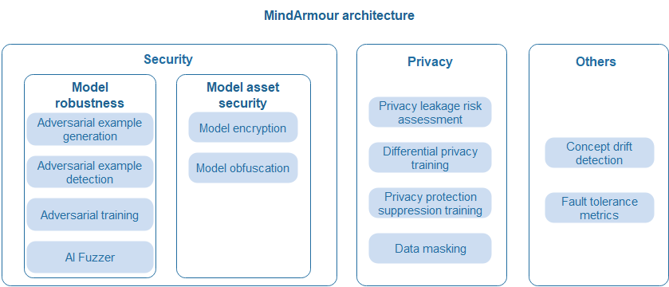
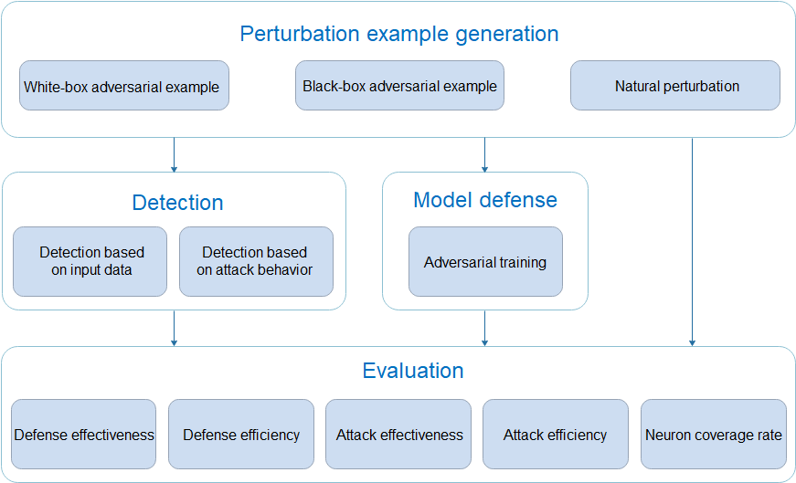
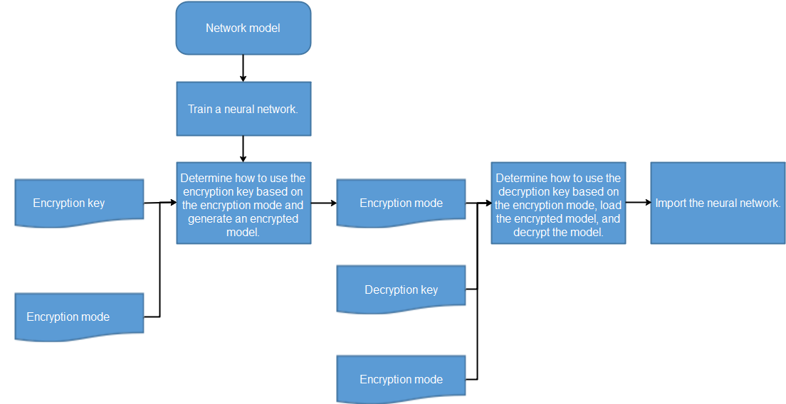
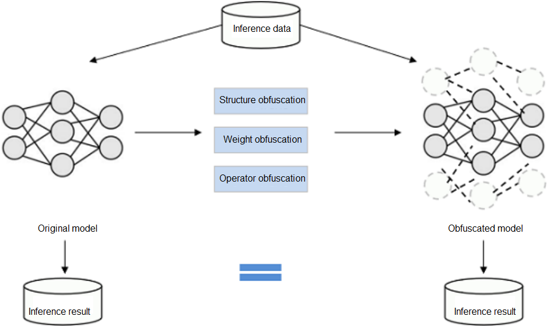
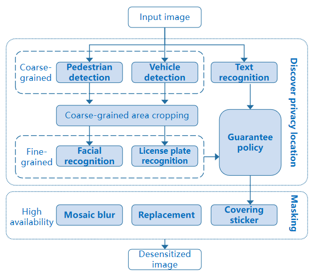
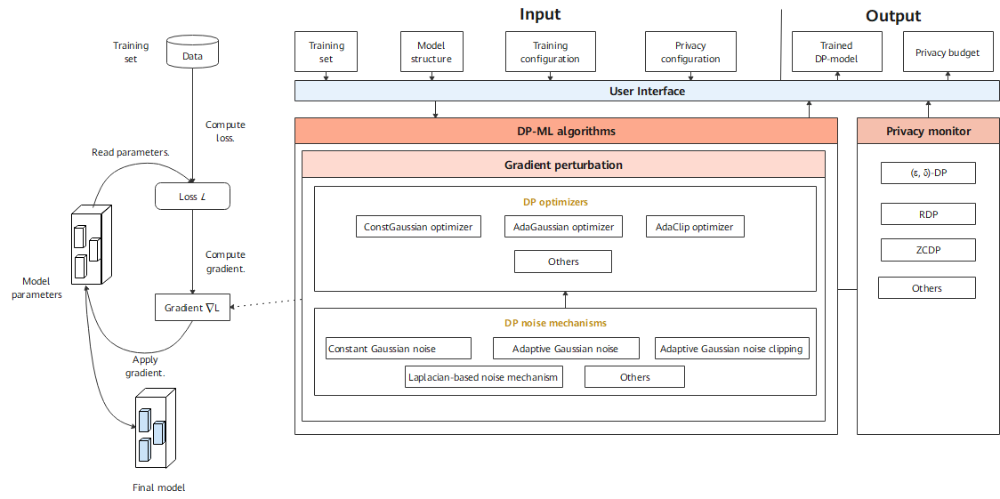

# Overall Security and Trustworthiness Design

## Overall Architecture

As a general technology, AI brings great opportunities and benefits, and faces new security and privacy protection challenges. MindArmour focuses on common security and privacy issues in AI application scenarios: AI models are vulnerable to adversarial example spoofing, sensitive privacy data may be collected in the data collection process, privacy data may be leaked during model use, model assets have a risk of being stolen, and models may become invalid due to data drift. MindArmour provides corresponding security and privacy protection capabilities.

The following figure shows the overall MindArmour architecture. The following describes three parts: model robustness, model asset security, and privacy protection.

- Model robustness: MindArmour model robustness focuses on the robustness of AI models for natural and adversarial perturbation examples. It covers natural perturbation example generation, black-box and white-box adversarial perturbation example generation, adversarial example detection, adversarial training, and AI Fuzzer, helping security personnel quickly and efficiently evaluate the robustness of AI models and improve their anti-attack capabilities.
- Model asset security: The structure and weight of AI models are key assets. To prevent models from being stolen during transmission, deployment, and running, MindArmour provides encryption-based model file protection and lightweight model protection based on structure parameter obfuscation. In federated learning scenarios, secure multi-party computing capabilities with lossless precision are provided to prevent model theft.
- Privacy leakage measurement and protection: In the data collection phase, the data masking capability is provided to prevent user privacy data from being collected. In the model training phase, differential privacy and privacy suppression mechanisms are provided to reduce model privacy leakage risks. In the model use phase, privacy leakage assessment technologies based on membership inference and inversion attacks are provided to evaluate the risks of model privacy leakage.

## Design Guidelines

### Model Robustness

Focus on the robustness of AI models for natural perturbation examples and adversarial examples.

**Natural Perturbation Examples**

Simulate common perturbations in real life, such as focus blur, motion blur, overexposure, rotation, translation, scaling, shearing, perspective transformation, uniform noise, and natural noise etc.

**Adversarial Examples**

An attacker adds small perturbations that are not easily perceived by human to the original example, causing deep learning model misjudgment. This is called an adversarial example attack.

MindArmour model security provides functions such as natural perturbation example generation, adversarial example generation, adversarial example detection, model defense, and attack defense effect evaluation, providing important support for AI model security research and AI application security.

- Perturbation example generation module: provides over 10 white-box adversarial example generation methods, over 5 black-box adversarial example generation methods, and over 15 natural perturbation example generation methods. Security engineers can quickly and efficiently generate adversarial examples based on different requirements to attack AI models.
- Detection module: provides more than 5 adversarial example detection methods to determine whether the input examples are adversarial and identify attack data and attacks before model inference.
- Defense module: provides defense methods for adversarial training to improve the attack defense capability of the model.
- Evaluation module: provides multi-dimensional evaluation indicators to comprehensively evaluate the robustness of the model.

#### AI Fuzzer

Different from traditional fuzzing, AI Fuzzer uses the neuron coverage rate as the test evaluation criterion based on the characteristics of neural networks. Neuron coverage refers to the range of the number of activated neurons and the output value of neurons observed through a group of inputs. The neuron coverage gain is used to guide input variation so that the input can activate more neurons and the neuron values can be distributed in a wider range. In this way, the output results and incorrect behaviors of different types of models can be explored to evaluate the robustness of the models.

AI Fuzzer consists of three modules:

1. Natural Threat/Adversarial Example Generator (data mutation module)

    Randomly selects a mutation method to mutate seed data to generate multiple variants. Mutation policies for multiple types of examples are supported, including:

    1. Method for generating natural perturbation examples:
      - Affine transformation: translate, scale, shear, rotate, perspective, and curve.
      - Blur: GaussianBlur, MotionBlur, and GradientBlur.
      - Luminance adjustment: Contrast and GradientLuminance.
      - Noise addition: UniformNoise, GaussianNoise, SaltAndPepperNoise, and NaturalNoise.
    2. Methods for generating white-box and black-box adversarial examples based on adversarial attacks: fast gradient sign method (FGSM), projected gradient descent (PGD), and momentum diverse input iterative method (MDIIM).

2. Fuzzer moduler (mutation guidance module):

   Performs fuzzing on the data generated by mutation and observes the change of the neuron coverage rate. If the generated data increases the neuron coverage rate, it adds the data to the mutation seed queue for the next round of data mutation. Currently, the following neuron coverage rate metrics are supported: NC, TKNC, KMNC, NBC, and SNAC.

3. Evaluation (evaluation module):

   Evaluates the fuzzer effect, quality of generated data, and strength of mutation methods. Three types of five metrics are supported, including common evaluation metrics such as accuracy, precision, and recall rate, neuron coverage, and attack success rate.

### Model Asset Security

Deep learning models have high business value and knowledge attributes. To protect model asset security and prevent models from being illegally copied, redistributed, and abused during transmission, deployment, and running, MindArmour provides encryption-based model file protection and structure parameter obfuscation-based lightweight model protection. In federated learning scenarios, secure multi-party computing capabilities with lossless precision are provided to prevent model theft.

#### Model Encryption

To ensure the security of model flushing to disks, MindArmour integrates the CKPT and MINDIR encryption and decryption functions in the framework. Developers can encrypt models and load ciphertext models before flushing models to disks. In the training phase, you can transfer the encryption key and encryption mode to the framework to enable the model encryption function and generate a ciphertext model. When the inference service is deployed, the same encryption key and mode are transferred to the framework during encryption and export to enable decryption during running.

#### Model Obfuscation

Model obfuscation scrambles the computation logic of a model without changing the model function, which greatly reduces the readability of the model. In this way, the reverse cost exceeds the benefit brought by the reverse, and the model is available but incomprehensible. It is lightweight and independent of specific hardware.

### Privacy

Protecting user privacy and security is an important corporate responsibility. MindArmour provides privacy protection capabilities throughout the AI lifecycle. In the data collection phase, the data masking capability is provided to prevent user privacy data from being collected. In the model training phase, differential privacy and privacy suppression mechanisms are provided to reduce model privacy leakage risks. In the model use phase, privacy leakage assessment technologies based on membership inference and inversion attacks are provided to evaluate the risks of model privacy leakage.

### Data Masking

Predefined privacy elements: The most common scenario is to anonymize street view data of autonomous driving, identify and mask specific content. The recall rate must be high, that is, the number of manual operations must be reduced as much as possible.

- Objects: faces, license plates, and specific text.
- Purposes: Protect ID privacy and maximize data availability while ensuring a high recall rate.
- Process:
    - Detect coarse-grained objects in which predefined fine-grained elements are located, and crop and save areas in which the coarse-grained objects are located.
    - Then, the fine-grained detection model is called to accurately locate privacy elements. If no privacy element is found in the coarse-grained detection area, the guarantee policy should be used to roughly locate the coarse-grained area to prevent privacy leakage caused by missing masking.
    - Finally, summarize all areas to be masked and the corresponding classes, and call the masking API to perform personalized masking.

#### Differential Privacy Training

The differential-privacy module of MindArmour implements differential privacy training. Model training consists of building a training dataset, computing the loss, computing the gradient, and updating model parameters. Currently, the differential privacy training of MindArmour focuses on the gradient computation process, that is, cropping and noise adding on the gradient using corresponding algorithms. In this way, user data privacy is protected.

- DP optimizer inherits capabilities of the MindSpore optimizer and uses the DP mechanisms to scramble and protect gradients. Currently, MindArmour provides three types of differential privacy optimizers: constant Gaussian optimizer, adaptive Gaussian optimizer, and adaptive clipping optimizer. Each type of differential privacy optimizer improves the differential privacy protection capabilities for common optimizers, such as SGD and Momentum, from different perspectives.
- Differential privacy (DP) noise mechanisms are the basis for building the differential privacy training capability. Different noise mechanisms meet the requirements of different differential privacy optimizers, including constant Gaussian noise, adaptive Gaussian noise, adaptive Gaussian noise clipping, and Laplacian-based noise mechanism.
- The privacy monitor provides callback functions such as Rényi differential privacy (RDP) and zero-concentrated differential privacy (ZCDP) to monitor the differential privacy budget of the model.

#### Privacy Leakage Assessment

MindArmour uses algorithms such as membership inference attack and model inversion attack to evaluate the risk of model privacy leakage.

- Membership inference: If an attacker has some access permissions (black box, gray box, or white box) of a model to obtain some or all information about the model output, structure, or parameters, they can determine whether a sample belongs to a training set of a model. In this case, we can use membership inference to evaluate the privacy data security of machine learning and deep learning models.
- Inversion attack: Attackers use model gradients to inversely infer user data. The attacker first randomly generates a pair of input data and labels, exports the virtual gradient, and updates the input data and labels during the optimization process to reduce the difference between the virtual gradient and the real gradient, thereby obtaining the privacy input data. With inversion attacks, we can evaluate the risk of leaking training data by deep learning models.
