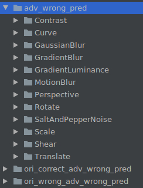
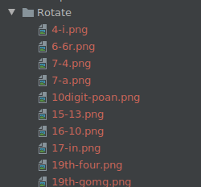

# Evaluating the Robustness of the OCR Model CNN-CTC

<a href="https://gitee.com/mindspore/docs/blob/master/docs/mindarmour/docs/source_en/evaluation_of_CNNCTC.md" target="_blank"></a>

## Overview

This tutorial uses natural perturbation serving to evaluate the robustness of the OCR model, CNN-CTC. Multiple natural perturbation sample datasets are generated based on serving, and then the robustness of the CNN-CTC model is evaluated based on the model performance on the natural perturbation sample datasets.

> You can obtain the complete executable sample code at <https://gitee.com/mindspore/mindarmour/tree/master/examples/natural_robustness/ocr_evaluate>.

## Environment Requirements

- Hardware

    - Prepare the Ascend/GPU processor to set up the hardware environment.

- Dependencies

    - [MindSpore](https://www.mindspore.cn/install/en)
    - MindSpore Serving 1.6.0 or later
    - MindArmour

## Script Description

### Code Structure

```bash
|-- natural_robustness
    |-- serving                         # Serving for generating natural perturbation samples.
    |-- ocr_evaluate
        |-- cnn_ctc                     # Directory for model training, inference, pre-processing, and post-processing.
        |-- data                        # Experiment analysis data.
        |-- default_config.yaml         # Parameter configuration.
        |-- generate_adv_samples.py     # Script for generating natural perturbation samples.
        |-- eval_and_save.py            # Script for CNN-CTC to perform inference on the perturbation sample and save the inference result.
        |-- analyse.py                  # Script for analyzing the robustness of the CNN-CTC model.
```

### Script Parameters

You can configure training parameters, inference parameters, and robustness evaluation parameters in `default_config.yaml`. We focus on the parameters used in the evaluation and the parameters that need to be configured by users. For details about other parameters, see the [CNN-CTC Tutorial](https://gitee.com/mindspore/models/tree/master/official/cv/cnnctc).

- `--TEST_DATASET_PATH`: indicates the path of the test dataset.
- `--CHECKPOINT_PATH`: indicates the checkpoint path.
- `--ADV_TEST_DATASET_PATH`: indicates the path of the perturbation sample dataset.
- `--IS_ADV`: specifies whether to use the perturbation sample for the test.

### Model and Data

The model to be evaluated is the CNN-CTC model implemented based on MindSpore. This model is mainly used for scene text recognition tasks. It uses a CNN model to extract features and uses the connectionist temporal classification (CTC) to predict the output sequence.

[Paper](https://arxiv.org/abs/1904.01906): J. Baek, G. Kim, J. Lee, S. Park, D. Han, S. Yun, S. J. Oh, and H. Lee, "What is wrong with scene text recognition model comparisons? dataset and model analysis," ArXiv, vol. abs/1904.01906, 2019.

For details about data processing and model training, see the [CNN-CTC Tutorial](https://gitee.com/mindspore/models/tree/master/official/cv/cnnctc). You need to obtain the preprocessed dataset and checkpoint model file based on this tutorial for the following evaluation task.

The preprocessed dataset is in .lmdb format and stored in key-value pairs.

- label- %09d: actual image label
- image- %09d: original image data
- num-samples: number of samples in the LMDB dataset

In the preceding information, `%09d` indicates a string of 9 digits. Example: label-000000001.

### Generating an Evaluation Dataset based on Natural Perturbation Serving

1. Start the serving server for generating natural perturbation samples. For details, see [Generating Natural Perturbation Samples Based on the Serving Server](https://gitee.com/mindspore/mindarmour/blob/master/examples/natural_robustness/serving/README.md#).

   ```bash
   cd serving/server/
   python serving_server.py
   ```

2. Generate an evaluation dataset based on the serving server.

   1. In `default_config.yaml`, configure the original test sample data path `TEST_DATASET_PATH` and the path to store the generated perturbation sample dataset `ADV_TEST_DATASET_PATH`. Example:

      ```yaml
      TEST_DATASET_PATH: "/opt/dataset/CNNCTC_data/MJ-ST-IIIT/IIIT5k_3000"
      ADV_TEST_DATASET_PATH: "/home/mindarmour/examples/natural_robustness/ocr_evaluate/data"
      ```

   2. The core code is described as follows:

      1. Configure the perturbation method. For details about the available perturbation methods and parameter configurations, see [transform/image](https://gitee.com/mindspore/mindarmour/tree/master/mindarmour/natural_robustness/transform/image). The following is a configuration example.

         ```python
         PerturbConfig = [
             {"method": "Contrast", "params": {"alpha": 1.5, "beta": 0}},
             {"method": "GaussianBlur", "params": {"ksize": 5}},
             {"method": "SaltAndPepperNoise", "params": {"factor": 0.05}},
             {"method": "Translate", "params": {"x_bias": 0.1, "y_bias": -0.1}},
             {"method": "Scale", "params": {"factor_x": 0.8, "factor_y": 0.8}},
             {"method": "Shear", "params": {"factor": 1.5, "direction": "horizontal"}},
             {"method": "Rotate", "params": {"angle": 30}},
             {"method": "MotionBlur", "params": {"degree": 5, "angle": 45}},
             {"method": "GradientBlur", "params": {"point": [50, 100], "kernel_num": 3, "center": True}},
             {"method": "GradientLuminance", "params": {"color_start": [255, 255, 255], "color_end": [0, 0, 0], "start_point": [100, 150], "scope": 0.3, "bright_rate": 0.3, "pattern": "light", "mode": "circle"}},
             {"method": "GradientLuminance", "params": {"color_start": [255, 255, 255], "color_end": [0, 0, 0], "start_point": [150, 200], "scope": 0.3, "pattern": "light", "mode": "horizontal"}},
             {"method": "GradientLuminance", "params": {"color_start": [255, 255, 255], "color_end": [0, 0, 0], "start_point": [150, 200], "scope": 0.3, "pattern": "light", "mode": "vertical"}},
             {"method": "Curve", "params": {"curves": 0.5, "depth": 3, "mode": "vertical"}},
             {"method": "Perspective", "params": {"ori_pos": [[0, 0], [0, 800], [800, 0], [800, 800]], "dst_pos": [[10, 0], [0, 800], [790, 0], [800, 800]]}},
         ]
         ```

      2. Prepare the data to be perturbed.

         ```python
         instances = []
         methods_number = 1
         outputs_number = 2
         perturb_config = json.dumps(perturb_config)
         env = lmdb.open(lmdb_paths, max_readers=32, readonly=True, lock=False, readahead=False, meminit=False)
         if not env:
             print('cannot create lmdb from %s' % (lmdb_paths))
             sys.exit(0)
         with env.begin(write=False) as txn:
             n_samples = int(txn.get('num-samples'.encode()))
             # Filtering
             filtered_labels = []
             filtered_index_list = []
             for index in range(n_samples):
                 index += 1  # lmdb starts with 1
                 label_key = 'label-%09d'.encode() % index
                 label = txn.get(label_key).decode('utf-8')
                 if len(label) > max_len: continue
                 illegal_sample = False
                 for char_item in label.lower():
                     if char_item not in config.CHARACTER:
                         illegal_sample = True
                         break
                 if illegal_sample: continue
                 filtered_labels.append(label)
                 filtered_index_list.append(index)
                 img_key = 'image-%09d'.encode() % index
                 imgbuf = txn.get(img_key)
                 instances.append({"img": imgbuf, 'perturb_config': perturb_config, "methods_number": methods_number,
                                   "outputs_number": outputs_number})

         print(f'num of samples in IIIT daaset: {len(filtered_index_list)}')
         ```

      3. Request the natural perturbation serving server and save the data returned by the serving server.

         ```python
         ip = '0.0.0.0:8888'
         client = Client(ip, "perturbation", "natural_perturbation")
         start_time = time.time()
         result = client.infer(instances)
         end_time = time.time()
         print('generated natural perturbs images cost: ', end_time - start_time)
         env_save = lmdb.open(lmdb_save_path, map_size=1099511627776)

         txn = env.begin(write=False)
         with env_save.begin(write=True) as txn_save:
             new_index = 1
             for i, index in enumerate(filtered_index_list):
                 try:
                     file_names = result[i]['file_names'].split(';')
                 except:
                     print('index: ', index)
                     print(result[i])
                 length = result[i]['file_length'].tolist()
                 before = 0
                 label = filtered_labels[i]
                 label = label.encode()
                 img_key = 'image-%09d'.encode() % index
                 ori_img = txn.get(img_key)
                 names_dict = result[i]['names_dict']
                 names_dict = json.loads(names_dict)
                 for name, leng in zip(file_names, length):
                     label_key = 'label-%09d'.encode() % new_index
                     txn_save.put(label_key, label)
                     img_key = 'image-%09d'.encode() % new_index
                     adv_img = result[i]['results']
                     adv_img = adv_img[before:before + leng]
                     adv_img_key = 'adv_image-%09d'.encode() % new_index
                     txn_save.put(img_key, ori_img)
                     txn_save.put(adv_img_key, adv_img)

                     adv_info_key = 'adv_info-%09d'.encode() % new_index
                     adv_info = json.dumps(names_dict[name]).encode()
                     txn_save.put(adv_info_key, adv_info)
                     before = before + leng
                     new_index += 1
             xn_save.put("num-samples".encode(),str(new_index - 1).encode())
         env.close()
         ```

   3. Run the script for generating natural perturbation samples.

      ```bash
      python generate_adv_samples.py
      ```

   4. The generated natural perturbation data is in .lmdb format and contains the following data items in key-value pair:

    - label- %09d: actual image label
    - image- %09d: original image data
    - adv_image- %09d: perturbed image data
    - adv_info- %09d: perturbation information, including perturbation methods and parameters
    - num-samples: number of samples in the LMDB dataset

### CNN-CTC Model Inference on the Generated Perturbation Dataset

1. In `default_config.yaml`, set the test dataset path `TEST_DATASET_PATH` to be the same as the path of the perturbation sample dataset `ADV_TEST_DATASET_PATH`. Example:

   ```yaml
   TEST_DATASET_PATH:  "/home/mindarmour/examples/natural_robustness/ocr_evaluate/data"
   ADV_TEST_DATASET_PATH: "/home/mindarmour/examples/natural_robustness/ocr_evaluate/data"
   ```

2. The core scripts are described as follows:

   1. Load the model and the dataset.

      ```python
      ds = test_dataset_creator(is_adv=config.IS_ADV)
      net = CNNCTC(config.NUM_CLASS, config.HIDDEN_SIZE, config.FINAL_FEATURE_WIDTH)

      ckpt_path = config.CHECKPOINT_PATH
      param_dict = load_checkpoint(ckpt_path)
      load_param_into_net(net, param_dict)
      print('parameters loaded! from: ', ckpt_path)
      ```

   2. Perform inference and save the inference results of the model on the original sample and perturbation sample.

      ```python
      env_save = lmdb.open(lmdb_save_path, map_size=1099511627776)
      with env_save.begin(write=True) as txn_save:
          for data in ds.create_tuple_iterator():
              img, _, text, _, length = data

              img_tensor = Tensor(img, mstype.float32)
              model_predict = net(img_tensor)
              model_predict = np.squeeze(model_predict.asnumpy())

              preds_size = np.array([model_predict.shape[1]] * config.TEST_BATCH_SIZE)
              preds_index = np.argmax(model_predict, 2)
              preds_index = np.reshape(preds_index, [-1])
              preds_str = converter.decode(preds_index, preds_size)
              label_str = converter.reverse_encode(text.asnumpy(), length.asnumpy())

              print("Prediction samples: \n", preds_str[:5])
              print("Ground truth: \n", label_str[:5])
              for pred, label in zip(preds_str, label_str):
                  if pred == label:
                      correct_count += 1
                  count += 1
                  if config.IS_ADV:
                      pred_key = 'adv_pred-%09d'.encode() % count
                  else:
                      pred_key = 'pred-%09d'.encode() % count

                  txn_save.put(pred_key, pred.encode())
      accuracy = correct_count / count
      ```

3. Run the eval_and_save.py script.

   ```bash
   python eval_and_save.py
   ```

   The CNN-CTC model performs inference on the generated natural perturbation dataset and saves the inference result of the model on each sample to the path `ADV_TEST_DATASET_PATH`.

   The following data items in key-value pair are added to the dataset:

    - pred- %09d: prediction result of the model on the original image data
    - adv_pred- %09d: prediction result of the model on the perturbed image data

   Prediction result of the model on real samples:

   ```bash
   Prediction samples:
       ['private', 'private', 'parking', 'parking', 'salutes']
   Ground truth:
       ['private', 'private', 'parking', 'parking', 'salutes']
   Prediction samples:
       ['venus', 'venus', 'its', 'its', 'the']
   Ground truth:
       ['venus', 'venus', 'its', 'its', 'the']
   Prediction samples:
       ['summer', 'summer', 'joeys', 'joeys', 'think']
   Ground truth:
       ['summer', 'summer', 'joes', 'joes', 'think']
   ...
   ```

   Prediction result of the model on natural perturbation samples:

   ```bash
   Prediction samples:
       ['private', 'private', 'parking', 'parking', 'salutes']
   Ground truth:
       ['private', 'private', 'parking', 'parking', 'salutes']
   Prediction samples:
       ['dams', 'vares', 'its', 'its', 'the']
   Ground truth:
       ['venus', 'venus', 'its', 'its', 'the']
   Prediction samples:
       ['sune', 'summer', '', 'joeys', 'think']
   Ground truth:
       ['summer', 'summer', 'joes', 'joes', 'think']
   ...
   ```

   Accuracies of the model on the original test dataset and natural perturbation dataset:

   ```bash
   num of samples in IIIT dataset: 5952
   Accuracy of benign sample:  0.8546195652173914
   Accuracy of perturbed sample:  0.6126019021739131
   ```

### Robustness Analysis

Run the analyse.py script to perform statistical analysis on the performance of CNN-CTC model on the perturbation dataset.

```bash
python analyse.py
```

Analysis result:

```bash
Number of samples in analyse dataset:  5952
Accuracy of original dataset:  0.46127717391304346
Accuracy of adversarial dataset:  0.6126019021739131
Number of samples correctly predicted in original dataset but wrong in adversarial dataset:  832
Number of samples both wrong predicted in original and adversarial dataset:  1449
------------------------------------------------------------------------------
Method  Shear
Number of perturb samples: 442
Number of wrong predicted: 351
Number of correctly predicted in origin dataset but wrong in adversarial: 153
Number of both wrong predicted in origin and adversarial dataset: 198
------------------------------------------------------------------------------
Method  Contrast
Number of perturb samples: 387
Number of wrong predicted: 57
Number of correctly predicted in origin dataset but wrong in adversarial: 8
Number of both wrong predicted in origin and adversarial dataset: 49
------------------------------------------------------------------------------
Method  GaussianBlur
Number of perturb samples: 436
Number of wrong predicted: 181
Number of correctly predicted in origin dataset but wrong in adversarial: 71
Number of both wrong predicted in origin and adversarial dataset: 110
------------------------------------------------------------------------------
Method  MotionBlur
Number of perturb samples: 458
Number of wrong predicted: 215
Number of correctly predicted in origin dataset but wrong in adversarial: 92
Number of both wrong predicted in origin and adversarial dataset: 123
------------------------------------------------------------------------------
Method  GradientLuminance
Number of perturb samples: 1243
Number of wrong predicted: 154
Number of correctly predicted in origin dataset but wrong in adversarial: 4
Number of both wrong predicted in origin and adversarial dataset: 150
------------------------------------------------------------------------------
Method  Rotate
Number of perturb samples: 405
Number of wrong predicted: 298
Number of correctly predicted in origin dataset but wrong in adversarial: 136
Number of both wrong predicted in origin and adversarial dataset: 162
------------------------------------------------------------------------------
Method  SaltAndPepperNoise
Number of perturb samples: 413
Number of wrong predicted: 116
Number of correctly predicted in origin dataset but wrong in adversarial: 29
Number of both wrong predicted in origin and adversarial dataset: 87
------------------------------------------------------------------------------
Method  Translate
Number of perturb samples: 419
Number of wrong predicted: 159
Number of correctly predicted in origin dataset but wrong in adversarial: 57
Number of both wrong predicted in origin and adversarial dataset: 102
------------------------------------------------------------------------------
Method  GradientBlur
Number of perturb samples: 440
Number of wrong predicted: 92
Number of correctly predicted in origin dataset but wrong in adversarial: 26
Number of both wrong predicted in origin and adversarial dataset: 66
------------------------------------------------------------------------------
Method  Perspective
Number of perturb samples: 401
Number of wrong predicted: 181
Number of correctly predicted in origin dataset but wrong in adversarial: 75
Number of both wrong predicted in origin and adversarial dataset: 106
------------------------------------------------------------------------------
Method  Curve
Number of perturb samples: 410
Number of wrong predicted: 361
Number of correctly predicted in origin dataset but wrong in adversarial: 162
Number of both wrong predicted in origin and adversarial dataset: 199
------------------------------------------------------------------------------
Method  Scale
Number of perturb samples: 434
Number of wrong predicted: 116
Number of correctly predicted in origin dataset but wrong in adversarial: 19
Number of both wrong predicted in origin and adversarial dataset: 97
------------------------------------------------------------------------------
```

The analysis result includes:

1. Number of evaluated samples: 5888
2. Accuracy of the CNN-CTC model on the original dataset: 85.4%
3. Accuracy of the CNN-CTC model on the perturbation dataset: 57.2%
4. Number of samples with correct prediction on the original image but incorrect prediction on the perturbed image: 1736
5. Number of samples with incorrect prediction on both the original image and the perturbed image: 782
6. For each perturbation method, the following are included: the number of samples, the number of perturbation samples with incorrect prediction, the number of samples with correct prediction on the original image but incorrect prediction on the perturbed image, and the number of samples with incorrect prediction on both the original image and the perturbed image.

If the prediction error rate of the CNN-CTC model is high after a perturbation method is used, the CNN-CTC model is not robust to this method. You are advised to improve the robustness of the CNN-CTC model. For example, if most images after perturbation (such as Rotate, Curve, MotionBlur, and Shear) are incorrectly predicted, further analysis is recommended.

The following folders are generated in `ADV_TEST_DATASET_PATH`:

```bash
adv_wrong_pred                  # Dataset whose image classification is incorrect after perturbation.
ori_corret_adv_wrong_pred       # Dataset with correct classification on the original image but incorrect classification on the perturbed image in the model
ori_wrong_adv_wrong_pred        # Dataset with incorrect classification on both the original image and the perturbed image in the model
```

Each folder is classified according to the perturbation method.



Each image is named in the format of true value-predicted value.png, as shown in the following figure.



The stored images can be further analyzed to determine whether the model quality problem, image quality problem, or perturbation method affects the image semantics and causes prediction errors.


