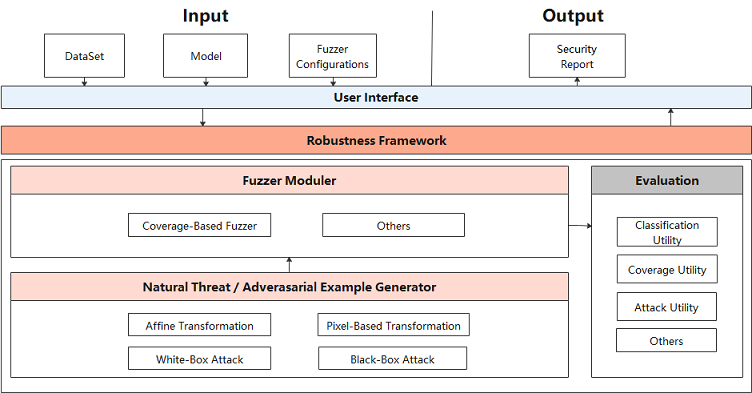
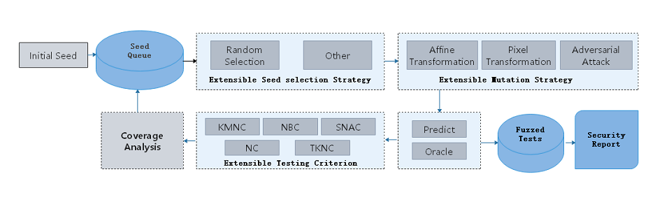

# AI Model Security Testing Design

## Background

Different from [fuzzing security test for traditional programs](https://zhuanlan.zhihu.com/p/43432370), MindArmour provides the AI model security test module fuzz_testing for deep neural network. Based on the neural network features, the concept of neuron coverage rate [1] is introduced to guide the fuzz testing. Fuzz testing is guided to generate samples in the direction of increasing neuron coverage rate so that more neurons can be activated by inputs. The distribution range of neuron values is wider to fully test DNN and explore the output results of different types of models and model error behavior.

## Fuzz Testing Design

The following figure shows the security test design of the AI model.

At the user interface layer, users need to provide the original dataset `DataSet`, tested model `Model`, and Fuzzer parameter `Fuzzer configuration`. After fuzzing the model and data, Fuzzer module returns the security report `Security Report`.

Fuzz testting architecture consists of three modules:

1. Natural Threat/Adversarial Example Generator:

   Randomly select a mutation method to mutate seed data and generate multiple variants. Mutation policies supporting multiple samples include:

   - Natural Robustness Methods
       - Image affine transformation methods: Translate, Scale, Shear, Rotate, Perspective, Curve;
       - Image blur methods: GaussianBlur, MotionBlur, GradientBlur;
       - Luminance adjustment methods: Contrast, GradientLuminance;
       - Add noise methods: UniformNoise, GaussianNoise, SaltAndPepperNoise, NaturalNoise.
   - Methods for generating adversarial examples based on white-box and black-box attacks: FGSM(FastGradientSignMethod), PGD(ProjectedGradientDescent), and MDIIM(MomentumDiverseInputIterativeMethod).

2. Fuzzer Moduler:

   Perform fuzz testing on the mutated data to observe the change of the neuron coverage rate. If the generated data increases the neuron coverage rate, add the data to the mutated seed queue for the next round of data mutation. Currently, the following neuron coverage metrics are supported: KMNC, NBC, SNAC, NC and TKNC.[2].

3. Evaluation:

   Evaluate the fuzz testing effect, quality of generated data, and strength of mutation methods. Five metrics of three types are supported, including the general evaluation metric (accuracy), neuron coverage rate metrics (kmnc, nbc, snac, nc and tknc), and adversarial attack evaluation metric (attack_success_rate).

## Fuzz Testing Process

The fuzz testing process is as follows:

1. Select seed A from the seed queue according to the policy.
2. Randomly select a mutation policy to mutate seed A and generate multiple variants A1, A2, ...
3. Use the target model to predict the variants. If the semantics of variant is consistent with the seed, the variant enters the Fuzzed Tests.
4. If the prediction is correct, use the neuron coverage metric for analysis.
5. If a variant increases the coverage rate, place the variant in the seed queue for the next round of mutation.

Through multiple rounds of mutations, you can obtain a series of variant data in the Fuzzed Tests, perform further analysis, and provide security reports from multiple perspectives. You can use them to deeply analyze defects of the neural network model and enhance the model to improve its universality and robustness.

## Code Implementation

1. [fuzzing.py](https://gitee.com/mindspore/mindarmour/blob/master/mindarmour/fuzz_testing/fuzzing.py): overall fuzz testing process.
2. [model_coverage_metrics.py](https://gitee.com/mindspore/mindarmour/blob/master/mindarmour/fuzz_testing/model_coverage_metrics.py): neuron coverage rate metrics, including KMNC, NBC, and SNAC.
3. [image transform methods](https://gitee.com/mindspore/mindarmour/tree/master/mindarmour/natural_robustness/transform/image): image mutation methods, including a plurality of noise addition, blurring, brightness adjustment and affine transformation methods.
4. [adversarial attacks](https://gitee.com/mindspore/mindarmour/tree/master/mindarmour/adv_robustness/attacks): methods for generating adversarial examples based on white-box and black-box attacks.

## References

[1] Pei K, Cao Y, Yang J, et al. Deepxplore: Automated whitebox testing of deep learning systems[C]//Proceedings of the 26th Symposium on Operating Systems Principles. ACM, 2017: 1-18.

[2] Ma L, Juefei-Xu F, Zhang F, et al. Deepgauge: Multi-granularity testing criteria for deep learning systems[C]//Proceedings of the 33rd ACM/IEEE International Conference on Automated Software Engineering. ACM, 2018: 120-131.
