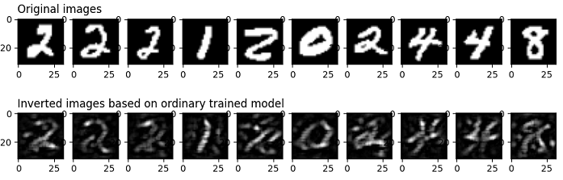
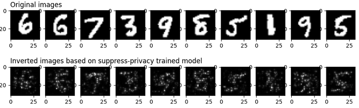

# Protecting User Privacy with Suppress Privacy

Translator: [翁炜华](https://gitee.com/weng-weihua)

<a href="https://gitee.com/mindspore/docs/blob/master/docs/mindarmour/docs/source_en/protect_user_privacy_with_suppress_privacy.md" target="_blank"></a>

## Overview

Privacy suppression is a mechanism to protect the privacy of user dat a. Privacy suppression is a way to protect user privacy when training an AI model. By removing unimportant parameters from the model, the number of its parameters can be significantly reduced, which reduces the input sample information that may be leaked by the model, thus greatly reducing the possibility of obtaining the original samples through model reversal attacks. Experiments show that the privacy suppression technique can achieve a better balance between the training accuracy and the degree of privacy protection for some models compared to differential privacy.

### MindArmour's Implementation of Privacy Suppression

Suppress-Privacy, a Suppress-Privacy module in MindArmour, implements a suppressed privacy optimizer. During the model training process, unimportant parameters are gradually set to 0 in a certain ratio, and eventually only 5-10% of the parameters are retained.

Here is an example showing that how to train a neural network model in MindSpore using the LeNet model, MNIST dataset, and the SuppressourPrivacy optimizer.

> This example is for the Ascend 910 AI processor and you can download the full sample code at <https://gitee.com/mindspore/mindarmour/blob/master/examples/privacy/sup_privacy/sup_privacy.py>

## Implementation

### Importing Library Files

The following presents the public modules, MindSpore-related modules, and privacy suppression modules that we need.

```python
import os
from easydict import EasyDict as edict
import mindspore.nn as nn
from mindspore import context
from mindspore.train.callback import ModelCheckpoint
from mindspore.train.callback import CheckpointConfig
from mindspore.train.callback import LossMonitor
from mindspore.nn import Accuracy
from mindspore import load_checkpoint, load_param_into_net
import mindspore.dataset as ds
import mindspore.dataset.vision.c_transforms as CV
import mindspore.dataset.transforms.c_transforms as C
from mindspore.dataset.vision import Inter
from mindspore import dtype as mstype

from examples.common.networks.lenet5.lenet5_net import LeNet5

from mindarmour.privacy.sup_privacy import SuppressModel
from mindarmour.privacy.sup_privacy import SuppressMasker
from mindarmour.privacy.sup_privacy import SuppressPrivacyFactory
from mindarmour.privacy.sup_privacy import MaskLayerDes

from mindarmour.utils import LogUtil

LOGGER = LogUtil.get_instance()
LOGGER.set_level('INFO')
TAG = 'Lenet5_Suppress_train'
```

### Parameter Configuration

1. Set the runtime environment, model training parameters, checkpoint storage parameters, and the batch_size parameter is recommended not to exceed 64. For more configurations, please refer to <https://gitee.com/mindspore/mindarmour/blob/master/examples/privacy/sup_privacy/sup_privacy_config.py>.

   ```python
   cfg = edict({
        'num_classes': 10,  # the number of classes of model's output
        'batch_size': 32,  # batch size for training
        'image_height': 32,  # the height of training samples
        'image_width': 32,  # the width of training samples
        'keep_checkpoint_max': 10,  # the maximum number of checkpoint files would be saved
        'device_target': 'Ascend',  # device used
   })
   ```

2. Configure the necessary information, including environment information and the execution mode. The PyNative mode on Ascend is currently supported.

   ```python
   context.set_context(mode=context.PYNATIVE_MODE, device_target=cfg.device_target)
   ```

   For detailed interface configuration information, see the `context.set_context` interface description.

### Preprocessed Datasets

Load the dataset and convert it into MindSpore data format.

```python
def generate_mnist_dataset(data_path, batch_size=32, repeat_size=1,
                           num_parallel_workers=1, sparse=True):
    """
    create dataset for training or testing
    """
    # define dataset
    ds1 = ds.MnistDataset(data_path)

    # define operation parameters
    resize_height, resize_width = 32, 32
    rescale = 1.0 / 255.0
    shift = 0.0

    # define map operations
    resize_op = CV.Resize((resize_height, resize_width),
                          interpolation=Inter.LINEAR)
    rescale_op = CV.Rescale(rescale, shift)
    hwc2chw_op = CV.HWC2CHW()
    type_cast_op = C.TypeCast(mstype.int32)

    # apply map operations on images
    if not sparse:
        one_hot_enco = C.OneHot(10)
        ds1 = ds1.map(operations=one_hot_enco, input_columns="label",
                      num_parallel_workers=num_parallel_workers)
        type_cast_op = C.TypeCast(mstype.float32)
    ds1 = ds1.map(operations=type_cast_op, input_columns="label",
                  num_parallel_workers=num_parallel_workers)
    ds1 = ds1.map(operations=resize_op, input_columns="image",
                  num_parallel_workers=num_parallel_workers)
    ds1 = ds1.map(operations=rescale_op, input_columns="image",
                  num_parallel_workers=num_parallel_workers)
    ds1 = ds1.map(operations=hwc2chw_op, input_columns="image",
                  num_parallel_workers=num_parallel_workers)

    # apply DatasetOps
    buffer_size = 10000
    ds1 = ds1.shuffle(buffer_size=buffer_size)
    ds1 = ds1.batch(batch_size, drop_remainder=True)
    ds1 = ds1.repeat(repeat_size)

    return ds1
```

### Building the Model

Here is an example of training the LeNet model, you can also build and train your own model.

Load the LeNet network, configure the checkpoint, set the optimizer type, and load the data with the loading function `generate_mnist_dataset` defined above.

```python
networks_l5 = LeNet5()
config_ck = CheckpointConfig(save_checkpoint_steps=10,
                             keep_checkpoint_max=cfg.keep_checkpoint_max)
ckpoint_cb = ModelCheckpoint(prefix="checkpoint_lenet",
                             directory='./trained_ckpt_file/',
                             config=config_ck)

# get training dataset
ds_train = generate_mnist_dataset('MNIST_unzip/train', cfg.batch_size)
```

### Introduction of Privacy Suppression

1. Configure the parameters of the suppress privacy optimizer

    - Define which layers of the AI model are involved in the suppress operation.
    - Instantiate the suppress privacy factory class.
    - Define the loss function.
    - Set the optimizer type.
    - If the sample size is 60000, the recommended parameters are set to end_epoch:10, start_epoch:3, mask_times:1000, lr:0.10, sparse_end:0.95, and sparse_start:0.0.
    This way the interval between two adjacent suppress operations is roughly 10~20 batches.

    ```python
    # layer_name (str): Layer name, get the name of one layer as following:
    #    for layer in networks.get_parameters(expand=True):
    #        if layer.name == "conv": ...
    # grad_idx (int): Grad layer index, get mask layer's index in grad tuple.
    # is_add_noise (bool): If True, the weight of this layer can add noise.
    #    If False, the weight of this layer can not add noise.
    # is_lower_clip (bool): If true, the weights of this layer would be clipped to greater than an lower bound value.
    #    If False, the weights of this layer won't be clipped.
    # min_num (int): The number of weights left that not be suppressed, which need to be greater than 0.
    # upper_bound (float): max value of weight in this layer, default value is 1.20 .
    masklayers_lenet5 = []  # determine which layer should be masked
    masklayers_lenet5.append(MaskLayerDes("conv1.weight", 0, True, True, 10))
    masklayers_lenet5.append(MaskLayerDes("conv2.weight", 1, True, True, 50))
    masklayers_lenet5.append(MaskLayerDes("fc1.weight", 2, True, False, -1))
    masklayers_lenet5.append(MaskLayerDes("fc2.weight", 4, True, False, -1))
    masklayers_lenet5.append(MaskLayerDes("fc3.weight", 6, True, False, 50))

    # networks (Cell): The training network.
    # mask_layers (list): Description of the training network layers that need to be suppressed.
    # policy (str): Training policy for suppress privacy training. "local_train" means local training.
    # end_epoch (int): The last epoch in suppress operations, 0 < start_epoch <= end_epoch <= 100 .
    # batch_num (int): The num of batch in an epoch, should be equal to num_samples/batch_size .
    # start_epoch (int): The first epoch in suppress operations, 0 < start_epoch <= end_epoch <= 100 .
    # mask_times (int): The num of suppress operations.
    # lr (Union[float, int]): Learning rate, 0 < lr <= 0.5 .
    # sparse_end (float): The sparsity to reach, 0.0 <= sparse_start < sparse_end < 1.0 .
    # sparse_start (float): The sparsity to start, 0.0 <= sparse_start < sparse_end < 1.0 .  
    suppress_ctrl_instance = SuppressPrivacyFactory().create(networks_l5,
                                                            masklayers_lenet5,
                                                            policy="local_train",
                                                            end_epoch=10,
                                                            batch_num=1875,
                                                            start_epoch=3,
                                                            mask_times=1000,
                                                            lr=0.05,
                                                            sparse_end=0.95,
                                                            sparse_start=0.0)
    net_loss = nn.SoftmaxCrossEntropyWithLogits(sparse=True, reduction="mean")
    net_opt = nn.SGD(networks_l5.trainable_params(), 0.05)
    ```

2. Packaging the LeNet model as a suppression privacy model

    - Instantiate the suppress privacy model class SuppressModel, which is used to train the model.
    - Instantiate SuppressMasker, a privacy suppression monitor, for selecting the appropriate time during training to perform suppress (set to zero) operations on model parameters.

   ```python
   # Create the suppress model for training.
   model_instance = SuppressModel(network=networks_l5,
                                   loss_fn=net_loss,
                                   optimizer=net_opt,
                                   metrics={"Accuracy": Accuracy()})
   model_instance.link_suppress_ctrl(suppress_ctrl_instance)
   suppress_masker = SuppressMasker(model=model_instance, suppress_ctrl=suppress_ctrl_instance)
   ```

3. Model Training and Testing

    ```python
   LOGGER.info(TAG, "============== Starting SUPP Training ==============")
   model_instance.train(10, ds_train, callbacks=[ckpoint_cb, LossMonitor(), suppress_masker],
                         dataset_sink_mode=False)

   LOGGER.info(TAG, "============== Starting SUPP Testing ==============")
   ds_eval = generate_mnist_dataset('MNIST_unzip/test', batch_size=cfg.batch_size)
   acc = model_instance.eval(ds_eval, dataset_sink_mode=False)
   LOGGER.info(TAG, "============== SUPP Accuracy: %s  ==============", acc)
    ```

4. Executing the command

   To run the script, enter the following command in the command line:

   ```bash
   python examples/privacy/sup_privacy/sup_privacy.py
   ```

   Replace `sup_privacy.py` with the name of your script.

5. Displaying the results

   The accuracy of LeNet model without privacy suppression is stable at 99%, and the convergence of LeNet model using privacy suppression is stable at about 97.5%.

   ```text
   ============== Starting SUPP Training ==============
   ...
   ============== Starting SUPP Testing ==============
   ...
   ============== SUPP Accuracy: 0.9745  ==============
   ```

### Privacy Protection Effect Test

To evaluate the effect of privacy suppression training on the protection of the dataset, we test it using an image reversal attack.
This inverse attack can restore the original image based on the output of the original image at one layer of the neural network, mainly because the network "remembers" the features of the training set during the training process.

The principle of this attack method can be found in <https://arxiv.org/pdf/1412.0035.pdf> and the complete code implementation can be found in <https://gitee.com/mindspore/mindarmour/blob/master/examples/privacy/inversion_attack/mnist_inversion_attack.py>, The following describes detailed test steps:

1. Preparation

    In order to compare with the suppressed privacy training, we need to get the CheckPoint file of the model using the regular training first. The model training can be referred to
    [mindarmour/examples/common/networks/lenet5](https://gitee.com/mindspore/mindarmour/blob/master/examples/common/networks/lenet5/mnist_train.py),
    It has the following directory structure:

    ```text
    ├── __init__.py
    ├── lenet5_net.py
    └── mnist_train.py
    ```

    Where `lenet5_net.py` is the model definition for LeNet5 and `mnist_train.py` is the regular training script for LeNet5. The `trained_ckpt_file` folder containing the model CheckPoint files can be generated by running the following command in this directory.

    ```bash
    python mnist_train.py
    ```

   In addition, since the newly trained model is needed for the evaluation of attack effectiveness in step 7 below, we change the generation command of the variable `ckpoint_cb` in the `mnist_train.py` file after generating the `trained_ckpt_file` directory to.

   ```python
   ckpoint_cb = ModelCheckpoint(prefix="checkpoint_lenet",
                             directory="./new_trained_ckpt_file/",
                             config=config_ck)
   ```

   Where `prefix` represents the prefix of the generated CheckPoint file name, `directory` represents the path where the CheckPoint file is stored, and then run `mnist_train.py`.
   Run `mnist_train.py` to get the `new_trained_ckpt_file` folder and the model files contained in it. At this point, the directory structure of `examples/common/networks/lenet5` should look like this:

   ```text
    ├── __init__.py
    ├── lenet5_net.py
    ├── mnist_train.py
    ├── new_trained_ckpt_file
    │   ├── checkpoint_lenet-10_1875.ckpt
    │   ├── checkpoint_lenet-1_1875.ckpt
    │   ├── checkpoint_lenet-2_1875.ckpt
    │   ├── checkpoint_lenet-3_1875.ckpt
    │   ├── checkpoint_lenet-4_1875.ckpt
    │   ├── checkpoint_lenet-5_1875.ckpt
    │   ├── checkpoint_lenet-6_1875.ckpt
    │   ├── checkpoint_lenet-7_1875.ckpt
    │   ├── checkpoint_lenet-8_1875.ckpt
    │   ├── checkpoint_lenet-9_1875.ckpt
    │   └── checkpoint_lenet-graph.meta
    └── trained_ckpt_file
        ├── checkpoint_lenet-10_1875.ckpt
        ├── checkpoint_lenet-1_1875.ckpt
        ├── checkpoint_lenet-2_1875.ckpt
        ├── checkpoint_lenet-3_1875.ckpt
        ├── checkpoint_lenet-4_1875.ckpt
        ├── checkpoint_lenet-5_1875.ckpt
        ├── checkpoint_lenet-6_1875.ckpt
        ├── checkpoint_lenet-7_1875.ckpt
        ├── checkpoint_lenet-8_1875.ckpt
        ├── checkpoint_lenet-9_1875.ckpt
        └── checkpoint_lenet-graph.meta
   ```

2. Import the required modules

    ```python
    import numpy as np
    import matplotlib.pyplot as plt
    from scipy.special import softmax
    from mindspore import load_checkpoint, load_param_into_net
    from mindspore import Tensor, context
    from mindspore import nn
    from mindarmour.privacy.evaluation import ImageInversionAttack
    from mindarmour.utils import LogUtil
    from examples.common.networks.lenet5.lenet5_net import LeNet5, conv, fc_with_initialize
    from examples.common.dataset.data_processing import generate_mnist_dataset
    LOGGER = LogUtil.get_instance()
    LOGGER.set_level('INFO')
    TAG = 'InversionAttack'
    ```

3. Build a reverse test network

    For better demonstration, we take the first two convolutional layers conv1 and conv2 of LeNet5 and the first fully connected layer fc1 as the test network, so the attack task is: to restore a certain image based on the feature map output from fc1.

    ```python
    class LeNet5_part(nn.Cell):
        """
        Part of LeNet5 network.
        """
        def __init__(self):
            super(LeNet5_part, self).__init__()
            self.conv1 = conv(1, 6, 5)
            self.conv2 = conv(6, 16, 5)
            self.fc1 = fc_with_initialize(16*5*5, 120)
            self.fc2 = fc_with_initialize(120, 84)
            self.fc3 = fc_with_initialize(84, 10)
            self.relu = nn.ReLU()
            self.max_pool2d = nn.MaxPool2d(kernel_size=2, stride=2)
            self.flatten = nn.Flatten()

        def construct(self, x):
            x = self.conv1(x)
            x = self.relu(x)
            x = self.max_pool2d(x)
            x = self.conv2(x)
            x = self.relu(x)
            x = self.max_pool2d(x)
            x = self.flatten(x)
            x = self.fc1(x)
            x = self.relu(x)
            return x
    ```

4. Import the trained CheckPoint file into the model

    ```python
    Checkpoint_path = '../../common/networks/lenet5/trained_ckpt_file/checkpoint_lenet-10_1875.ckpt'
    load_dict = load_checkpoint(Checkpoint_path)
    net = LeNet5_part()
    load_param_into_net(net, load_dict)
    ```

5. Get test samples

    We take 30 images for testing, saving them by themselves and their output after `LeNet5_part` (i.e. `target_features`).

    ```python
    # get original data
    data_list = "../../common/dataset/MNIST/train"
    batch_size = 32
    ds = generate_mnist_dataset(data_list, batch_size)
    i = 0
    batch_num = 1
    sample_num = 30
    for data in ds.create_tuple_iterator(output_numpy=True):
        i += 1
        images = data[0].astype(np.float32)
        true_labels = data[1][: sample_num]
        target_features = net(Tensor(images)).asnumpy()[:sample_num]
        original_images = images[: sample_num]
        if i >= batch_num:
            break
    ```

6. Conduct reverse attacks

    ```python
    inversion_attack = ImageInversionAttack(net, input_shape=(1, 32, 32), input_bound=(0, 1), loss_weights=[1, 0.1, 5])
    inversion_images = inversion_attack.generate(target_features, iters=100)
    ```

7. Attack result evaluation and presentation

    We use matplotlib to draw the original image and the image restored with the inverse attack, and call the `evaluate` method of `inversion_attack` for quantitative evaluation.
    The `evaluate` method returns `avg_l2_dis`, `avg_ssim` and `avg_confi`, which denote the average L2 parametric distance and average structural similarity, as well as the inference result of the reverse-reduced image on a new model (average confidence on its true label).
    In general, the smaller `avg_l2_dis` and the larger `avg_ssim` represent the closer the inversion_images are to the original_images; and the new neural network model can replace the human vision to make a quantitative assessment of the recognizability of the images (i.e., the higher `avg_confi` indicates that the inversion _image contains semantic information that is closer to the original image).

    ```python
    plot_num = min(sample_num, 10)
    for n in range(1, plot_num+1):
        plt.subplot(2, plot_num, n)
        if n == 1:
            plt.title('Original images', fontsize=12, loc='left')
        plt.gray()
        plt.imshow(images[n - 1].reshape(32, 32))
        plt.subplot(2, plot_num, n + plot_num)
        if n == 1:
            plt.title('Inverted images based on ordinary trained model', fontsize=12, loc='left')
        plt.gray()
        plt.imshow(inversion_images[n - 1].reshape(32, 32))
    plt.show()

    net2 = LeNet5()
    new_ckpt_path = '../../common/networks/lenet5/new_trained_ckpt_file/checkpoint_lenet-10_1875.ckpt'
    new_load_dict = load_checkpoint(new_ckpt_path)
    load_param_into_net(net2, new_load_dict)
    pred_labels = np.argmax(net2(Tensor(inversion_images).astype(np.float32)).asnumpy(), axis=1)

    avg_l2_dis, avg_ssim, avg_confi = inversion_attack.evaluate(original_images, inversion_images, true_labels, net2)
    LOGGER.info(TAG, 'The average L2 distance between original images and inverted images is: {}'.format(avg_l2_dis))
    LOGGER.info(TAG, 'The average ssim value between original images and inverted images is: {}'.format(avg_ssim))
    LOGGER.info(TAG, 'The average prediction confidence on true labels of inverted images is: {}'.format(avg_confi))
    LOGGER.info(TAG, 'True labels of original images are:      %s' % true_labels)
    LOGGER.info(TAG, 'Predicted labels of inverted images are: %s' % pred_labels)
    ```

8. Experimental results

    ```text
    The average L2 distance between original images and inverted images is: 0.8294931122450715
    The average ssim value between original images and inverted images is: 0.2429179625584347
    The average prediction confidence on true labels of inverted images is: 0.9547292590141296
    True labels of original images are:      [5 7 1 0 4 3 1 5 5 9 5 0 9 9 7 5 4 2 1 7 4 0 0 6 2 6 0 6 6 6]
    Predicted labels of inverted images are: [5 7 1 0 4 3 1 5 5 9 5 0 9 9 7 5 4 2 1 7 4 0 0 6 2 6 0 6 6 6]
    ```

    

    We can see the general outline of the original_images from the inversion_images, indicating that the conventionally trained model is likely to lead to privacy leakage of the training set.
    **In order to verify that the model obtained by privacy suppression training can better protect the information of the training data**, we replace the CheckPoint file in step 4 above with the CheckPoint file obtained by privacy suppression training and execute the process from step 2 to step 7 above, we can obtain the following results.

    ```text
    The average L2 distance between original images and inverted images is: 0.862553358599391
    The average ssim value between original images and inverted images is: 0.2644709319921787
    The average prediction confidence on true labels of inverted images is: 0.5576204061508179
    True labels of original images are:      [9 2 2 0 1 2 9 8 5 0 7 3 4 8 9 0 6 6 7 2 0 6 7 5 8 8 1 6 7 9]
    Predicted labels of inverted images are: [8 2 2 0 1 2 7 8 5 0 7 3 4 8 9 7 6 6 7 2 0 6 7 5 8 8 1 5 7 9]
    ```

    

    First, the results on the visualization show that the model obtained from the inverse attack based on the suppression of privacy training is very poor; however, the avg_l2_dis and avg_ssim obtained in this case are very close to the previous one.
    This is mainly due to the fact that avg_l2_dis and avg_ssim can only compare low-order information between images based on the mean and standard deviation of image pixels, while avg_confi can compare higher-order semantic information between images.

    The samples used in this experiment are MNIST datasets, which are relatively simple images, with the black background occupying most of the image and the white part containing the main information occupying less of the area. However, it can be seen that the avg_confi obtained based on the suppressed privacy model is significantly lower than the previous set of experiments, which indicates that the images constructed in reverse have been more difficult to be recognized by the new model, and this result is consistent with the results observed by our human vision.

### Citation

[1] Ligeng Zhu, Zhijian Liu, and Song Han. [Deep Leakage from Gradients](http://arxiv.org/pdf/1906.08935.pdf). NeurIPS, 2019.

[2] Aravindh Mahendran, Andrea Vedaldi. [Understanding Deep Image Representations by Inverting Them](https://arxiv.org/pdf/1412.0035.pdf). CVPR, 2015.
