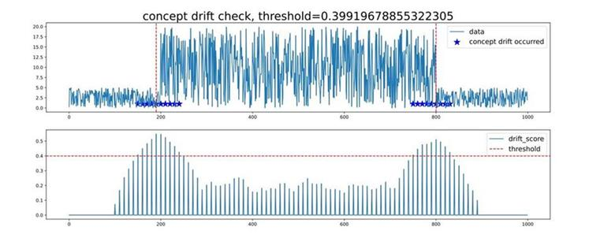

# 实现时序数据概念漂移检测应用

<a href="https://gitee.com/mindspore/docs/blob/r1.6/docs/mindarmour/docs/source_zh_cn/concept_drift_time_series.md" target="_blank"></a>

## 概述

概念漂移（Concept Drift）是AI学习领域的一种重要数据现象，表现为在线推理数据（实时分布）
与训练阶段（历史分布）不一致。概念漂移检测能够及时发现数据分布变化，提前预测模型失效征兆，对AI模型的及时调整具有重要意义。

概念漂移检测本质上是检测数据分布变化，本示例提出一种检测数据变化的方法，对比新窗口数据的特征是否足够偏离历史窗口特征，如若偏离程度大于某一阈值，则数据发生概念漂移。

本例会实现一个简单的时序数据概念漂移检测的功能，整体流程如下：

1. 下载公开数据集或构造数据。
2. 定义概念漂移类参数。
3. 调用概念漂移检测函数。
4. 查看结果。

> 你可以在这里找到完整可运行的样例代码：<https://gitee.com/mindspore/mindarmour/blob/r1.6/examples/reliability/concept_drift_time_series.py> 。

## 准备环节

确保已经正确安装了MindSpore。如果没有，可以通过[MindSpore安装页面](https://www.mindspore.cn/install)进行安装。  

### 下载数据集

示例中用到金融领域公开数据集：标普500指数记录的美国股市平均记录。
> 数据集下载页面：<https://www.kaggle.com/camnugent/sandp500>。

将数据集下载并解压到本地路径下，目录结构如下：

```bash
├── archive
  ├── individual_stocks_5yr
      ├──individual_stocks_5yr
```

数据路径：archive/individual_stocks_5yr/individual_stocks_5yr。文件夹内每一个csv文件为一组数据用例。

### 导入Python库&模块

在使用前，需要导入需要的Python库。

```python
import numpy
import matplotlib
import itertools
import mindarmour
```

## 数据处理

从数据路径：archive/individual_stocks_5yr/individual_stocks_5yr 中打开一个数据用例。

```python
import numpy as np
DATA_FILE = r'archive/individual_stocks_5yr/individual_stocks_5yr/AEE_data.csv'
data = np.loadtxt(DATA_FILE, str, delimiter=",")
```

`data`数据包含包含了`date`，`open`，`high`，`low`，`close`，`volume`，`Name`列 ，其中`open`，`high`，`low`，`close`，`volume`为数值列，可以选择数值列中的某一列或某几列进行概念漂移检测。

```python
data = data[1:, 2].astype('float64')  # 选择第2列
```

或

```python
data = data[1:, 2: 4].astype('float64')  # 选择第2-4列
```

为了方便样例使用，可以通过构造的方式获得数据，如下方代码所示。

```python
import numpy as np
data = 5*np.random.rand(1000)
data[200: 800] = 50*np.random.rand(600)
```

## 初始化概念漂移检测模块

导入概念漂移检测模块，并进行初始化，示例代码如下：

```python
from mindarmour import ConceptDriftCheckTimeSeries

concept = ConceptDriftCheckTimeSeries(window_size=100, rolling_window=10, step=10, threshold_index=1.5,need_label=False)
```

初始化参数含义：

- `window_size(int)`：概念窗口。数值不小于10，如果给定输入数据`data`的长度， `window_size`范围在[10, 1/3*len(`data`)] 之间。一般，如果时序数据为周期性函数，`window_size`的大小可以选择2-5倍的周期长度。举例，`data`的长度为1000，周期为30，那么`window_size`的范围可以在[10, 333]，考虑到数据周期性，`window_size`可以取值90。
- `rolling_window(int)`：平滑窗口。数值大小 [1, `window_size`]。默认值：10。
- `step(int)`: 窗口滑动步长。数值范围在 [1,`window_size`]之间。默认值：10。
- `threshold_index(float)`：阈值系数。阈值系数越高，阈值越大。默认值: 1.5。
- `need_label(bool)`：标签需求。False或True。如果为True， 表明需要概念漂移标签。如果为False， 则不需要概念漂移标签。默认值：False。

## 启动概念漂移检测

完成模块初始化后，调用概念漂移检测函数`concept_check`。

```python
drift_score, threshold, concept_drift_location = concept.concept_check(data)
```

返回值

- `drift_score(numpy.ndarray)`：概念漂移分数。针对输入`data`，获得其发生概念漂移的置信分数。分数越高，概念漂移的可能性越大。
- `threshold(float)`：概念漂移阈值。根据`threshold_index(float)`计算获得的阈值大小。
- `concept_drift_location(list)`：概念漂移发生位置。返回概念漂移发生的x轴对应位置，通常为某个x轴区域。

## 查看结果

当执行完concept.concept_check(data)，会将执行结果保存为pdf，命名为"concept_drift_check.pdf"。

如下图所示：



**子图1**：用户输入的数据`data`。数据中发生概念漂移的位置用蓝色五星标出，红色虚线（竖直方向）表示概念漂移发生最明显的位置。  
**子图2**：概念漂移置信分数`drift_score`（针对子图1中的数据），分数越高，概念漂移的可能性越大。红色虚线表示判断概念漂移的阈值`threshold`，虚线之上的`drift_score`所对应的横轴位置，判定为发生概念漂移。`threshold`的大小可根据`threshold_index`进行调节。