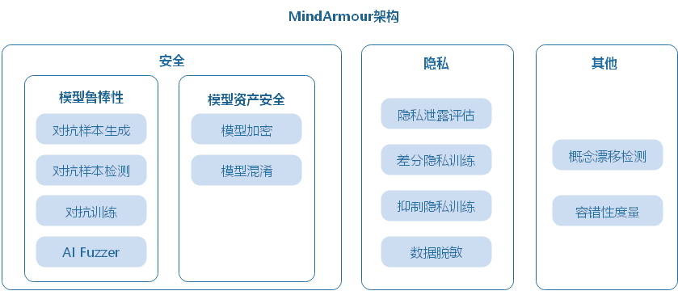
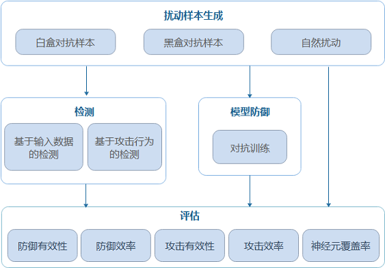
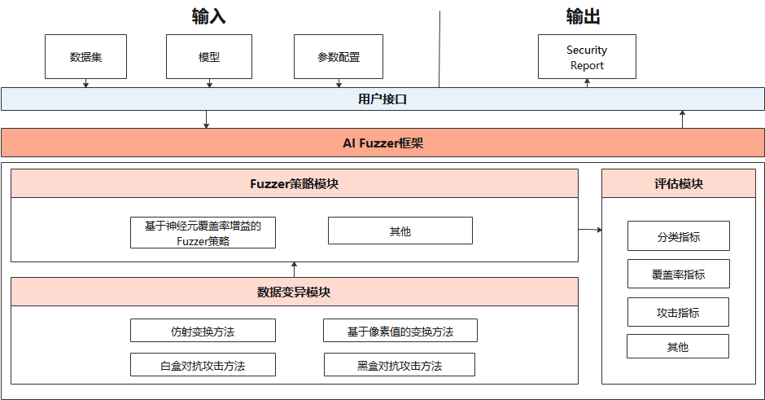
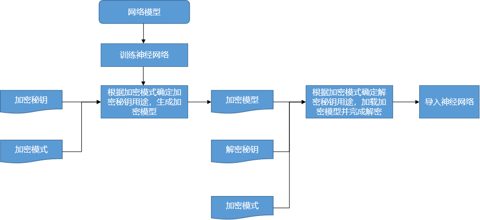
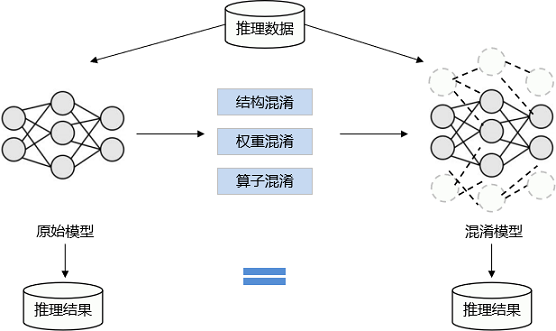
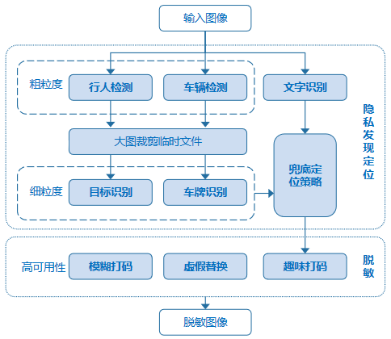

# 安全可信总体设计

## 总体架构

AI作为一种通用技术，带来巨大机遇和效益的同时也面临着新的安全与隐私保护的挑战。MindArmour关注AI应用场景中常见的安全与隐私问题：AI模型易受对抗样本欺骗、数据采集过程中可能收集到敏感隐私数据、模型使用过程中可能泄露隐私数据、模型资产存在被窃取风险、数据漂移导致模型失效等。并提供相应的安全与隐私保护能力。

MindArmour总体架构如下图所示，下面介绍主要的三个部分：模型鲁棒性、模型资产安全、隐私保护。

- 模型鲁棒性：MindArmour的模型鲁棒性主要关注AI模型对于自然扰动样本及对抗扰动样本的鲁棒性。涵盖自然扰动样本生成、黑白盒对抗扰动样本生成、对抗样本检测、对抗训练、AI Fuzzer等能力，用于帮助安全工作人员快速高效的对AI模型进行鲁棒性评测、提升模型抗攻击能力。
- 模型资产安全：AI模型的结构和权重是关键资产，为防止模型在传输、部署、运行时被敌手窃取，MindArmour提供了基于加密的模型文件保护功能和基于结构参数混淆的轻量级模型保护功能。在联邦学习场景中提供精度无损的安全多方计算能力防止模型窃取。
- 隐私泄露度量及保护：在数据采集阶段提供数据脱敏能力，避免采集用户隐私数据；模型训练阶段提供差分隐私、抑制隐私保护机制，减少模型隐私泄露风险；在模型使用阶段提供基于成员推理、逆向攻击的隐私泄露评估技术用于评估模型泄露隐私的风险。

## 设计思路

### 模型鲁棒性

主要关注AI模型对于自然扰动样本及对抗扰动样本的鲁棒性。

#### 对抗样本

攻击者在原始样本处加入人类不易察觉的微小扰动，导致深度学习模型误判，称为对抗样本攻击。MindArmour模型安全提供对抗样本生成、对抗样本检测、模型防御、攻防效果评估等功能，为AI模型安全研究和AI应用安全提供重要支撑。

- 扰动样本生成模块：提供10+白盒对抗样本生成方法、5+黑盒对抗样本生成方法，15+自然扰动样本生成方法。支持安全工程师根据不同需求快速高效地生成对抗样本，用于攻击AI模型。
- 检测模块：提供5+对抗样本检测方法，判断输入样本是否具有对抗性，在模型推理前识别攻击数据和攻击行为。
- 防御模块：提供对抗训练的防御方法，提升模型自身的抗攻击能力。
- 评测模块：提供多维度的评价指标全面评估模型鲁棒性。

#### AI Fuzzer

不同于传统fuzz测试，AI Fuzzer根据神经网络特点，以神经元覆盖率作为测试评价准则。神经元覆盖率，是指通过一组输入观察到的激活神经元数量和神经元输出值的范围。通过神经元覆盖率增益来指导输入变异，让输入能够激活更多的神经元，神经元值的分布范围更广，从而探索不同类型的模型输出结果、错误行为，从而评测模型鲁棒性。

AI Fuzzer主要包括三个模块：

1. Natural Threat/Adversarial Example Generator（数据变异模块）：

    随机选择变异方法对种子数据变异生成多个变种。支持多种样本的变异策略， 包括：

    - 图像仿射变换方法如：平移、旋转、缩放、错切、透视等。
    - 基于图像像素值变化的方法如：改变对比度、亮度、模糊、加噪、柏林噪声等。
    - 基于对抗攻击的白盒、黑盒对抗样本生成方法，如FGSM、PGD、MDIIM等。

2. Fuzzer moduler（变异指导模块）:

   对变异生成的数据进行fuzz测试，观察神经元覆盖率的变化情况，如果生成的数据使得神经元覆盖率增加，则加入变异的种子队列，用于下一轮的数据变异。目前支持的神经元覆盖率指标包括NC、TKNC、KMNC、NBC、SNAC。

3. Evaluation（评估模块）：

   评估Fuzzer效果，生成数据的质量，变异方法的强度。支持3个类型5种指标，包括准确率、精确率、召回率等通用评价指标，神经元覆盖率指标，对抗攻击成功率指标。

### 模型资产安全

深度学习模型具有较高的商业价值和知识属性，为保护模型资产安全，防止模型在传输、部署、运行时被被非法复制、重新分发滥用，MindArmour提供了基于加密的模型文件保护功能和基于结构参数混淆的轻量级模型保护功能。在联邦学习场景中提供精度无损的安全多方计算能力防止模型窃取。

#### 模型加密

为保护模型落盘安全，MindArmour在框架中集成了对ckpt和MINDIR加解密的功能，提供开发者在落盘前完成模型加密以及加载密文模型的能力。用户在训练阶段可以向框架传入加密秘钥和加密模式来启用模型加密功能，生成密文模型。在部署推理服务时向框架传入和加密导出时一致的加密秘钥和模式，启用运行时解密。

#### 模型混淆

模型混淆在不改变模型功能的同时，对模型的计算逻辑进行加扰，大大降低模型的可读性，使其逆向成本超过逆向所带来的收益，做到模型可用但不可理解。具有轻量、不依赖于特定硬件等优势。

### 隐私

保护用户隐私安全是一项重要的企业责任。MindArmour提供AI生命周期的隐私保护能力：数据采集阶段提供数据脱敏能力，避免采集用户隐私数据；模型训练阶段提供差分隐私、抑制隐私保护机制，减少模型隐私泄露风险；在模型使用阶段提供基于成员推理、逆向攻击的隐私泄露评估技术用于评估模型泄露隐私的风险。

### 数据脱敏

预定义隐私元素：最常见的场景是对自动驾驶的街景数据进行脱敏，对特定内容进行识别并脱敏，要求结果召回率高，即尽可能打码以防止隐私泄露带来的人工额外操作。

- 脱敏对象：人脸，车牌，特定文字。
- 脱敏目标：保护ID隐私；在保证召回率的前提下最大化数据可用性。
- 处理过程：
    - 对预定义细粒度元素所在的粗粒度物体进行检测，并将所在区域进行裁剪保存；
    - 再调用细粒度检测模型进行隐私元素的精准定位，如果粗粒度检测区域未发现隐私元素，为防止漏打码造成隐私泄露，应对粗粒度区域使用兜底策略进行大致定位；
    - 最后汇总得到所有待打码区域及所对应的类别，调用脱敏接口进行个性化脱敏。

#### 差分隐私训练

MindArmour的Differential-Privacy模块实现了差分隐私训练的能力。模型的训练主要由构建训练数据集、计算损失、计算梯度以及更新模型参数等过程组成，目前MindArmour的差分隐私训练主要着力于计算梯度的过程，通过相应的算法对梯度进行裁剪、加噪等处理，从而保护用户数据隐私。

- 差分隐私优化器：差分隐私优化器继承了MindSpore优化器的能力，并使用差分隐私的噪声机制对梯度加扰保护。目前，MindArmour提供三类差分隐私优化器：固定高斯优化器、自适应高斯优化器、自适应裁剪优化器，每类差分隐私优化器从不同的角度为SGD、Momentum等常规优化器增加差分隐私保护的能力。
- 噪声机制：噪声机制是构建差分隐私训练能力的基础，不同的噪声机制满足不同差分隐私优化器的需求，包括固定高斯分布噪声、自适应高斯分布噪声、自适应裁剪高斯分布噪声、拉普拉斯分布噪声等多种机制。
- 检测器：Monitor提供RDP、ZCDP等回调函数，用于监测模型的差分隐私预算。

#### 隐私泄露评估

MindArmour提供基于成员推理攻击、模型逆向攻击等算法，评估模型隐私泄漏的风险。

- 成员推理：指攻击者拥有模型的部分访问权限(黑盒、灰盒或白盒)，能够获取到模型的输出、结构或参数等部分或全部信息，并基于这些信息推断某个样本是否属于模型的训练集。利用成员推理，我们可以评估机器学习/深度学习模型的隐私数据安全。
- 逆向攻击：指攻击者利用模型梯度逆向推理用户数据。攻击者先随机生成一对输入数据和标签，导出虚拟梯度，在优化过程中更新输入数据和标签，减小虚拟梯度与真实梯度的差异，从而获得隐私输入数据。利用逆向攻击，我们可以评估深度学习模型泄露训练数据的风险。