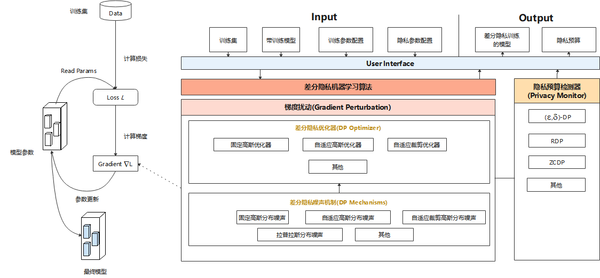

# 差分隐私设计

## 总体设计

MindArmour的Differential-Privacy模块实现了差分隐私训练的能力。模型的训练主要由构建训练数据集、计算损失、计算梯度以及更新模型参数等过程组成，目前MindArmour的差分隐私训练主要着力于计算梯度的过程，通过相应的算法对梯度进行裁剪、加噪等处理，从而保护用户数据隐私。

*
图1  差分隐私总体设计
*

图1是差分隐私训练的总体设计，主要由差分隐私噪声机制(DP Mechanisms)、差分隐私优化器(DP Optimizer)、差分隐私监控器(Privacy Monitor)组成。

### 差分隐私优化器

差分隐私优化器继承了MindSpore优化器的能力，并使用差分隐私的噪声机制对梯度加扰保护。目前，MindArmour提供三类差分隐私优化器：固定高斯优化器、自适应高斯优化器、自适应裁剪优化器，每类差分隐私优化器从不同的角度为SGD、Momentum等常规优化器增加差分隐私保护的能力。

- 固定高斯优化器，是一种非自适应高斯噪声的差分隐私优化器。其优势在于可以严格控制差分隐私预算ϵ，缺点是在模型训练过程中，每个Step添加的噪声量固定，若迭代次数过大，训练后期的噪声使得模型收敛困难，甚至导致性能大幅下跌，模型可用性差。
- 自适应高斯优化器，通过自适应调整标准差，来调整高斯分布噪声的大小，在模型训练初期，添加的噪声量较大，随着模型逐渐收敛，噪声量逐渐减小，噪声对于模型可用性的影响减小。自适应高斯噪声的缺点是不能严格控制差分隐私预算。
- 自适应裁剪优化器，是一种自适应调整调整裁剪粒度的差分隐私优化器，梯度裁剪是差分隐私训练的一个重要操作，自适应裁剪优化器能够自适应的控制梯度裁剪的比例在给定的范围波动，控制迭代训练过程中梯度裁剪的粒度。

### 差分隐私的噪声机制

噪声机制是构建差分隐私训练能力的基础，不同的噪声机制满足不同差分隐私优化器的需求，包括固定高斯分布噪声、自适应高斯分布噪声、自适应裁剪高斯分布噪声、拉普拉斯分布噪声等多种机制。

### Monitor

Monitor提供RDP、ZCDP等回调函数，用于监测模型的差分隐私预算。

- ZCDP[1]

    ZCDP，zero-concentrated differential privacy，是一种宽松的差分隐私定义，利用Rényi散度来度量随机函数在相邻数据集上的分布差异。

- RDP[2]

    RDP，Rényi Differential Privacy，是一种更通用的基于R'enyi散度的差分隐私定义，利用Rényi散度来度量两个相邻数据集的分布差异。

相对于传统差分隐私，ZCDP和RDP都能能够提供更加严格的隐私预算上界保证。

## 代码实现

- [mechanisms.py](https://gitee.com/mindspore/mindarmour/blob/r1.6/mindarmour/privacy/diff_privacy/mechanisms/mechanisms.py)：这个文件实现了差分隐私训练所需的噪声生成机制，包括简单高斯噪声、自适应高斯噪声、自适应裁剪高斯噪声等。
- [optimizer.py](https://gitee.com/mindspore/mindarmour/blob/r1.6/mindarmour/privacy/diff_privacy/optimizer/optimizer.py)：这个文件实现了使用噪声生成机制在反向传播时添加噪声的根本逻辑。
- [monitor.py](https://gitee.com/mindspore/mindarmour/blob/r1.6/mindarmour/privacy/diff_privacy/monitor/monitor.py)：实现了计算差分隐私预算的回调函数，模型训练过程中，会反馈当前的差分隐私预算。
- [model.py](https://gitee.com/mindspore/mindarmour/blob/r1.6/mindarmour/privacy/diff_privacy/train/model.py)：这个文件实现了计算损失和梯度的逻辑，差分隐私训练的梯度截断逻辑在此文件中实现，且model.py是用户使用差分隐私训练能力的入口。

## 参考文献

[1] Lee, Jaewoo, and Daniel Kifer. "Concentrated differentially private gradient descent with adaptive per-iteration privacy budget." *Proceedings of the 24th ACM SIGKDD International Conference on Knowledge Discovery & Data Mining*. 2018.

[2] Mironov, Ilya. "Rényi differential privacy." *2017 IEEE 30th Computer Security Foundations Symposium (CSF)*. IEEE, 2017.
