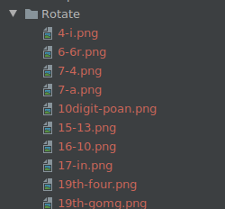
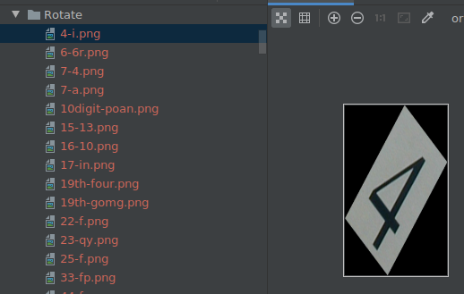

# 对OCR模型CNN-CTC的鲁棒性评测

<a href="https://gitee.com/mindspore/docs/blob/r1.7/docs/mindarmour/docs/source_zh_cn/evaluation_of_CNNCTC.md" target="_blank"></a>

## 概述

本教程主要演示利用自然扰动serving服务，对OCR模型CNN-CTC做一个简单的鲁棒性评测。先基于serving生成多种自然扰动样本数据集，然后根据CNN-CTC模型在自然扰动样本数据集上的表现来评估模型的鲁棒性。

> 你可以在这里找到完整可运行的样例代码：<https://gitee.com/mindspore/mindarmour/tree/r1.7/examples/natural_robustness/ocr_evaluate> 。

## 环境要求

- 硬件

    - Ascend或GPU处理器搭建硬件环境。

- 依赖

    - [MindSpore](https://www.mindspore.cn/install)
    - MindSpore-Serving >= 1.6.0
    - MindArmour

## 脚本说明

### 代码结构

```bash
|-- natural_robustness
    |-- serving                         # 提供自然扰动样本生成的serving服务
    |-- ocr_evaluate
        |-- cnn_ctc                     # cnn_ctc模型目录：模型的训练、推理、前后处理
        |-- data                        # 存储实验分析数据
        |-- default_config.yaml         # 参数配置
        |-- generate_adv_samples.py     # 用于生成自然扰动样本
        |-- eval_and_save.py            # cnn_ctc在扰动样本上推理，并保存推理结果
        |-- analyse.py                  # 分析cnn_ctc模型的鲁棒性
```

### 脚本参数

在`default_config.yaml`中可以同时配置训练参数、推理参数、鲁棒性评测参数。这里我们重点关注在评测过程中使用到的参数，以及需要用户配置的参数，其余参数说明参考[CNN-CTC教程](https://gitee.com/mindspore/models/tree/r1.7/official/cv/cnnctc)。

- `--TEST_DATASET_PATH`：测试数据集路。
- `--CHECKPOINT_PATH`：checkpoint路径。
- `--ADV_TEST_DATASET_PATH`：扰动样本数据集路径。
- `--IS_ADV`：是否使用扰动样本进行测试。

### 模型与数据

被评测的模型为基于MindSpore实现的OCR模型CNN-CTC，该模型主要针对场景文字识别（Scene Text Recognition）任务，用CNN模型提取特征，用CTC（Connectionist temporal classification）预测输出序列。

[论文](https://arxiv.org/abs/1904.01906)： J. Baek, G. Kim, J. Lee, S. Park, D. Han, S. Yun, S. J. Oh, and H. Lee, “What is wrong with scene text recognition model comparisons? dataset and model analysis,” ArXiv, vol. abs/1904.01906, 2019.

数据处理与模型训练参考[CNN-CTC教程](https://gitee.com/mindspore/models/tree/r1.7/official/cv/cnnctc)。评测任务需基于该教程获得预处理后的数据集和checkpoint模型文件。

预处理后的数据集为.lmdb格式，以键值对方式存储：

- label-%09d：图片的真实标签
- image-%09d：原始图片数据
- num-samples：lmdb数据集中的样本数量

其中，`%09d`为：长度为9的数字串。形如：label-000000001。

### 基于自然扰动serving生成评测数据集

1. 启动自然扰动serving服务。具体说明参考：[自然扰动样本生成serving服务](https://gitee.com/mindspore/mindarmour/blob/r1.7/examples/natural_robustness/serving/README.md)

   ```bash
   cd serving/server/
   python serving_server.py
   ```

2. 基于serving服务，生成测评数据集。

   1. 在default_config.yaml中配置原来测试样本数据路径`TEST_DATASET_PATH`和生成扰动样本数据集路径`ADV_TEST_DATASET_PATH`。例如：

      ```yaml
      TEST_DATASET_PATH: "/opt/dataset/CNNCTC_data/MJ-ST-IIIT/IIIT5k_3000"
      ADV_TEST_DATASET_PATH: "/home/mindarmour/examples/natural_robustness/ocr_evaluate/data"
      ```

   2. 核心代码说明：

      1. 配置扰动方法，目前可选的扰动方法及参数配置参考[image transform methods](https://gitee.com/mindspore/mindarmour/tree/r1.7/mindarmour/natural_robustness/transform/image)。下面是一个配置例子。

         ```python
         PerturbConfig = [
             {"method": "Contrast", "params": {"alpha": 1.5, "beta": 0}},
             {"method": "GaussianBlur", "params": {"ksize": 5}},
             {"method": "SaltAndPepperNoise", "params": {"factor": 0.05}},
             {"method": "Translate", "params": {"x_bias": 0.1, "y_bias": -0.1}},
             {"method": "Scale", "params": {"factor_x": 0.8, "factor_y": 0.8}},
             {"method": "Shear", "params": {"factor": 1.5, "direction": "horizontal"}},
             {"method": "Rotate", "params": {"angle": 30}},
             {"method": "MotionBlur", "params": {"degree": 5, "angle": 45}},
             {"method": "GradientBlur", "params": {"point": [50, 100], "kernel_num": 3, "center": True}},
             {"method": "GradientLuminance", "params": {"color_start": [255, 255, 255], "color_end": [0, 0, 0], "start_point": [100, 150], "scope": 0.3, "bright_rate": 0.3, "pattern": "light", "mode": "circle"}},
             {"method": "GradientLuminance", "params": {"color_start": [255, 255, 255], "color_end": [0, 0, 0], "start_point": [150, 200], "scope": 0.3, "pattern": "light", "mode": "horizontal"}},
             {"method": "GradientLuminance", "params": {"color_start": [255, 255, 255], "color_end": [0, 0, 0], "start_point": [150, 200], "scope": 0.3, "pattern": "light", "mode": "vertical"}},
             {"method": "Curve", "params": {"curves": 0.5, "depth": 3, "mode": "vertical"}},
             {"method": "Perspective", "params": {"ori_pos": [[0, 0], [0, 800], [800, 0], [800, 800]], "dst_pos": [[10, 0], [0, 800], [790, 0], [800, 800]]}},
         ]
         ```

      2. 准备需要扰动的数据。

         ```python
         instances = []
         methods_number = 1
         outputs_number = 2
         perturb_config = json.dumps(perturb_config)
         env = lmdb.open(lmdb_paths, max_readers=32, readonly=True, lock=False, readahead=False, meminit=False)
         if not env:
             print('cannot create lmdb from %s' % (lmdb_paths))
             sys.exit(0)
         with env.begin(write=False) as txn:
             n_samples = int(txn.get('num-samples'.encode()))
             # Filtering
             filtered_labels = []
             filtered_index_list = []
             for index in range(n_samples):
                 index += 1  # lmdb starts with 1
                 label_key = 'label-%09d'.encode() % index
                 label = txn.get(label_key).decode('utf-8')
                 if len(label) > max_len: continue
                 illegal_sample = False
                 for char_item in label.lower():
                     if char_item not in config.CHARACTER:
                         illegal_sample = True
                         break
                 if illegal_sample: continue
                 filtered_labels.append(label)
                 filtered_index_list.append(index)
                 img_key = 'image-%09d'.encode() % index
                 imgbuf = txn.get(img_key)
                 instances.append({"img": imgbuf, 'perturb_config': perturb_config, "methods_number": methods_number,
                                   "outputs_number": outputs_number})

         print(f'num of samples in IIIT daaset: {len(filtered_index_list)}')
         ```

      3. 请求自然扰动serving服务，并保存serving返回的数据。

         ```python
         ip = '0.0.0.0:8888'
         client = Client(ip, "perturbation", "natural_perturbation")
         start_time = time.time()
         result = client.infer(instances)
         end_time = time.time()
         print('generated natural perturbs images cost: ', end_time - start_time)
         env_save = lmdb.open(lmdb_save_path, map_size=1099511627776)

         txn = env.begin(write=False)
         with env_save.begin(write=True) as txn_save:
             new_index = 1
             for i, index in enumerate(filtered_index_list):
                 try:
                     file_names = result[i]['file_names'].split(';')
                 except:
                     print('index: ', index)
                     print(result[i])
                 length = result[i]['file_length'].tolist()
                 before = 0
                 label = filtered_labels[i]
                 label = label.encode()
                 img_key = 'image-%09d'.encode() % index
                 ori_img = txn.get(img_key)
                 names_dict = result[i]['names_dict']
                 names_dict = json.loads(names_dict)
                 for name, leng in zip(file_names, length):
                     label_key = 'label-%09d'.encode() % new_index
                     txn_save.put(label_key, label)
                     img_key = 'image-%09d'.encode() % new_index
                     adv_img = result[i]['results']
                     adv_img = adv_img[before:before + leng]
                     adv_img_key = 'adv_image-%09d'.encode() % new_index
                     txn_save.put(img_key, ori_img)
                     txn_save.put(adv_img_key, adv_img)

                     adv_info_key = 'adv_info-%09d'.encode() % new_index
                     adv_info = json.dumps(names_dict[name]).encode()
                     txn_save.put(adv_info_key, adv_info)
                     before = before + leng
                     new_index += 1
             xn_save.put("num-samples".encode(),str(new_index - 1).encode())
         env.close()
         ```

   3. 执行自然扰动样本生成脚本：

      ```bash
      python generate_adv_samples.py
      ```

   4. 生成的自然扰动数据为.lmdb格式，包含下列键值对数据项：

    - label-%09d：图片的真实标签
    - image-%09d：原始图片数据
    - adv_image-%09d：生成的扰动图片数据
    - adv_info-%09d：扰动信息，包含扰动方法和参数
    - num-samples：lmdb数据集中的样本数量

### CNN-CTC模型在生成扰动数据集上推理

1. 在default_config.yaml中将测试数据集路径`TEST_DATASET_PATH`设置成和生成扰动样本数据集路径`ADV_TEST_DATASET_PATH`一样的。例如：

   ```yaml
   TEST_DATASET_PATH:  "/home/mindarmour/examples/natural_robustness/ocr_evaluate/data"
   ADV_TEST_DATASET_PATH: "/home/mindarmour/examples/natural_robustness/ocr_evaluate/data"
   ```

2. 核心脚本说明

   1. 加载模型和数据集

      ```python
      ds = test_dataset_creator(is_adv=config.IS_ADV)
      net = CNNCTC(config.NUM_CLASS, config.HIDDEN_SIZE, config.FINAL_FEATURE_WIDTH)

      ckpt_path = config.CHECKPOINT_PATH
      param_dict = load_checkpoint(ckpt_path)
      load_param_into_net(net, param_dict)
      print('parameters loaded! from: ', ckpt_path)
      ```

   2. 推理并保存模型对于原始样本和扰动样本的推理结果。

      ```python
      env_save = lmdb.open(lmdb_save_path, map_size=1099511627776)
      with env_save.begin(write=True) as txn_save:
          for data in ds.create_tuple_iterator():
              img, _, text, _, length = data

              img_tensor = Tensor(img, mstype.float32)
              model_predict = net(img_tensor)
              model_predict = np.squeeze(model_predict.asnumpy())

              preds_size = np.array([model_predict.shape[1]] * config.TEST_BATCH_SIZE)
              preds_index = np.argmax(model_predict, 2)
              preds_index = np.reshape(preds_index, [-1])
              preds_str = converter.decode(preds_index, preds_size)
              label_str = converter.reverse_encode(text.asnumpy(), length.asnumpy())

              print("Prediction samples: \n", preds_str[:5])
              print("Ground truth: \n", label_str[:5])
              for pred, label in zip(preds_str, label_str):
                  if pred == label:
                      correct_count += 1
                  count += 1
                  if config.IS_ADV:
                      pred_key = 'adv_pred-%09d'.encode() % count
                  else:
                      pred_key = 'pred-%09d'.encode() % count

                  txn_save.put(pred_key, pred.encode())
      accuracy = correct_count / count
      ```

3. 执行eval_and_save.py脚本:

   ```bash
   python eval_and_save.py
   ```

   CNN-CTC模型在生成的自然扰动数据集上进行推理，并在`ADV_TEST_DATASET_PATH`中保存模型对于每个样本的推理结果。

   数据集中新增键值对数据项：

    - pred-%09d：模型对原始图片数据的预测结果
    - adv_pred-%09d：模型对扰动图片数据的预测结果

   模型对于真实样本的预测结果：

   ```bash
   Prediction samples:
       ['private', 'private', 'parking', 'parking', 'salutes']
   Ground truth:
       ['private', 'private', 'parking', 'parking', 'salutes']
   Prediction samples:
       ['venus', 'venus', 'its', 'its', 'the']
   Ground truth:
       ['venus', 'venus', 'its', 'its', 'the']
   Prediction samples:
       ['summer', 'summer', 'joeys', 'joeys', 'think']
   Ground truth:
       ['summer', 'summer', 'joes', 'joes', 'think']
   ...
   ```

   模型对于自然扰动样本的预测结果：

   ```bash
   Prediction samples:
       ['private', 'private', 'parking', 'parking', 'salutes']
   Ground truth:
       ['private', 'private', 'parking', 'parking', 'salutes']
   Prediction samples:
       ['dams', 'vares', 'its', 'its', 'the']
   Ground truth:
       ['venus', 'venus', 'its', 'its', 'the']
   Prediction samples:
       ['sune', 'summer', '', 'joeys', 'think']
   Ground truth:
       ['summer', 'summer', 'joes', 'joes', 'think']
   ...
   ```

   模型在原始测试数据集和自然扰动数据集上的准确率：

   ```bash
   num of samples in IIIT dataset: 5952
   Accuracy of benign sample:  0.8546195652173914
   Accuracy of perturbed sample:  0.6126019021739131
   ```

### 鲁棒性分析

根据CNN-CTC模型在扰动数据集上的表现进行统计分析。运行脚本analyse.py。

```bash
python analyse.py
```

分析结果：

```bash
Number of samples in analyse dataset:  5952
Accuracy of original dataset:  0.46127717391304346
Accuracy of adversarial dataset:  0.6126019021739131
Number of samples correctly predicted in original dataset but wrong in adversarial dataset:  832
Number of samples both wrong predicted in original and adversarial dataset:  1449
------------------------------------------------------------------------------
Method  Shear
Number of perturb samples: 442
Number of wrong predicted: 351
Number of correctly predicted in origin dataset but wrong in adversarial: 153
Number of both wrong predicted in origin and adversarial dataset: 198
------------------------------------------------------------------------------
Method  Contrast
Number of perturb samples: 387
Number of wrong predicted: 57
Number of correctly predicted in origin dataset but wrong in adversarial: 8
Number of both wrong predicted in origin and adversarial dataset: 49
------------------------------------------------------------------------------
Method  GaussianBlur
Number of perturb samples: 436
Number of wrong predicted: 181
Number of correctly predicted in origin dataset but wrong in adversarial: 71
Number of both wrong predicted in origin and adversarial dataset: 110
------------------------------------------------------------------------------
Method  MotionBlur
Number of perturb samples: 458
Number of wrong predicted: 215
Number of correctly predicted in origin dataset but wrong in adversarial: 92
Number of both wrong predicted in origin and adversarial dataset: 123
------------------------------------------------------------------------------
Method  GradientLuminance
Number of perturb samples: 1243
Number of wrong predicted: 154
Number of correctly predicted in origin dataset but wrong in adversarial: 4
Number of both wrong predicted in origin and adversarial dataset: 150
------------------------------------------------------------------------------
Method  Rotate
Number of perturb samples: 405
Number of wrong predicted: 298
Number of correctly predicted in origin dataset but wrong in adversarial: 136
Number of both wrong predicted in origin and adversarial dataset: 162
------------------------------------------------------------------------------
Method  SaltAndPepperNoise
Number of perturb samples: 413
Number of wrong predicted: 116
Number of correctly predicted in origin dataset but wrong in adversarial: 29
Number of both wrong predicted in origin and adversarial dataset: 87
------------------------------------------------------------------------------
Method  Translate
Number of perturb samples: 419
Number of wrong predicted: 159
Number of correctly predicted in origin dataset but wrong in adversarial: 57
Number of both wrong predicted in origin and adversarial dataset: 102
------------------------------------------------------------------------------
Method  GradientBlur
Number of perturb samples: 440
Number of wrong predicted: 92
Number of correctly predicted in origin dataset but wrong in adversarial: 26
Number of both wrong predicted in origin and adversarial dataset: 66
------------------------------------------------------------------------------
Method  Perspective
Number of perturb samples: 401
Number of wrong predicted: 181
Number of correctly predicted in origin dataset but wrong in adversarial: 75
Number of both wrong predicted in origin and adversarial dataset: 106
------------------------------------------------------------------------------
Method  Curve
Number of perturb samples: 410
Number of wrong predicted: 361
Number of correctly predicted in origin dataset but wrong in adversarial: 162
Number of both wrong predicted in origin and adversarial dataset: 199
------------------------------------------------------------------------------
Method  Scale
Number of perturb samples: 434
Number of wrong predicted: 116
Number of correctly predicted in origin dataset but wrong in adversarial: 19
Number of both wrong predicted in origin and adversarial dataset: 97
------------------------------------------------------------------------------
```

分析结果包含：

1. 评测的样本数量：5888
2. CNN-CTC模型在原数据集上的准确率：85.4%
3. CNN-CTC模型在扰动数据集上的准确率：57.2%
4. 在原图上预测正确，扰动后图片预测错误的 样本数量：1736
5. 在原图和扰动后图片上均预测错误的样本数量：782
6. 对于每一个扰动方法，包含样本数量、扰动样本预测错误的数量、原样本预测正确扰动后预测错误的数量、原样本和扰动样本均预测错误的数量。

如果模型对某扰动方法扰动后的图片预测错误率较高，则说明CNN-CTC模型对于该方法鲁棒性较差，建议针对性提升，如Rotate、Curve、MotionBlur和Shear这几种扰动方法，大部分扰动后的图片都预测错误，建议进一步分析。

同时在`ADV_TEST_DATASET_PATH`路径下生成3个文件夹：

```bash
adv_wrong_pred                  # 模型对于扰动后图片分类错误的数据集
ori_corret_adv_wrong_pred       # 模型对于原图分类正确但扰动后图片分类错误的数据集
ori_wrong_adv_wrong_pred        # 模型对于原图分类和扰动后图片均分类错误的数据集
```

每个文件夹均按照扰动方法分类:


每张图片的命名格式：真值-预测值.png，如下图：



存储的图片可供进一步分析，是模型质量问题、图片质量问题、还是扰动方法影响图片语义从而导致预测错误。

