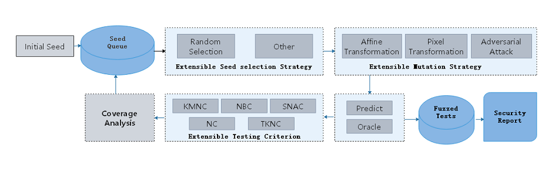

# AI模型安全测试设计

## 背景

不同于[传统程序的Fuzz安全测试](https://zhuanlan.zhihu.com/p/43432370)，MindArmour针对深度神经网络，提供AI模型安全测试模块fuzz_testing。根据神经网络的特点，引入神经元覆盖率[1]的概念，作为Fuzz的测试指导，引导Fuzz朝神经元覆盖率增加的方向生成样本，让输入能够激活更多的神经元，神经元值的分布范围更广，以充分测试DNN，探索不同类型的模型输出结果、模型错误行为。

## Fuzz Testing设计图

AI模型安全测试设计图如下。

在用户接口层，需要用户提供原始数据集`DataSet`、被测试模型`Model`和配置Fuzzer参数`Fuzzer configuration`。Fuzzer模块对模型和数据进行Fuzz测试后，返回安全评估报告`Security Report`。

Fuzz Testing架构主要包括三个模块：

1. Natural Threat/Adversarial Example Generator（数据变异模块）：

   随机选择变异方法对种子数据变异生成多个变种。支持多种样本的变异策略， 包括：

   - 自然扰动样本生成方法：
       - 仿射变换类方法：Translate、Scale、Shear、Rotate、Perspective、Curve；
       - 模糊类方法：GaussianBlur、MotionBlur、GradientBlur；
       - 亮度调整类方法：Contrast、GradientLuminance;
       - 加噪类方法：UniformNoise、GaussianNoise、SaltAndPepperNoise、NaturalNoise。
   - 基于对抗攻击的白盒、黑盒对抗样本生成方法：FGSM（FastGradientSignMethod）、PGD（ProjectedGradientDescent）、MDIIM（MomentumDiverseInputIterativeMethod）。

2. Fuzzer moduler（变异指导模块）:

   对变异生成的数据进行fuzz测试，观察神经元覆盖率的变化情况，如果生成的数据使得神经元覆盖率增加，则加入变异的种子队列，用于下一轮的数据变异。目前支持的神经元覆盖率指标包括KMNC、NBC、SNAC、NC、TKNC[2]。

3. Evaluation（评估模块）：

   评估Fuzz Testing的效果，生成数据的质量，变异方法的强度。支持3个类型5种指标，包括通用评价指标：accuracy，神经元覆盖率指标：kmnc，nbc，snac，nc，tknc，对抗攻击评价指标：attack_success_rate。

## Fuzz Testing流程

具体的Fuzz Testing流程如下：

1. 根据策略从种子队列中选择一个种子A。
2. 随机选择变异策略，对种子A进行变异，生成多个变种数据A1，A2...
3. 用目标模型对变种A1，A2...进行预测，如果变种的语意与种子保持一致，则进入Fuzzed Tests。
4. 若目标模型对于变种的预测结果是正确的，用神经元覆盖率指标进行分析。
5. 如果变种使得覆盖率增加，那么将该变种放入种子队列，用于下一轮变异。

通过多轮循环，我们获得一系列变异数据Fuzzed Tests，并进一步分析，从多个角度给出安全报告。可以用于深入分析神经网络模型的缺陷，从而针对这些缺陷，进行模型增强等，改善提升模型的通用性、鲁棒性。

## 代码实现

1. [fuzzing.py](https://gitee.com/mindspore/mindarmour/blob/r1.7/mindarmour/fuzz_testing/fuzzing.py)：Fuzzer总体流程。
2. [model_coverage_metrics.py](https://gitee.com/mindspore/mindarmour/blob/r1.7/mindarmour/fuzz_testing/model_coverage_metrics.py)：神经元覆盖率指标，包括KMNC，NBC，SNAC。
3. [image transform methods](https://gitee.com/mindspore/mindarmour/tree/r1.7/mindarmour/natural_robustness/transform/image)：图像变异方法，包括多种加噪、模糊、亮度调整、仿射变化方法。
4. [adversarial attacks](https://gitee.com/mindspore/mindarmour/tree/r1.7/mindarmour/adv_robustness/attacks)：对抗样本攻击方法，包含多种黑盒、白盒攻击方法。

## 参考文献

[1] Pei K, Cao Y, Yang J, et al. Deepxplore: Automated whitebox testing of deep learning systems[C]//Proceedings of the 26th Symposium on Operating Systems Principles. ACM, 2017: 1-18.

[2]Ma L, Juefei-Xu F, Zhang F, et al. Deepgauge: Multi-granularity testing criteria for deep learning systems[C]//Proceedings of the 33rd ACM/IEEE International Conference on Automated Software Engineering. ACM, 2018: 120-131.
