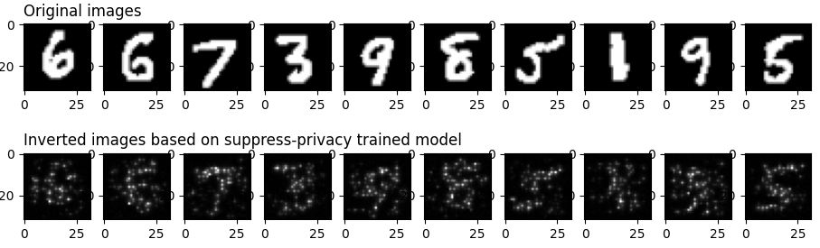

# 应用抑制隐私机制保护用户隐私

<a href="https://gitee.com/mindspore/docs/blob/master/docs/mindarmour/docs/source_zh_cn/protect_user_privacy_with_suppress_privacy.md" target="_blank"></a>

## 概述

抑制隐私是一种保护用户数据隐私的机制。抑制隐私是在AI训练过程中保护用户隐私的一种方法。通过去除模型中不重要的参数，使得其参数量得以大幅度的减少，减少了模型可能泄露的输入样本信息，从而大大降低通过模型逆向攻击获得原始样本的可能性。实验表明抑制隐私技术相对于差分隐私能够在某些模型的训练精度和隐私保护程度之间取得更好的平衡。

### MindArmour实现的抑制隐私

MindArmour的抑制隐私模块Suppress-Privacy，实现了抑制隐私优化器。在模型训练过程中，不重要的参数会按照一定的比例逐渐地被设置为0，最终只保留5-10%的参数。

这里以LeNet模型，MNIST 数据集为例，说明如何在MindSpore上使用抑制隐私优化器训练神经网络模型。

> 本例面向Ascend 910 AI处理器，你可以在这里下载完整的样例代码：<https://gitee.com/mindspore/mindarmour/blob/master/examples/privacy/sup_privacy/sup_privacy.py>

## 实现阶段

### 导入需要的库文件

下列是我们需要的公共模块、MindSpore相关模块和抑制隐私特性模块。

```python
import os
from easydict import EasyDict as edict
import mindspore.nn as nn
from mindspore import set_context, PYNATIVE_MODE
from mindspore.train.callback import ModelCheckpoint
from mindspore.train.callback import CheckpointConfig
from mindspore.train.callback import LossMonitor
from mindspore.nn import Accuracy
from mindspore import load_checkpoint, load_param_into_net
import mindspore.dataset as ds
import mindspore.dataset.vision.c_transforms as CV
import mindspore.dataset.transforms.c_transforms as C
from mindspore.dataset.vision import Inter
from mindspore import dtype as mstype

from examples.common.networks.lenet5.lenet5_net import LeNet5

from mindarmour.privacy.sup_privacy import SuppressModel
from mindarmour.privacy.sup_privacy import SuppressMasker
from mindarmour.privacy.sup_privacy import SuppressPrivacyFactory
from mindarmour.privacy.sup_privacy import MaskLayerDes

from mindarmour.utils import LogUtil

LOGGER = LogUtil.get_instance()
LOGGER.set_level('INFO')
TAG = 'Lenet5_Suppress_train'
```

### 参数配置

1. 设置运行环境、模型训练参数、checkpoint存储参数，batch_size参数建议不要超过64。更多配置可以参考<https://gitee.com/mindspore/mindarmour/blob/master/examples/privacy/sup_privacy/sup_privacy_config.py>。

   ```python
   cfg = edict({
        'num_classes': 10,  # the number of classes of model's output
        'batch_size': 32,  # batch size for training
        'image_height': 32,  # the height of training samples
        'image_width': 32,  # the width of training samples
        'keep_checkpoint_max': 10,  # the maximum number of checkpoint files would be saved
        'device_target': 'Ascend',  # device used
   })
   ```

2. 配置必要的信息，包括环境信息、执行的模式。目前支持Ascend上的PyNative模式。

   ```python
   set_context(mode=PYNATIVE_MODE, device_target=cfg.device_target)
   ```

   详细的接口配置信息，请参见`context.set_context`接口说明。

### 预处理数据集

加载数据集并处理成MindSpore数据格式。

```python
def generate_mnist_dataset(data_path, batch_size=32, repeat_size=1,
                           num_parallel_workers=1, sparse=True):
    """
    create dataset for training or testing
    """
    # define dataset
    ds1 = ds.MnistDataset(data_path)

    # define operation parameters
    resize_height, resize_width = 32, 32
    rescale = 1.0 / 255.0
    shift = 0.0

    # define map operations
    resize_op = CV.Resize((resize_height, resize_width),
                          interpolation=Inter.LINEAR)
    rescale_op = CV.Rescale(rescale, shift)
    hwc2chw_op = CV.HWC2CHW()
    type_cast_op = C.TypeCast(mstype.int32)

    # apply map operations on images
    if not sparse:
        one_hot_enco = C.OneHot(10)
        ds1 = ds1.map(operations=one_hot_enco, input_columns="label",
                      num_parallel_workers=num_parallel_workers)
        type_cast_op = C.TypeCast(mstype.float32)
    ds1 = ds1.map(operations=type_cast_op, input_columns="label",
                  num_parallel_workers=num_parallel_workers)
    ds1 = ds1.map(operations=resize_op, input_columns="image",
                  num_parallel_workers=num_parallel_workers)
    ds1 = ds1.map(operations=rescale_op, input_columns="image",
                  num_parallel_workers=num_parallel_workers)
    ds1 = ds1.map(operations=hwc2chw_op, input_columns="image",
                  num_parallel_workers=num_parallel_workers)

    # apply DatasetOps
    buffer_size = 10000
    ds1 = ds1.shuffle(buffer_size=buffer_size)
    ds1 = ds1.batch(batch_size, drop_remainder=True)
    ds1 = ds1.repeat(repeat_size)

    return ds1
```

### 建立模型

这里以LeNet模型为例，您也可以建立训练自己的模型。

加载LeNet网络，配置checkpoint、设置优化器类型，用上述定义的数据加载函数`generate_mnist_dataset`载入数据。

```python
networks_l5 = LeNet5()
config_ck = CheckpointConfig(save_checkpoint_steps=10,
                             keep_checkpoint_max=cfg.keep_checkpoint_max)
ckpoint_cb = ModelCheckpoint(prefix="checkpoint_lenet",
                             directory='./trained_ckpt_file/',
                             config=config_ck)

# get training dataset
ds_train = generate_mnist_dataset('MNIST_unzip/train', cfg.batch_size)
```

### 引入抑制隐私训练

1. 配置抑制隐私优化器的参数

    - 定义AI模型的哪些层参与suppress操作。
    - 实例化抑制隐私工厂类。
    - 定义损失函数。
    - 设置优化器类型。
    - 如果样本数为60000，推荐的参数设置为end_epoch:10，start_epoch:3，mask_times:1000，lr:0.10，sparse_end:0.95，sparse_start:0.0。
    这样相邻两次suppress操作的间隔大致在10~20个batch。

    ```python
    # layer_name (str): Layer name, get the name of one layer as following:
    #    for layer in networks.get_parameters(expand=True):
    #        if layer.name == "conv": ...
    # grad_idx (int): Grad layer index, get mask layer's index in grad tuple.
    # is_add_noise (bool): If True, the weight of this layer can add noise.
    #    If False, the weight of this layer can not add noise.
    # is_lower_clip (bool): If true, the weights of this layer would be clipped to greater than an lower bound value.
    #    If False, the weights of this layer won't be clipped.
    # min_num (int): The number of weights left that not be suppressed, which need to be greater than 0.
    # upper_bound (float): max value of weight in this layer, default value is 1.20 .
    masklayers_lenet5 = []  # determine which layer should be masked
    masklayers_lenet5.append(MaskLayerDes("conv1.weight", 0, True, True, 10))
    masklayers_lenet5.append(MaskLayerDes("conv2.weight", 1, True, True, 50))
    masklayers_lenet5.append(MaskLayerDes("fc1.weight", 2, True, False, -1))
    masklayers_lenet5.append(MaskLayerDes("fc2.weight", 4, True, False, -1))
    masklayers_lenet5.append(MaskLayerDes("fc3.weight", 6, True, False, 50))

    # networks (Cell): The training network.
    # mask_layers (list): Description of the training network layers that need to be suppressed.
    # policy (str): Training policy for suppress privacy training. "local_train" means local training.
    # end_epoch (int): The last epoch in suppress operations, 0 < start_epoch <= end_epoch <= 100 .
    # batch_num (int): The num of batch in an epoch, should be equal to num_samples/batch_size .
    # start_epoch (int): The first epoch in suppress operations, 0 < start_epoch <= end_epoch <= 100 .
    # mask_times (int): The num of suppress operations.
    # lr (Union[float, int]): Learning rate, 0 < lr <= 0.5 .
    # sparse_end (float): The sparsity to reach, 0.0 <= sparse_start < sparse_end < 1.0 .
    # sparse_start (float): The sparsity to start, 0.0 <= sparse_start < sparse_end < 1.0 .  
    suppress_ctrl_instance = SuppressPrivacyFactory().create(networks_l5,
                                                            masklayers_lenet5,
                                                            policy="local_train",
                                                            end_epoch=10,
                                                            batch_num=1875,
                                                            start_epoch=3,
                                                            mask_times=1000,
                                                            lr=0.05,
                                                            sparse_end=0.95,
                                                            sparse_start=0.0)
    net_loss = nn.SoftmaxCrossEntropyWithLogits(sparse=True, reduction="mean")
    net_opt = nn.SGD(networks_l5.trainable_params(), 0.05)
    ```

2. 将LeNet模型包装成抑制隐私模型

    - 实例化抑制隐私模型类SuppressModel，用于执行模型训练过程。
    - 实例化抑制隐私监测器SuppressMasker，用于在模型训练中选择合适时机对模型参数进行suppress(置零)操作。

   ```python
   # Create the suppress model for training.
   model_instance = SuppressModel(network=networks_l5,
                                   loss_fn=net_loss,
                                   optimizer=net_opt,
                                   metrics={"Accuracy": Accuracy()})
   model_instance.link_suppress_ctrl(suppress_ctrl_instance)
   suppress_masker = SuppressMasker(model=model_instance, suppress_ctrl=suppress_ctrl_instance)
   ```

3. 模型训练与测试

    ```python
   LOGGER.info(TAG, "============== Starting SUPP Training ==============")
   model_instance.train(10, ds_train, callbacks=[ckpoint_cb, LossMonitor(), suppress_masker],
                         dataset_sink_mode=False)

   LOGGER.info(TAG, "============== Starting SUPP Testing ==============")
   ds_eval = generate_mnist_dataset('MNIST_unzip/test', batch_size=cfg.batch_size)
   acc = model_instance.eval(ds_eval, dataset_sink_mode=False)
   LOGGER.info(TAG, "============== SUPP Accuracy: %s  ==============", acc)
    ```

4. 运行命令

   运行脚本，可在命令行输入命令：

   ```bash
   python examples/privacy/sup_privacy/sup_privacy.py
   ```

   其中`sup_privacy.py`替换成你的脚本的名字。

5. 结果展示

   不加抑制隐私的LeNet模型精度稳定在99%，使用抑制隐私LeNet模型收敛，精度稳定在97.5%左右。

   ```text
   ============== Starting SUPP Training ==============
   ...
   ============== Starting SUPP Testing ==============
   ...
   ============== SUPP Accuracy: 0.9745  ==============
   ```

### 隐私保护效果测试

为了评估抑制隐私训练对数据集的保护效果，我们使用图像逆向攻击进行测试，
这种逆向攻击可以根据原始图片在神经网络某一层的输出来反向还原出原始图片，主要原因是网络在训练的过程中“记住”了训练集的特征，
这种攻击方法的原理可以参考<https://arxiv.org/pdf/1412.0035.pdf>，完整的代码实现可以参考<https://gitee.com/mindspore/mindarmour/blob/master/examples/privacy/inversion_attack/mnist_inversion_attack.py>
，下面介绍详细的测试步骤：

1. 准备工作

    为了和抑制隐私训练进行对比，我们需要先使用常规训练得到模型的CheckPoint文件。模型训练可以参考
    [mindarmour/examples/common/networks/lenet5](https://gitee.com/mindspore/mindarmour/blob/master/examples/common/networks/lenet5/mnist_train.py) ，
    它的目录结构如下：

    ```text
    ├── __init__.py
    ├── lenet5_net.py
    └── mnist_train.py
    ```

    其中`lenet5_net.py`为LeNet5的模型定义，`mnist_train.py`为LeNet5的常规训练脚本。在该目录下运行如下命令，即可生成包含模型CheckPoint文件的`trained_ckpt_file`文件夹。

    ```bash
    python mnist_train.py
    ```

   此外，由于下面的步骤7中需要用到新训练的模型进行攻击效果的评估，我们在生成`trained_ckpt_file`目录后，将`mnist_train.py`文件中的变量`ckpoint_cb`的生成命令改成：

   ```python
   ckpoint_cb = ModelCheckpoint(prefix="checkpoint_lenet",
                             directory="./new_trained_ckpt_file/",
                             config=config_ck)
   ```

   其中`prefix`代表生成的CheckPoint文件名的前缀，`directory`代表CheckPoint文件的存放路径，再运行`mnist_train.py`，
   就可以得到`new_trained_ckpt_file`文件夹及包含其中的模型文件。此时`examples/common/networks/lenet5`的目录结构应该如下所示：

   ```text
    ├── __init__.py
    ├── lenet5_net.py
    ├── mnist_train.py
    ├── new_trained_ckpt_file
    │   ├── checkpoint_lenet-10_1875.ckpt
    │   ├── checkpoint_lenet-1_1875.ckpt
    │   ├── checkpoint_lenet-2_1875.ckpt
    │   ├── checkpoint_lenet-3_1875.ckpt
    │   ├── checkpoint_lenet-4_1875.ckpt
    │   ├── checkpoint_lenet-5_1875.ckpt
    │   ├── checkpoint_lenet-6_1875.ckpt
    │   ├── checkpoint_lenet-7_1875.ckpt
    │   ├── checkpoint_lenet-8_1875.ckpt
    │   ├── checkpoint_lenet-9_1875.ckpt
    │   └── checkpoint_lenet-graph.meta
    └── trained_ckpt_file
        ├── checkpoint_lenet-10_1875.ckpt
        ├── checkpoint_lenet-1_1875.ckpt
        ├── checkpoint_lenet-2_1875.ckpt
        ├── checkpoint_lenet-3_1875.ckpt
        ├── checkpoint_lenet-4_1875.ckpt
        ├── checkpoint_lenet-5_1875.ckpt
        ├── checkpoint_lenet-6_1875.ckpt
        ├── checkpoint_lenet-7_1875.ckpt
        ├── checkpoint_lenet-8_1875.ckpt
        ├── checkpoint_lenet-9_1875.ckpt
        └── checkpoint_lenet-graph.meta
   ```

2. 导入需要的模块

    ```python
    import numpy as np
    import matplotlib.pyplot as plt
    from scipy.special import softmax
    from mindspore import load_checkpoint, load_param_into_net
    from mindspore import Tensor
    from mindspore import nn
    from mindarmour.privacy.evaluation import ImageInversionAttack
    from mindarmour.utils import LogUtil
    from examples.common.networks.lenet5.lenet5_net import LeNet5, conv, fc_with_initialize
    from examples.common.dataset.data_processing import generate_mnist_dataset
    LOGGER = LogUtil.get_instance()
    LOGGER.set_level('INFO')
    TAG = 'InversionAttack'
    ```

3. 构建逆向测试网络

    为了更好地演示，我们取LeNet5的前面两个卷积层conv1、conv2和第一个全连接层fc1作为测试网络，于是攻击任务就是：根据某一图片从fc1输出的feature map来还原出该图片。

    ```python
    class LeNet5_part(nn.Cell):
        """
        Part of LeNet5 network.
        """
        def __init__(self):
            super(LeNet5_part, self).__init__()
            self.conv1 = conv(1, 6, 5)
            self.conv2 = conv(6, 16, 5)
            self.fc1 = fc_with_initialize(16*5*5, 120)
            self.fc2 = fc_with_initialize(120, 84)
            self.fc3 = fc_with_initialize(84, 10)
            self.relu = nn.ReLU()
            self.max_pool2d = nn.MaxPool2d(kernel_size=2, stride=2)
            self.flatten = nn.Flatten()

        def construct(self, x):
            x = self.conv1(x)
            x = self.relu(x)
            x = self.max_pool2d(x)
            x = self.conv2(x)
            x = self.relu(x)
            x = self.max_pool2d(x)
            x = self.flatten(x)
            x = self.fc1(x)
            x = self.relu(x)
            return x
    ```

4. 将训练好的CheckPoint文件导入模型

    ```python
    Checkpoint_path = '../../common/networks/lenet5/trained_ckpt_file/checkpoint_lenet-10_1875.ckpt'
    load_dict = load_checkpoint(Checkpoint_path)
    net = LeNet5_part()
    load_param_into_net(net, load_dict)
    ```

5. 获取测试样本

    我们取30张图片进行测试，保存好它们本身以及它们经过`LeNet5_part`的输出（即`target_features`）。

    ```python
    # get original data
    data_list = "../../common/dataset/MNIST/train"
    batch_size = 32
    ds = generate_mnist_dataset(data_list, batch_size)
    i = 0
    batch_num = 1
    sample_num = 30
    for data in ds.create_tuple_iterator(output_numpy=True):
        i += 1
        images = data[0].astype(np.float32)
        true_labels = data[1][: sample_num]
        target_features = net(Tensor(images)).asnumpy()[:sample_num]
        original_images = images[: sample_num]
        if i >= batch_num:
            break
    ```

6. 进行逆向攻击

    ```python
    inversion_attack = ImageInversionAttack(net, input_shape=(1, 32, 32), input_bound=(0, 1), loss_weights=[1, 0.1, 5])
    inversion_images = inversion_attack.generate(target_features, iters=100)
    ```

7. 攻击结果评估和展示

    我们用matplotlib画出原始图像以及用逆向攻击还原出来的图像，并且调用`inversion_attack`的`evaluate`方法进行定量评估，
    `evaluate`方法会返回`avg_l2_dis`，`avg_ssim`和`avg_confi`，分别表示原图与逆向还原的图像之间的平均L2
   范数距离和平均结构相似性，以及逆向还原出来的图片在一个新模型上的推理结果（在其真实标签上的平均置信度）。
    一般来说，`avg_l2_dis`越小、`avg_ssim`越大，则代表inversion_images与original_images越接近；而新的神经网络模型可以替代人眼对图片的可识别度做一个定量的评估（即`avg_confi`越高，说明inversion_image包含的语义信息与原图更为接近）。

    ```python
    plot_num = min(sample_num, 10)
    for n in range(1, plot_num+1):
        plt.subplot(2, plot_num, n)
        if n == 1:
            plt.title('Original images', fontsize=12, loc='left')
        plt.gray()
        plt.imshow(images[n - 1].reshape(32, 32))
        plt.subplot(2, plot_num, n + plot_num)
        if n == 1:
            plt.title('Inverted images based on ordinary trained model', fontsize=12, loc='left')
        plt.gray()
        plt.imshow(inversion_images[n - 1].reshape(32, 32))
    plt.show()

    net2 = LeNet5()
    new_ckpt_path = '../../common/networks/lenet5/new_trained_ckpt_file/checkpoint_lenet-10_1875.ckpt'
    new_load_dict = load_checkpoint(new_ckpt_path)
    load_param_into_net(net2, new_load_dict)
    pred_labels = np.argmax(net2(Tensor(inversion_images).astype(np.float32)).asnumpy(), axis=1)

    avg_l2_dis, avg_ssim, avg_confi = inversion_attack.evaluate(original_images, inversion_images, true_labels, net2)
    LOGGER.info(TAG, 'The average L2 distance between original images and inverted images is: {}'.format(avg_l2_dis))
    LOGGER.info(TAG, 'The average ssim value between original images and inverted images is: {}'.format(avg_ssim))
    LOGGER.info(TAG, 'The average prediction confidence on true labels of inverted images is: {}'.format(avg_confi))
    LOGGER.info(TAG, 'True labels of original images are:      %s' % true_labels)
    LOGGER.info(TAG, 'Predicted labels of inverted images are: %s' % pred_labels)
    ```

8. 实验结果

    ```text
    The average L2 distance between original images and inverted images is: 0.8294931122450715
    The average ssim value between original images and inverted images is: 0.2429179625584347
    The average prediction confidence on true labels of inverted images is: 0.9547292590141296
    True labels of original images are:      [5 7 1 0 4 3 1 5 5 9 5 0 9 9 7 5 4 2 1 7 4 0 0 6 2 6 0 6 6 6]
    Predicted labels of inverted images are: [5 7 1 0 4 3 1 5 5 9 5 0 9 9 7 5 4 2 1 7 4 0 0 6 2 6 0 6 6 6]
    ```

    

    我们可以从inversion_images看出original_images的大概轮廓了，说明常规训练的模型很可能会导致训练集的隐私泄露。
    **为了验证抑制隐私训练得到的模型可以更好地保护训练数据的信息**，我们将上述步骤4中的CheckPoint文件换成抑制隐私训练得到的CheckPoint文件，并执行上述步骤2至步骤7的过程，可以得到如下结果：

    ```text
    The average L2 distance between original images and inverted images is: 0.862553358599391
    The average ssim value between original images and inverted images is: 0.2644709319921787
    The average prediction confidence on true labels of inverted images is: 0.5576204061508179
    True labels of original images are:      [9 2 2 0 1 2 9 8 5 0 7 3 4 8 9 0 6 6 7 2 0 6 7 5 8 8 1 6 7 9]
    Predicted labels of inverted images are: [8 2 2 0 1 2 7 8 5 0 7 3 4 8 9 7 6 6 7 2 0 6 7 5 8 8 1 5 7 9]
    ```

    

    首先，从可视化上结果来看，基于抑制隐私训练得到的模型进行逆向攻击，效果很差；但这种情形下得到的avg_l2_dis和avg_ssim和上一种情形很接近，
    这主要是由于avg_l2_dis和avg_ssim只能根据图片像素的均值和标准差比较图片之间的低阶信息，而avg_confi可以比较图片之间的高阶语义信息。

    本实验使用的样本是MNIST数据集，这类图片较为简单，黑色背景占了图片的大部分区域，而包含主要信息的白色部分占据的区域较少。但可以看到，
    基于抑制隐私模型得到的avg_confi明显低于上一组实验，这说明逆向构造出来的图片已经比较难被新模型识别出来了，这个结果和我们人眼观察的结果是一致的。

### 引用

[1] Ligeng Zhu, Zhijian Liu, and Song Han. [Deep Leakage from Gradients](http://arxiv.org/pdf/1906.08935.pdf). NeurIPS, 2019.

[2] Aravindh Mahendran, Andrea Vedaldi. [Understanding Deep Image Representations by Inverting Them](https://arxiv.org/pdf/1412.0035.pdf). CVPR, 2015.