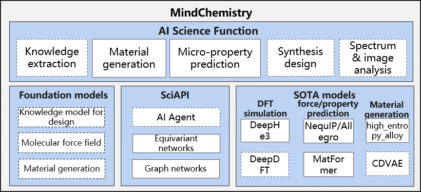
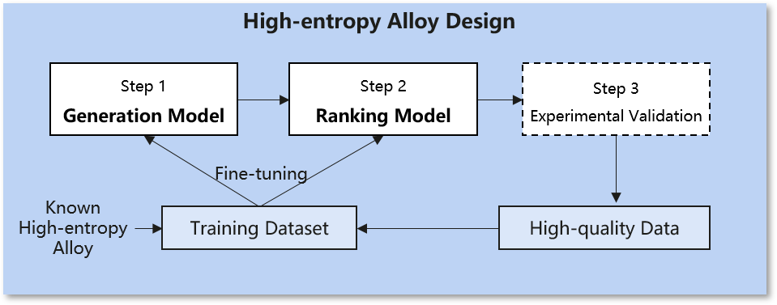
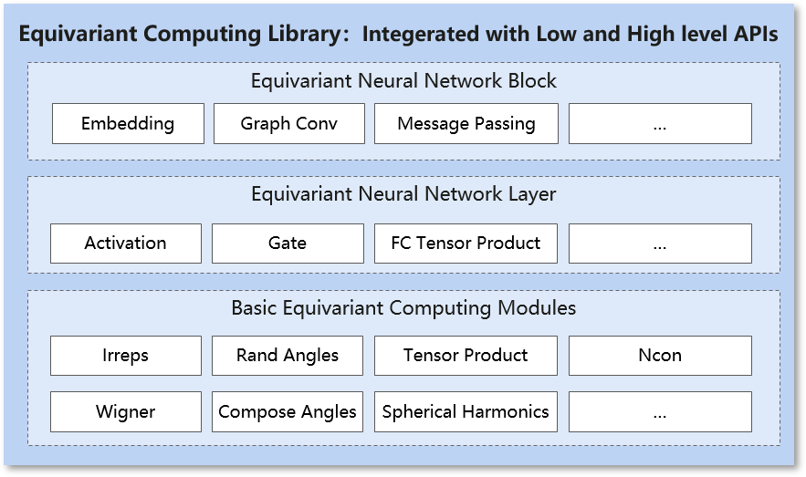

MindSpore Chemistry
===================

Introduction
------------

Conventional chemistry studies have long been confronted with numerous
challenges. The process of experimental design, synthesis,
characterization, and analysis can be time-consuming, costly, and highly
dependent on experts’ experiences. The synergy between AI and chemistry
offers unprecedented opportunities to overcome the limitations of
conventional approaches and unlock new frontiers in scientific discovery
and innovation. AI techniques can efficiently process vast amount of
data, mining underneath patterns and generating predictive models. By
leveraging AI, chemistry and material science researchers can accelerate
the design and optimization of chemical processes and the design and
analysis of novel materials.

**MindSpore Chemistry**\ (MindChemistry) is a toolkit built on MindSpore
endeavoring to integrate AI with conventional chemistry research. It
supports multi-scale tasks including molecular generation, property
prediction and synthesis optimization on multiple chemistry systems such
as organic, inorganic and composites chemistry systems. MindChemistry
dedicates to enabling the joint research of AI and chemistry with high
efficiency, and seek to facilitate an innovative paradigm of joint
research between AI and chemistry, providing experts with novel
perspectives and efficient tools.

Latest News
-----------

-  🔥\ ``2024.07.30`` MindChemistry 0.1.0 is released.

Features
--------

Applications
~~~~~~~~~~~~

-  Material Generation

   -  **Scenario**\ ：Inorganic chemistry
   -  **Dataset**\ ：High-entropy alloy dataset. The high-entropy alloy
      dataset includes the chemical composition of known high-entropy
      alloys and thermodynamic properties of the alloys. It provides
      chemical composition information such as the metal element types
      and corresponding percentages as well as thermodynamic properties
      such as magnetostrictive effects and Curie temperatures.
   -  **Task**\ ：High-entropy alloy composition design. We integrate
      Machine learning-enabled high-entropy alloy discovery[1] approach
      for designing novel high-entropy alloys with low thermal expansion
      coefficients(TEC) in active learning fashion. In the active
      learning circle, candidates of high-enropy alloys are firstly
      generated based on the AI model and the candidate components are
      filtered based on the prediction model and the predicted thermal
      expansion coefficient calculated by the thermodynamics. Finally,
      the researchers need to determine the final high-entropy alloy
      components based on experimental verification.

-  **Property Prediction**\ ：

   -  **Scenario**\ ：Organic chemistry
   -  **Dataset**: Revised Molecular Dynamics 17(rMD17). rMD17 dataset
      includes molecular dynamics simulations of multiple organic
      chemical moleculars. It provides chemical desciptive information
      such as the atomic numbers and positions as well as molecular
      property information such as energies and forces.
   -  **Task**\ ：Molecular energy prediction. We integrate the NequIP
      model [2] and Allegro model [3], according to the position of each
      atom in the molecular system and structure description of the
      atomic number information construction diagram, and calculate the
      energy of the molecular system based on the equivariant
      calculation and graph neural network.

.. figure:: ./images/nequip.png
   :alt: MindSpore nequip Architecture

-  **Electronic Structure Prediction**\ ：

   -  **Scenario**: Materials
   -  **Dataset**: Bilayer graphene dataset. The dataset contains
      descriptive information such as atomic positions and atomic
      numbers, as well as property information such as Hamiltonian.
   -  **Task**: Density Functional Theory Hamiltonian Prediction. We
      integrate the DeephE3nn model [4], an equivariant neural network based
      on E3, to predict a Hamiltonian by using the structure of atoms.

-  **Prediction of crystalline material properties**:

   -  **Scenario**: Materials
   -  **Dataset**: JARVIS-DFT 3D dataset. The dataset contains
      descriptive information such as atomic position and atomic number
      of crystal materials, as well as property information such as
      energy and force field.
   -  **Task**: Prediction of crystalline material properties. We
      integrate the Matformer model [5] based on graph neural networks and
      Transformer architectures, for predicting various properties of
      crystalline materials.

Modules
~~~~~~~

-  **Equivariant Computing**

   -  **Introduction**\ ：Symmetry is an essential property in science
      domain. Equivarient neural network adopts intuitive representation
      as input and computing equivariently with respect to spatial
      rotation, shift and inversion. Adopting equivariant neural network
      for modeling scientific scenarios results in higher representation
      effectiveness for data and high efficiency for model training.
   -  **Functions**\ ：E(3) computing modules integrates basic modules
      such as Irreps, Spherical Harmonics and Tensor Products. Based on
      the basic modules, equivariant neural network layers such as
      equivariant Activation, Linear and Convolution layers are provided
      for constructing user customed equivariant neural networks.

Installation
------------

Version Dependency
~~~~~~~~~~~~~~~~~~

Because MindChemistry is dependent on MindSpore, please click `MindSpore
Download Page <https://www.mindspore.cn/versions>`__ according to the
corresponding relationship indicated in the following table. Download
and install the corresponding whl package.

============= ====== ========= ======
MindChemistry Branch MindSpore Python
============= ====== ========= ======
master        master >=2.3     >=3.8
0.1.0         r0.6   >=2.2.12  >=3.8
============= ====== ========= ======

Dependency
~~~~~~~~~~

.. code:: bash

   pip install -r requirements.txt

Hardware
~~~~~~~~

+--------------------------+-----------------+--------+
| Hardware                 | os              | Status |
+==========================+=================+========+
| AtlasA2 training series  | Ubuntu-x86      | ✔️     |
+--------------------------+-----------------+--------+
|                          | Ubuntu-aarch64  | ✔️     |
+--------------------------+-----------------+--------+
|                          | EulerOS-aarch64 | ✔️     |
+--------------------------+-----------------+--------+
|                          | CentOS-x86      | ✔️     |
+--------------------------+-----------------+--------+
|                          | CentOS-aarch64  | ✔️     |
+--------------------------+-----------------+--------+

source code install
~~~~~~~~~~~~~~~~~~~

-  **Download source code from Gitee**

   .. code:: bash

      git clone https://gitee.com/mindspore/mindscience.git
      cd {PATH}/mindscience/MindChemistry

-  **Compile in Ascend backend**

   .. code:: bash

      bash build.sh -e ascend -j8

-  **Install whl package**

   .. code:: bash

      cd {PATH}/mindscience/MindChemistry/output
      pip install mindchemistry_*.whl

Community
---------

Core Contributor
~~~~~~~~~~~~~~~~

Thanks goes to these wonderful people 🧑‍🤝‍🧑:

yufan, wangzidong, liuhongsheng, gongyue, gengchenhua, linghejing,
yanchaojie, suyun, wujian, caowenbin

Contribution Guide
------------------

-  Please click here to see how to contribute your code: `Contribution
   Guide <https://gitee.com/mindspore/mindscience/blob/master/CONTRIBUTION.md>`__

License
-------

`Apache License 2.0 <http://www.apache.org/licenses/LICENSE-2.0>`__

References
----------

[1] Rao Z, Tung P Y, Xie R, et al. Machine learning-enabled high-entropy
alloy discovery[J]. Science, 2022, 378(6615): 78-85.

[2] Batzner S, Musaelian A, Sun L, et al. E(3)-equivariant graph neural
networks for data-efficient and accurate interatomic potentials[J].
Nature communications, 2022, 13(1): 2453.

[3] Musaelian A, Batzner S, Johansson A, et al. Learning local
equivariant representations for large-scale atomistic dynamics[J].
Nature communications, 2023, 14(1): 579.

[4] Xiaoxun Gong, He Li, Nianlong Zou, et al. General framework for
E(3)-equivariant neural network representation of density functional
theory Hamiltonian[J].
Nature communications, 2023, 14: 2848.

[5] Keqiang Yan, Yi Liu, Yuchao Lin, Shuiwang ji, et al. Periodic
Graph Transformers for Crystal Material Property Prediction[J].
arXiv:2209.11807v1 [cs.LG] 23 sep 2022.

.. toctree::
   :maxdepth: 1
   :caption: Quick Start

    quick_start/quick_start

.. toctree::
   :glob:
   :maxdepth: 1
   :caption: User Guide

   user/molecular_generation
   user/molecular_prediction

.. toctree::
   :maxdepth: 1
   :caption: API References

   mindchemistry.cell
   mindchemistry.e3
   mindchemistry.utils

.. toctree::
   :glob:
   :maxdepth: 1
   :caption: RELEASE NOTES

   RELEASE